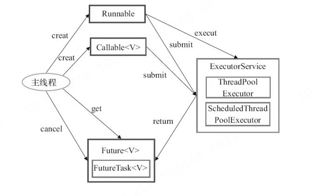
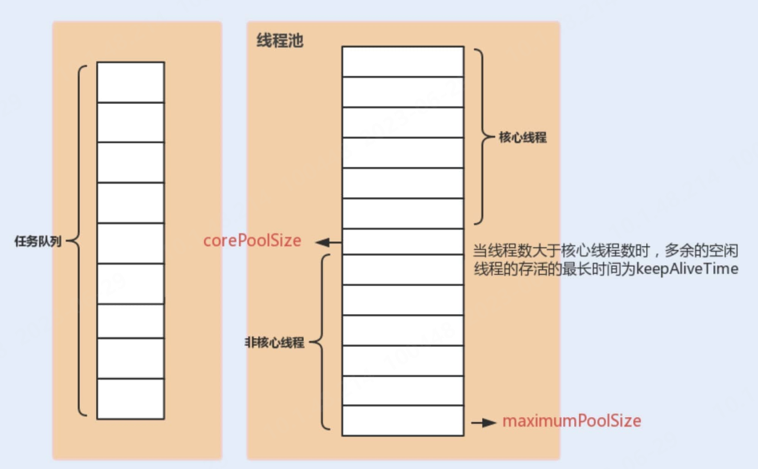
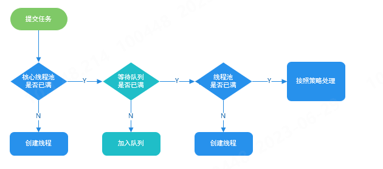

### 并发编程
#### 指令重排序
简单来说就是系统在执行代码的时候并不一定是按照你写的代码的顺序依次执行。，一般分为两种情况：
* 编译器优化重排 ：编译器（包括 JVM、JIT 编译器等）在不改变单线程程序语义的前提下，重新安排语句的执行顺序。
* 指令并行重排 ：现代处理器采用了指令级并行技术(Instruction-Level Parallelism，ILP)来将多条指令重叠执行。如果不存在数据依赖性，处理器可以改变语句对应机器指令的执行顺序。
Java 源代码会经历 编译器优化重排 —> 指令并行重排 —> 内存系统重排 的过程，最终才变成操作系统可执行的指令序列。指令重排序可以保证串行语义一致，但是没有义务保证多线程间的语义也一致
#### Java内存模型
原因：
   * Java 语言是跨平台的，它需要自己提供一套内存模型以屏蔽系统差异。
   * 简化多线程编程，增强程序可移植性的
##### 主内存与本地内存
* 主内存 ：所有线程创建的实例对象都存放在主内存中，不管该实例对象是成员变量还是方法中的本地变量(也称局部变量)
* 本地内存 ：每个线程都有一个私有的本地内存来存储共享变量的副本，并且，每个线程只能访问自己的本地内存，无法访问其他线程的本地内存。本地内存是 JMM 抽象出来的一个概念，存储了主内存中的共享变量副本。
##### 八种同步操作
* 锁定（lock）: 作用于主内存中的变量，将他标记为一个线程独享变量。
* 解锁（unlock）: 作用于主内存中的变量，解除变量的锁定状态，被解除锁定状态的变量才能被其他线程锁定。
* read（读取）：作用于主内存的变量，它把一个变量的值从主内存传输到线程的工作内存中，以便随后的 load 动作使用。
* load(载入)：把 read 操作从主内存中得到的变量值放入工作内存的变量的副本中。
* use(使用)：把工作内存中的一个变量的值传给执行引擎，每当虚拟机遇到一个使用到变量的指令时都会使用该指令。
* assign（赋值）：作用于工作内存的变量，它把一个从执行引擎接收到的值赋给工作内存的变量，每当虚拟机遇到一个给变量赋值的字节码指令时执行这个操作。
* store（存储）：作用于工作内存的变量，它把工作内存中一个变量的值传送到主内存中，以便随后的 write 操作使用。
* write（写入）：作用于主内存的变量，它把 store 操作从工作内存中得到的变量的值放入主内存的变量中。
##### happens-before 原则
1. 定义：
   * 如果一个操作 happens-before 另一个操作，那么第一个操作的执行结果将对第二个操作可见，并且第一个操作的执行顺序排在第二个操作之前。
   * 两个操作之间存在 happens-before 关系，并不意味着 Java 平台的具体实现必须要按照 happens-before 关系指定的顺序来执行。如果重排序之后的执行结果，与按 happens-before 关系来执行的结果一致，那么 JMM 也允许这样的重排序
2. 其表达的意义是前一个操作的结果对于后一个操作是可见的，无论这两个操作是否在同一个线程里。
3. 常用规则：
   * 程序顺序规则 ：一个线程内，按照代码顺序，书写在前面的操作 happens-before 于书写在后面的操作；
   * 解锁规则 ：解锁 happens-before 于加锁；
   * volatile 变量规则 ：对一个 volatile 变量的写操作 happens-before 于后面对这个 volatile 变量的读操作。说白了就是对 volatile 变量的写操作的结果对于发生于其后的任何操作都是可见的。
   * 传递规则 ：如果 A happens-before B，且 B happens-before C，那么 A happens-before C；
   * 线程启动规则 ：Thread 对象的 start（）方法 happens-before 于此线程的每一个动作。
#### 线程池
* 降低资源消耗。通过重复利用已创建的线程降低线程创建和销毁造成的消耗。
* 提高响应速度。当任务到达时，任务可以不需要等到线程创建就能立即执行。
* 提高线程的可管理性。线程是稀缺资源，如果无限制的创建，不仅会消耗系统资源，还会降低系统的稳定性，使用线程池可以进行统一的分配，调优和监控
##### 使用场景
一般用于执行多个不相关联的耗时任务，没有多线程的情况下，任务顺序执行，使用了线程池的话可让多个不相关联的任务同时执行。
#####  Executor 框架
1. 框架结构
   * 任务(Runnable /Callable)：执行任务需要实现的 Runnable 接口 或 Callable接口。Runnable 接口或 Callable 接口 实现类都可以被 ThreadPoolExecutor 或 ScheduledThreadPoolExecutor 执行。
   * 任务的执行(Executor)
   * 异步计算的结果(Future)：Future 接口以及 Future 接口的实现类 FutureTask 类都可以代表异步计算的结果。
2. 使用示意图

   * 主线程首先要创建实现 Runnable 或者 Callable 接口的任务对象。
   * 把创建完成的实现 Runnable/Callable接口的 对象直接交给 ExecutorService 执行: ExecutorService.execute（Runnable command））或者也可以把 Runnable 对象或Callable 对象提交给 ExecutorService 执行（ExecutorService.submit（Runnable task）或 ExecutorService.submit（Callable <T> task））。
   * 如果执行 ExecutorService.submit（…），ExecutorService 将返回一个实现Future接口的对象（我们刚刚也提到过了执行 execute()方法和 submit()方法的区别，submit()会返回一个 FutureTask 对象）。由于 FutureTask 实现了 Runnable，我们也可以创建 FutureTask，然后直接交给 ExecutorService 执行。
   * 最后，主线程可以执行 FutureTask.get()方法来等待任务执行完成。主线程也可以执行 FutureTask.cancel（boolean mayInterruptIfRunning）来取消此任务的执行
##### ThreadPoolExecutor 类
   * 构造函数：
```java
  /**
     * 用给定的初始参数创建一个新的ThreadPoolExecutor。
     */
    public ThreadPoolExecutor(int corePoolSize,//线程池的核心线程数量,需要保留在池中的线程数。
                              int maximumPoolSize,//线程池的最大线程数，当任务数大于核心线程数+队列容量时，会被非核心线程执行。
                              long keepAliveTime,//当线程数大于核心线程数时，多余的空闲线程存活的最长时间。当线程池中的线程数量大于 corePoolSize 的时候，如果这时没有新的任务提交，核心线程外的线程不会立即销毁，而是会等待，直到等待的时间超过了 keepAliveTime才会被回收销毁；
                              TimeUnit unit,//时间单位
                              BlockingQueue<Runnable> workQueue,//任务队列，用来储存等待执行任务的队列，当新任务来的时候会先判断当前运行的线程数量是否达到核心线程数，如果达到的话，新任务就会被存放在队列中
                              ThreadFactory threadFactory,//线程工厂，用来创建线程，一般默认即可
                              RejectedExecutionHandler handler//拒绝策略，当提交的任务过多而不能及时处理时，我们可以定制策略来处理任务
                               ) {
        if (corePoolSize < 0 ||
            maximumPoolSize <= 0 ||
            maximumPoolSize < corePoolSize ||
            keepAliveTime < 0)
            throw new IllegalArgumentException();
        if (workQueue == null || threadFactory == null || handler == null)
            throw new NullPointerException();
        this.corePoolSize = corePoolSize;
        this.maximumPoolSize = maximumPoolSize;
        this.workQueue = workQueue;
        this.keepAliveTime = unit.toNanos(keepAliveTime);
        this.threadFactory = threadFactory;
        this.handler = handler;
    }
```

1. RejectedExecutionHandler：
   * `ThreadPoolExecutor.AbortPolicy` ：抛出 RejectedExecutionException来拒绝新任务的处理。默认策略
   * `ThreadPoolExecutor.CallerRunsPolicy` ：调用执行自己的线程运行任务，也就是直接在调用execute方法的线程中运行(run)被拒绝的任务，如果执行程序已关闭，则会丢弃该任务。因此这种策略会降低对于新任务提交速度，影响程序的整体性能。如果您的应用程序可以承受此延迟并且你要求任何一个任务请求都要被执行的话，你可以选择这个策略。
   * `ThreadPoolExecutor.DiscardPolicy` ：不处理新任务，直接丢弃掉。
   * `ThreadPoolExecutor.DiscardOldestPolicy` ： 此策略将丢弃最早的未处理的任务请求。
##### ThreadPoolExecutor 使用
1. `execute()`
```java
   // 存放线程池的运行状态 (runState) 和线程池内有效线程的数量 (workerCount)
   private final AtomicInteger ctl = new AtomicInteger(ctlOf(RUNNING, 0));

    private static int workerCountOf(int c) {
        return c & CAPACITY;
    }
    //任务队列
    private final BlockingQueue<Runnable> workQueue;

    public void execute(Runnable command) {
        // 如果任务为null，则抛出异常。
        if (command == null)
            throw new NullPointerException();
        // ctl 中保存的线程池当前的一些状态信息
        int c = ctl.get();

        //  下面会涉及到 3 步 操作
        // 1.首先判断当前线程池中之行的任务数量是否小于 corePoolSize
        // 如果小于的话，通过addWorker(command, true)新建一个线程，并将任务(command)添加到该线程中；然后，启动该线程从而执行任务。
        if (workerCountOf(c) < corePoolSize) {
            if (addWorker(command, true))
                return;
            c = ctl.get();
        }
        // 2.如果当前执行的任务数量大于等于 corePoolSize 的时候就会走到这里
        // 通过 isRunning 方法判断线程池状态，线程池处于 RUNNING 状态并且队列可以加入任务，该任务才会被加入进去
        if (isRunning(c) && workQueue.offer(command)) {
            int recheck = ctl.get();
            // 再次获取线程池状态，如果线程池状态不是 RUNNING 状态就需要从任务队列中移除任务，并尝试判断线程是否全部执行完毕。同时执行拒绝策略。
            if (!isRunning(recheck) && remove(command))
                reject(command);
                // 如果当前线程池为空就新创建一个线程并执行。
            else if (workerCountOf(recheck) == 0)
                addWorker(null, false);
        }
        //3. 通过addWorker(command, false)新建一个线程，并将任务(command)添加到该线程中；然后，启动该线程从而执行任务。
        //如果addWorker(command, false)执行失败，则通过reject()执行相应的拒绝策略的内容。
        else if (!addWorker(command, false))
            reject(command);
    }
```

2. execute() 与 submit()
   * execute:提交不需要返回值的任务，所以无法判断任务是否被线程池执行成功与否
   * submit：用于提交需要返回值的任务。线程池会返回一个 Future 类型的对象，通过这个 Future 对象可以判断任务是否执行成功，并且可以通过 Future 的 get()方法来获取返回值，get()方法会阻塞当前线程直到任务完成，而使用 get（long timeout，TimeUnit unit）方法的话，如果在 timeout 时间内任务还没有执行完，就会抛出 java.util.concurrent.TimeoutException。
3. shutdown()与 shutdownNow()
   * `shutdown()`：关闭线程池，线程池的状态变为 SHUTDOWN。线程池不再接受新任务了，但是队列里的任务得执行完毕。
   * `shutdownNow()`：关闭线程池，线程池的状态变为 STOP。线程池会终止当前正在运行的任务，并停止处理排队的任务并返回正在等待执行的 List。
4. isTerminated() 与 isShutdown()
   * `isTerminated()`:当调用 shutdown() 方法后，并且所有提交的任务完成后返回为 true
   * `isShutdown()`:当调用 shutdown() 方法后返回为 true。
##### 常见的线程池（不推荐使用）
1. `FixedThreadPool`：可重用固定线程数的线程池。即corePoolSize 和 maximumPoolSize都被设定为同一个值。
   * FixedThreadPool 使用无界队列 LinkedBlockingQueue，其容量为 Integer.MAX_VALUE，keepAliveTime 也将是一个无效参数，且由于不会拒绝任务，在任务较多时，会导致OMM溢出。
2. `SingleThreadExecutor`：只有一个线程的线程池。
   * 同样使用无界队列。
3. `CachedThreadPool`： 一个会根据需要创建新线程的线程池
   * corePoolSize 被设置为空（0），maximumPoolSize被设置为 Integer.MAX.VALUE,如果主线程提交任务的速度高于 maximumPool 中线程处理任务的速度时，CachedThreadPool 会不断创建新的线程。极端情况下，这样会导致耗尽 cpu 和内存资源。keepAliveTime为60s。
##### ScheduledThreadPoolExecutor
1. 使用的任务队列 DelayQueue 封装了一个 PriorityQueue，PriorityQueue 会对队列中的任务进行排序，执行所需时间短的放在前面先被执行(ScheduledFutureTask 的 time 变量小的先执行)，如果执行所需时间相同则先提交的任务将被先执行(ScheduledFutureTask 的 squenceNumber 变量小的先执行)。
2. ScheduledThreadPoolExecutor 和 Timer

|ScheduledThreadPoolExecutor|Timer|
|---|---|
|不是对系统时钟的变化敏感|对系统时钟的变化敏感|
|以配置任意数量的线程。 此外，如果你想（通过提供 ThreadFactory），你可以完全控制创建的线程|只有一个执行线程，因此长时间运行的任务可以延迟其他任务|
|不仅捕获运行时异常，还允许您在需要时处理它们（通过重写 afterExecute 方法）。抛出异常的任务将被取消，但其他任务将继续运行。|在TimerTask 中抛出的运行时异常会杀死一个线程，从而导致 Timer 死机|
##### 线程池大小的确定
1. CPU 密集型任务---利用 CPU 计算能力的任务(N+1)： 这种任务消耗的主要是 CPU 资源，可以将线程数设置为 N（CPU 核心数）+1，比 CPU 核心数多出来的一个线程是为了防止线程偶发的缺页中断，或者其它原因导致的任务暂停而带来的影响。一旦任务暂停，CPU 就会处于空闲状态，而在这种情况下多出来的一个线程就可以充分利用 CPU 的空闲时间。
2. I/O 密集型任务---涉及到网络读取，文件读取(2N)： 这种任务应用起来，系统会用大部分的时间来处理 I/O 交互，而线程在处理 I/O 的时间段内不会占用 CPU 来处理，这时就可以将 CPU 交出给其它线程使用。因此在 I/O 密集型任务的应用中，我们可以多配置一些线程，具体的计算方法是 2N。
##### 线程池的状态
线程池一共有五种状态, 分别是：
1. RUNNING ：能接受新提交的任务，并且也能处理阻塞队列中的任务。
2. SHUTDOWN：关闭状态，不再接受新提交的任务，但却可以继续处理阻塞队列中已保存的任务。在线程池处于 RUNNING 状态时，调用 shutdown()方法会使线程池进入到该状态。
3. STOP：不能接受新任务，也不处理队列中的任务，会中断正在处理任务的线程。在线程池处于 RUNNING 或 SHUTDOWN 状态时，调用 shutdownNow() 方法会使线程池进入到该状态。
4. TIDYING：如果所有的任务都已终止了，workerCount (有效线程数) 为0，线程池进入该状态后会调用 terminated() 方法进入TERMINATED 状态。
5. TERMINATED：在terminated() 方法执行完后进入该状态，默认terminated()方法中什么也没有做。进入TERMINATED的条件如下：


##### 动态线程池设定
利用setCorePoolSize()和setMaximumPoolSize()更改核心线程数和最大线程数，重写BlockingQueue，取消其capacity的final修饰，实现阻塞队列的动态修改。
##### 关闭线程池
```java
    executor.shutdown();
    executor.awaitTerminayion(60,TimeUnit.SECONDS);
    executor.shutdownnow();
```
#### AQS
AQS 的全称为 AbstractQueuedSynchronizer ，翻译过来的意思就是抽象队列同步器，这个类在 java.util.concurrent.locks 包下面。主要用来构建锁和同步器。
##### 原理
* 如果被请求的共享资源空闲，则将当前请求资源的线程设置为有效的工作线程，并且将共享资源设置为锁定状态。如果被请求的共享资源被占用，那么就需要一套线程阻塞等待以及被唤醒时锁分配的机制，这个机制 AQS 是用 CLH 队列锁实现的，即将暂时获取不到锁的线程加入到队列中。
* AQS 使用一个 int 成员变量（被volatile 修饰）来表示同步状态，通过内置的 FIFO 队列来完成获取资源线程的排队工作。AQS 使用 CAS 对该同步状态进行原子操作实现对其值的修改。状态信息通过 protected 类型的getState()，setState()，compareAndSetState() 进行操作
##### 资源共享方式
1. 独占式：只有一个线程能执行，如 ReentrantLock。又可分为公平锁和非公平锁，ReentrantLock 同时支持两种锁，下面以 ReentrantLock 对这两种锁的定义做介绍：
```java
/** Synchronizer providing all implementation mechanics */
private final Sync sync;
public ReentrantLock() {
    // 默认非公平锁
    sync = new NonfairSync();
}
public ReentrantLock(boolean fair) {
    sync = fair ? new FairSync() : new NonfairSync();
}
```
   * 公平锁 ：按照线程在队列中的排队顺序，先到者先拿到锁
```java
static final class FairSync extends Sync {
    final void lock() {
        acquire(1);
    }
    // AbstractQueuedSynchronizer.acquire(int arg)
    public final void acquire(int arg) {
        if (!tryAcquire(arg) &&
            acquireQueued(addWaiter(Node.EXCLUSIVE), arg))
            selfInterrupt();
    }
    protected final boolean tryAcquire(int acquires) {
        final Thread current = Thread.currentThread();
        int c = getState();
        if (c == 0) {
            // 1. 和非公平锁相比，这里多了一个判断：是否有线程在等待
            if (!hasQueuedPredecessors() &&
                compareAndSetState(0, acquires)) {
                setExclusiveOwnerThread(current);
                return true;
            }
        }
        else if (current == getExclusiveOwnerThread()) {
            int nextc = c + acquires;
            if (nextc < 0)
                throw new Error("Maximum lock count exceeded");
            setState(nextc);
            return true;
        }
        return false;
    }
}
```
   * 非公平锁（默认） ：当线程要获取锁时，先通过两次 CAS 操作去抢锁，如果没抢到，当前线程再加入到队列中等待唤醒。
```java
static final class NonfairSync extends Sync {
    final void lock() {
        // 2. 和公平锁相比，这里会直接先进行一次CAS，成功就返回了
        if (compareAndSetState(0, 1))
            setExclusiveOwnerThread(Thread.currentThread());
        else
            acquire(1);
    }
    // AbstractQueuedSynchronizer.acquire(int arg)
    public final void acquire(int arg) {
        if (!tryAcquire(arg) &&
            acquireQueued(addWaiter(Node.EXCLUSIVE), arg))
            selfInterrupt();
    }
    protected final boolean tryAcquire(int acquires) {
        return nonfairTryAcquire(acquires);
    }
}
/**
 * Performs non-fair tryLock.  tryAcquire is implemented in
 * subclasses, but both need nonfair try for trylock method.
 */
final boolean nonfairTryAcquire(int acquires) {
    final Thread current = Thread.currentThread();
    int c = getState();
    if (c == 0) {
        // 这里没有对阻塞队列进行判断
        if (compareAndSetState(0, acquires)) {
            setExclusiveOwnerThread(current);
            return true;
        }
    }
    else if (current == getExclusiveOwnerThread()) {
        int nextc = c + acquires;
        if (nextc < 0) // overflow
            throw new Error("Maximum lock count exceeded");
        setState(nextc);
        return true;
    }
    return false;
}
```
对比源码可以发现：
* 非公平锁在调用 lock 后，首先就会调用 CAS 进行一次抢锁，如果这个时候恰巧锁没有被占用，那么直接就获取到锁返回了。
* 非公平锁在 CAS 失败后，和公平锁一样都会进入到 tryAcquire 方法，在 tryAcquire 方法中，如果发现锁这个时候被释放了（state == 0），非公平锁会直接 CAS 抢锁，但是公平锁会判断等待队列是否有线程处于等待状态，如果有则不去抢锁，乖乖排到后面。
总体上说非公平锁会有更好的性能，因为它的吞吐量比较大。当然，非公平锁让获取锁的时间变得更加不确定，可能会导致在阻塞队列中的线程长期处于饥饿状态。
1. 共享式 ：多个线程可同时执行，如Semaphore、CountDownLatch、 CyclicBarrier、ReadWriteLock
2. 底层实现：同步器设计基于模板方法模式的，如果需要自定义同步器一般的方式是这样：
   * 使用者继承 AbstractQueuedSynchronizer 并重写指定的方法。（对于共享资源 state 的获取和释放）
   * 将 AQS 组合在自定义同步组件的实现中，并调用其模板方法，而这些模板方法会调用使用者重写的方法。
##### Semaphore（信号量）
可以指定多个线程同时访问某个资源。提供公平和非公平模式。
实例代码：
```java
public class SemaphoreExample1 {
  // 请求的数量
  private static final int threadCount = 550;

  public static void main(String[] args) throws InterruptedException {
    // 创建一个具有固定线程数量的线程池对象（如果这里线程池的线程数量给太少的话你会发现执行的很慢）
    ExecutorService threadPool = Executors.newFixedThreadPool(300);
    // 一次只能允许执行的线程数量。
    final Semaphore semaphore = new Semaphore(20);

    for (int i = 0; i < threadCount; i++) {
      final int threadnum = i;
      threadPool.execute(() -> {// Lambda 表达式的运用
        try {
          semaphore.acquire();// 获取一个许可，所以可运行线程数量为20/1=20;当然也可以一次拿取或释放多个去壳
          test(threadnum);
          semaphore.release();// 释放一个许可
        } catch (InterruptedException e) {
          // TODO Auto-generated catch block
          e.printStackTrace();
        }

      });
    }
    threadPool.shutdown();
    System.out.println("finish");
  }

  public static void test(int threadnum) throws InterruptedException {
    Thread.sleep(1000);// 模拟请求的耗时操作
    System.out.println("threadnum:" + threadnum);
    Thread.sleep(1000);// 模拟请求的耗时操作
  }
}
```
##### CountDownLatch（倒计时器）
允许 count 个线程阻塞在一个地方，直至所有线程的任务都执行完毕
使用示例：
```java

public class CountDownLatchExample1 {
  // 请求的数量
  private static final int threadCount = 550;

  public static void main(String[] args) throws InterruptedException {
    // 创建一个具有固定线程数量的线程池对象（如果这里线程池的线程数量给太少的话你会发现执行的很慢）
    ExecutorService threadPool = Executors.newFixedThreadPool(300);
    final CountDownLatch countDownLatch = new CountDownLatch(threadCount);
    for (int i = 0; i < threadCount; i++) {
      final int threadnum = i;
      threadPool.execute(() -> {// Lambda 表达式的运用
        try {
          test(threadnum);
        } catch (InterruptedException e) {
          // TODO Auto-generated catch block
          e.printStackTrace();
        } finally {
          countDownLatch.countDown();// 表示一个请求已经被完成
        }

      });
    }
    countDownLatch.await();
    threadPool.shutdown();
    System.out.println("finish");
  }

  public static void test(int threadnum) throws InterruptedException {
    Thread.sleep(1000);// 模拟请求的耗时操作
    System.out.println("threadnum:" + threadnum);
    Thread.sleep(1000);// 模拟请求的耗时操作
  }
}
```
1. 经典使用场景：
   * 某一线程在开始运行前等待 n 个线程执行完毕。如启动服务时，主线程需要等待其他组件加载完成。
   * 实现多个线程开始执行任务的最大并行性。即多个任务再开始执行任务前，首先countdownlatch.await(),当主线程当主线程调用 countDown() 时，计数器变为 0，多个线程同时被唤醒。
2. 不足：是一次性的，只能在构造函数中对其设置值，当用完毕后，它不能再次被使用。
##### CyclicBarrier(循环栅栏)
让一组线程到达一个屏障（也可以叫同步点）时被阻塞，直到最后一个线程到达屏障时，屏障才会开门，所有被屏障拦截的线程才会继续干活。
使用示例：
```java
public class CyclicBarrierExample2 {
  // 请求的数量
  private static final int threadCount = 550;
  // 需要同步的线程数量
  private static final CyclicBarrier cyclicBarrier = new CyclicBarrier(5);

  public static void main(String[] args) throws InterruptedException {
    // 创建线程池
    ExecutorService threadPool = Executors.newFixedThreadPool(10);

    for (int i = 0; i < threadCount; i++) {
      final int threadNum = i;
      Thread.sleep(1000);
      threadPool.execute(() -> {
        try {
          test(threadNum);
        } catch (InterruptedException e) {
          // TODO Auto-generated catch block
          e.printStackTrace();
        } catch (BrokenBarrierException e) {
          // TODO Auto-generated catch block
          e.printStackTrace();
        }
      });
    }
    threadPool.shutdown();
  }

  public static void test(int threadnum) throws InterruptedException, BrokenBarrierException {
    System.out.println("threadnum:" + threadnum + "is ready");
    try {
      /**等待60秒，保证子线程完全执行结束*/
      cyclicBarrier.await(60, TimeUnit.SECONDS);
    } catch (Exception e) {
      System.out.println("-----CyclicBarrierException------");
    }
    System.out.println("threadnum:" + threadnum + "is finish");
  }

}
```
```java
/**
 * @Description: 新建 CyclicBarrier 的时候指定一个 Runnable
 */
public class CyclicBarrierExample3 {
  // 请求的数量
  private static final int threadCount = 550;
  // 需要同步的线程数量
  private static final CyclicBarrier cyclicBarrier = new CyclicBarrier(5, () -> {
    System.out.println("------当线程数达到之后，优先执行------");
  });

  public static void main(String[] args) throws InterruptedException {
    // 创建线程池
    ExecutorService threadPool = Executors.newFixedThreadPool(10);

    for (int i = 0; i < threadCount; i++) {
      final int threadNum = i;
      Thread.sleep(1000);
      threadPool.execute(() -> {
        try {
          test(threadNum);
        } catch (InterruptedException e) {
          // TODO Auto-generated catch block
          e.printStackTrace();
        } catch (BrokenBarrierException e) {
          // TODO Auto-generated catch block
          e.printStackTrace();
        }
      });
    }
    threadPool.shutdown();
  }

  public static void test(int threadnum) throws InterruptedException, BrokenBarrierException {
    System.out.println("threadnum:" + threadnum + "is ready");
    cyclicBarrier.await();
    System.out.println("threadnum:" + threadnum + "is finish");
  }

}
```
1. 与CountDownLatch的区别：
   * 通过reset功能，CyclicBarrier可以重复使用
   * CyclicBarrier 注重于多个线程相互等待，到达同步点，再一起执行。
   * CountDownLatch 注重于等待其他线程完成某件事。
#### 原子类
1. 引用类型
   * AtomicReference：引用类型原子类
   * AtomicMarkableReference：原子更新带有标记的引用类型。该类将 boolean 标记与引用关联起来，也可以解决使用 CAS 进行原子更新时可能出现的 ABA 问题。
   * AtomicStampedReference ：原子更新带有版本号的引用类型。该类将整数值与引用关联起来，可用于解决原子的更新数据和数据的版本号，可以解决使用 CAS 进行原子更新时可能出现的 ABA 问题。
2. CAS ABA问题：线程1获取变量的值为A，线程B获取了该变量，并修改为B，最后又修改回A，此时线程1再次获取变量值仍然为A,CAS成功。
##### 对象的属性修改类型原子类
要想原子地更新对象的属性需要两步。第一步，因为对象的属性修改类型原子类都是抽象类，所以每次使用都必须使用静态方法 newUpdater()创建一个更新器，并且需要设置想要更新的类和属性。第二步，更新的对象属性必须使用 public volatile 修饰符。

#### 其他
##### 乐观锁与悲观锁
1. 乐观锁：总是假设最好的情况，每次去拿数据的时候都认为别人不会修改，所以不会上锁，但是在提交更新的时候会对数据的冲突与否进行检测，如果发现冲突，要么再重试一次，要么切换为悲观的策略。
   * 一般会使用版本号机制或CAS算法实现
2. 悲观锁：总是假设最坏的情况，每次去拿数据的时候都认为别人会修改，所以每次在拿数据的时候都会上锁（每次请求都会先对数据进行加锁， 然后进行数据操作，最后再解锁），即共享资源每次只给一个线程使用，其它线程阻塞，用完后再把资源转让给其它线程
   * 通过synchronized关键字或Lock接口来实现的。
##### LongAdder
* LongAdder是jdk8新增的用于并发环境的计数器，目的是为了在高并发情况下，代替AtomicLong/AtomicInt，成为一个用于高并发情况下的高效的通用计数器。LongAdder是根据锁分段来实现的，它里面维护一组按需分配的计数单元，并发计数时，不同的线程可以在不同的计数单元上进行计数，这样减少了线程竞争，提高了并发效率。本质上是用空间换时间的思想，不过在实际高并发情况中消耗的空间可以忽略不计。
* 现在，在处理高并发计数时，应该优先使用LongAdder，而不是继续使用AtomicLong。当然，线程竞争很低的情况下进行计数，使用Atomic还是更简单更直接，并且效率稍微高一些。其他情况，比如序号生成，这种情况下需要准确的数值，全局唯一的AtomicLong才是正确的选择，此时不应该使用LongAdder。
##### ThreadLocal
即线程私有的局部变量存储容器，可以理解成每个线程都有自己专属的存储容器，它用来存储线程私有变量，其实它只是一个外壳，内部真正存取是一个Map。每个线程可以通过set()和get()存取变量，多线程间无法访问各自的局部变量，相当于在每个线程间建立了一个隔板。只要线程处于活动状态，它所对应的ThreadLocal实例就是可访问的，线程被终止后，它的所有实例将被垃圾收集。
1. 常用场景
   * 每个线程分配一个 JDBC 连接 Connection
   * 管理Session会话，使线程处理多次处理会话时始终是同一个Session。
2. 实现原理：
   * 存储使用数组实现，使用get和set方法时，为先获取当前线程，再取出当前的ThreadLocalMap
   * hash冲突使用线性查找方式解决，因此，应使用尽量少的threadlocal变量。
##### 注意事项
1. this逃逸问题
2. 线程资源必须通过线程池提供，不允许在应用中自行显式创建线程。使用线程池的好处是减少在创建和销毁线程上所消耗的时间以及系统资源开销，解决资源不足的问题。如果不使用线程池，有可能会造成系统创建大量同类线程而导致消耗完内存或者“过度切换”的问题。
3.  synchronized关键字也可以修饰静态方法，此时如果调用该静态方法，将会锁住整个类，但不能修饰静态代码块。
4.  在定义接口方法时不能使用synchronized关键字;构造方法不能使用synchronized关键字，但可以使用synchronized代码块来进行同步;它不会被继承.
5.  wait()、notify()、notifyAll()用来实现线程之间的通信，这三个方法都不是Thread类中所声明的方法，而是Object类中声明的方法。原因是每个对象都拥有锁，所以让当前线程等待某个对象的锁，当然应该通过这个对象来操作。并且只有采用synchronized实现线程同步时才能使用这三个方法
6.  启动子线程后，立即调用该线程的join()方法，实现主线程等待子线程执行完成后再执行
7.  sleep()和wait()的区别
   * sleep()是Thread类中的静态方法，而wait()是Object类中的成员方法；
   * sleep()可以在任何地方使用，而wait()只能在同步方法或同步代码块中使用；
   * sleep()不会释放锁，而wait()会释放锁，并需要通过notify()/notifyAll()重新获取锁。
8. 《阿里开发手册》强制线程池不允许使用 Executors 去创建，而是通过 ThreadPoolExecutor 构造函数的方式
9. 实现runnable没有返回值，而实现callable接口的任务线程能返回执行结果
10. callable接口实现类中的run方法允许异常向上抛出，可以在内部处理，try catch，但是runnable接口实现类中run方法的异常必须在内部处理，不能抛出
11.  建议不同的业务用不同的线程池,否则可能会出现死锁
12.  建议为每个线程池显式命名，以便定位问题。
   * 自己实现 ThreadFactor
```java
import java.util.concurrent.Executors;
import java.util.concurrent.ThreadFactory;
import java.util.concurrent.atomic.AtomicInteger;
/**
 * 线程工厂，它设置线程名称，有利于我们定位问题。
 */
public final class NamingThreadFactory implements ThreadFactory {

    private final AtomicInteger threadNum = new AtomicInteger();
    private final ThreadFactory delegate;
    private final String name;

    /**
     * 创建一个带名字的线程池生产工厂
     */
    public NamingThreadFactory(ThreadFactory delegate, String name) {
        this.delegate = delegate;
        this.name = name; // TODO consider uniquifying this
    }

    @Override
    public Thread newThread(Runnable r) {
        Thread t = delegate.newThread(r);
        t.setName(name + " [#" + threadNum.incrementAndGet() + "]");
        return t;
    }

}
```
   * spring也为我们提供了自定义线程池的工具类：CustomizableThreadFactory。 
