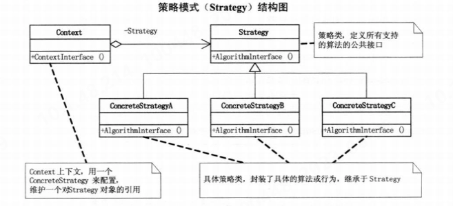

## 面向对象设计
### uml
#### 类图
1. 组合与聚合，其判断关键就是生命周期是否一致，在代码中往往体现为是否通过是否由该类创造另一个类的对象，例如若A类的构造方法中创造了B类的对象，则B和A是组合关系。

## 设计模式
### 一. 简单工厂模式
使用单独的工厂类进行创造实例的过程，实现功能的解耦。下图展示了一个简单工厂模式的UML的示意。

```java
public class Solution {
    public static void main(String[] arg){
        MOperation mOperation  = OperationFactory.operationFactory("+");
        mOperation.setOperation_num_A(5);
        mOperation.setOperation_num_B(6);
        System.out.println(mOperation.getResult());
    }
}
class MOperation{

    private double operation_num_A = 0;
    private double operation_num_B = 0;
    public double getOperation_num_A() {
        return operation_num_A;
    }
    public void setOperation_num_A(double operation_num_A) {
        this.operation_num_A = operation_num_A;
    }
    public double getOperation_num_B() {
        return operation_num_B;
    }
    public void setOperation_num_B(double operation_num_B) {
        this.operation_num_B = operation_num_B;
    }
    public double getResult() {return 0;}
}
class MOperationAdd extends MOperation{
    @Override
    public double getResult() {
        return getOperation_num_A()+getOperation_num_B();
    }
}
class MOperationSub extends MOperation{
    @Override
    public double getResult() {
        return getOperation_num_A()-getOperation_num_B();
    }
}
class  MOperationMul extends MOperation{
    @Override
    public double getResult() {
        return getOperation_num_A()*getOperation_num_B();
    }
}
class  MOperationDiv extends MOperation{
    @Override
    public double getResult() {
        if (getOperation_num_B()==0)
            try {
                throw new Exception("除数不能为0！");
            } catch (Exception e) {
                throw new RuntimeException(e);
            }
        return getOperation_num_A()/getOperation_num_B();

    }
}
class OperationFactory{
    public static MOperation operationFactory(String operation){
        switch (operation){
            case "+":
                return new MOperationAdd();
            case "-":
                return new MOperationSub();
            case "*":
                return new MOperationMul();
            case "/":
                return new MOperationDiv();
            default:
                return new MOperation();
        }
    }
}
```
### 二. 策略模式
&#8195;&#8195;策略模式（Strategy）定义了算法家族，分别封装起来，让它们之间可以互相替换，此模式让算法的变化不会影响到使用算法的客户。即当算法会出现经常性的变换时(或该算法更注重变化时)，将变化点封装起来。其基本结构如下所示：

&#8195;&#8195;该模式所定义的算法家族从概念上来看，完成的都是相同工作，只是实现不同，他可以以相同方式调用所有的算法，减少了算法类和使用算法类之间的耦合。而其Strategy类层次为Context定义了一系列可供重用的算法或行为，继承有助于析取出这些算法中的公共功能。此外：
1. 其简化了单元测试，因为每个算法都有自己的类，可通过自己的接口单独测试
2. 在基本的策略模式中，选择所用具体实现的职责由客户端对象承担，并转给策略模式的Context对象。

以下展示了策略模式和简单工厂模式的结合：
```java
public class Solution {
    public static void main(String[] arg){
        StrategyContext strategy_context = new StrategyContext("A");
        strategy_context.operationContextInterface();
    }
}
//Strategy
abstract class  Strategy {
    public  abstract void doWork();
}
class StrategyA extends Strategy {
    @Override
    public void doWork() {
        System.out.println("策略A");
    }
}
class StrategyB extends Strategy {
    @Override
    public void doWork() {
        System.out.println("策略B");
    }
}
class StrategyC extends Strategy {
    @Override
    public void doWork() {
        System.out.println("策略C");
    }
}
class StrategyD extends Strategy {
    @Override
    public void doWork() {
        System.out.println("策略D");
    }

}
class StrategyContext {
    Strategy strategy =null;
    public StrategyContext(String operation){
        switch (operation){
            case "A":
                strategy = new StrategyA();
                break;
            case "B":
                strategy = new StrategyB();
                break;
            case "C":
                strategy =  new StrategyC();
                break;
            case "D":
                strategy =  new StrategyD();
                break;
        }
    }
    public void operationContextInterface(){
        if(strategy ==null){
            try {
                throw new Exception("所选算法无效");
            } catch (Exception e) {
                throw new RuntimeException(e);
            }
        }
        strategy.doWork();
    }
}
```
