## 面向对象设计
### uml
#### 类图
1. 组合与聚合，其判断关键就是生命周期是否一致。
### 设计原则
#### A. 单一职责原则
&#8195;&#8195;即就一个类而言，应该仅有一个引起它变化的原因。
1. 如果一个类承担的职责过多，就等于把这些职责耦合在一起，一个职责的变化可能会削弱或抑制这个类完成其他职责的能力。这种耦合会导致脆弱的设计，当变化发生时，设计会遭受到意想不到的破坏。
2. 如果能想到多于一个动机去改变一个类，那么这个类就具有多于一个的职责。
#### B. 开放-封闭原则
&#8195;&#8195;软件实体（类，模块，函数等等）应该可以扩展，但是不可修改。即对于扩展时开放的，但对于更改是封闭的。
1. 设计人员必须对于他设计的模块应该对那种变化封闭做出选择。他必须先猜测出最有可能发生的变化种类，然后狗仔抽象来隔离哪些变化。（如策略模式中，采用的不同策略，均继承于同一抽象类）
2. 在最初编写代码时，假设变化不会发生，当发生小变化时，立刻采取行动，创建抽象来隔离以后发生的同类变化。且越早创建正确的抽象，修改的代价就越低。
3. 其精神在于：面对需求，对程序的改动是通过增加新代码进行的，而不是更改现有代码。
#### C. 里氏代换原则
&#8195;&#8195;子类型必须能够替换掉他们的父类型。
1. 即在软件中，把父类都替换成它的子类，程序的行为没有变化。（指对象的静态类型）
#### D. 依赖倒转原则
&#8195;&#8195;抽象不应该依赖细节，细节应该依赖于抽象。高层模块不应该依赖底层模块，二者都应依赖于抽象。
1. 即针对接口编程，不要针对实现编程。
2. 若程序中所有的依赖关系都是终止于抽象类或者接口，则是面向对象的设计。
#### E. 迪米特法则
&#8195;&#8195;也叫最少知识原则。如果两个类不必彼此直接通信，那么这两个类就不应当发生直接的相互作用。如果其中一个类需要调用另一个类的某一个方法的话，可以通过第三者转发这个调用。
1. 在类的设计结构上，每一个类都应当尽量降低成员的访问权限。
2. 在程序设计时，类之间的耦合越弱，越有利于复用，一个处在弱耦合的类被修改，不会对有关系的类造成波及。
#### F. 合成/聚合复用原则
&#8195;&#8195;即尽量使用合成/聚合，尽量不要使用类继承。
1. 优先使用对象的合成/聚合将有助于你保持每个类被封装，并被集中在单个任务上。这样类和类继承层次会保持较小规模，并且不太可能增长为不可控制的庞然大物。
2. 继承身为一种强耦合的结构，一定要在“is-a”的关系时使用，否则会导致结构上的复杂与麻烦
### 开发原则与注意事项
1. 不要为代码添加基于猜测、实际不需要的功能。如果不清楚一个系统是否需要某项功能或模式，一般就不要急着去实现它。
2. 尽管将一个系统划分为许多对象通常会增加其可复用性，但是对象间相互连接的激增又会降低其可复用性，因为大量的连接使得一个对象无法在没有其他对象支持下正常工作，系统将会表现为一个不可分割的整体，此时，进行改动将十分困难。
3. 将一个系统分割成一系列相互协作的类有一个很不好的副作用，那就是需要维护相关对象间的一致性。若为了维持一致性而使各类紧密耦合，这样会给维护、扩展和重用都带来不便。
## 设计模式
### 一. 简单工厂模式
使用单独的工厂类进行创造实例的过程，实现功能的解耦。下图展示了一个简单工厂模式的UML的示意。

```java
public class Solution {
    public static void main(String[] arg){
        MOperation mOperation  = OperationFactory.operationFactory("+");
        mOperation.setOperation_num_A(5);
        mOperation.setOperation_num_B(6);
        System.out.println(mOperation.getResult());
    }
}
class MOperation{

    private double operation_num_A = 0;
    private double operation_num_B = 0;
    public double getOperation_num_A() {
        return operation_num_A;
    }
    public void setOperation_num_A(double operation_num_A) {
        this.operation_num_A = operation_num_A;
    }
    public double getOperation_num_B() {
        return operation_num_B;
    }
    public void setOperation_num_B(double operation_num_B) {
        this.operation_num_B = operation_num_B;
    }
    public double getResult() {return 0;}
}
class MOperationAdd extends MOperation{
    @Override
    public double getResult() {
        return getOperation_num_A()+getOperation_num_B();
    }
}
class MOperationSub extends MOperation{
    @Override
    public double getResult() {
        return getOperation_num_A()-getOperation_num_B();
    }
}
class  MOperationMul extends MOperation{
    @Override
    public double getResult() {
        return getOperation_num_A()*getOperation_num_B();
    }
}
class  MOperationDiv extends MOperation{
    @Override
    public double getResult() {
        if (getOperation_num_B()==0)
            try {
                throw new Exception("除数不能为0！");
            } catch (Exception e) {
                throw new RuntimeException(e);
            }
        return getOperation_num_A()/getOperation_num_B();

    }
}
class OperationFactory{
    public static MOperation operationFactory(String operation){
        switch (operation){
            case "+":
                return new MOperationAdd();
            case "-":
                return new MOperationSub();
            case "*":
                return new MOperationMul();
            case "/":
                return new MOperationDiv();
            default:
                return new MOperation();
        }
    }
}
```
### 二. 策略模式
&#8195;&#8195;策略模式（Strategy）定义了算法家族，分别封装起来，让它们之间可以互相替换，此模式让算法的变化不会影响到使用算法的客户。即当算法会出现经常性的变换时(或该算法更注重变化时)，将变化点封装起来。其基本结构如下所示：

&#8195;&#8195;该模式所定义的算法家族从概念上来看，完成的都是相同工作，只是实现不同，他可以以相同方式调用所有的算法，减少了算法类和使用算法类之间的耦合。而其Strategy类层次为Context定义了一系列可供重用的算法或行为，继承有助于析取出这些算法中的公共功能。此外：
1. 其简化了单元测试，因为每个算法都有自己的类，可通过自己的接口单独测试
2. 在基本的策略模式中，选择所用具体实现的职责由客户端对象承担，并转给策略模式的Context对象。

以下展示了策略模式和简单工厂模式的结合：
```java
public class Solution {
    public static void main(String[] arg){
        // 客户端只需要认识StrategyContext一个类，减少了耦合
        StrategyContext strategy_context = new StrategyContext("A");
        strategy_context.operationContextInterface();
    }
}
//Strategy
abstract class  Strategy {
    public  abstract void doWork();
}
class StrategyA extends Strategy {
    @Override
    public void doWork() {
        System.out.println("策略A");
    }
}
class StrategyB extends Strategy {
    @Override
    public void doWork() {
        System.out.println("策略B");
    }
}
class StrategyC extends Strategy {
    @Override
    public void doWork() {
        System.out.println("策略C");
    }
}
class StrategyD extends Strategy {
    @Override
    public void doWork() {
        System.out.println("策略D");
    }

}
class StrategyContext {
    Strategy strategy =null;
    public StrategyContext(String operation){
        switch (operation){
            case "A":
                strategy = new StrategyA();
                break;
            case "B":
                strategy = new StrategyB();
                break;
            case "C":
                strategy =  new StrategyC();
                break;
            case "D":
                strategy =  new StrategyD();
                break;
        }
    }
    public void operationContextInterface(){
        if(strategy ==null){
            try {
                throw new Exception("所选算法无效");
            } catch (Exception e) {
                throw new RuntimeException(e);
            }
        }
        strategy.doWork();
    }
}
```
### 三、 装饰模式
&#8195;&#8195;装饰模式：动态地给一个对象添加一些额外的职责，就增加功能来说，装饰模式比生成子类更加灵活。其基本结构如下：
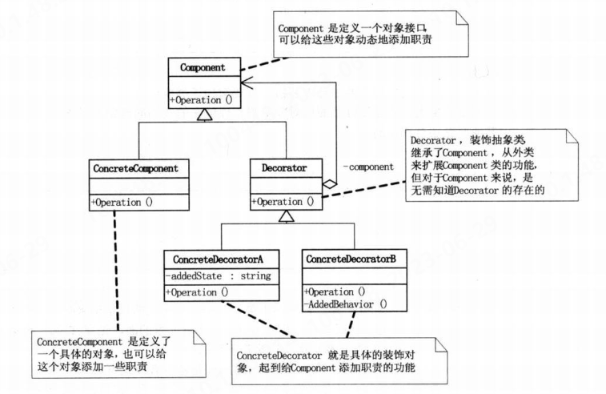
1. 装饰模式利用`SetComponent`来对对象进行包装，这样每个装饰对象的实现就和如何使用这个对象分离开了，每个装饰对象只关心自己得到功能，不需要1关心如何被添加到对象链当中。
2. 如果只有一个`ConcreteComponent`类而没有抽象的`Component`类，那么`Decorator`类可以是`ConcreteComponent`的一个子类。如果只有一个`ConcreteDecorator`，那么就没有必要建立一个单独的`Decorator`类，而可以把`Decorator`和`ConcreteDecorator`的职责合并成一个类。
3. ***当系统需要新功能时，向旧的类中添加新的代码，这些新加的代码通常装饰了原有类的核心职责或主要行为，但会增加主类的复杂度，然而可能新加入的东西只是在特定情况下才会执行的。***此时使用装饰模式可以把每个要装饰的功能放在单独的类中，并让这个类包装它所要装饰得到对象。这样可以有效地把类的核心职责和装饰功能区分开，并去除相关类中重复的装饰逻辑。
```java
public class Solution {
    public static void main(String[] arg){
    ConcreteComponent concrete_component = new ConcreteComponent("待装饰类");
    DecoratorA decorator_A = new DecoratorA();
    DecoratorB decorator_B = new DecoratorB();
    decorator_A.setComponent(concrete_component);
    decorator_B.setComponent(decorator_A);
    decorator_B.doWork();
    }
}
abstract class Component{
    abstract void doWork();
}
class ConcreteComponent extends Component{
    private String name;
    ConcreteComponent(String name){
        this.name = name;
    }
    @Override
    void doWork() {
        System.out.print("装饰了"+ name);
    }
}
abstract class Decorator extends Component{
    protected Component component;
    public void setComponent(Component component){
        this.component = component;
    }

    @Override
    void doWork() {
        if (component != null){
            component.doWork();
        }
    }
}
class DecoratorA extends Decorator{
    @Override
    void doWork() {
        System.out.print("A方法 ");
        super.doWork();
    }
}
class DecoratorB extends Decorator{
    @Override
    void doWork() {
        System.out.print("B方法 ");
        super.doWork();
    }
}
```
### 四、代理模式
&#8195;&#8195;代理模式：为其他对象提供一种代理以控制对这个对象的访问。其基本结构如下所示：

1. 应用场景：
   * 远程代理：也就是为一个对象在不同的地址空间提供局部代表。这样可以隐藏一个对象存在于不同地址空间的事实。
   * 虚拟代理：根据需要创建开销很大的对象。通过它来存放实例化需要很长时间的真是对象。（如HTML网页中的图片加载）
   * 安全代理：用来控制真实对象访问时的权限。
   * 智能指引：是指调用真实的对象时，代理处理另外一些事。
2. 要求代理和真实对象均继承自同一父类或实现同一接口。
```java
public class Solution {
    public static void main(String[] arg){
        Proxy proxy = new Proxy(new RealSubjects());
        proxy.doWork();
    }
}
abstract class Subjects{
    public abstract void doWork();
}
class RealSubjects extends Subjects{
    @Override
    public void doWork() {
        System.out.println("代理执行");
    }
}
class Proxy extends Subjects{
    RealSubjects real_subjects;
    public Proxy(RealSubjects real_subjects){
        this.real_subjects = real_subjects;
    }
    @Override
    public void doWork() {
        if (real_subjects==null){
            real_subjects = new RealSubjects();
        }
        real_subjects.doWork();
    }
}
```
### 五. 工厂方法模式
&#8195;&#8195;定义一个用于创建对象的接口，让子类决定实例化哪一个类。工厂方法使一个类的实例化延迟到其子类。其基本结构如下：
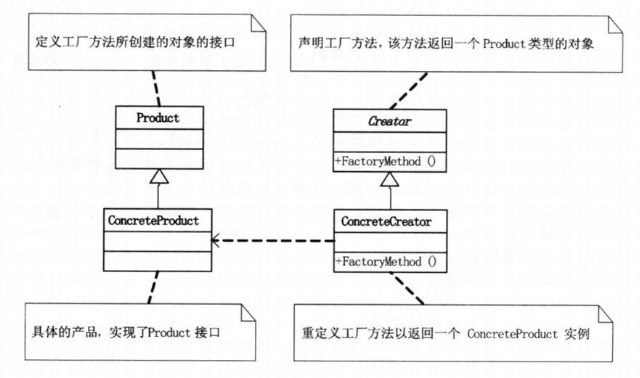
1. ***使用不同的工厂去调用各个类中不同的构造函数，以实现不同的种类的初始化***
```java
public class Solution {
    public static void main(String[] args){
        ADCFactory adc_factory = new JinxFactory();
        adc_factory.creatADC().doWork();
        adc_factory = new AsheFactory();
        adc_factory.creatADC().doWork();
    }
}
abstract class ADC{
    abstract void doWork();
}
class Ashe extends ADC{
    @Override
    void doWork() {
        System.out.println("艾师傅正在刮痧！");
    }
}
class Jinx extends ADC{
    @Override
    void doWork() {
        System.out.println("爆爆杀疯了！");
    }
}
interface ADCFactory{
    ADC creatADC();
}
class AsheFactory implements ADCFactory{
    @Override
    public ADC creatADC() {
        return new Ashe();
    }
}
class JinxFactory implements ADCFactory{
    @Override
    public ADC creatADC() {
        return new Jinx();
    }
}
```
### 六. 原型模式
&#8195;&#8195;用原型实例指定创建对象的种类，并且通过拷贝这些原型创建新的对象，其基本结构如下：
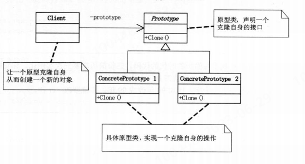
1. 原型模式其实就是一个从一个对象再创建另外一个可定制的对象，而且不需要知道任何创建的细节。其关键在于有一个clone方法
2. 浅复制与深复制
3. 可直接通过实现Cloneable接口的方法实现，而不需要再自己声明Prototype接口
```java

public class Solution {
    public static void main(String[] args) {
        Review review = new Review("Yutchen");
        review.setWork_summary("7月1日","学习JVM中线程安全与锁优化");
        Review review1 = (Review) review.clone();
        review1.setWork_summary("7月2日","学习设计模式");
        review.show();
        review1.show();
    }
}
class Review implements Cloneable{
    private String name;
    private WorkSummary work_summary;

    public Review(String name) {
        this.name = name;
        work_summary = new WorkSummary();
    }

    public void setWork_summary(String date,String work) {
        work_summary.setWorkSummary(date,work);
    }

    public void show(){
        System.out.println(name+work_summary.getDate()+work_summary.getWork());
    }
    //实现克隆方法时，先调用父类的克隆方法，再进行修正。
    //克隆方法仅会复制变量的值，因此对于引用类型，相当于获得了其本身的句柄，而不是其“内涵”
    public Review clone() {
        Review review = null;
        try {
            review = (Review) super.clone();
        } catch (CloneNotSupportedException e) {
            throw new RuntimeException(e);
        }
        //实现深复制：2. 调用要深复制的变量的克隆方法，并将结果赋给该变量。
        review.work_summary = work_summary.clone();
        return review;
    }
}
class WorkSummary implements Cloneable{
    private String date;
    private String work;
    public void setWorkSummary(String date,String work){
        this.date = date;
        this.work = work;
    }

    public String getDate() {
        return date;
    }

    public String getWork() {
        return work;
    }
    //实现深复制：1. 在引用类型的变量所对应的类中实现克隆方法。
    public WorkSummary clone()  {
        try {
            return (WorkSummary) super.clone();
        } catch (CloneNotSupportedException e) {
            throw new RuntimeException(e);
        }
    }
}   
```
### 七. 模板方法模式
&#8195;&#8195;定义一个操作中的算法的骨架，而将一些步骤延迟到子类中去。该方法使得子类可以不改变一个算法的结构即可重定义该算法的某些特定步骤。（即在父类的方法中调用其他可被子类重写的方法）。其基本结构如下：
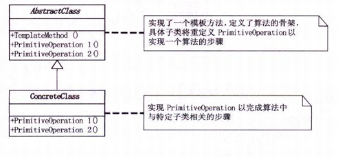
1. ***当某一功能其实现的步骤是固定的，但是每一步中的具体细节可能不同时，使用该模式。它将具体细节的实现延迟到子类中，并由父类中已定义的方法调用，确定个细节之间的执行步骤与逻辑***
2. 既然用到了继承，并且这个继承有意义，就应该要成为子类的模板，所有重复的代码都应该上升到父类去，而不是让每个子类都去重复。
3. 当要完成某一细节层次一致的一个过程或一系列步骤，但其个别步骤在更详细的层次上的实现可能不同时，通常考虑用模板方法模式来处理。
```java

public class Solution {
    public static void main(String[] args) {
        Team edg = new EDG();
        Team ig = new IG();
        edg.show();
        ig.show();
    }
}
abstract class Team{
    public void show(){
        teamName();
        teamMember();
        teamLeader();
    }
    protected abstract void teamName();
    protected abstract void teamMember();
    protected abstract void teamLeader();
}
class EDG extends Team{
    @Override
    public void teamName() {
        System.out.println("EDG战队");
    }

    @Override
    protected void teamMember() {
        System.out.println("队员：Flandre,Jiejie,Scout,Viper,Meiko");
    }

    @Override
    protected void teamLeader() {
        System.out.println("教练：Maokai");
    }
}
class IG extends Team{
    @Override
    protected void teamName() {
        System.out.println("IG战队");
    }

    @Override
    protected void teamMember() {
        System.out.println("队员：Theshy,Ning,Rookie,Jackeylove,Baolan");
    }

    @Override
    protected void teamLeader() {
        System.out.println("教练：金晶洙");
    }
}
```
### 八. 外观模式
&#8195;&#8195;为子系统中的一组接口提供一个一致的界面，此模式定义了一个高层接口，这个接口使得这一子系统更加容易使用。（即提供功能接口，并封闭底层实现）其基本结构如下：
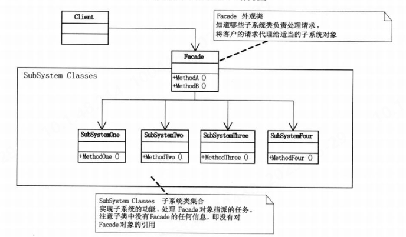
&#8195;&#8195;使用时机：
1. ***该模式将子系统中的的功能“进一步封装”，即在外观类中定义相关方法，通过调用该层的类，实现上层所需的功能，并且将外观类中的方法作为提供给上层的唯一接口***
2. 在设计初期阶段，应该有意识的将不同的两个层分离，在层与层之间建立外观。***以避免在各层类之间错综复杂的联系***
3. 在开发阶段，子系统往往因为不断的重构演化而变得越来越复杂，增加外观类可以提供一个简单的接口，减少他们的依赖。
4. 在维护一个大的遗留系统时，可能这个系统已经非常难以维护和扩展了，可以为新系统开发一个外观类来提供粗糙或高度复杂的遗留代码的比较清晰简单的接口，让新系统与外观对象交互。
```java


public class Solution {
    public static void main(String[] args) {
        Qiyana qiyana = new Qiyana();
        qiyana.combo2();
    }
}
class Qiyana{
    private Skill_Q skill_q = new Skill_Q();
    private Skill_W skill_w = new Skill_W();
    private Skill_E skill_e = new Skill_E();
    private Skill_R skill_r = new Skill_R();
    public void combo1(){
        skill_q.doWork();
        skill_w.doWork();
        skill_q.doWork();
    }
    public void combo2(){
        skill_e.doWork();
        skill_q.doWork();
        skill_r.doWork();
        skill_w.doWork();
        skill_q.doWork();
    }
}
class Skill_Q{
    public void doWork(){
        System.out.println("使用Q技能");
    }
}
class Skill_W{
    public void doWork(){
        System.out.println("使用W技能");
    }
}
class Skill_E{
    public void doWork(){
        System.out.println("使用E技能");
    }
}
class Skill_R{
    public void doWork(){
        System.out.println("使用R技能");
    }
}
```
### 九. 建造者模式
&#8195;&#8195;将一个复杂对象的构建与它的表示分离，使得同样的构建过程可以创建不同的表示。如果使用了建造者模式，那么用户就只需要指定需要建造的类型就可以得到他们，而具体建造的过程和细节就不需要知道了，由指挥者类来控制建造过程，隔离用户与建造过程的关联。其基本结构如下：

1. 主要用于创建一些复杂的对象，***这些对象内部构建的建造顺序通常是稳定的，但对象内部的构建步骤通常面临着复杂的变化。，此时通过Director类保证构建顺序，具体的实施则根据不同的Builder不同，此模式的整体思路与模板模式相似，但建造者模式着重于创建实例，而模板模式着重于功能实现***
```java
import java.util.ArrayList;
import java.util.List;

public class Solution {
    public static void main(String[] args) {
        Builder builder = new ConcreteBuilder1();
        Director director = new Director();
        director.Construct(builder);
        Product product = builder.getProduct();
        product.show();
    }
}
class Product{
    private List<String> list =new ArrayList<>();
    public void addPart(String s){
        list.add(s);
    }
    public void show(){
        for (String s: list) {
            System.out.println(s);
        }
    }
}
class Director{
    //由Director类保证创建流程的步骤和顺序
   public void Construct(Builder builder){
      builder.builderPart1();
      builder.builderPart2();
   }
}
abstract class Builder{
    protected Product product = new Product();
    abstract void builderPart1();
    abstract void builderPart2();
    public Product getProduct(){
        return product;
    }

}
class ConcreteBuilder1 extends Builder{
    @Override
    void builderPart1() {
        product.addPart("组件A");
    }

    @Override
    void builderPart2() {
        product.addPart("组件B");
    }
}
class ConcreteBuilder2 extends Builder{
    @Override
    void builderPart1() {
        product.addPart("组件X");
    }

    @Override
    void builderPart2() {
        product.addPart("组件Y");
    }
}
```
### 十. 观察者模式
&#8195;&#8195;该模式定义了一种一对多的依赖关系，让多个观察者对象同时监听某一个主题对象。这个主题对象在状态发生变化时，会通知所有观察者对象，使它们能够自动更新自己。其基本结构如下：

1. ***在主题对象中保存若干个观察者对象，当主题对象的状态发生变化时，依次调用观察者对象中的UPdate（）方法，实现观察者状态的更新。而在观察者对象中，通过保存主题类的实例，以在Update（）方法被调用时，可即时获取到所观察主题的状态，并根据状态的不同，做出不同的行为***
2. 一个Subject可以有任意数目的依赖它的Observer，一旦Subject的状态发生改变，所有的Observer都可以得到通知。
3. 应该考虑用观察者模式的情况：
   * ***当一个对象的改变需要同时改变其他对象，且它不知道具体有多少对象有待改变时***
   * 当一个抽象模型有两个方面，其中一个方面依赖与另一个方面，且要将两者封装在独立的对象中使他们各自独立地改变和复用。
```java
import java.util.ArrayList;
import java.util.List;

public class Solution {
    public static void main(String[] args) {
        ConcreteSubject subject = new ConcreteSubject();
        subject.Attach(new ConcreteObserverA(subject,"小瓜"));
        subject.Attach(new ConcreteObserverA(subject,"邦邦"));
        subject.setSubjctState("开心");
        subject.Notify();
    }
}
abstract class Subject{
    protected List<Observer> list = new ArrayList<>();
    public void Attach(Observer observer){
        list.add(observer);
    }
    public void Detach(Observer observer){
        list.remove(observer);
    }
    public void Notify(){
        for (Observer o:
                list) {
            o.Update();
        }
    }
}
class ConcreteSubject extends Subject{
    private String subjct_state;

    public String getSubjctState() {
        return subjct_state;
    }

    public void setSubjctState(String subjct_state) {
        this.subjct_state = subjct_state;
    }
}
abstract class Observer{
    public abstract void Update();
}
class ConcreteObserverA extends Observer{
    //需要随着Subject类中subjct_state属性变化的属性。
    private String observer_state;
    private String name;
    private ConcreteSubject subject;

    public ConcreteObserverA(ConcreteSubject subject,String name) {
        this.subject = subject;
        this.name = name;
    }

    public String getObserver_state() {
        return observer_state;
    }

    public void setObserver_state(String observer_state) {
        this.observer_state = observer_state;
    }

    @Override
    public void Update() {
        //根据主题对象的状态变化，使观察者对象的状态也发生变化
        observer_state = subject.getSubjctState();
        System.out.println("观察者"+name+"的最新状态是"+observer_state);
    }
}
```
### 十一. 抽象工厂模式
&#8195;&#8195;提供一个创建一系列相关或者相互依赖对象的接口，而无需指定它们具体的类。其基本结构如下：
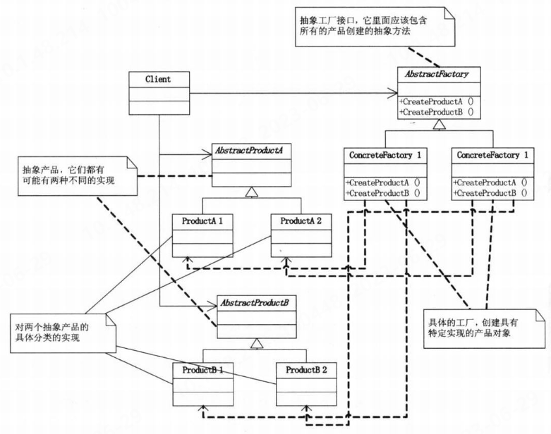

1. ***当某些抽象在不同的场景下有不同的实现时，为了快速实现其在不同场景下的切换与应用，可考虑使用抽象工厂模式，对不同的场景采用不同的工厂，用于这些抽象在特定场景下的实例化。一个比较有代表性的例子是，数据库操作，不同的数据库操作作为抽象，其在使用不同的数据库时，有不同的实现（即，类）***
2. 利用反射技术替代对工厂的判断，即采用依赖注入的编程方式。
3. 利用反射+配置文件替代在程序中的修改
4. 可以用简单工厂代替抽象工厂，简化修改
5. 在所有用到简单工厂的地方，都可以考虑使用反射技术来去除switch或if，解除分支判断带来的耦合。
### 十二. 状态模式
&#8195;&#8195;当一个对象的内在状态发生改变时允许改变其行为，这个对象看起来像是改变了其类。主要解决的是当控制一个对象状态转换的条件表达式过于复杂时的情况下，把状态的判断逻辑转移到表示不同状态的一系列类当中，可以把复杂的判断逻辑简化。

1. ***将对象不同状态的行为封装到不同的状态类中，并保存一个当前状态的对象，通过该状态对象调用特定的方法实现不同的行为。且当状态相关量发生变化时，状态的判断逻辑时在状态类中实现的，而不是对象本身所对应的类***
2. 可以将特定状态相关的行为局部化，并且将不同状态的行为分割开来。即将特定的状态相关的行为都放入一个对象中，由于所有与状态相关的代码都存在于某个ConcreteState中，所以通过定义新的子类可以很容易地增加新的状态和转换。
3. 将状态转移逻辑分布到State的子类之间，来减小相互间的依赖，以消除庞大的条件分支语句
4. 当一个对象的行为取决于他的状态，并且他必须在运行时刻根据状态改变它的行为时，可考虑使用状态模式。
```java
//此处模拟所用的壁纸随时间轮换不同场景的简单逻辑
public class Solution {
    public static void main(String[] args) {
        WallPaperEngine w = new WallPaperEngine(0);
        w.showWallPaper();
        w.setTime(6);
        w.showWallPaper();
        w.setTime(14);
        w.showWallPaper();

    }
}
//壁纸引擎类
class WallPaperEngine{
    private int time;
    private State state;

    public int getTime() {
        return time;
    }

    public void setTime(int time) {
        this.time = time;
    }
    public void setState(State state) {
        this.state = state;
    }

    WallPaperEngine(int time) {
        this.time = time;
        this.state = new StateNight();
    }

    public void showWallPaper(){
        //调用状态对象中的方法
        state.showWallPaper(this);
    }
}
//状态类,将状态之间转换和对应的操作都封装在具体的State中
abstract class State{
    abstract public void showWallPaper(WallPaperEngine w);
}
class StateDawn extends State{
    @Override
    public void showWallPaper(WallPaperEngine w) {
        if (w.getTime()<7){
            System.out.println("美丽的清晨");
        }else{
            w.setState(new StateDayTime());
            w.showWallPaper();
        }
    }
}
class StateDayTime extends State{
    @Override
    public void showWallPaper(WallPaperEngine w) {
        if (w.getTime()<17){
            System.out.println("热烈的白天");
        }else{
            w.setState(new StateDusk());
            w.showWallPaper();
        }
    }
}
class StateDusk extends State{
    @Override
    public void showWallPaper(WallPaperEngine w) {
        if (w.getTime()<19){
            System.out.println("浪漫的黄昏");
        }else{
            w.setState(new StateNight());
            w.showWallPaper();
        }
    }
}
class StateNight extends State{
    @Override
    public void showWallPaper(WallPaperEngine w) {
        if (w.getTime()<5){
            System.out.println("寂静的夜晚");
        }else{
            w.setState(new StateDawn());
            w.showWallPaper();
        }
    }
}
```
### 十三. 适配器模式
&#8195;&#8195;该模式将一个类的接口转换成客户希望的另一个接口，使得原本由于接口不兼容而不能一起工作的那些类可以一起工作。其基本结构：
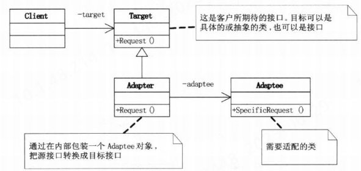
1. 系统的数据和行为都正确，但接口不符时，我们应该考虑使用适配器，目的是使控制范围之外的一个原有对象与某个接口匹配。其主要应用于希望复用一些现存的类，但是接口又与复用环境要求不一致的情况。
2. ***一般在开发后期或者维护期使用，即在双方都不太容易修改的时候再使用该模式***，或者在使用第三方开发组件时。
```java
//使用适配器模式，将接口转换的代价集中到适配器中
public class Solution {
    public static void main(String[] args) {
    MyTools myTools = new AdapterForMyTools();
    myTools.doWork();
    }
}
class MyTools{
    public void doWork(){
        System.out.println("使用独自开发的工具包。");
    }
}
class OtherTools{
    public void works(){
        System.out.println("采用第三方工具包");
    }
}
//采用适配器，调用其他接口
class AdapterForMyTools extends MyTools{
    OtherTools otherTools = new OtherTools();
    @Override
    public void doWork() {
        otherTools.works();
    }
}
```
### 十四. 备忘录模式
&#8195;&#8195;在不破坏封装性的前提下，捕获一个对象的内部状态，并在该对象之外保存这个状态，这样以后就可将对象恢复到原先保存的状态。其基本结构为：
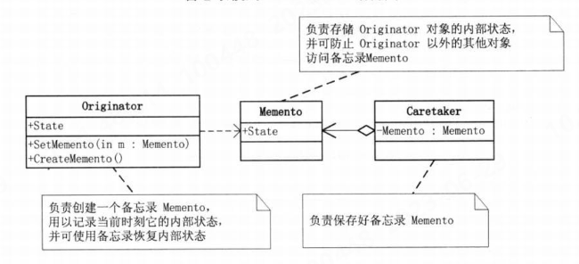
1. Caretaker只能看备忘录的窄接口，他只能将备忘录传递给其他对象。Originator能够看到一个宽接口，允许它访问返回到先前状态所需的所有数据。***窄接口可通过让类实现接口方法实现，即CareTaker访问接口，Originator访问类***
2. 当我们需要保存全部信息时，可以考虑使用clone的方式实现，但这相当于开放了全部public接口。而当需要保存部分信息时，可使用该模式，将保存的细节封装在备忘录类Memento中，并使其只拥有需要保存的信息。
```java
//使用备忘录模式，实现游戏杀戮尖塔中对人物信息存档功能的简单逻辑
public class Solution {
    public static void main(String[] args) {
        int[] card = {1,2,3};
        int[] treasure = {4,5,6};
        String name = "战士";
        Role role = new Role();
        role.setState(78,card,treasure,name);
        //创建一个caretaker，用于管理生成的备忘录
        Caretaker caretaker = new Caretaker();
        caretaker.setMemento(role.createMemento());
        //角色状态发生变化
        card[2]=4;
        role.setState(72,card,treasure,name);
        role.show();
        //使用备忘录复原
        role.Recover(caretaker.getMemento());
        role.show();
    }
}
//角色类
class Role{
    private int health;
    private int[] card;
    private int[] treasure;
    private String name;
    public void setState(int health, int[] card, int[] treasure, String name){
        this.health = health;
        this.card = card;
        this.treasure = treasure;
        this.name = name;
    }
    public void show(){
        System.out.println(name+"还拥有"+health+"生命值");
        for (int i:card
             ) {
            System.out.print(i);
        }
    }

    /**
     * 创建备忘录
     * @return
     */
    public Memento createMemento(){

        return (new Memento(health,card,treasure,name));
    }

    /**
     * 从备忘录中恢复数据
     * @param memento
     */
    public void Recover(Memento memento){
        card=memento.getCard();
        health=memento.getHealth();
        treasure=memento.getTreasure();
        name=memento.getName();
    }
}

//备忘录类中包含所要保存的所有属性
class Memento{
    private int health;
    private int[] card ;
    private int[] treasure;
    private String name;

    public int getHealth() {
        return health;
    }

    public int[] getCard() {
        return card;
    }

    public int[] getTreasure() {
        return treasure;
    }

    public String getName() {
        return name;
    }

    public Memento(int health, int[] card, int[] treasure, String name) {
        this.health = health;
        //对于数组，调用clone()方法，实现深复制
        this.card = card.clone();
        this.treasure = treasure.clone();
        this.name = name;
    }
}
class Caretaker{
    private Memento memento;

    public Memento getMemento() {
        return memento;
    }

    public void setMemento(Memento memento) {
        this.memento = memento;
    }
}
```
### 十五. 组合模式
&#8195;&#8195;该模式将对象组合成树形结构以表示“部分-整体”的层次结构。使得用户对单个对象和组合对象的使用具有一致性。其基本结构为：
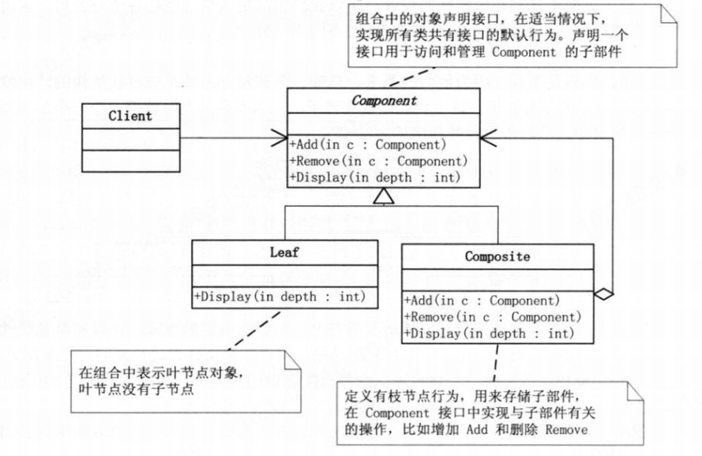
1. ***该模式使枝节点包含对顶层抽象的引用，形成组合关系，以此来实现树形结构***
2. 透明方式：在Component中声明所有用来管理子对象的方法，使叶节点和枝节点对于外界没有区别。但由于叶节点实际上不具备该功能，，所以实现它是没有意义的。
3. 安全方式：不在Component中声明子对象不具备的方法，但由于不够透明，不同的实现类将具有不同的接口，客户端调用时要做相应的判断。
4. 当发现需求中是体现部分与整体层次的结构时，且希望用户可以忽略组合对象和单个对象的不同，统一的使用组合结构中的所有对象时（如Word中对单个文字和整段文字调整格式），应该考虑使用组合模式。

```java
import java.util.ArrayList;
import java.util.List;

//使用组合结构，模拟实现公司架构逻辑
public class Solution {
    public static void main(String[] args) {
        Company root = new ConcreteCompany("上海总公司");
        root.Add(new HRDepartment("上海总公司人力管理部门"));
        root.Add(new FinanceDepartment("上海总公司财务管理部门"));
        Company company1 = new ConcreteCompany("青岛分公司");
        company1.Add(new HRDepartment("青岛分公司人力管理部门"));
        company1.Add(new FinanceDepartment("青岛分公司财务管理部门"));
        root.Add(company1);
        root.Display(1);
        root.doWork();
    }
}
abstract class Company{
    private String name;

    public String getName() {
        return name;
    }

    public Company(String name){
        this.name = name;
    }
    abstract public void Add(Company c);
    abstract public void Remove(Company c);
    abstract public void Display(int depth);
    abstract public void doWork();
}
class HRDepartment extends Company{
    public HRDepartment(String name) {
        super(name);
    }

    @Override
    public void Add(Company c) {

    }

    @Override
    public void Remove(Company c) {

    }

    @Override
    public void Display(int depth) {
        System.out.println("第"+depth+"层"+getName());
    }

    @Override
    public void doWork() {
        System.out.println("负责"+getName()+"人力管理");
    }
}
class FinanceDepartment extends Company{
    public FinanceDepartment(String name) {
        super(name);
    }

    @Override
    public void Add(Company c) {

    }

    @Override
    public void Remove(Company c) {

    }

    @Override
    public void Display(int depth) {
        System.out.println("第"+depth+"层"+getName());
    }

    @Override
    public void doWork() {
        System.out.println("负责"+getName()+"财务管理");
    }
}
//具体公司类，作为枝节点
class ConcreteCompany extends Company{
    private List<Company> list = new ArrayList<>();
    public ConcreteCompany(String name) {
        super(name);
    }

    @Override
    public void Add(Company c) {
        list.add(c);
    }

    @Override
    public void Remove(Company c) {
        list.remove(c);
    }

    @Override
    public void Display(int depth) {
        System.out.println("第"+depth+"层"+getName());
        for(Company c:list){
            c.Display(depth+1);
        }
    }

    @Override
    public void doWork() {
        for(Company c:list){
            c.doWork();
        }
    }
}
```
### 十六. 迭代器模式
&#8195;&#8195;该模式提供一种方法顺序访问一个聚合对象中的各个元素，且还不会暴露该对象的内部表示。其基本结构为：
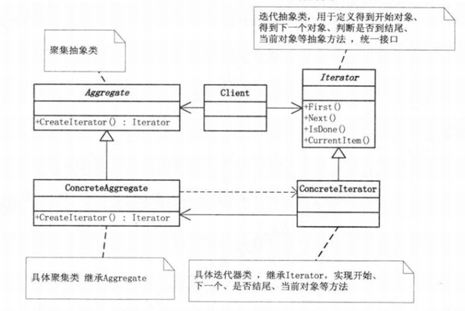
1. 当需要访问一个聚类对象，且不管这些对象是什么都需要遍历的时候，或者需要对聚类有多种遍历方式时，可以考虑用该模式。该模式提供如开始、下一个、是否结束、当前项等统一的接口。
2. 具体迭代器用以实现不同的迭代方法。
3. 该模式目前已被大多高级语言封装，如`foreach`
### 十七.单例模式
&#8195;&#8195;该模式保证一个类仅有一个实例，并提供一个访问它的全局访问点。其基本结构为：
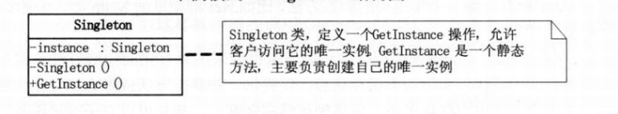
1. ***该模式将构造方法设为私有，并开放一个静态的接口用于获取本类实例的唯一访问点，在该接口中将判断该实例是否已被创建。***
2. 使用双重锁定来减少加锁对性能的影响，即先做判断再加锁，然后再在锁中做相同的判断。
```java
public class Solution {
    public static void main(String[] args) {
        Singleton singleton1 = Singleton.getSingleton();
        Singleton singleton2 = Singleton.getSingleton();
        singleton1.Add();
        singleton2.Display();
    }
}
class Singleton{
    //声明一个全局的实例，此外静态方法getSingleton()只能访问静态变量
    private static Singleton singleton;
    private int num = 1;
    private Singleton(){
    }
    //在多线程时，需要对此方法加锁
    public static Singleton getSingleton(){
        if (singleton==null){
            singleton = new Singleton();
        }
        return singleton;
    }
    public void Add(){
        num+=1;
    }
    public void Display(){
        System.out.println(num);
    }
}
```
#### 单例模式的实现
##### 懒汉式（线程不安全）
延迟了实例化，只有在被调用后才会创建实例
```java
public class Singleton {
     private static Singleton uniqueInstance;
 
     private Singleton() {
 
    }
 
    public static Singleton getUniqueInstance() {
        if (uniqueInstance == null) {
            uniqueInstance = new Singleton();
        }
        return uniqueInstance;
    }
}
```
##### 饿汉式（线程安全）
提前实例化好了一个实例，避免了线程不安全问题的出现,但可能会导致资源浪费
```java
public class Singleton {

    private static Singleton uniqueInstance = new Singleton();

    private Singleton() {
    }

    public static Singleton getUniqueInstance() {
        return uniqueInstance;
    }

}
```
##### 懒汉式（线程安全）
对get方法加锁保证线程安全，但性能较低
```java
public class Singleton {
    private static Singleton uniqueInstance;

    private static singleton() {
    }

    private static synchronized Singleton getUinqueInstance() {
        if (uniqueInstance == null) {
            uniqueInstance = new Singleton();
        }
        return uniqueInstance;
    }

}
```
##### 双重检查锁实现（线程安全）
仅当需要创建实例时上锁，其中对实例采用volatile关键字修饰，保证多线程情况下不会因为指令重排序导致不安全。
```java
public class Singleton {

    private volatile static Singleton uniqueInstance;

    private Singleton() {
    }

    public static Singleton getUniqueInstance() {
        if (uniqueInstance == null) {
            synchronized (Singleton.class) {
                if (uniqueInstance == null) {
                    uniqueInstance = new Singleton();
                }
            }
        }
        return uniqueInstance;
    }  
}
```
##### 静态内部类实现（线程安全）
延迟实例化，节约了资源；且线程安全,由JVM保证只会初始化一次；性能也提高了。
```java
public class Singleton {

    private Singleton() {
    }

    private static class SingletonHolder {
        private static final Singleton INSTANCE = new Singleton();
    }

    public static Singleton getUniqueInstance() {
        return SingletonHolder.INSTANCE;
    }

}
```
##### 枚举类实现（线程安全）
默认枚举实例的创建就是线程安全的，且在任何情况下都是单例，天然防止反射和反序列化调用
```java
public enum Singleton {

    INSTANCE;

    //添加自己需要的操作
    public void doSomeThing() {

    }

}
```
### 十八. 桥接模式
&#8195;&#8195;该模式将抽象部分与它的实现部分分离，使它们都可以独立的变化。此处的实现是指抽象类和它的派生类用来实现自己的对象。例如学校的学生可以按班级来分类实现，也可以按性别来分类实现。其基本结构为：
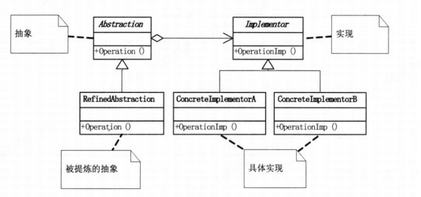
1. 由于实现的方式有多种，桥接模式的核心意图就是把这些实现独立出来，让它们各自的变化，这使得每种实现的变化不会影响其他实现，从而达到应对变换的目的。
2. 即一种将多对不同种类的抽象组合的可能，通过建立其根本抽象之间的联系，来减少整个结构的复杂度。例如上文中提到的学生，直接建立根本抽象类，即性别(包含男、女)和班级（包含1、2、3...班）之间的联系，来避免出现类似于2班男生，1班女生这样的类。
```java
//采用桥接模式使各种实现独立变化
public class Solution {
    public static void main(String[] args) {
        MClass class_one = new MClassOne();
        class_one.setStu(new Boy());
        class_one.doWork();
        MClass class_two = new MClassTwo();
        class_two.setStu(new Girl());
        class_two.doWork();
        class_two.setStu(new Boy());
        class_two.doWork();
    }
}
abstract class MClass{
    private Sex stu;
    public void setStu(Sex stu) {
        this.stu = stu;
    }

    public Sex getStu() {
        return stu;
    }

    abstract public void doWork();
}
class MClassOne extends MClass{


    @Override
    public void doWork() {
        System.out.print("一班");
        getStu().doWork();
    }
}
class MClassTwo extends MClass{
    @Override
    public void doWork() {
        System.out.print("二班");
        getStu().doWork();
    }
}
abstract class Sex{
    abstract void doWork();
}
class Boy extends Sex{
    @Override
    void doWork() {
        System.out.println("男生去踢足球");
    }
}
class Girl extends Sex{
    @Override
    void doWork() {
        System.out.println("女生去跳皮筋");
    }
}
```
### 十九. 命令模式
&#8195;&#8195;该模式将一个请求封装为一个对象，从而使你可用不同的请求对客户进行参数化；对请求排队或者记录请求日志，以及支持可撤销的操作。
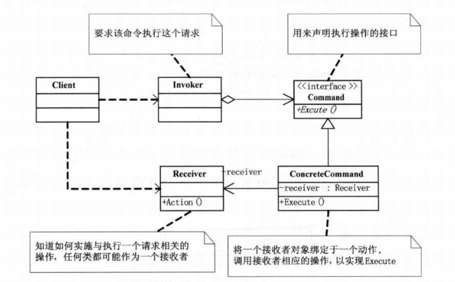
1. 对于请求排队或者记录请求日志，以及支持可撤销的操作等行为时，“行为请求者”和“行为实现者”的紧耦合会导致关系僵化，存在隐患。
2. 该模式可以
   * 较容易的设计一个命令队列
   * 在需要的情况下，可以较容易的将命令记入日志
   * 允许接受请求的一方决定是否要否决请求
   * 可以容易的实现对请求的撤销和重做
   * 由于加进新的具体命令类不影响其他的类，因此增加新的具体命令类很容易
   * 把请求一个操作的对象和知道怎么执行一个操作的对象分离开了
---
```java
import java.util.ArrayList;
import java.util.List;

//采用命令模式来模拟老师通知学生干活的简单逻辑
public class Solution {
    public static void main(String[] args) {
        Teacher teacher = new Teacher();
        //课题有新的任务下发，老师将其分解成不同的命令指派给不同的学生，整个课题实现由学生完成，老师充当通知者，不参与实际操作
        Command command = new CommandResearch();
        command.setStudent(new Student("小A"));
        Command command1 = new CommandWrite();
        command1.setStudent(new Student("小B"));
        teacher.addCommand(command);
        teacher.addCommand(command1);
        //将命令通知到个人
        teacher.Notify();
    }
}
//Invoker,由该类或者接收者去判断是否执行命令
class Teacher{
    private List<Command> list = new ArrayList<>();
    public void addCommand(Command c){
        list.add(c);
    }
    public void Notify(){
        for(Command c : list){
            c.doWork();
        }
    }

}
abstract class Command{
    private Student student;

    public void setStudent(Student student) {
        this.student = student;
    }

    public Student getStudent() {
        return student;
    }

    abstract void doWork();
}
//Receiver
class Student{
    private String name;

    public Student(String name) {
        this.name = name;
    }

    public void Write(){
        System.out.println(name+"写材料!");
    }
    public void Research(){
        System.out.println(name+"做科研!");
    }
}
class CommandWrite extends Command{
    @Override
    void doWork() {
        getStudent().Write();
    }
}
class CommandResearch extends Command{
    @Override
    void doWork() {
        getStudent().Research();
    }
}
```
### 二十. 职责链模式
&#8195;&#8195;该模式使多个对象都有机会处理请求，从而避免请求的发送者和接收者之间的耦合关系。将这个对象连成一条链，并沿着这条链传递该请求，直到有一个对象处理它为止。其基本结构图如下：
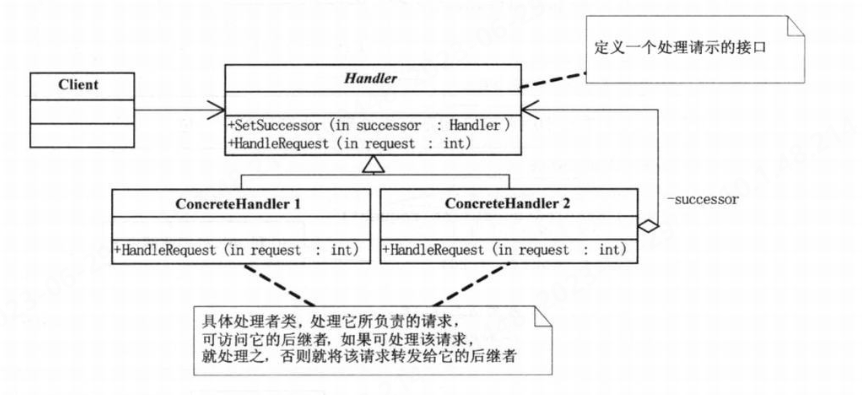
1. 其中发出这个请求的客户端并不知道这当中的哪一个对象最终处理这个请求，这样系统的更改可以咋不影响客户端的情况下动态地重新组织和分配职责。
2. 在该模式下，每个职责对象只需保持一个后继对象的引用，而不需要保持它所有候选接受者的引用；且由于是在客户端定义链的结构，因此可以随时修改处理流程的结构。
3. 在该模式下，原有分支内的功能被分解到每一个处理者类中，而处理流程被分到客户端中，降低了修改的代价，避免了原来大量分支判断造成难维护、灵活性差的问题。
```java
//采用职责链模式模拟学生请假的简单逻辑
public class Solution {
    public static void main(String[] args) {
        Handles fudaoyuan = new HandlesFuDaoYuan();
        Handles daoshi = new HandlesDaoShi();
        Handles shuji = new HandlesShuJi();
        fudaoyuan.setSuccessor(daoshi);
        daoshi.setSuccessor(shuji);
        fudaoyuan.handleRequest(8);
        fudaoyuan.handleRequest(2);

    }
}
abstract class Handles{
    private Handles handles;
    public Handles getHandles() {
        return handles;
    }

    public void setHandles(Handles handles) {
        this.handles = handles;
    }

    public void setSuccessor(Handles h){
        setHandles(h);
    }
    abstract void handleRequest(int num);
}
class HandlesFuDaoYuan extends Handles{
    @Override
    void handleRequest(int num) {
        if(num < 3){
            System.out.println("辅导员审批，同意请假!");
        }else {
            if (getHandles() != null)
              getHandles().handleRequest(num);
        }
    }
}
class HandlesDaoShi extends Handles{
    @Override
    void handleRequest(int num) {
        if(num < 7){
            System.out.println("导师审批，同意请假!");
        }else {
            if (getHandles() != null)
              getHandles().handleRequest(num);
        }
    }
}
class HandlesShuJi extends Handles{
    @Override
    void handleRequest(int num) {
        if(num < 15){
            System.out.println("书记审批，同意请假!");
        }else {
            System.out.println("书记审批，不同意请假!");
        }
    }
}
```
### 二十一. 中介者模式
&#8195;&#8195;该模式用一个中介对象来封装一系列的对象交互。中介者使各对象不需要显式地相互引用，从而使其耦合松散，而且可以独立的改变它们之间的交互。其基本结构如下：
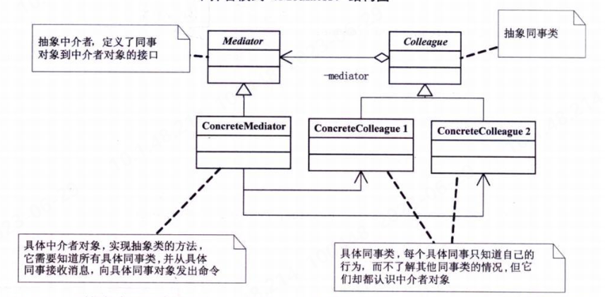
1. 当系统中出现了“多对多”交互复杂的对象群时，应首先烦死是否在系统设计上有不合理的地方，而不是直接使用该模式。
2. 该模式一般应用于一组对象以定义良好但是复杂的方式进行通信的场合，以及想定制一个分布在多个类中的行为，而又不想生成太多子类的场合。
3. 在Android开发中的Activity类就承担着中介者的作用，它承担了各个控件之间的联系与操作。
```java
//采用中介模式模拟租房的简单逻辑
public class Solution {
    public static void main(String[] args) {
        Mediator mediator = new Mediator();
        Seller seller = new Seller(mediator);
        Buyer buyer = new Buyer(mediator);
        mediator.setBuyer(buyer);
        mediator.setSeller(seller);
        buyer.sendMessage("希望可以获得一些优惠");
        seller.sendMessage("没问题，但是要至少租6个月");

    }
}
class Mediator{
    private Seller seller;
    private Buyer buyer;

    public Seller getSeller() {
        return seller;
    }

    public void setSeller(Seller seller) {
        this.seller = seller;
    }

    public Buyer getBuyer() {
        return buyer;
    }

    public void setBuyer(Buyer buyer) {
        this.buyer = buyer;
    }
    public void SendMessage(String m,User user){
        if (user == seller){
            buyer.getMessage(m);
        }
        if (user == buyer){
            seller.getMessage(m);
        }
    }
}
abstract class User{
    private Mediator mediator;

    public Mediator getMediator() {
        return mediator;
    }

    public User(Mediator mediator) {
        this.mediator = mediator;
    }
    public abstract void sendMessage(String m);
    public abstract void getMessage(String m);
}
class Seller extends User{
    public Seller(Mediator mediator) {
        super(mediator);
    }

    @Override
    public void sendMessage(String m) {
        getMediator().SendMessage(m,this);
    }

    @Override
    public void getMessage(String m) {
        System.out.println("卖家收到对方消息："+m);
    }
}
class Buyer extends User{
    public Buyer(Mediator mediator) {
        super(mediator);
    }

    @Override
    public void sendMessage(String m) {
        getMediator().SendMessage(m,this);
    }

    @Override
    public void getMessage(String m) {
        System.out.println("买家收到对方消息："+m);
    }
}
```
### 二十二.享元模式
&#8195;&#8195;该模式运用共享技术有效地支持大量细粒度的对象。其基本结构如下：

1. 享元模式可以避免大量相似类的开销，在程序设计中，有时候需要生成大量细粒度地类实例来表示数据。如果发现这些实例除了几个参数外基本都是相同的，可以将那些参数移到类实例外面，在方法调用的时候再传递进来，这样就能通过共享大幅度减少单个实例的数目。即协调内部和外部状态，在共享的同时，体现它们的不同。
2. 如果一个应用程序使用了大量的对象，而大量的对象造成了很大的存储开销时，就应考虑使用；还有就是对象的大多数状态可以表示外部状态，如果单独提取出对象中的外部状态，那么可以用相对较少的共享对象取代很多对象，此时可以考虑使用共享模式。
3. String的实现方式就是一种享元模式。再如棋盘上的棋子，若每个棋子都生成新的对象，将会产生极大的开销，因此可用享元模式设计。
4. 运用享元模式需要维护一个记录了系统已有的所有享元的列表，这需要耗费资源，且该模式使系统更加复杂。因此应该在有足够多的对象实例可供共享时使用。
```java
import java.util.HashMap;

//采用享元模式模拟在棋盘上下围棋的逻辑
public class Solution {
    public static void main(String[] args) {
        ChessFactory chessFactory = new ChessFactory();
        Chess chess1 = chessFactory.getChess("白子");
        Chess chess2 = chessFactory.getChess("黑子");
        chess2.Draw(new Locate(2,3));
        chess1.Draw(new Locate(2,4));
        chess2.Draw(new Locate(3,4));
    }
}
class Chess{
    private String name;

    public Chess(String name) {
        this.name = name;
    }
    public void Draw(Locate l){
        System.out.println("在坐标("+l.getX()+","+l.getY()+")处落下"+name);
    }
}
//作为棋子的外部状态类
class Locate {
    private int x;
    private int y;

    public int getX() {
        return x;
    }

    public int getY() {
        return y;
    }

    public Locate(int x, int y) {
        this.x = x;
        this.y = y;
    }
}
class ChessFactory{
    private HashMap<String,Chess> chess = new HashMap<>();
    public Chess getChess(String name){
        if (!chess.containsKey(name)){
            chess.put(name,new Chess(name));
        }
        return chess.get(name);
    }
}
```
### 二十三. 解释器模式
&#8195;&#8195;该模式对于某一给定的语言，定义它的文法的一种表示，并定义一个解释器，这个解释器使用该表示来解释语言中的句子。其基本结构如下：

1. 如果一种特定类型的问题发生的频率足够高，那么可能就值得将该问题的各个实例表述为一个简单语言中的句子。这样就可以构建一个解释器，该解释器通过解释这些句子来解决该问题。如使用正则表达式识别字符串。
2. 当有一个语言需要解释执行，并且你可以将该语言中的句子表示为一个抽象语法树时，可使用解释器模式。
3. 使用解释器模式意味着可以很容易地改变和扩展文法，因为该模式使用类来表示文法规则。可以使用继承来改变或者扩展文法。也比较容易实现文法，因为定义抽象语法树中各个节点的类的实现大体类似。这些类都易于直接编写。
4. 当文法非常复杂时，应使用其他技术如语法分析程序或者编译器生成器来处理
 
### 二十四.访问者模式
&#8195;&#8195;该模式表示一个作用于对象结构中各个元素的操作，它可以在不改变各元素的类的前提下，定义作用于这些元素的新操作。即可以在不在相应的类中增加新方法的情况下，为其增加新的操作。其基本结构如下：
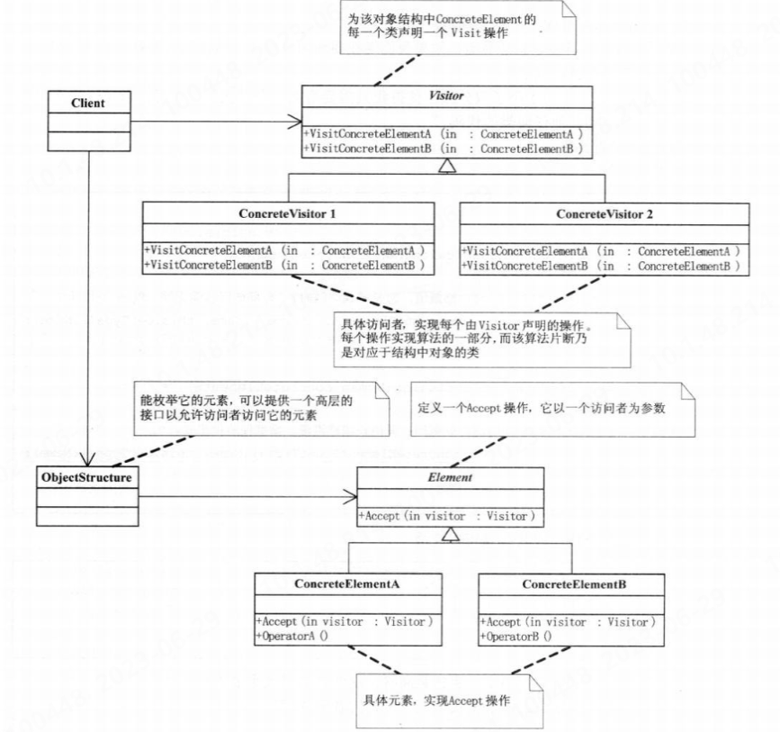
1. 采用双分派技术使实际执行的操作请求决定于请求的种类和两个接收者的类型。
2. 该模式使用的前提是元素的结构相对稳定的系统，即不会或较少会出现元素数目的改动。它把数据结构和作用于结构山的操作直接的耦合解脱开，使得操作集合可以相对自由地演化。因此，其适用于数据结构稳定但算法操作易变的情况。


end at the page 323