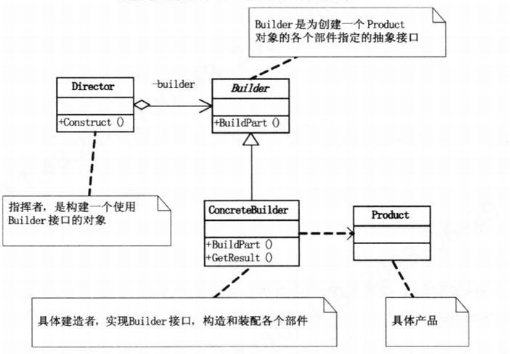
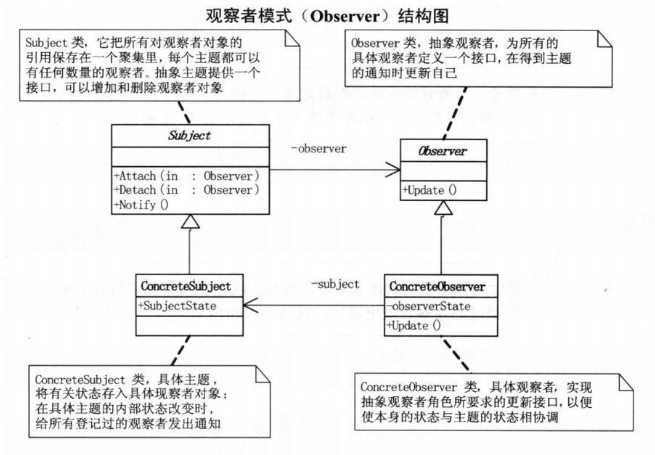

## 面向对象设计
### uml
#### 类图
1. 组合与聚合，其判断关键就是生命周期是否一致，在代码中往往体现为是否通过是否由该类创造另一个类的对象，例如若A类的构造方法中创造了B类的对象，则B和A是组合关系。
### 设计原则
#### A. 单一职责原则
&#8195;&#8195;即就一个类而言，应该仅有一个引起它变化的原因。
1. 如果一个类承担的职责过多，就等于把这些职责耦合在一起，一个职责的变化可能会削弱或抑制这个类完成其他职责的能力。这种耦合会导致脆弱的设计，当变化发生时，设计会遭受到意想不到的破坏。
2. 如果能想到多于一个动机去改变一个类，那么这个类就具有多于一个的职责。
#### B. 开放-封闭原则
&#8195;&#8195;软件实体（类，模块，函数等等）应该可以扩展，但是不可修改。即对于扩展时开放的，但对于更改是封闭的。
1. 设计人员必须对于他设计的模块应该对那种变化封闭做出选择。他必须先猜测出最有可能发生的变化种类，然后狗仔抽象来隔离哪些变化。（如策略模式中，采用的不同策略，均继承于同一抽象类）
2. 在最初编写代码时，假设变化不会发生，当发生小变化时，立刻采取行动，创建抽象来隔离以后发生的同类变化。且越早创建正确的抽象，修改的代价就越低。
3. 其精神在于：面对需求，对程序的改动是通过增加新代码进行的，而不是更改现有代码。
#### C. 里氏代换原则
&#8195;&#8195;子类型必须能够替换掉他们的父类型。
1. 即在软件中，把父类都替换成它的子类，程序的行为没有变化。（指对象的静态类型）
#### D. 依赖倒转原则
&#8195;&#8195;抽象不应该依赖细节，细节应该依赖于抽象。高层模块不应该依赖底层模块，二者都应依赖于抽象。
1. 即针对接口编程，不要针对实现编程。
2. 若程序中所有的依赖关系都是终止于抽象类或者接口，则是面向对象的设计。
#### E. 迪米特法则
&#8195;&#8195;也叫最少知识原则。如果两个类不必彼此直接通信，那么这两个类就不应当发生直接的相互作用。如果其中一个类需要调用另一个类的某一个方法的话，可以通过第三者转发这个调用。
1. 在类的设计结构上，每一个类都应当尽量降低成员的访问权限。
2. 在程序设计时，类之间的耦合越弱，越有利于复用，一个处在弱耦合的类被修改，不会对有关系的类造成波及。
## 设计模式
### 一. 简单工厂模式
使用单独的工厂类进行创造实例的过程，实现功能的解耦。下图展示了一个简单工厂模式的UML的示意。

```java
public class Solution {
    public static void main(String[] arg){
        MOperation mOperation  = OperationFactory.operationFactory("+");
        mOperation.setOperation_num_A(5);
        mOperation.setOperation_num_B(6);
        System.out.println(mOperation.getResult());
    }
}
class MOperation{

    private double operation_num_A = 0;
    private double operation_num_B = 0;
    public double getOperation_num_A() {
        return operation_num_A;
    }
    public void setOperation_num_A(double operation_num_A) {
        this.operation_num_A = operation_num_A;
    }
    public double getOperation_num_B() {
        return operation_num_B;
    }
    public void setOperation_num_B(double operation_num_B) {
        this.operation_num_B = operation_num_B;
    }
    public double getResult() {return 0;}
}
class MOperationAdd extends MOperation{
    @Override
    public double getResult() {
        return getOperation_num_A()+getOperation_num_B();
    }
}
class MOperationSub extends MOperation{
    @Override
    public double getResult() {
        return getOperation_num_A()-getOperation_num_B();
    }
}
class  MOperationMul extends MOperation{
    @Override
    public double getResult() {
        return getOperation_num_A()*getOperation_num_B();
    }
}
class  MOperationDiv extends MOperation{
    @Override
    public double getResult() {
        if (getOperation_num_B()==0)
            try {
                throw new Exception("除数不能为0！");
            } catch (Exception e) {
                throw new RuntimeException(e);
            }
        return getOperation_num_A()/getOperation_num_B();

    }
}
class OperationFactory{
    public static MOperation operationFactory(String operation){
        switch (operation){
            case "+":
                return new MOperationAdd();
            case "-":
                return new MOperationSub();
            case "*":
                return new MOperationMul();
            case "/":
                return new MOperationDiv();
            default:
                return new MOperation();
        }
    }
}
```
### 二. 策略模式
&#8195;&#8195;策略模式（Strategy）定义了算法家族，分别封装起来，让它们之间可以互相替换，此模式让算法的变化不会影响到使用算法的客户。即当算法会出现经常性的变换时(或该算法更注重变化时)，将变化点封装起来。其基本结构如下所示：

&#8195;&#8195;该模式所定义的算法家族从概念上来看，完成的都是相同工作，只是实现不同，他可以以相同方式调用所有的算法，减少了算法类和使用算法类之间的耦合。而其Strategy类层次为Context定义了一系列可供重用的算法或行为，继承有助于析取出这些算法中的公共功能。此外：
1. 其简化了单元测试，因为每个算法都有自己的类，可通过自己的接口单独测试
2. 在基本的策略模式中，选择所用具体实现的职责由客户端对象承担，并转给策略模式的Context对象。

以下展示了策略模式和简单工厂模式的结合：
```java
public class Solution {
    public static void main(String[] arg){
        // 客户端只需要认识StrategyContext一个类，减少了耦合
        StrategyContext strategy_context = new StrategyContext("A");
        strategy_context.operationContextInterface();
    }
}
//Strategy
abstract class  Strategy {
    public  abstract void doWork();
}
class StrategyA extends Strategy {
    @Override
    public void doWork() {
        System.out.println("策略A");
    }
}
class StrategyB extends Strategy {
    @Override
    public void doWork() {
        System.out.println("策略B");
    }
}
class StrategyC extends Strategy {
    @Override
    public void doWork() {
        System.out.println("策略C");
    }
}
class StrategyD extends Strategy {
    @Override
    public void doWork() {
        System.out.println("策略D");
    }

}
class StrategyContext {
    Strategy strategy =null;
    public StrategyContext(String operation){
        switch (operation){
            case "A":
                strategy = new StrategyA();
                break;
            case "B":
                strategy = new StrategyB();
                break;
            case "C":
                strategy =  new StrategyC();
                break;
            case "D":
                strategy =  new StrategyD();
                break;
        }
    }
    public void operationContextInterface(){
        if(strategy ==null){
            try {
                throw new Exception("所选算法无效");
            } catch (Exception e) {
                throw new RuntimeException(e);
            }
        }
        strategy.doWork();
    }
}
```
### 三、 装饰模式
&#8195;&#8195;装饰模式：动态地给一个对象添加一些额外的职责，就增加功能来说，装饰模式比生成子类更加灵活。其基本结构如下：

1. 装饰模式利用`SetComponent`来对对象进行包装，这样每个装饰对象的实现就和如何使用这个对象分离开了，每个装饰对象只关心自己得到功能，不需要1关心如何被添加到对象链当中。
2. 如果只有一个`ConcreteComponent`类而没有抽象的`Component`类，那么`Decorator`类可以是`ConcreteComponent`的一个子类。如果只有一个`ConcreteDecorator`，那么就没有必要建立一个单独的`Decorator`类，而可以把`Decorator`和`ConcreteDecorator`的职责合并成一个类。
3. 当系统需要新功能时，向旧的类中添加新的代码，这些新加的代码通常装饰了原有类的核心职责或主要行为，但会增加主类的复杂度，然而可能新加入的东西只是在特定情况下才会执行的。此时使用装饰模式可以把每个要装饰的功能放在单独的类中，并让这个类包装它所要装饰得到对象。这样可以有效地把类的核心职责和装饰功能区分开，并去除相关类中重复的装饰逻辑。
```java
public class Solution {
    public static void main(String[] arg){
    ConcreteComponent concrete_component = new ConcreteComponent("待装饰类");
    DecoratorA decorator_A = new DecoratorA();
    DecoratorB decorator_B = new DecoratorB();
    decorator_A.setComponent(concrete_component);
    decorator_B.setComponent(decorator_A);
    decorator_B.doWork();
    }
}
abstract class Component{
    abstract void doWork();
}
class ConcreteComponent extends Component{
    private String name;
    ConcreteComponent(String name){
        this.name = name;
    }
    @Override
    void doWork() {
        System.out.print("装饰了"+ name);
    }
}
abstract class Decorator extends Component{
    protected Component component;
    public void setComponent(Component component){
        this.component = component;
    }

    @Override
    void doWork() {
        if (component != null){
            component.doWork();
        }
    }
}
class DecoratorA extends Decorator{
    @Override
    void doWork() {
        System.out.print("A方法 ");
        super.doWork();
    }
}
class DecoratorB extends Decorator{
    @Override
    void doWork() {
        System.out.print("B方法 ");
        super.doWork();
    }
}
```
### 四、代理模式
&#8195;&#8195;代理模式：为其他对象提供一种代理以控制对这个对象的访问。其基本结构如下所示：

1. 应用场景：
   * 远程代理：也就是为一个对象在不同的地址空间提供局部代表。这样可以隐藏一个对象存在于不同地址空间的事实。
   * 虚拟代理：根据需要创建开销很大的对象。通过它来存放实例化需要很长时间的真是对象。（如HTML网页中的图片加载）
   * 安全代理：用来控制真实对象访问时的权限。
   * 智能指引：是指调用真实的对象时，代理处理另外一些事。
2. 要求代理和真实对象均继承自同一父类或实现同一接口。
```java
public class Solution {
    public static void main(String[] arg){
        Proxy proxy = new Proxy(new RealSubjects());
        proxy.doWork();
    }
}
abstract class Subjects{
    public abstract void doWork();
}
class RealSubjects extends Subjects{
    @Override
    public void doWork() {
        System.out.println("代理执行");
    }
}
class Proxy extends Subjects{
    RealSubjects real_subjects;
    public Proxy(RealSubjects real_subjects){
        this.real_subjects = real_subjects;
    }
    @Override
    public void doWork() {
        if (real_subjects==null){
            real_subjects = new RealSubjects();
        }
        real_subjects.doWork();
    }
}
```
### 五. 工厂方法模式
&#8195;&#8195;定义一个用于创建对象的接口，让子类决定实例化哪一个类。工厂方法使一个类的实例化延迟到其子类。其基本结构如下：

```java
public class Solution {
    public static void main(String[] args){
        ADCFactory adc_factory = new JinxFactory();
        adc_factory.creatADC().doWork();
        adc_factory = new AsheFactory();
        adc_factory.creatADC().doWork();
    }
}
abstract class ADC{
    abstract void doWork();
}
class Ashe extends ADC{
    @Override
    void doWork() {
        System.out.println("艾师傅正在刮痧！");
    }
}
class Jinx extends ADC{
    @Override
    void doWork() {
        System.out.println("爆爆杀疯了！");
    }
}
interface ADCFactory{
    ADC creatADC();
}
class AsheFactory implements ADCFactory{
    @Override
    public ADC creatADC() {
        return new Ashe();
    }
}
class JinxFactory implements ADCFactory{
    @Override
    public ADC creatADC() {
        return new Jinx();
    }
}
```
### 六. 原型模式
&#8195;&#8195;用原型实例指定创建对象的种类，并且通过拷贝这些原型创建新的对象，其基本结构如下：

1. 原型模式其实就是一个从一个对象再创建另外一个可定制的对象，而且不需要知道任何创建的细节。其关键在于有一个clone方法
2. 浅复制与深复制
3. 可直接通过实现Cloneable接口的方法实现，而不需要再自己声明Prototype接口
```java

public class Solution {
    public static void main(String[] args) {
        Review review = new Review("Yutchen");
        review.setWork_summary("7月1日","学习JVM中线程安全与锁优化");
        Review review1 = (Review) review.clone();
        review1.setWork_summary("7月2日","学习设计模式");
        review.show();
        review1.show();
    }
}
class Review implements Cloneable{
    private String name;
    private WorkSummary work_summary;

    public Review(String name) {
        this.name = name;
        work_summary = new WorkSummary();
    }

    public void setWork_summary(String date,String work) {
        work_summary.setWorkSummary(date,work);
    }

    public void show(){
        System.out.println(name+work_summary.getDate()+work_summary.getWork());
    }
    //实现克隆方法时，先调用父类的克隆方法，再进行修正。
    //克隆方法仅会复制变量的值，因此对于引用类型，相当于获得了其本身的句柄，而不是其“内涵”
    public Review clone() {
        Review review = null;
        try {
            review = (Review) super.clone();
        } catch (CloneNotSupportedException e) {
            throw new RuntimeException(e);
        }
        //实现深复制：2. 调用要深复制的变量的克隆方法，并将结果赋给该变量。
        review.work_summary = work_summary.clone();
        return review;
    }
}
class WorkSummary implements Cloneable{
    private String date;
    private String work;
    public void setWorkSummary(String date,String work){
        this.date = date;
        this.work = work;
    }

    public String getDate() {
        return date;
    }

    public String getWork() {
        return work;
    }
    //实现深复制：1. 在引用类型的变量所对应的类中实现克隆方法。
    public WorkSummary clone()  {
        try {
            return (WorkSummary) super.clone();
        } catch (CloneNotSupportedException e) {
            throw new RuntimeException(e);
        }
    }
}   
```
### 七. 模板方法模式
&#8195;&#8195;定义一个操作中的算法的骨架，而将一些步骤延迟到子类中去。该方法使得子类可以不改变一个算法的结构即可重定义该算法的某些特定步骤。（即在父类的方法中调用其他可被子类重写的方法）。其基本结构如下：

1. 既然用到了继承，并且这个继承有意义，就应该要成为子类的模板，所有重复的代码都应该上升到父类去，而不是让每个子类都去重复。
2. 当要完成某一细节层次一致的一个过程或一系列步骤，但其个别步骤在更详细的层次上的实现可能不同时，通常考虑用模板方法模式来处理。
```java

public class Solution {
    public static void main(String[] args) {
        Team edg = new EDG();
        Team ig = new IG();
        edg.show();
        ig.show();
    }
}
abstract class Team{
    public void show(){
        teamName();
        teamMember();
        teamLeader();
    }
    protected abstract void teamName();
    protected abstract void teamMember();
    protected abstract void teamLeader();
}
class EDG extends Team{
    @Override
    public void teamName() {
        System.out.println("EDG战队");
    }

    @Override
    protected void teamMember() {
        System.out.println("队员：Flandre,Jiejie,Scout,Viper,Meiko");
    }

    @Override
    protected void teamLeader() {
        System.out.println("教练：Maokai");
    }
}
class IG extends Team{
    @Override
    protected void teamName() {
        System.out.println("IG战队");
    }

    @Override
    protected void teamMember() {
        System.out.println("队员：Theshy,Ning,Rookie,Jackeylove,Baolan");
    }

    @Override
    protected void teamLeader() {
        System.out.println("教练：金晶洙");
    }
}
```
### 八. 外观模式
&#8195;&#8195;为子系统中的一组接口提供一个一致的界面，次模式定义了一个高层接口，这个接口使得这一子系统更加容易使用。（即提供功能接口，并封闭底层实现）其基本结构如下：

&#8195;&#8195;使用时机：
1. 在设计初期阶段，应该有意识的将不同的两个层分离，在层与层之间建立外观。
2. 在开发阶段，子系统往往因为不断的重构演化而变得越来越复杂，增加外观类可以提供一个简单的接口，减少他们的依赖。
3. 在维护一个打的遗留系统时，可能这个系统已经非常难以维护和扩展了，可以为新系统开发一个外观类来提供粗糙或高度复杂的遗留代码的比较清晰简单的接口，让新系统与外观对象交互。
```java


public class Solution {
    public static void main(String[] args) {
        Qiyana qiyana = new Qiyana();
        qiyana.combo2();
    }
}
class Qiyana{
    private Skill_Q skill_q = new Skill_Q();
    private Skill_W skill_w = new Skill_W();
    private Skill_E skill_e = new Skill_E();
    private Skill_R skill_r = new Skill_R();
    public void combo1(){
        skill_q.doWork();
        skill_w.doWork();
        skill_q.doWork();
    }
    public void combo2(){
        skill_e.doWork();
        skill_q.doWork();
        skill_r.doWork();
        skill_w.doWork();
        skill_q.doWork();
    }
}
class Skill_Q{
    public void doWork(){
        System.out.println("使用Q技能");
    }
}
class Skill_W{
    public void doWork(){
        System.out.println("使用W技能");
    }
}
class Skill_E{
    public void doWork(){
        System.out.println("使用E技能");
    }
}
class Skill_R{
    public void doWork(){
        System.out.println("使用R技能");
    }
}
```
### 九. 建造者模式
&#8195;&#8195;将一个复杂对象的构建与它的表示分离，使得同样的构建过程可以创建不同的表示。如果使用了建造者模式，那么用户就只需要指定需要建造的类型就可以得到他们，而具体建造的过程和细节就不需要知道了，由指挥者类来控制建造过程，隔离用户与建造过程的关联。其基本结构如下：

1. 主要用于创建一些复杂的对象，这些对象内部构建间的建造顺序通常是稳定的，但对象内部的构建通常面临这复杂的变化。
```java
import java.util.ArrayList;
import java.util.List;

public class Solution {
    public static void main(String[] args) {
        Builder builder = new ConcreteBuilder1();
        Director director = new Director();
        director.Construct(builder);
        Product product = builder.getProduct();
        product.show();
    }
}
class Product{
    private List<String> list =new ArrayList<>();
    public void addPart(String s){
        list.add(s);
    }
    public void show(){
        for (String s: list) {
            System.out.println(s);
        }
    }
}
class Director{
    //由Director类保证创建流程的步骤和顺序
   public void Construct(Builder builder){
      builder.builderPart1();
      builder.builderPart2();
   }
}
abstract class Builder{
    protected Product product = new Product();
    abstract void builderPart1();
    abstract void builderPart2();
    public Product getProduct(){
        return product;
    }

}
class ConcreteBuilder1 extends Builder{
    @Override
    void builderPart1() {
        product.addPart("组件A");
    }

    @Override
    void builderPart2() {
        product.addPart("组件B");
    }
}
class ConcreteBuilder2 extends Builder{
    @Override
    void builderPart1() {
        product.addPart("组件X");
    }

    @Override
    void builderPart2() {
        product.addPart("组件Y");
    }
}
```
### 十. 观察者模式
&#8195;&#8195;该模式定义了一种一对多的依赖关系，让多个观察者对象同事监听某一个主题对象。这个主题对象在状态发生变化时，会通知所有观察者对象，使它们能够自动更新自己。其基本结构如下：

1. 将一个系统分割成一系列相互协作的类有一个很不好的副作用，那就是需要维护相关对象间的一致性。若为了维持一致性而使各类紧密耦合，这样会给维护、扩展和重用都带来不便。
2. 一个Subject可以有任意数目的依赖它的Observer，一旦Subject的状态发生改变，所有的Observer都可以得到通知。
3. 应该考虑用观察者模式的情况：
   * 当一个对象的改变需要同事改变其他对象时，且它不知道具体有多少对象有待改变时
   * 当一个抽象模型有两个方面，其中一个方面依赖与另一个方面，且要将两者封装在独立的对象中使他们各自独立地改变和复用。
```java
import java.util.ArrayList;
import java.util.List;

public class Solution {
    public static void main(String[] args) {
        ConcreteSubject subject = new ConcreteSubject();
        subject.Attach(new ConcreteObserverA(subject,"小瓜"));
        subject.Attach(new ConcreteObserverA(subject,"邦邦"));
        subject.setSubjctState("开心");
        subject.Notify();
    }
}
abstract class Subject{
    protected List<Observer> list = new ArrayList<>();
    public void Attach(Observer observer){
        list.add(observer);
    }
    public void Detach(Observer observer){
        list.remove(observer);
    }
    public void Notify(){
        for (Observer o:
                list) {
            o.Update();
        }
    }
}
class ConcreteSubject extends Subject{
    private String subjct_state;

    public String getSubjctState() {
        return subjct_state;
    }

    public void setSubjctState(String subjct_state) {
        this.subjct_state = subjct_state;
    }
}
abstract class Observer{
    public abstract void Update();
}
class ConcreteObserverA extends Observer{
    //需要随着Subject类中subjct_state属性变化的属性。
    private String observer_state;
    private String name;
    private ConcreteSubject subject;

    public ConcreteObserverA(ConcreteSubject subject,String name) {
        this.subject = subject;
        this.name = name;
    }

    public String getObserver_state() {
        return observer_state;
    }

    public void setObserver_state(String observer_state) {
        this.observer_state = observer_state;
    }

    @Override
    public void Update() {
        observer_state = subject.getSubjctState();
        System.out.println("观察者"+name+"的最新状态是"+observer_state);
    }
}
```
4. 委托是一种引用方法的的类型，可以看做是对函数的抽象，一旦为委托分配的方法，委托将与该方法具有完全相同的行为，而且搭载的方法不需要属于一个类。（Java中尚不支持该特性）
### 十一. 抽象工厂模式
&#8195;&#8195;提供一个创建一系列相关或者相互依赖对象的接口，而无需指定它们具体的类。其基本结构如下：


1. 利用反射技术替代对工厂的判断，即采用依赖注入的编程方式。
2. 利用反射+配置文件替代在程序中的修改
3. 可以用简单工厂代替抽象工厂，简化修改
4. 在所有用到简单工厂的地方，都可以考虑使用反射技术来去除switch或if，解除分支判断带来的耦合。
### 十二. 状态模式
&#8195;&#8195;当一个对象的内在状态发生改变时允许改变其行为，这个对象看起来像是改变了其类。主要解决的是当控制一个对象状态转换的条件表达式过于复杂时的情况下，把状态的判断逻辑转移到表示不同状态的一系列类当中，可以把复杂的判断逻辑简化。

1. 可以将特定状态相关的行为局部化，并且将不同状态的行为分割开来。即将特定的状态相关的行为都放入一个对象中，由于所有与状态相关的代码都存在于某个ConcreteState中，所以通过定义新的子类可以很容易地增加新的状态和转换。
2. 将状态转移逻辑分布到State的子类之间，来减小相互间的依赖，以消除庞大的条件分支语句
3. 当一个对象的行为取决于他的状态，并且他必须在运行时刻根据状态改变它的行为时，可考虑使用状态模式。
```java
//此处模拟所用的壁纸随时间轮换不同场景的简单逻辑
public class Solution {
    public static void main(String[] args) {
        WallPaperEngine w = new WallPaperEngine(0);
        w.showWallPaper();
        w.setTime(6);
        w.showWallPaper();
        w.setTime(14);
        w.showWallPaper();

    }
}
//壁纸引擎类
class WallPaperEngine{
    private int time;
    private State state;

    public int getTime() {
        return time;
    }

    public void setTime(int time) {
        this.time = time;
    }
    public void setState(State state) {
        this.state = state;
    }

    WallPaperEngine(int time) {
        this.time = time;
        this.state = new StateNight();
    }

    public void showWallPaper(){
        state.showWallPaper(this);
    }
}
//状态类,将状态之间转换和对应的操作都封装在具体的State中
abstract class State{
    abstract public void showWallPaper(WallPaperEngine w);
}
class StateDawn extends State{
    @Override
    public void showWallPaper(WallPaperEngine w) {
        if (w.getTime()<7){
            System.out.println("美丽的清晨");
        }else{
            w.setState(new StateDayTime());
            w.showWallPaper();
        }
    }
}
class StateDayTime extends State{
    @Override
    public void showWallPaper(WallPaperEngine w) {
        if (w.getTime()<17){
            System.out.println("热烈的白天");
        }else{
            w.setState(new StateDusk());
            w.showWallPaper();
        }
    }
}
class StateDusk extends State{
    @Override
    public void showWallPaper(WallPaperEngine w) {
        if (w.getTime()<19){
            System.out.println("浪漫的黄昏");
        }else{
            w.setState(new StateNight());
            w.showWallPaper();
        }
    }
}
class StateNight extends State{
    @Override
    public void showWallPaper(WallPaperEngine w) {
        if (w.getTime()<5){
            System.out.println("寂静的夜晚");
        }else{
            w.setState(new StateDawn());
            w.showWallPaper();
        }
    }
}
```
### 十三. 适配器模式

 
---
end at the page 189