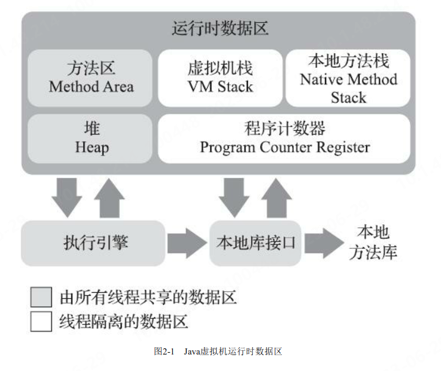
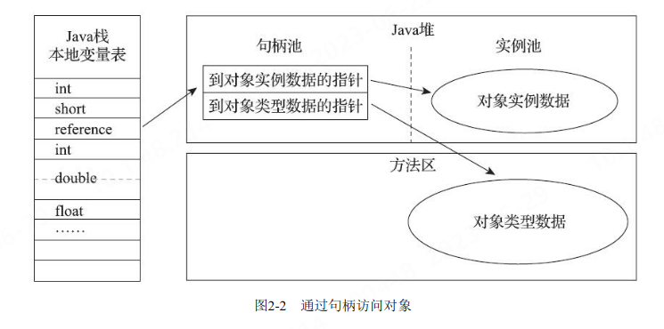

# 自动内存管理
## 一、Java内存区域与内存溢出异常
### A. 运行时数据区域

#### a. 程序计数器(Program Counter Register)[^1]
[^1]:该内存区域是唯一一个在《Java虚拟机规范》中没有规定任何OutOfMemoryError情况的区域
1. 可以看作是当前线程所执行的<u>字节码</u>的行号指示器,可以通过改变这个计数器的值来选取下一条需要执行的字节码指令；
2. 为了保证多线程工作时，各线程在切换后可以恢复到正确的执行位置，每条线程都需要有一个独立的程序计数器，互不影响，独立存储，属于‘线程私有’内存；
3. 对于执行的Java方法，该计数器记录正在执行的虚拟机字节码指令的地址；若是本地（Native）方法，则计数器值为空（Undefined）
#### b. Java虚拟机栈(Java Virtual Machine Stack)
1. ‘线程私有’内存，生命周期与线程相同；
2. 它描述了Java方法执行的线程内存模型，每个方法执行时，虚拟机都会同步创建一个栈帧（Stack Frame）用于存储局部变量表、操作数栈、动态连接、方法出口等信息；
3. 方法调用对应入栈，执行完毕对应出栈；
4. 会抛出StackOverflowError和OutOfMemoryError（前提是栈容量可以动态扩展,且扩展时无法申请足够内存）异常；
##### 局部变量表：
&#8195;\*存放了编译期可知的各种Java虚拟机基本数据类型、对象引用和returnAddress类型（指向一条字节码指令的地址）；
&#8195;\*用于存储变量的存储空间以以局部变量槽（Slot）来表示，其中64位长度类型数据会占用两个变量槽，其余只占一个；
&#8195;\*局部变量表所需的内存空间在编译期间完成分配，当进入一个方法时，这个方法需要在栈帧中分配多大的局部变量空间是完全确定的（由虚拟机决定），在方法运行期间不会改变局部变量表的大小(指变量槽的数量)；
#### c. 本地方法栈(Native Method Stacks)
1. 虚拟机规范对其中使用的方法的语言、使用方式与数据结构没有强制规定，不同虚拟机可根据实际需求实现，甚至该部分并不是必须的，可与虚拟机栈合二为一；
2. 会抛出StackOverflowError和OutOfMemoryError(OOM)（前提是栈容量可以动态扩展，且扩展时无法申请足够内存）异常；
#### d. Java堆(Java Heap)
1. 几乎所有的对象**实例**都在Java堆上分配内存，是所有线程共享的一块内存区域，在虚拟机启动时创建；
2. 是垃圾收集器管理的内存区域，但并不意味着在虚拟机规范中根据‘经典分代’理论，将其划分为了不同区域；
3. 可以处于物理上不连续的内存空间，但在逻辑上它应该被视为连续的；
4. 可以被实现为固定大小或可扩展的（当前主流风格，即通过-Xmx和-Xms设定）；
5. 当在Java堆中没有内存完成实例分配，并且堆也无法再扩展时，Java虚拟机将会抛出OOM异常；
#### e. 方法区(Method Area)
1. 用于存储已被虚拟机加载的类型信息、常量、静态变量、即时编译器编译后的代码缓存等数据，是各个线程共享的内存区域；
2. 如何实现方法区属于虚拟机实现细节，不受《Java虚拟机规范》管束，并不要求统一。
3. 可以处于物理上不连续的内存空间，但在逻辑上它应该被视为连续的；
4. 可以被实现为固定大小或可扩展的（当前主流风格，即通过-Xmx和-Xms设定）；
5. 如果方法区无法满足新的内存分配需求时，抛出OOM异常；
##### 运行时常量池(Runtime Constant Pool)
&#8195;\*属于方法区中的一部分，在类加载后存储Class文件中的常量池表(Constant Pool Table)（用于存放编译期生成的各种字面量与符号引用），一般来说会把由符号引用翻译出来的直接引用也存储在运行时常量池中；
&#8195;\*相对于Class文件常量池的另外一个重要特征是具备动态性，也就是说，并非预置入Class文件中常量池的内容才能进入方法区运行时常量池，运行期间也可以将新的常量放入池中，这种特性被开发人员利用得比较多的便是String类的intern()方法；
&#8195;\*受到方法区内存的限制，当常量池无法再申请到内存时抛出OOM异常；
### B. 基于HotSpot虚拟机的过程分析
#### a. 对象的创建（仅讨论普通java对象）
&#8195;&#8195;当Java虚拟机遇到一条<u>字节码</u>new指令时，首先将去检查这个指令的参数是否能在常量池中定位到一个类的符号引用，并且检查这个符号引用代表的类是否已被加载、解析和初始化过。如果没有，那必须先执行相应的类加载过程。类加载检查通过之后虚拟机将为新生对象 ***分配内存***（所需内存大小在类加载完成即可确定）。
1. 在分配内存过程中，首先需考虑的问题是分配方式，主要有“指针碰撞”(Bump The Pointer)和“空闲列表”(Free List)两种方式，选择哪种方式由Java堆是否规整决定。
2. 此外还需考虑并发情况下的线程安全问题，目前由两种解决方案：一是对分配内存空间的动作进行同步处理（采用CAS加上失败重试保证更新操作的原子性），二是采用本地线程分配缓冲(Thread Local Allocation Buffer，TLAB),即先为每个线程预分配一小块内存，线程分配内存时先在本地缓冲区中分配，本地缓冲区用完才需同步锁定。

&#8195;&#8195;内存分配完成之后，虚拟机必须将分配到的内存空间（但不包括对象头）都初始化为零值（可提前到TLAB分配时），以保证对象的实例字段在Java代码中可以不赋初始值就直接使用，使程序能访问到这些字段的数据类型所对应的零值。然后虚拟机对对象进行必要的设置，如对象是哪个类的实例、如何才能找到类的元数据信息和GC分代年龄等信息。这些信息存放在对象的对象头（Object Header）中。此时从虚拟机角度，新的对象已经产生。
&#8195;&#8195;然而从Java程序角度，对象创建才刚刚开始----构造函数，此时Class文件中的\<init>()方法还没有执行，所有的字段都为默认的零值，对象需要的其他资源和状态信息也还没有按照预定的意图构造好。执行完后，对象才算被完全构造出来。
3. 一般来说在new指令后会接着执行\<init>()方法。
#### b. 对象的内存布局
&#8195;&#8195;对象在堆内存中的存储布局可以划分为三个部分：对象头（Header）、实例数据（Instance Data）和对齐填充（Padding）。
1. ***对象头*** 包括两部分信息，分别为“Mark Word”和类型指针
&#8195;**\*** “Mark Word”用于存储对象自身的运行时数据，如哈希码（HashCode）、GC分代年龄、锁状态标志、线程持有的锁、偏向线程ID、偏向时间戳等。在不同位数的虚拟机中长度不同（32bit或64bit），是一种有着动态定义的数据结构。
&#8195;**\*** 类型指针即对象指向它的类型元数据的指针，Java虚拟机通过这个指针来确定该对象是哪个类的实例。但不是所有需虚拟机实现必须在对象数据上保留类型指针。
&#8195;**\*** 如果对象是一个Java数组，在对象头中还必须有一块用于记录数组长度的数据。
2. ***实例数据*** 部分是对象真正存储的有效信息，即在程序代码中定义的各种类型的字段内容。该部分的存储顺序受虚拟机分配策略参数（-XX：FieldsAllocationStyle参数）和字段在Java源码中定义顺序的影响。且相同宽度的字段总是被分配到一起存放，在满足这个前提条件的情况下，在父类中定义的变量会出现在子类之前。
&#8195;**\*** 如果HotSpot虚拟机的+XX：CompactFields参数值为true（默认就为true），那子类之中较窄的变量也允许插入父类变量的空隙之中，以节省出一点点空间。
3. ***对齐填充*** 仅仅起占位符的作用，不是必然存在的，为了对齐对象的起始地址。
#### c. 对象的访问定位
&#8195;&#8195;Java程序会通过栈上的reference数据来操作堆上的具体对象。目前分为两种主流方式：使用句柄和直接指针。
1. 使用句柄访问的话，Java堆中将可能会划分出一块内存来作为句柄池，reference中存储的就是对象的句柄地址，而句柄中包含了对象实例数据与类型数据各自具体的地址信息。该方法在对象被移动时（如GC）只会改变句柄中的实例数据指针，而reference本身不需要被修改。

2. 使用直接指针访问的话，Java堆中对象的内存布局就必须考虑如何放置访问类型数据的相关信息，reference中存储的直接就是对象地址，如果只是访问对象本身的话，就不需要多一次间接访问的开销。该方法速度更快，节省了一次指针定位的时间。
 

 ### C. OOM异常实战
 #### a. 堆溢出
 &#8195;&#8195;通过参数-XX：+HeapDumpOnOutOf-MemoryError可以让虚拟机在出现内存溢出异常的时候Dump出当前的内存堆转储快照以便进行事后分析。
 1. 当出现Java堆内存溢出时，异常堆栈信息“java.lang.OutOfMemoryError”会跟随进一步提示“Java heap space”。
 2. 首先通过内存映像分析工具堆Dump出的堆转储快照进行分析，通过判断导致OOM的对象是否必要确认属于内存泄露（Memory Leak）还是内存溢出（Memory Overflow）；
 3. 若是内存泄漏，可通过工具查看泄露对象的类型信息及到GC Roots的引用链，定位代码位置；
 4. 若是内存溢出，则调整堆参数（-Xms和-Xmx），或优化代码设计，减少运行时内存消耗。
#### b. 虚拟机栈和本地方法栈溢出
1. 出现StackOverflowError异常时，会有明确错误堆栈可供分析，相对而言比较容易定位到问题所在；
2. 如果是建立过多线程导致的内存溢出，在不能减少线程数量或者更换64位虚拟机的情况下，就只能通过减少最大堆和减少栈容量（即每个线程所分配的栈大小）来换取更多的线程；
#### c. 方法区和运行时常量池溢出
1. JDK6前，运行时常量池属于方法区，即永久代中；在JDK7之后，该部分被移至Java堆中，此时需要通过限制最大堆内存限制该部分内存；
2. String.intern()方法它的作用是如果字符串常量池中已经包含一个等于此String对象的字符串，则返回代表池中这个字符串的String对象的引用；否则，会将此String对象包含的字符串添加到常量池中，并且返回此String对象的引用。
#### d. 本机直接内存溢出
&#8195;&#8195;可通过-XX：MaxDirectMemorySize参数来指定，如果不指定，则默认与Java堆最大值（由-Xmx指定）一致。由直接内存导致的内存溢出，一个明显的特征是在Heap Dump文件中不会看见有什么明显的异常情况，如果读者发现内存溢出之后产生的Dump文件很小，而程序中又直接或间接使用了DirectMemory（典型的间接使用就是NIO），那就可以考虑重点检查一下直接内存方面的原因了。


## 二、垃圾收集器与内存分配策略
### A. 判断对象是否“存活”
#### a. 引用计数算法
&#8195;&#8195;即在对象中添加一个引用计数器，每当有一个地方引用它时，计数器值就加一；当引用失效时，计数器值就减一；任何时刻计数器为零的对象就是不可能再被使用的。
1. 在主流的Java虚拟机中并没有使用，因为需要大量的额外处理才能保证正确地工作（例如难以解决对象相互循环引用的问题）。
#### b. 可达性分析算法
&#8195;&#8195;这个算法的基本思路就是通过一系列称为“GC Roots”的根对象作为起始节点集，从这些节点开始，根据引用关系向下搜索，搜索过程所走过的路径称为“引用链”（Reference Chain），如果某个对象到GC Roots间没有任何引用链相连，或者用图论的话来说就是从GC Roots到这个对象不可达时，则证明此对象是不可能再被使用的。
1. 可作为GC Roots的对象：
   * 在虚拟机栈（栈帧中的本地变量表）中引用的对象，譬如各个线程被调用的方法堆栈中使用到的参数、局部变量、临时变量等。
   * 在方法区中类静态属性引用的对象，譬如Java类的引用类型静态变量（一般指被static修饰的对象，加载类的时候就加载到内存中。）
   * 在方法区中常量引用的对象，譬如字符串常量池（String Table）里的引用。
   * 在本地方法栈中JNI（即通常所说的Native方法）引用的对象。
   * Java虚拟机内部的引用，如基本数据类型对应的Class对象，一些常驻的异常对象（比如NullPointExcepiton、OutOfMemoryError）等，还有系统类加载器。
   * 所有被同步锁（synchronized关键字）持有的对象。
#### c. 引用的分类
1. **强引用**：指在程序代码之中普遍存在的引用赋值，即类似“Object obj=new Object()”这种引用关系。无论任何情况下，只要强引用关系还存在，垃圾收集器就永远不会回收掉被引用的对象。
2. **软引用**：用来描述一些还有用，但非必须的对象。只被软引用关联着的对象，在系统将要发生内存溢出异常前，会把这些对象列进回收范围之中进行第二次回收，如果这次回收还没有足够的内存，才会抛出内存溢出异常。可通过SoftReference类来实现软引用。
3. **弱引用**：用来描述那些非必须对象，但是它的强度比软引用更弱一些，被弱引用关联的对象只能生存到下一次垃圾收集发生为止。当垃圾收集器开始工作，无论当前内存是否足够，都会回收掉只被弱引用关联的对象。可通过WeakReference类来实现弱引用。
4. **虚引用**：也称为“幽灵引用”或者“幻影引用”，它是最弱的一种引用关系。一个对象是否有虚引用的存在，完全不会对其生存时间构成影响，也无法通过虚引用来取得一个对象实例。为一个对象设置虚引用关联的唯一目的只是为了能在这个对象被收集器回收时收到一个系统通知。可通过PhantomReference类来实现虚引用，且必须和ReferenceQueue类配合使用。当gc准备回收对象时，若发现它有虚引用，就会在回收之前，把这个虚引用加到与之关联的ReferenceQueue中。
```java
Object obj = new Object();
        ReferenceQueue<Object> referenceQueue = new ReferenceQueue<Object>();
        PhantomReference<Object> phantomReference = new PhantomReference<Object>(obj,referenceQueue);
        obj=null;//手动设置为空，触发GC
        new Thread(()->{
            Reference<? extends Object> reference = referenceQueue.poll();
            if(reference!=null){
                System.out.println("内存被回收"+reference);
            }
        }).start();

```
还可用于检测内存泄漏。
#### d. finalize()方法与GC
&#8195;&#8195;当对象不可达时，并不是一定为被GC回收，要真正宣告一个对象死亡，至少要经历两次标记过程：如果对象在进行可达性分析后发现没有与GC Roots相连接的引用链，那它将会被第一次标记，随后进行一次筛选，筛选的条件是此对象是否有必要执行finalize()方法。（假如对象没有覆盖finalize()方法，或者finalize()方法已经被虚拟机调用过，那么虚拟机将这两种情况都视为“没有必要执行”）。
1. 这个对象被判定为确有必要执行finalize()方法，那么该对象将会被放置在一个名为F-Queue的队列之中，并在稍后由一条由虚拟机自动建立的、低调度优先级的Finalizer线程去执行它们的finalize()方法。值得注意的是，虚拟机只会触发该方法开始运行，但不一定会等待它运行结束。在finalize()方法运行结束后，GC再次判断对象是否可达，若仍不可达，则进行回收
2. 若没必要执行finalize()方法，会直接回收。
3. 注意，任何对象的finalize()方法只会被系统自动调用一次。
4. 该方法已不推荐使用。
#### e. 回收方法区
 ----
 end at page 112