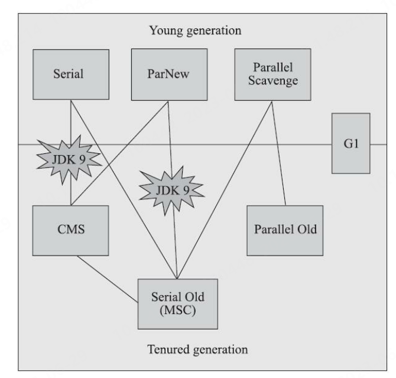
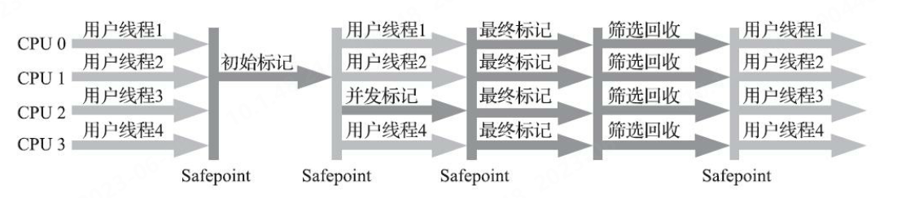
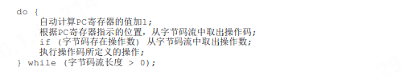
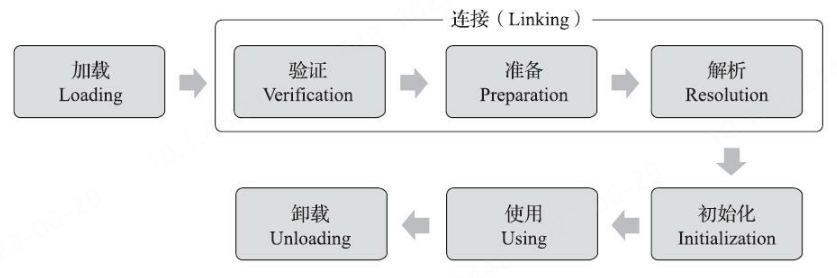

# 自动内存管理
## 一、Java内存区域与内存溢出异常
### A. 运行时数据区域

#### a. 程序计数器(Program Counter Register)[^1]
[^1]:该内存区域是唯一一个在《Java虚拟机规范》中没有规定任何OutOfMemoryError情况的区域
1. 可以看作是当前线程所执行的<u>字节码</u>的行号指示器,可以通过改变这个计数器的值来选取下一条需要执行的字节码指令；
2. 为了保证多线程工作时，各线程在切换后可以恢复到正确的执行位置，每条线程都需要有一个独立的程序计数器，互不影响，独立存储，属于‘线程私有’内存；
3. 对于执行的Java方法，该计数器记录正在执行的虚拟机字节码指令的地址；若是本地（Native）方法，则计数器值为空（Undefined）
#### b. Java虚拟机栈(Java Virtual Machine Stack)
1. ‘线程私有’内存，生命周期与线程相同；
2. 它描述了Java方法执行的线程内存模型，每个方法执行时，虚拟机都会同步创建一个栈帧（Stack Frame）用于存储局部变量表、操作数栈、动态连接、方法出口等信息；
3. 方法调用对应入栈，执行完毕对应出栈；
4. 会抛出StackOverflowError和OutOfMemoryError（前提是栈容量可以动态扩展,且扩展时无法申请足够内存）异常；
##### 局部变量表：
&#8195;\*存放了编译期可知的各种Java虚拟机基本数据类型、对象引用和returnAddress类型（指向一条字节码指令的地址）；
&#8195;\*用于存储变量的存储空间以以局部变量槽（Slot）来表示，其中64位长度类型数据会占用两个变量槽，其余只占一个；
&#8195;\*局部变量表所需的内存空间在编译期间完成分配，当进入一个方法时，这个方法需要在栈帧中分配多大的局部变量空间是完全确定的（由虚拟机决定），在方法运行期间不会改变局部变量表的大小(指变量槽的数量)；
#### c. 本地方法栈(Native Method Stacks)
1. 虚拟机规范对其中使用的方法的语言、使用方式与数据结构没有强制规定，不同虚拟机可根据实际需求实现，甚至该部分并不是必须的，可与虚拟机栈合二为一；
2. 会抛出StackOverflowError和OutOfMemoryError(OOM)（前提是栈容量可以动态扩展，且扩展时无法申请足够内存）异常；
#### d. Java堆(Java Heap)
1. 几乎所有的对象**实例**都在Java堆上分配内存，是所有线程共享的一块内存区域，在虚拟机启动时创建；
2. 是垃圾收集器管理的内存区域，但并不意味着在虚拟机规范中根据‘经典分代’理论，将其划分为了不同区域；
3. 可以处于物理上不连续的内存空间，但在逻辑上它应该被视为连续的；
4. 可以被实现为固定大小或可扩展的（当前主流风格，即通过-Xmx和-Xms设定）；
5. 当在Java堆中没有内存完成实例分配，并且堆也无法再扩展时，Java虚拟机将会抛出OOM异常；
#### e. 方法区(Method Area)
1. 用于存储已被虚拟机加载的类型信息、常量、静态变量、即时编译器编译后的代码缓存等数据，是各个线程共享的内存区域；
2. 如何实现方法区属于虚拟机实现细节，不受《Java虚拟机规范》管束，并不要求统一。
3. 可以处于物理上不连续的内存空间，但在逻辑上它应该被视为连续的；
4. 可以被实现为固定大小或可扩展的（当前主流风格，即通过-Xmx和-Xms设定）；
5. 如果方法区无法满足新的内存分配需求时，抛出OOM异常；
##### 运行时常量池(Runtime Constant Pool)
&#8195;\*属于方法区中的一部分，在类加载后存储Class文件中的常量池表(Constant Pool Table)（用于存放编译期生成的各种字面量与符号引用），一般来说会把由符号引用翻译出来的直接引用也存储在运行时常量池中；
&#8195;\*相对于Class文件常量池的另外一个重要特征是具备动态性，也就是说，并非预置入Class文件中常量池的内容才能进入方法区运行时常量池，运行期间也可以将新的常量放入池中，这种特性被开发人员利用得比较多的便是String类的intern()方法；
&#8195;\*受到方法区内存的限制，当常量池无法再申请到内存时抛出OOM异常；
### B. 基于HotSpot虚拟机的过程分析
#### a. 对象的创建（仅讨论普通java对象）
&#8195;&#8195;当Java虚拟机遇到一条<u>字节码</u>new指令时，首先将去检查这个指令的参数是否能在常量池中定位到一个类的符号引用，并且检查这个符号引用代表的类是否已被加载、解析和初始化过。如果没有，那必须先执行相应的类加载过程。类加载检查通过之后虚拟机将为新生对象 ***分配内存***（所需内存大小在类加载完成即可确定）。
1. 在分配内存过程中，首先需考虑的问题是分配方式，主要有“指针碰撞”(Bump The Pointer)和“空闲列表”(Free List)两种方式，选择哪种方式由Java堆是否规整决定。
2. 此外还需考虑并发情况下的线程安全问题，目前由两种解决方案：一是对分配内存空间的动作进行同步处理（采用CAS加上失败重试保证更新操作的原子性），二是采用本地线程分配缓冲(Thread Local Allocation Buffer，TLAB),即先为每个线程预分配一小块内存，线程分配内存时先在本地缓冲区中分配，本地缓冲区用完才需同步锁定。

&#8195;&#8195;内存分配完成之后，虚拟机必须将分配到的内存空间（但不包括对象头）都初始化为零值（可提前到TLAB分配时），以保证对象的实例字段在Java代码中可以不赋初始值就直接使用，使程序能访问到这些字段的数据类型所对应的零值。然后虚拟机对对象进行必要的设置，如对象是哪个类的实例、如何才能找到类的元数据信息和GC分代年龄等信息。这些信息存放在对象的对象头（Object Header）中。此时从虚拟机角度，新的对象已经产生。
&#8195;&#8195;然而从Java程序角度，对象创建才刚刚开始----构造函数，此时Class文件中的\<init>()方法还没有执行，所有的字段都为默认的零值，对象需要的其他资源和状态信息也还没有按照预定的意图构造好。执行完后，对象才算被完全构造出来。
3. 一般来说在new指令后会接着执行\<init>()方法。
#### b. 对象的内存布局
&#8195;&#8195;对象在堆内存中的存储布局可以划分为三个部分：对象头（Header）、实例数据（Instance Data）和对齐填充（Padding）。
1. ***对象头*** 包括两部分信息，分别为“Mark Word”和类型指针
&#8195;**\*** “Mark Word”用于存储对象自身的运行时数据，如哈希码（HashCode）、GC分代年龄、锁状态标志、线程持有的锁、偏向线程ID、偏向时间戳等。在不同位数的虚拟机中长度不同（32bit或64bit），是一种有着动态定义的数据结构。
&#8195;**\*** 类型指针即对象指向它的类型元数据的指针，Java虚拟机通过这个指针来确定该对象是哪个类的实例。但不是所有需虚拟机实现必须在对象数据上保留类型指针。
&#8195;**\*** 如果对象是一个Java数组，在对象头中还必须有一块用于记录数组长度的数据。
2. ***实例数据*** 部分是对象真正存储的有效信息，即在程序代码中定义的各种类型的字段内容。该部分的存储顺序受虚拟机分配策略参数（-XX：FieldsAllocationStyle参数）和字段在Java源码中定义顺序的影响。且相同宽度的字段总是被分配到一起存放，在满足这个前提条件的情况下，在父类中定义的变量会出现在子类之前。
&#8195;**\*** 如果HotSpot虚拟机的+XX：CompactFields参数值为true（默认就为true），那子类之中较窄的变量也允许插入父类变量的空隙之中，以节省出一点点空间。
3. ***对齐填充*** 仅仅起占位符的作用，不是必然存在的，为了对齐对象的起始地址。
#### c. 对象的访问定位
&#8195;&#8195;Java程序会通过栈上的reference数据来操作堆上的具体对象。目前分为两种主流方式：使用句柄和直接指针。
1. 使用句柄访问的话，Java堆中将可能会划分出一块内存来作为句柄池，reference中存储的就是对象的句柄地址，而句柄中包含了对象实例数据与类型数据各自具体的地址信息。该方法在对象被移动时（如GC）只会改变句柄中的实例数据指针，而reference本身不需要被修改。

2. 使用直接指针访问的话，Java堆中对象的内存布局就必须考虑如何放置访问类型数据的相关信息，reference中存储的直接就是对象地址，如果只是访问对象本身的话，就不需要多一次间接访问的开销。该方法速度更快，节省了一次指针定位的时间。
 
### C. OOM异常实战
 #### a. 堆溢出
 &#8195;&#8195;通过参数-XX：+HeapDumpOnOutOf-MemoryError可以让虚拟机在出现内存溢出异常的时候Dump出当前的内存堆转储快照以便进行事后分析。
 1. 当出现Java堆内存溢出时，异常堆栈信息“java.lang.OutOfMemoryError”会跟随进一步提示“Java heap space”。
 2. 首先通过内存映像分析工具堆Dump出的堆转储快照进行分析，通过判断导致OOM的对象是否必要确认属于内存泄露（Memory Leak）还是内存溢出（Memory Overflow）；
 3. 若是内存泄漏，可通过工具查看泄露对象的类型信息及到GC Roots的引用链，定位代码位置；
 4. 若是内存溢出，则调整堆参数（-Xms和-Xmx），或优化代码设计，减少运行时内存消耗。
#### b. 虚拟机栈和本地方法栈溢出
1. 出现StackOverflowError异常时，会有明确错误堆栈可供分析，相对而言比较容易定位到问题所在；
2. 如果是建立过多线程导致的内存溢出，在不能减少线程数量或者更换64位虚拟机的情况下，就只能通过减少最大堆和减少栈容量（即每个线程所分配的栈大小）来换取更多的线程；
#### c. 方法区和运行时常量池溢出
1. JDK6前，运行时常量池属于方法区，即永久代中；在JDK7之后，该部分被移至Java堆中，此时需要通过限制最大堆内存限制该部分内存；
2. String.intern()方法它的作用是如果字符串常量池中已经包含一个等于此String对象的字符串，则返回代表池中这个字符串的String对象的引用；否则，会将此String对象包含的字符串添加到常量池中，并且返回此String对象的引用。
#### d. 本机直接内存溢出
&#8195;&#8195;可通过-XX：MaxDirectMemorySize参数来指定，如果不指定，则默认与Java堆最大值（由-Xmx指定）一致。由直接内存导致的内存溢出，一个明显的特征是在Heap Dump文件中不会看见有什么明显的异常情况，如果读者发现内存溢出之后产生的Dump文件很小，而程序中又直接或间接使用了DirectMemory（典型的间接使用就是NIO），那就可以考虑重点检查一下直接内存方面的原因了。


## 二、垃圾收集器与内存分配策略
### A. 判断对象是否“存活”
#### a. 引用计数算法
&#8195;&#8195;即在对象中添加一个引用计数器，每当有一个地方引用它时，计数器值就加一；当引用失效时，计数器值就减一；任何时刻计数器为零的对象就是不可能再被使用的。
1. 在主流的Java虚拟机中并没有使用，因为需要大量的额外处理才能保证正确地工作（例如难以解决对象相互循环引用的问题）。
#### b. 可达性分析算法
&#8195;&#8195;这个算法的基本思路就是通过一系列称为“GC Roots”的根对象作为起始节点集，从这些节点开始，根据引用关系向下搜索，搜索过程所走过的路径称为“引用链”（Reference Chain），如果某个对象到GC Roots间没有任何引用链相连，或者用图论的话来说就是从GC Roots到这个对象不可达时，则证明此对象是不可能再被使用的。
1. 可作为GC Roots的对象主要在全局性的引用（例如常量或类静态属性）与执行上下文（例如栈帧中的本地变量表）中：
   * 在虚拟机栈（栈帧中的本地变量表）中引用的对象，譬如各个线程被调用的方法堆栈中使用到的参数、局部变量、临时变量等。
   * 在方法区中类静态属性引用的对象，譬如Java类的引用类型静态变量（一般指被static修饰的对象，加载类的时候就加载到内存中。）
   * 在方法区中常量引用的对象，譬如字符串常量池（String Table）里的引用。
   * 在本地方法栈中JNI（即通常所说的Native方法）引用的对象。
   * Java虚拟机内部的引用，如基本数据类型对应的Class对象，一些常驻的异常对象（比如NullPointExcepiton、OutOfMemoryError）等，还有系统类加载器。
   * 所有被同步锁（synchronized关键字）持有的对象。
#### c. 引用的分类
1. **强引用**：指在程序代码之中普遍存在的引用赋值，即类似“Object obj=new Object()”这种引用关系。无论任何情况下，只要强引用关系还存在，垃圾收集器就永远不会回收掉被引用的对象。
2. **软引用**：用来描述一些还有用，但非必须的对象。只被软引用关联着的对象，在系统将要发生内存溢出异常前，会把这些对象列进回收范围之中进行第二次回收，如果这次回收还没有足够的内存，才会抛出内存溢出异常。可通过SoftReference类来实现软引用。
3. **弱引用**：用来描述那些非必须对象，但是它的强度比软引用更弱一些，被弱引用关联的对象只能生存到下一次垃圾收集发生为止。当垃圾收集器开始工作，无论当前内存是否足够，都会回收掉只被弱引用关联的对象。可通过WeakReference类来实现弱引用。
4. **虚引用**：也称为“幽灵引用”或者“幻影引用”，它是最弱的一种引用关系。一个对象是否有虚引用的存在，完全不会对其生存时间构成影响，也无法通过虚引用来取得一个对象实例。为一个对象设置虚引用关联的唯一目的只是为了能在这个对象被收集器回收时收到一个系统通知。可通过PhantomReference类来实现虚引用，且必须和ReferenceQueue类配合使用。当gc准备回收对象时，若发现它有虚引用，就会在回收之前，把这个虚引用加到与之关联的ReferenceQueue中。
```java
        Object obj = new Object();
        ReferenceQueue<Object> referenceQueue = new ReferenceQueue<Object>();
        PhantomReference<Object> phantomReference = new PhantomReference<Object>(obj,referenceQueue);
        obj=null;//手动设置为空，触发GC
        new Thread(()->{
            Reference<? extends Object> reference = referenceQueue.poll();
            if(reference!=null){
                System.out.println("内存被回收"+reference);
            }
        }).start();

```
还可用于检测内存泄漏。
#### d. finalize()方法与GC
&#8195;&#8195;当对象不可达时，并不是一定为被GC回收，要真正宣告一个对象死亡，至少要经历两次标记过程：如果对象在进行可达性分析后发现没有与GC Roots相连接的引用链，那它将会被第一次标记，随后进行一次筛选，筛选的条件是此对象是否有必要执行finalize()方法。（假如对象没有覆盖finalize()方法，或者finalize()方法已经被虚拟机调用过，那么虚拟机将这两种情况都视为“没有必要执行”）。
1. 这个对象被判定为确有必要执行finalize()方法，那么该对象将会被放置在一个名为F-Queue的队列之中，并在稍后由一条由虚拟机自动建立的、低调度优先级的Finalizer线程去执行它们的finalize()方法。值得注意的是，虚拟机只会触发该方法开始运行，但不一定会等待它运行结束。在finalize()方法运行结束后，GC再次判断对象是否可达，若仍不可达，则进行回收
2. 若没必要执行finalize()方法，会直接回收。
3. 注意，任何对象的finalize()方法只会被系统自动调用一次。
4. 该方法已不推荐使用。
#### e. 回收方法区
&#8195;&#8195;方法区的垃圾收集主要回收两部分内容：废弃的常量和不再使用的类型。回收废弃常量与回收Java堆中的对象非常类似。但判断一个类型是否属于不再被使用的类须同时满足以下三个条件：
1. 该类所有的实例都已经被回收，也就是Java堆中不存在该类及其任何派生子类的实例；
2. 加载该类的类加载器已经被回收，这个条件除非是经过精心设计的可替换类加载器的场景，如OSGi、JSP的重加载等，否则通常是很难达成的；
3. 该类对应的java.lang.Class对象没有在任何地方被引用，无法在任何地方通过反射访问该类的方法。

值得注意的是，即使满足上述条件，也只是允许被回收，而不是一定会回收。
### B. 垃圾收集算法
&#8195;&#8195;从如何判定对象消亡的角度出发，垃圾收集算法可以划分为“引用计数式垃圾收集”（Reference Counting GC）和“追踪式垃圾收集”（Tracing GC）两大类，这两类也常被称作“直接垃圾收集”和“间接垃圾收集”。以下主要讨论第二种。
#### a.分代收集理论
1. 分代收集理论实质是一套符合大多数程序运行实际情况的经验法则，建立在三个分代假说上：
    * 弱分代假说（Weak Generational Hypothesis）：绝大多数对象都是朝生夕灭的。
    * 强分代假说（Strong Generational Hypothesis）：熬过越多次垃圾收集过程的对象就越难以消亡。
    * 跨代引用假说（Intergenerational Reference Hypothesis）：跨代引用相对于同代引用来说仅占极少数。

   如果一个区域中大多数对象都是朝生夕灭，难以熬过垃圾收集过程的话，那么把它们集中放在一起，每次回收时只关注如何保留少量存活而不是去标记那些大量将要被回收的对象，就能以较低代价回收到大量的空间；如果剩下的都是难以消亡的对象，那把它们集中放在一块，虚拟机便可以使用较低的频率来回收这个区域，这就同时兼顾了垃圾收集的时间开销和内存的空间有效利用。
2. 新生代（Young Generation）和老年代（Old Generation）：在新生代中，每次垃圾收集时都发现有大批对象死去，而每次回收后存活的少量对象，将会逐步晋升到老年代中存放。
3. 为了解决跨代引用问题，可以在新生代上建立一个全局的数据结构（该结构被称为“记忆集”，Remembered Set），这个结构把老年代划分成若干小块，标识出老年代的哪一块内存会存在跨代引用。此后当发生Minor GC时，只有包含了跨代引用的小块内存里的对象才会被加入到GCRoots进行扫描。
4. 部分收集（Partial GC）：指目标不是完整收集整个Java堆的垃圾收集，其中又分为：
   * 新生代收集（Minor GC/Young GC）：指目标只是新生代的垃圾收集。
   * 老年代收集（Major GC/Old GC）：指目标只是老年代的垃圾收集。
   * 混合收集（Mixed GC）：指目标是收集整个新生代以及部分老年代的垃圾收集。
5. 整堆收集（Full GC）：收集整个Java堆和方法区的垃圾收集。
#### b.标记-清除算法
&#8195;&#8195;首先标记出所有需要回收的对象，在标记完成后，统一回收掉所有被标记的对象;也可以反过来标记存活的对象，统一回收未被标记的对象。该方法有两个主要缺点：
1. 第一个是执行效率不稳定，如果Java堆中包含大量对象，而且其中大部分是需要被回收的，这时必须进行大量标记和清除的动作，导致标记和清除两个过程的执行效率都随对象数量增长而降低。
2. 第二个是内存空间的碎片化问题，标记、清除之后会产生大量不连续的内存碎片，空间碎片太多可能会导致当以后在程序运行过程中需要分配较大对象时无法找到足够的连续内存而不得不提前触发另一次垃圾收集动作。
#### c.标记-复制算法
&#8195;&#8195;它将可用内存按容量划分为大小相等的两块，每次只使用其中的一块。当这一块的内存用完了，就将还存活着的对象复制到另外一块上面，然后再把已使用过的内存空间一次清理掉。该方法实现简单，运行高效，但空间浪费较大。
1. 目前主要采用该方法去回收新生代，因为其“朝生夕灭”的特点，且IBM的实验表明，98%的新生代对象熬不过第一轮收集，所以不需要按照1：1的比例来分配新生代内存空间。
2. 在Appel式回收中，当多于10%的新生代对象存活，需要依赖其他内存区域（大多为老年代）进行分配担保。
#### d.标记-整理算法
&#8195;&#8195;其中的标记过程仍然与“标记-清除”算法一样，但后续步骤不是直接对可回收对象进行清理，而是让所有存活的对象都向内存空间一端移动，然后直接清理掉边界以外的内存，即每一次回收会整理内存以减少内存碎片。
1. 一般用于老年代对象的回收中。
2. 可以在大多数时间采用标记-清除算法，直到内存空间的碎片化程度已经大到影响对象分配时，再采用标记-整理算法。
### C. HotSpot的算法实现细节
#### a. 根节点枚举
&#8195;&#8195;根节点枚举必须在一个能保障一致性的快照中才得以进行——这里“一致性”的意思是整个枚举期间执行子系统看起来就像被冻结在某个时间点上，不会出现分析过程中，根节点集合的对象引用关系还在不断变化的情况，若这点不能满足的话，分析结果准确性也就无法保证。因此所有收集器在根节点枚举这一步骤时都是必须暂停用户线程的。
&#8195;&#8195;而在准确式（指虚拟机可以知道内存中某个位置的数据具体是什么类型）垃圾收集中，并不需要一个不漏地检查完所有执行上下文和全局的引用位置（不是所有的都是对象引用）。如HotSpot中利用一组称为OopMap的数据结构进行记录：在类加载动作完成时，HotSpot把对象内什么偏移量上是什么类型的数据计算出来，在即时编译过程中，也会在特定的位置记录下栈里和寄存器里哪些位置是引用。可以将其理解为一个导航地图，通过它可以直接知道要找的地方（对象引用）在什么位置，若是没有这份导航，则需要自己从头到尾找一遍。
#### b. 安全点
&#8195;&#8195;可能导致引用关系变化，或者说导致OopMap内容变化的指令非常多，所以每次指令都生成对应的OopMap将消耗大量的存储空间。因此，只会在“特定位置”记录这些信息，这些位置就是安全点。
1. 安全点位置的选取基本上是以“是否具有让程序长时间执行的特征”为标准进行选定的，“长时间执行”的最明显特征就是指令序列的复用，例如方法调用、循环跳转、异常跳转等都属于指令序列复用，所以只有具有这些功能的指令才会产生安全点。
2. 另外一个需要考虑的问题是，如何在垃圾收集发生时让所有线程（这里其实不包括执行JNI调用的线程）都跑到最近的安全点：
   * 抢先式中断不需要线程的执行代码主动去配合，在垃圾收集发生时，系统首先把所有用户线程全部中断，如果发现有用户线程中断的地方不在安全点上，就恢复这条线程执行，让它一会再重新中断，直到跑到安全点上。
   * 主动式中断的是当垃圾收集需要中断线程的时候，不直接对线程操作，仅仅简单地设置一个标志位，各个线程执行过程时会不停地主动去轮询这个标志，一旦发现中断标志为真时就自己在最近的安全点上主动中断挂起。轮询标志的地方和安全点是重合的，另外还要加上所有创建对象和其他需要在Java堆上分配内存的地方，这是为了检查是否即将要发生垃圾收集，避免没有足够内存分配新对象。

&#8195;&#8195;为了保证轮询操作足够高效，HotSpot使用了内存保护陷阱的方式。当需要暂停用户线程时，虚拟机把0x160100的内存页设置为不可读，那线程执行到test指令时就会产生一个自陷异常信号，然后在预先注册的异常处理器中挂起线程实现等待。

#### c. 安全区域
&#8195;&#8195;安全区域是指能够确保在某一段代码片段之中，引用关系不会发生变化，即这个区域中任意地方开始垃圾收集都是安全的。是为了解决程序不执行即没有分配处理器时间的情况下，线程无法响应虚拟机的中断请求，走到安全点，让虚拟机进入垃圾回收状态的问题。
1. 当用户线程执行到安全区域里面的代码时，首先会标识自己已经进入了安全区域，那样当这段时间里虚拟机要发起垃圾收集时就不必去管这些已声明自己在安全区域内的线程了。
2. 当线程要离开安全区域时，它要检查虚拟机是否已经完成了根节点枚举（或者垃圾收集过程中其他需要暂停用户线程的
阶段），
   * 如果完成了，那线程就当作没事发生过，继续执行；
   * 否则它就必须一直等待，直到收到可以离开安全区域的信号为止。
#### d. 记忆集与卡表
&#8195;&#8195;记忆集是一种为了解决对象跨代引用带来的问题，用于记录从非收集区域指向收集区域的指针集合的抽象数据结构。在垃圾收集的场景中，收集器只需要通过记忆集判断出某一块非收集区域是否存在有指向了收集区域的指针就可以了，并不需要了解这些跨代指针的全部细节。
1. 记忆集的记录精度：
   *  **字长精度**：每个记录精确到一个机器字长，该字包含跨代指针。
   *  **对象精度**：每个记录精确到一个对象，该对象里有字段含有跨代指针。
   *  **卡精度**：每个记录精确到一块内存区域，该区域内有对象含有跨代指针。
2. 卡表，即一种以卡精度实现记忆集的方式，可以是一个字节数组如CARD_TABLE，其每个元素对应其标识的一块特定大小的内存块（卡页），在HotSpot中为512字节。当卡页中有对象的字段存在跨代指针，就将对应卡表的数组元素的值标识为1，称为这个元素变脏。变脏的时间点原则上应该发生在引用类型字段赋值的那一刻。
#### e. 写屏障
&#8195;&#8195;在编译执行场景下，需要一种方式可以保证在对象赋值的那一刻去更新维护卡表，在HotSpot虚拟机里是通过写屏障（Write Barrier）技术维护卡表状态的。写屏障可以看作在虚拟机层面对“引用类型字段赋值”这个动作的AOP切面，在引用对象赋值时会产生一个环形（Around）通知，供程序执行额外的动作，也就是说赋值的前后都在写屏障的覆盖范畴内。
1. 应用写屏障后，虚拟机就会为所有赋值操作生成相应的指令，一旦收集器在写屏障中增加了更新卡表操作，无论更新的是不是老年代对新生代对象的引用，每次只要对引用进行更新，就会产生额外的开销
2. 伪共享是处理并发底层细节时一种经常需要考虑的问题，现代中央处理器的缓存系统中是以缓存行（Cache Line）为单位存储的，当多线程修改互相独立的变量时，如果这些变量恰好共享同一个缓存行，就会彼此影响（写回、无效化或者同步）而导致性能降低
   * 为了避免伪共享问题，一种简单的解决方案是不采用无条件的写屏障，而是先检查卡表标记，只有当该卡表元素未被标记过时才将其标记为变脏
#### f. 并发的可达性分析
&#8195;&#8195;从GC Roots再继续往下遍历对象图，这一步骤的停顿时间就必定会与Java堆容量直接成正比例关系了：堆越大，存储的对象越多，对象图结构越复杂，要标记更多对象而产生的停顿时间自然就更长。
1. 为了解释清楚必须在一个能保障一致性的快照上才能进行对象图的遍历的原因，引入三色标记（Tri-color Marking）：
   * **白色**：表示对象尚未被垃圾收集器访问过。在可达性分析刚刚开始的阶段，所有的对象都是白色的，若在分析结束的阶段，仍然是白色的对象，即代表不可达。
   * **黑色**：表示对象已经被垃圾收集器访问过，且这个对象的所有引用都已经扫描过。黑色的对象代表已经扫描过，它是安全存活的，如果有其他对象引用指向了黑色对象，无须重新扫描一遍。黑色对象不可能直接（不经过灰色对象）指向某个白色对象。
   * **灰色**：表示对象已经被垃圾收集器访问过，但这个对象上至少存在一个引用还没有被扫描过。
2. 在用户线程与收集器是并发工作时，修改对象图的结构，会导致错误标记。当且仅当以下两个条件同时满足时，会产生“对象消失”的问题，即原本应该是黑色的对象被误标为白色：
   * 赋值器插入了一条或多条从黑色对象到白色对象的新引用
   * 赋值器删除了全部从灰色对象到该白色对象的直接或间接引用
3. 解决方案：
   * **增量更新**要破坏的是第一个条件，当黑色对象插入新的指向白色对象的引用关系时，就将这个新插入的引用记录下来，等并发扫描结束之后，再将这些记录过的引用关系中的黑色对象为根，重新扫描一次。这可以简化理解为，黑色对象一旦新插入了指向白色对象的引用之后，它就变回灰色对象了。
   * **原始快照**要破坏的是第二个条件，当灰色对象要删除指向白色对象的引用关系时，就将这个要删除的引用记录下来，在并发扫描结束之后，再将这些记录过的引用关系中的灰色对象为根，重新扫描一次。这也可以简化理解为，无论引用关系删除与否，都会按照刚刚开始扫描那一刻的对象图快照来进行搜索。
### D. 经典垃圾收集器
&#8195;&#8195;此处主要讨论JDK7 Update4之后，JDK11发布前OracleJDK中的HotSpot虚拟机[1]所包含的全部可用的垃圾收集器。下图展示了各收集器之间的关系，若两个收集器之间存在连线，就说明它们可以搭配使用。图中收集器所处的区域，则表示它是属于新生代收集器抑或是老年代收集器。
*其采用的算法决定了其主要回收的区域，其是否并行决定了其工作于客户端还是服务端。*


#### a. Serial收集器
1. 是一个单线程工作的收集器，它进行垃圾收集时，必须暂停其他所有工作线程，直到它收集结束。
2. 新生代采用标记-复制算法，老年代采用标记-整理算法。
3. 是HotSpot虚拟机运行在客户端模式下的默认新生代收集器，对于内存资源受限的环境，它是所有收集器里额外内存消耗最小的。
#### b. ParNew收集器
1. 实质上是Serial收集器的多线程并行版本（多个GC线程）
2. 它是一种较多运行在服务端模式下的HotSpot虚拟机首选的新生代收集器
#### c. Parallel Scavenge收集器
1. 基于标记-复制算法实现的，能够并行收集的多线程收集器
2. 该收集器的目标则是达到一个可控制的吞吐量（Throughput），即处理器用于运行用户代码的时间与处理器总消耗时间的比值，而不是缩短垃圾收集时用户线程的停顿时间
3. 控制最大垃圾收集停顿时间的-XX：MaxGCPauseMillis参数（将停顿时间减小意味着系统为新生代分配的内存减小，这也就可能导致垃圾收集更加频繁，以致于吞吐量下降）;直接设置吞吐量大小的-XX：GCTimeRatio参数(值则应当是一个大于0小于100的整数，也就是垃圾收集时间占总时间的比率，相当于吞吐量的倒数)。
4. 使用参数-XX：+UseAdaptiveSizePolicy使虚拟机会根据当前系统的运行情况收集性能监控信息，动态调整参数以提供最合适的停顿时间或者最大的吞吐量。
#### d. Serial Old收集器
1. 是Serial收集器的老年代版本，它同样是一个单线程收集器，使用标记-整理算法。
2. 主要是供客户端模式下的HotSpot虚拟机使用
#### e. Parallel Old收集器
1. 是Parallel Scavenge收集器的老年代版本，支持多线程并发收集，基于标记-整理算法实现。
2. 主要是供服务端使用。
#### f. CMS收集器
1. CMS（Concurrent Mark Sweep）收集器是一种以获取最短回收停顿时间为目标的收集器,适用于基于浏览器的B/S系统的服务端，为了保证标记不出错，采用增量更新算法（即破坏第一个条件--新增黑色指向白色的引用）。
2. 其处理过程分为以下四个步骤（其中初始标记、重新标记这两个步骤仍然需要“Stop The World”）：
   * **初始标记**：仅仅只是标记一下GCRoots能直接关联到的对象，速度很快；
   * **并发标记**：就是从GC Roots的直接关联对象开始遍历整个对象图的过程，这个过程耗时较长但是不需要停顿用户线程，用户线程可以与垃圾收集线程一起并发运行，；
   * **重新标记**：为了修正并发标记期间，因用户程序继续运作而导致标记产生变动的那一部分对象的标记记录，这个阶段的停顿时间通常会比初始标记阶段稍长一些，但也远比并发标记阶段的时间短；
   * **并发清除**：清理删除掉标记阶段判断的已经死亡的对象，由于不需要移动存活对象，所以这个阶段也是可以与用户线程同时并发的。

&#8195;&#8195;由于在整个过程中耗时最长的并发标记和并发清除阶段中，垃圾收集器线程都可以与用户线程一起工作，所以从总体上来说，CMS收集器的内存回收过程是与用户线程一起并发执行的。
   
3. CMS的缺点：
   * CMS收集器对处理器资源非常敏感。在并发阶段，它虽然不会导致用户线程停顿，但却会因为占用了一部分线程（或者说处理器的计算能力）而导致应用程序变慢，降低总吞吐量，其默认启动的回收线程数是（处理器核心数量+3）/4。如果应用本来的处理器负载就很高，且处理器核心数量不足四个时，还要分出一半的运算能力去执行收集器线程，就可能导致用户程序的执行速度忽然大幅降低。
   * 由于CMS收集器无法处理“浮动垃圾”（Floating Garbage）（在标记过程结束后产生的垃圾对象，它们需要在下一次收集中处理），有可能出现“并发失败”（Concurrent Mode Failure）失败进而导致另一次完全“Stop The World”的Full GC的产生。这是由于，在垃圾回收阶段预留一部分空间供收集时的程序运行使用，但当预留的内存无法满足程序分配新对象的需要，就会出现一次“并发失败”，这时候虚拟机将冻结用户线程的执行，临时启用Serial Old收集器来重新进行老年代的垃圾收集。可通过参数-XX：CMSInitiatingOccupancyFraction设置预留内存大小。
   * 由于CMS是基于标记-清除算法实现的，因此会产生大量的空间碎片，导致老年代在还有很多空间的情况下，不得不触发一次Full GC.
#### g. Garbage First(G1)收集器
1. 服务端模式下的默认垃圾收集器，目标是达到延迟可控情况下的高吞吐量，是整体上基于标记-整理算法，局部上基于标记-复制算法的收集器。
2. 可以面向堆内存任何部分来组成回收集（Collection Set，一般简称CSet）进行回收，衡量标准不再是它属于哪个分代，而是哪块内存中存放的垃圾数量最多，回收收益最大，这就是G1收集器的Mixed GC模式。
3. 基于Region的堆内存布局：不再坚持固定大小以及固定数量的分代区域划分，而是把连续的Java堆划分为多个大小相等的独立区域（Region），每一个Region都可以根据需要扮演不同的空间。而收集器堆扮演不同空间的Region采用不同的策略去处理。
   * 其中的Humongous区域，专门用来存储大对象。G1认为只要大小超过了一个Region容量一半的对象即可判定为大对象。每个Region的大小可以通过参数-XX：G1HeapRegionSize设定，取值范围为1MB～32MB，且应为2的N次幂。而对于那些超过了整个Region容量的超级大对象，将会被存放在N个连续的Humongous Region之中，G1的大多数行为都把Humongous Region作为老年代的一部分来进行看待。
   * 为解决在Region里面存在的跨Region引用对象的问题，它的每个Region都维护有自己的记忆集，这些记忆集会记录下别的Region指向自己的指针，并标记这些指针分别在哪些卡页的范围之内。其存储本质时哈希表，Key是别的Region的起始地址，Value是一个集合，里面存储的元素是对应区域的卡表的索引号。
   * 为了在并发标记阶段收集线程与用户线程互不干扰地运行，采用了原始快照算法（即破坏了第二个条件，删除了所有由灰色直接或间接指向白色的路径）保证标记结果不出错，；为解决回收过程中的新对象分配问题，收集器为每一个Region设计了两个名为TAMS（Top at Mark Start）的指针，把Region中的一部分空间划分出来用于并发回收过程中的新对象分配，并发回收时新分配的对象地址都必须要在这两个指针位置以上，在这个地址以上的对象默认为存活的，不进行回收。但若内存回收速度赶不上内存分配速度，也会进行Full GC。
4. 建立了“停顿时间模型”，即能够支持指定在一个长度为M毫秒的时间片段内，消耗在垃圾收集上的时间大概率不超过N毫秒这样的目标。这是由于收集器去跟踪各个Region里面的垃圾堆积的“价值”大小，价值即回收所获得的空间大小以及回收所需时间的经验值，然后在后台维护一个优先级列表，每次根据用户设定允许的收集停顿时间（使用参数-XX：MaxGCPauseMillis指定，默认值是200毫秒），优先处理回收价值收益最大的那些Region。
   * 为建立起可靠的停顿预测模型，在垃圾收集过程中，G1收集器会记录每个Region的回收耗时、每个Region记忆集里的脏卡数量等各个可测量的步骤花费的成本，并分析得出衰减平均值、标准偏差、置信度等统计信息。
5. G1收集器的运行步骤：
   * **初始标记**：仅仅标记一下GC Roots能直接关联到的对象，并且修改TAMS指针的值，让下一阶段用户线程并发运行时，能正确地在可用的Region中分配新对象，需要短暂地停顿。
   * **并发标记**：从GC Root开始对堆中对象进行可达性分析，可与用户程序并发执行，扫描完对象图之后还要重新处理SATB记录下的在并发时有引用变动的对象；
   * **最终标记**：用户线程做另一个短暂的暂停，用于处理并发阶段结束后仍遗留下来的最后那少量的SATB记录；
   * **筛选回收**：负责更新Region的统计数据，对各个Region的回收价值和成本进行排序，根据用户所期望的停顿时间来制定回收计划，并回收。必须暂停用户线程，由多条收集器线程并行完成。



6. 在小内存应用上CMS的表现大概率仍然要会优于G1，而在大内存应用上G1则大多能发挥其优势，这个优劣势的Java堆容量平衡点通常在6GB至8GB之间。

### E. 低延迟垃圾收集器（了解）
### F. 内存分配与回收策略
&#8195;&#8195;《Java虚拟机规范》并未规定新对象的创建和存储细节，这取决于虚拟机当前使用的是哪一种垃圾收集器，以及虚拟机中与内存相关的参数的设定。此部分对一些最基本的内存分配原则进行介绍。
#### a. 对象优先在Eden分配
&#8195;&#8195;大多数情况下，对象在新生代Eden区中分配。当Eden区没有足够空间进行分配时，虚拟机将发起一次Minor GC,而当存活对象无法放入Survivor空间中时，会通过**分配担保机制**，使用老年代空间存放这些对象。
1. 发生Minor GC之前，虚拟机必须先检查老年代最大可用的连续空间是否大于新生代所有对象总空间，如果这个条件成立，那这一次Minor GC可以确保是安全的。如果不成立，则虚拟机会先查看否允许担保失败（Handle Promotion Failure）；如果允许，那会继续检查老年代最大可用的连续空间是否大于历次晋升到老年代对象的平均大小，如果大于，将尝试进行一次Minor GC，尽管这次Minor GC是有风险的；如果小于，或者设置不允许冒险，那这时就要改为进行一次Full GC。（在JDK 6 Update24后，只要老年代的连续空间大于新生代对象总大小或者历次晋升的平均大小，就会进行Minor GC，否则将进行Full GC）
#### b. 大对象直接进入老年代
&#8195;&#8195;大对象就是指需要大量连续内存空间的Java对象，最典型的大对象便是那种很长的字符串，或者元素数量很庞大的数组。
1. 在Java虚拟机中要避免大对象，因为它需要连续内存，可能会导致内存明明还有不少空间时就提前触发垃圾收集，以获取足够的连续空间才能安置好它们，而当复制对象时，大对象就意味着高额的内存复制开销。
2. 在HotSpot虚拟机的Serial和ParNew两款新生代收集器中，提供了-XX：PretenureSizeThreshold参数，指定大于该设置值的对象直接在老年代分配，这样做的目的就是避免在Eden区及两个Survivor区之间来回复制，产生大量的内存复制操作。
#### c. 长期存活的对象将进入老年代
&#8195;&#8195;虚拟机给每个对象定义了一个对象年龄计数器（存于对象头中）用以判断哪些对象放在新生代，哪些放在老年代。当其年龄达到一定程度（默认15），就会晋升老年代。
1. 动态对象年龄判断：并不是永远要求对象年龄必须达到阈值才能晋升到老年代，如果在Survivor空间中相同年龄所有对象大小的总和大于Survivor空间的一半，年龄大于或等于该年龄的对象就可以直接进入老年代。

## 三. 经典调优案例
---
this part start at page 256

---

# 虚拟机执行子系统

## 四. 类文件结构
&#8195;&#8195;字节码是一种操作系统和机器指令集无关的、平台中立的编译后存储格式，其存在是平台无关性的基石。而语言无关性的基础是虚拟机和字节码存储格式。Java虚拟机不与包括Java语言在内的任何程序语言绑定，它只与“Class文件”这种特定的二进制文件格式所关联，Class文件中包含了Java虚拟机指令集、符号表以及若干其他辅助信息。且要求Class文件必须应用许多强制性的语法和结构化约束，但图灵完备的字节码格式，保证了任意一门功能性语言都可以表示为一个能被Java虚拟机所接受的有效的Class文件
### A. Class类文件的结构
&#8195;&#8195;任何一个Class文件都对应着唯一的一个类或接口的定义信息，但是反过来说，类或接口并不一定都得定义在文件里（譬如类或接口也可以动态生成，直接送入类加载器中）。
&#8195;&#8195;Class文件是一组以8个字节为基础单位的二进制流，各个数据项目严格按照顺序紧凑地排列在文件之中，中间没有添加任何分隔符，这使得整个Class文件中存储的内容几乎全部是程序运行的必要数据，没有空隙存在。当遇到需要占用8个字节以上空间的数据项时，则会按照高位在前（高位字节在地址最低位）的方式分割成若干个8个字节进行存储。Class文件格式采用一种类似于C语言结构体的伪结构来存储数据，这种伪结构中只有两种数据类型：“无符号数”和“表”。
1. **无符号数**属于基本的数据类型，以u1、u2、u4、u8来分别代表1个字节、2个字节、4个字节和8个字节的无符号数，无符号数可以用来描述数字、索引引用、数量值或者按照UTF-8编码构成字符串值。
2. **表**是由多个无符号数或者其他表作为数据项构成的复合数据类型，为了便于区分，所有表的命名都习惯性地以“_info”结尾。表用于描述有层次关系的复合结构的数据，整个Class文件本质上也可以视作是一张表，由下图所示的数据项按严格顺序排列构成。

   无论是无符号数还是表，当需要描述同一类型但数量不定的多个数据时，经常会使用一个前置的容量计数器加若干个连续的数据项的形式，这时候称这一系列连续的某一类型的数据为某一类型的“集合”

#### a. 魔数与Class文件的版本
1. 魔数用于确定文件是否为一个能被虚拟机接受的Class文件.
2. 版本号由主版本号（Major Version）和次版本号Minor Version）共同决定。Java版本号从45开始，之后每个大版本使其加1，即JDK13 的主版本号最大值为57。且高版本的JDK能向下兼容以前版本的Class文件，但不能运行以后版本的Class文件，即便文件格式没有任何变化。
#### b. 常量池
1. 常量池容量计数器从1开始计数，将0空出以便后面某些指向常量池的数据在特定情况下需要表达“不引用任何一个常量池项目”的含义。
2. 常量池中主要存放两大类常量：字面量（Literal）和符号引用（Symbolic References）。字面量比较接近于Java语言层面的常量概念，如文本字符串、被声明为final的常量值等。而符号引用则属于编译原理方面的概念，主要包括：
   * 被模块导出或者开放的包（Package）
   * 类和接口的全限定名（Fully Qualified Name）
   * 字段的名称和描述符（Descriptor）
   * 方法的名称和描述符
   * 方法句柄和方法类型（Method Handle、Method Type、Invoke Dynamic）
   * 动态调用点和动态常量（Dynamically-Computed Call Site、Dynamically-Computed Constant）
3. Java代码在进行Javac编译的时候，并不像C和C++那样有“连接”这一步骤，而是在虚拟机加载Class文件的时候进行动态连接。也就是说，在Class文件中不会保存各个方法、字段最终在内存中的布局信息，这些字段、方法的符号引用不经过虚拟机在运行期转换的话是无法得到真正的内存入口地址，也就无法直接被虚拟机使用的。当虚拟机做类加载时，将会从常量池获得对应的符号引用，再在类创建时或运行时解析、翻译到具体的内存地址之中。
4. 常量池中每一项常量都是一个表，它们起始的第一位是一个u1类型的标志位tag，用以标志当前常量类型。
5. 可使用javap工具的`-verbose <classname>`参数输出对应文件的字节码内容。
#### c. 访问标志与索引
1. 标志用于识别一些类或者接口层次的访问信息，包括：这个Class是类还是接口；是否定义为public类型；是否定义为abstract类型；如果是类的话，是否被声明为final；等等
2. 类索引用于确定这个类的全限定名，父类索引用于确定这个类的父类的全限定名。接口索引集合就用来描述这个类实现了哪些接口，这些被实现的接口将按implements关键字（如果这个Class文件表示的是一个接口，则应当是extends关键字）后的接口顺序从左到右排列在接口索引集合中。三者一起确定该类型的继承关系。
#### d. 字段表集合
字段表（field_info）用于描述接口或者类中声明的变量，“字段”（Field）包括类级变量以及实例级变量，但不包括在方法内部声明的局部变量。
1. 包括字段修饰符，字段简单名索引，描述符索引，属性表集合
2. 关于描述符，基本数据类型与void类型都用一个大写字符表示，而对象类型则用字符L加对象的全限定名来表示。对于数组类型，每一维度将使用一个前置的“[”字符来描述。
3. 字段表集合中不会列出从父类或者父接口中继承而来的字段，但有可能出现原本Java代码之中不存在的字段，譬如在内部类中为了保持对外部类的访问性，编译器就会自动添加指向外部类实例的字段。
4. 对于Class文件格式来讲，只要两个字段的描述符不是完全相同，那字段重名就是合法的。
#### e. 方法表集合
1. 与字段表集合的结构基本一致。
2. 用描述符来描述方法时，按照先参数列表、后返回值的顺序描述，参数列表按照参数的严格顺序放在一组小括号“()”之内。如方法`int indexOf(char[]source，int sourceOffset，int sourceCount，char[]target，int targetOffset，int targetCount，int fromIndex)`的描述符为“([CII[CIII)I”
3. 与字段表集合相对应地，如果父类方法在子类中没有被重写（Override），方法表集合中就不会出现来自父类的方法信息。但同样地，有可能会出现由编译器自动添加的方法，最常见的便是类构造器“`<clinit>()`”方法和实例构造器“`<init>()`”方法
4. 在Class文件格式之中，特征签名的范围明显要更大一些，只要描述符不是完全一致的两个方法就可以共存。也就是说，如果两个方法有相同的名称和特征签名，但返回值不同，那么也是可以合法共存于同一个Class文件中的。
#### f. 属性表集合
&#8195;&#8195;该部分不再要求各个属性表具有严格顺序，且只要不与已有属性名重复，任何人实现的编译器都可以向属性表中写入自己定义的属性信息。以下对一些常用的部分进行介绍：
1. **Code属性**：Java程序方法体里面的代码经过Javac编译器处理之后，最终变为字节码指令存储在Code属性内。Code属性出现在方法表的属性集合之中，但并非所有的方法表都必须存在这个属性，譬如接口或者抽象类中的方法就不存在Code属性。
   * max_stack代表了操作数栈（Operand Stack）深度的最大值。在方法执行的任意时刻，操作数栈都不会超过这个深度。虚拟机运行的时候需要根据这个值来分配栈帧（Stack Frame）中的操作栈深度。
   * max_locals代表了局部变量表所需的存储空间。在这里，max_locals的单位是变量槽（Slot），变量槽是虚拟机为局部变量分配内存所使用的最小单位。虚拟机会将局部变量表中的变量槽进行重用，当代码执行超出一个局部变量的作用域时，这个局部变量所占的变量槽可以被其他局部变量所使用，Javac编译器会根据变量的作用域来分配变量槽给各个变量使用，根据同时生存的最大局部变量数量和类型计算出max_locals的大小。
   * code_length和code用来存储Java源程序编译后生成的字节码指令。code_length代表字节码长度，code是用于存储字节码指令的一系列字节流。<u>code_length实际只用了u2长度，超出后，编译器会拒绝编译，因此当生成的字节码太长会导致编译失败</u>

2. **ConstantValue属性**：作用是通知虚拟机自动为静态变量赋值，只有被static关键字修饰的变量才能使用该属性。
   * 对非static类型的变量（也就是实例变量）的赋值是在实例构造器`<init>`()方法中进行的；而对于类变量，则有两种方式可以选择：在类构造器`<clinit>`()方法中或者使用ConstantValue属性。目前Oracle公司实现的Javac编译器的选择是，如果同时使用final和static来修饰一个变量（按照习惯，这里称“常量”更贴切），并且这个变量的数据类型是基本类型或者java.lang.String的话，就将会生成ConstantValue属性来进行初始化；如果这个变量没有被final修饰，或者并非基本类型及字符串，则将会选择在`<clinit>`()方法中进行初始化

### B. 字节码
&#8195;&#8195;Java虚拟机的指令由一个字节长度的、代表着某种特定操作含义的数字（称为操作码，Opcode）以及跟随其后的零至多个代表此操作所需的参数（称为操作数，Operand）构成。由于Java虚拟机采用面向操作数栈而不是面向寄存器的架构，所以大多数指令都不包含操作数，只有一个操作码，指令参数都存放在操作数栈中。
1. 由于限制了Java虚拟机操作码的长度为一个字节，Class文件格式放弃了编译后代码的操作数长度对齐（除了tableswitch和lookupswitch），这就意味着虚拟机在处理那些超过一个字节的数据时，不得不在运行时从字节中重建出具体数据的结构，譬如要将一个16位长度的无符号整数使用两个无符号字节存储起来（假设将它们命名为byte1和byte2），那它们的值应该是这样：`(byte1 << 8) | byte2`。
2. 在不考虑异常处理的前提下，Java虚拟即的解释器可以用下面的伪代码作为最基本的执行模型：
   
[字节码详细说明](https://www.jianshu.com/p/5718ebecff84)
#### a. 字节码与数据类型
&#8195;&#8195;对于大部分与数据类型相关的字节码指令，它们的操作码助记符中都有特殊的字符来表明专门为哪种数据类型服务：i代表对int类型的数据操作，l代表long，s代表short，b代表byte，c代表char，f代表float，d代表double，a代表reference。但并非每种数据类型和每一种操作都有对应的指令。
1. 编译器会在编译期或运行期将byte和short类型的数据带符号扩展（Sign-Extend）为相应的int类型数据，将boolean和char类型数据零位扩展（Zero-Extend）为相应的int类型数据。与之类似，在处理boolean、byte、short和char类型的数组时，也会转换为使用对应的int类型的字节码指令来处理。
#### b. 加载和存储指令
&#8195;&#8195;该类指令用于将数据在栈帧中的局部变量表和操作数栈之间来回传输：
1. 将一个局部变量加载到操作数栈：`Tload`,`Tload_<n>`
2. 将一个数值从操作数栈存储到局部变量表：`Tstore`,`Tstore_<n>`
3. 将一个常量加载到操作数栈：`bipush、sipush、ldc、ldc_w、ldc2_w、aconst_null、iconst_m1、Tconst_<T>`
4. 扩充局部变量表的访问索引的指令：`wide`

&#8195;&#8195;上述指令中，T代表数据类型；有一部分是以尖括号结尾的，这些指令助记符实际上代表了一组指令。
#### c. 运算指令
&#8195;&#8195;算术指令用于对两个操作数栈上的值进行某种特定运算，并把结果重新存入到操作栈顶。大体上运算指令可以分为两种：对整型数据进行运算的指令与对浮点型数据进行运算的指令。整数与浮点数的算术指令在溢出和被零除的时候也有各自不同的行为表现。
1. ·加法指令：`Tadd`
   ·减法指令：`Tsub`
   ·乘法指令：`Tmul`
   ·除法指令：`Tdiv`
   ·求余指令：`Trem`
   ·取反指令：`Tneg`
   ·位移指令：`Tshl、Tshr、Tushr`
   ·按位或指令：`Tor`
   ·按位与指令：`Tand`
   ·按位异或指令：`Txor`
   ·局部变量自增指令：`iinc`
   ·比较指令：`Tcmpg、Tcmpl、lcmp`，其中各种类型的比较最终都会转化为int类型的比较操作。
2. 在整型运算中，只有除法指令以及求余指令中当出现除数为零时会导致虚拟机抛出ArithmeticException异常，其余任何整型数运算场景都不应该抛出运行时异常。
3. Java虚拟机在处理浮点数运算时，不会抛出任何运行时异常。
#### d. 类型转换指令
&#8195;&#8195;类型转换指令可以将两种不同的数值类型相互转换，这些转换操作一般用于实现用户代码中的显式类型转换操作，或者用来处理字节码指令集中数据类型相关指令无法与数据类型一一对应的问题。
1. 窄化类型转换必须显示地采用转换指令完成,包括：`i2b、i2c、i2s、l2i、f2i、f2l、d2i、d2l和d2f`
2. int或long类型窄化转换为整数类型T的时候，转换过程仅仅是简单丢弃除最低位N字节以外的内容，因此可能导致结果的正负号变化。
#### e. 对象创建与访问指令
1. 创建类实例的指令：`new`
2. 创建数组的指令：`newarray、anewarray、multianewarray`
3. 访问类字段（static字段，或者称为类变量）和实例字段（非static字段，或者称为实例变量）的指令：`getfield、putfield、getstatic、putstatic`
4. 把一个数组元素加载到操作数栈的指令：`Taload`
5. 将一个操作数栈的值储存到数组元素中的指令：`Tastore`
6. 取数组长度的指令：`arraylength`
7. 检查类实例类型的指令：`instanceof、checkcast`
#### f. 操作数栈管理指令
1. 将操作数栈的栈顶一个或两个元素出栈：pop、pop2
2. 复制栈顶一个或两个数值并将复制值或双份的复制值重新压入栈顶：dup、dup2、dup_x1、dup2_x1、dup_x2、dup2_x2
3. 将栈最顶端的两个数值互换：swap
#### g. 控制转移指令
&#8195;&#8195;让Java虚拟机有条件或无条件地从指定位置指令（而不是控制转移指令）的下一条指令继续执行程序，从概念模型上理解，可以认为控制指令就是在有条件或无条件地修改PC寄存器的值。
1. 条件分支：`ifeq、iflt、ifle、ifne、ifgt、ifge、ifnull、ifnonnull、if_icmpeq、if_icmpne、if_icmplt、if_icmpgt、if_icmple、if_icmpge、if_acmpeq和if_acmpne`
2. 复合条件分支：`tableswitch、lookupswitch`
3. 无条件分支：`goto、goto_w、jsr、jsr_w、ret`

&#8195;&#8195;对于boolean类型、byte类型、char类型和short类型的条件分支比较操作，都使用int类型的比较指令来完成，而对于long类型、float类型和double类型的条件分支比较操作，则会先执行相应类型的比较运算指令，运算指令会返回一个整型值到操作数栈中，随后再执行int类型的条件分支比较操作来完成整个分支跳转。
#### h. 方法调用和返回指令
1. invokevirtual指令：用于调用对象的实例方法，根据对象的实际类型进行分派（<u>虚方法分派</u>），这也是Java语言中最常见的方法分派方式。
2. invokeinterface指令：用于调用接口方法，它会在运行时搜索一个实现了这个接口方法的对象，找出适合的方法进行调用。
3. invokespecial指令：用于调用一些需要特殊处理的实例方法，包括实例初始化方法、私有方法和父类方法。
4. invokestatic指令：用于调用类静态方法（static方法）。
5. invokedynamic指令：用于在运行时动态解析出调用点限定符所引用的方法。并执行该方法。前面四条调用指令的分派逻辑都固化在Java虚拟机内部，用户无法改变，而invokedynamic指令的分派逻辑是由用户所设定的引导方法决定的
6. 方法返回指令根据返回值的类型区分有不同的`Treturn`，另外还有一条`return`指令供声明为void的方法、实例初始化方法、类和接口的类初始化方法使用。
#### i. 异常处理指令
&#8195;&#8195;在Java程序中显式抛出异常的操作（throw语句）都由athrow指令来实现，在Java虚拟机中，处理异常（catch语句）不是由字节码指令来实现的，而是采用异常表来完成。
#### j. 同步指令
&#8195;&#8195;Java虚拟机可以支持方法级的同步和方法内部一段指令序列的同步，这两种同步结构都是使用管程（Monitor，更常见的是直接将它称为“锁”）来实现的。
1. 方法级的同步是隐式的，无须通过字节码指令来控制，当方法调用时，调用指令会先检查方法的ACC_SYNCHRONIZED访问标志是否被设置，若设置了，执行线程就要求先成功持有管程，然后才能执行方法，最后当方法完成时释放管程。执行期间，其他线程无法再获取到同一个管程。如果一个同步方法执行期间抛出了异常，并且在方法内部无法处理此异常，那这个同步方法所持有的管程将在异常抛到同步方法边界之外时自动释放。
2. 同步一段指令集序列通常是由Java语言中的synchronized语句块来表示的，Java虚拟机的指令集中有monitorenter和monitorexit两条指令来支持synchronized关键字的语义，

## 五. 类加载机制
Java虚拟机把描述类的数据从Class文件加载到内存，并对数据进行校验、转换解析和初始化，最终形成可以被虚拟机直接使用的Java类型，这个过程被称作虚拟机的类加载机制。
1. 在Java语言里面，类型的加载、连接和初始化过程都是在程序运行期间完成的。
2. 在实际情况中，每个Class文件都有代表着Java语言中的一个类或接口的可能。

### A. 类加载的时机
&#8195;&#8195;一个类型从被加载到虚拟机内存中开始，到卸载出内存为止，它的整个生命周期将会经历如下所示的七个阶段：
   
&#8195;&#8195;加载、验证、准备、初始化和卸载这五个阶段的顺序是确定的，类型的加载过程必须按照这种顺序按部就班地<u>开始</u>，而解析阶段则不一定：它在某些情况下可以在初始化阶段之后再开始（如动态绑定时）.
&#8195;&#8195; 对于“加载”阶段的开始时间没有强制约束，而“初始化”阶段在以下情况下会立即开始（这六种场景被称为对类型的主动引用）：
1. 遇到new（使用new关键字实例化对象）、getstatic、putstatic（读取或设置一个类型的静态字段（被final修饰、已在编译期把结果放入常量池的静态字段除外），只有直接定义这个字段的类才会被初始化）或invokestatic（调用一个类型的静态方法）这四条字节码指令时，如果类型没有进行过初始化，则需要先触发其初始化阶段。
2. 使用java.lang.reflect包的方法对类型进行反射调用的时候，如果类型没有进行过初始化，则需要先触发其初始化。
3. 当初始化类的时候，如果发现其父类还没有进行过初始化，则需要先触发其父类的初始化。
4. 当虚拟机启动时，用户需要指定一个要执行的主类（包含main()方法的那个类），虚拟机会先初始化这个主类。
5. 当使用动态语言支持时，如果一个java.lang.invoke.MethodHandle实例最后的解析结果为REF_getStatic、REF_putStatic、REF_invokeStatic、REF_newInvokeSpecial四种类型的方法句柄，并且这个方法句柄对应的类没有进行过初始化，则需要先触发其初始化。
6. 当一个接口中定义了默认方法（被default关键字修饰的接口方法）时，如果有这个接口的实现类发生了初始化，那该接口要在其之前被初始化

&#8195;&#8195;通过数组定义来引用类，不会触发此类的初始化；常量在编译阶段会存入调用类的常量池中，本质上没有直接引用到定义常量的类，因此不会触发定义常量的。
&#8195;&#8195;当一个类在初始化时，要求其父类全部都已经初始化过了，但是一个接口在初始化时，并不要求其父接口全部都完成了初始化，只有在真正使用到父接口的时候（如引用接口中定义的常量）才会初始化。
### B. 类加载的过程
&#8195;&#8195;即加载、验证、准备、解析和初始化五个阶段
#### a. 加载
1. 在加载阶段，虚拟机需要完成以下三件事情：
   * 通过一个类的全限定名来获取定义此类的二进制字节流（并没有指明从哪获取，如何获取）。该部分由虚拟机外部实现，而实现这个动作的代码被称为“类加载器”
   * 将这个字节流所代表的静态存储结构转化为方法区的运行时数据结构。
   * （在类型数据存储在方法区之后）在内存中生成一个代表这个类的java.lang.Class对象，作为方法区这个类的各种数据的访问入口。
2. 非数组类型的加载阶段可以使用虚拟机内置的引导类加载器，也可以由用户自定义的类加载器完成；而数组类本身不通过类加载器创建，它是由Java虚拟机直接在内存中动态构造出来的，但其元素类型（数组去掉所有维度的类型）还是要靠类加载器完成加载。一个数组类C的加载过程遵循以下规则
   * 如果数组的组件类型（数组去掉一个维度的类型）是引用类型，那就递归加载这个组件类型，数组C将被标识在加载该组件类型的类加载器的类名称空间上。
   * 如果数组的组件类型不是引用类型（例如int[]数组的组件类型为int），Java虚拟机将会把数组C标记为与引导类加载器关联。
   * 数组类的可访问性与它的组件类型的可访问性一致，如果组件类型不是引用类型，它的数组类的可访问性将默认为public，可被所有的类和接口访问到
3. 加载阶段与连接阶段的部分动作（如一部分字节码文件格式验证动作）是交叉进行的，加载阶段尚未完成，连接阶段可能已经开始，但这些夹在加载阶段之中进行的动作，仍然属于连接阶段的一部分，这两个阶段的开始时间仍然保持着固定的先后顺序。
#### b. 验证
&#8195;&#8195;为了确保Class文件的字节流中包含的信息符合《Java虚拟机规范》的全部约束要求，保证这些信息被当作代码运行后不会危害虚拟机自身的安全。包含以下四个阶段的检验：
1. 文件格式检验
2. 元数据验证：对类的元数据信息进行语义校验，保证不存在与《Java语言规范》定义相悖的元数据信息
3. 字节码验证：通过数据流分析和控制流分析，确定程序语义是合法的、符合逻辑的。
4. 符号引用验证：发生在虚拟机将符号引用转化为直接引用的时候，这个转化动作将在连接的第三阶段——解析阶段中发生。主要时检查该类是否缺少或者被禁止访问它依赖的某些外部类、方法、字段等资源
#### c. 准备
&#8195;&#8195;准备阶段是正式为类中定义的变量（即静态变量，被static修饰的变量）分配内存并设置类变量初始值（此处在通常情况下时零值）的阶段（在JDK 8及之后，类变量则会随着Class对象一起存放在Java堆）
#### d. 解析
&#8195;&#8195;解析阶段是Java虚拟机将常量池内的符号引用替换为直接引用的过程。只要在执行用于操作符号引用的字节码指令之前进行解析即可。
1. **符号引用**：以一组符号来描述所引用的目标，符号可以是任何形式的字面量，只要使用时能无歧义地定位到目标即可。与虚拟机实现的内存布局无关，引用的目标并不一定是已经加载到虚拟机内存当中的内容。
2. **直接引用**：是可以直接指向目标的指针、相对偏移量或者是一个能间接定位到目标的句柄。和虚拟机实现的内存布局直接相关的，如果有了直接引用，那引用的目标必定已经在虚拟机的内存中存在。
#### e. 初始化
&#8195;&#8195;该阶段会根据程序员通过程序编码制定的主观计划去初始化类变量和其他资源，初始化阶段就是执行类构造器`<clinit>()`方法的过程,该方法时Javac编译其的自动生成物。
1. 该方法是类中的所有类变量的赋值动作和静态语句块（static{}块）中的语句合并产生的，编译器收集的顺序是由语句在源文件中出现的顺序决定的，静态语句块中只能访问到定义在静态语句块之前的变量，定义在它之后的变量，静态语句块可以赋值，但是不能访问。
   ```java
   public class Test {
    static {
        i = 0;  //  给变量复制可以正常编译通过
        System.out.print(i);  // 这句编译器会提示“非法向前引用”
    }
    static int i = 1;
   }
   ```
2. 与类的构造函数不同，它不需要显式地调用父类构造器，Java虚拟机会保证在子类的`<clinit>()`方法执行前，父类的`<clinit>()`方法已经执行完毕。所以父类中定义的静态语句块要优先于子类的变量赋值操作。
```java
   public class Solution {
    public static void main(String[] arg){
        System.out.println(B.b);//输出为0
        System.out.println(BB.bb);//输出为1
    }
}
class A{
    public static int a ;
    A(){
        a = 3;
    }

}
class B extends A{
    public static int b ;
    B(){
        b=a;
    }
}
class AA{
    public static int aa = 2;
    static {
        aa = 1;
    }
  
}
class BB extends AA{
    public static int bb = aa;
}
```
3. 并不是必须的，若类中没有静态语句块，也没有对变量的赋值操作，则可以不为其生成该方法。
4. 接口与类不同的是，执行接口的`<clinit>()`方法不需要先执行父接口的`<clinit>()`方法，因为只有当父接口中定义的变量被使用时，父接口才会被初始化。此外，接口的实现类在初始化时也一样不会执行接口的`<clinit>()`方法
5. 如果多个线程同时去初始化一个类，那么只会有其中一个线程去执行这个类的`<clinit>()`方法，其他线程都需要阻塞等待，直到活动线程执行完毕`<clinit>()`方法。
6. 同一个类加载器下，一个类型只会被初始化一次。

### C. 类加载器
#### a. 类与类加载器
&#8195;&#8195;对于任意一个类，都必须由加载它的类加载器和这个类本身一起共同确立其在Java虚拟机中的唯一性，每一个类加载器，都拥有一个独立的类名称空间，所以比较两个类是否“相等”，只有在这两个类是由同一个类加载器加载的前提下才有意义，否则，即使这两个类来源于同一个Class文件，被同一个Java虚拟机加载，只要加载它们的类加载器不同，那这两个类就必定不相等。
#### b. 双亲委派模型
&#8195;&#8195;Java自JDK1.2以来一直保持着三层类加载器、双亲委派的类加载架构：
1. 三层类加载器：
   * 启动类加载器（Bootstrap Class Loader）：以C++语言实现，这个类加载器负责加载存放在<JAVA_HOME>\lib目录，或者被-Xbootclasspath参数所指定的路径中存放的，而且是Java虚拟机能够识别的类库加载到虚拟机的内存中。无法被Java程序直接引用。
   * 扩展类加载器（Extension Class Loader）:以Java语言实现，它负责加载<JAVA_HOME>\lib\ext目录中，或者被java.ext.dirs系统变量所指定的路径中所有的类库。这是一种Java系统类库的扩展机制。
   * 应用程序类加载器（Application Class Loader）：它负责加载用户类路径（ClassPath）上所有的类库，开发者同样可以直接在代码中使用这个类加载器。如果应用程序没有自定义过自己的类加载器，一般情况下这个就是程序中默认的类加载器。
2. **双亲委派模型**：双亲委派模型要求除了顶层的启动类加载器外，其余的类加载器都应有自己的父类加载器。不过这里类加载器之间的父子关系一般不是以继承（Inheritance）的关系来实现的，而是通常使用组合（Composition）关系来复用父加载器的代码。
   * 工作过程：如果一个类加载器收到了类加载的请求，它首先不会自己去尝试加载这个类，而是把这个请求委派给父类加载器去完成，每一个层次的类加载器都是如此，因此所有的加载请求最终都应该传送到最顶层的启动类加载器中，只有当父加载器反馈自己无法完成这个加载请求（它的搜索范围中没有找到所需的类）时，子加载器才会尝试自己去完成加载
   * 该模型可以保证程序的稳定运行，使Java中的类随着其类加载器一起具备了一种带优先级的层次关系，保证系统类不会被覆盖。
其在java.lang.ClassLoader的loadClass()方法之中实现：
```java
protected Class<?> loadClass(String name, boolean resolve)
        throws ClassNotFoundException
    {
        synchronized (getClassLoadingLock(name)) {
            // First, check if the class has already been loaded
            Class<?> c = findLoadedClass(name);
            if (c == null) {
                long t0 = System.nanoTime();
                try {
                    if (parent != null) {
                        c = parent.loadClass(name, false);
                    } else {
                        c = findBootstrapClassOrNull(name);
                    }
                } catch (ClassNotFoundException e) {
                    // ClassNotFoundException thrown if class not found
                    // from the non-null parent class loader
                }

                if (c == null) {
                    // If still not found, then invoke findClass in order
                    // to find the class.
                    long t1 = System.nanoTime();
                    c = findClass(name);
                    // this is the defining class loader; record the stats
                    PerfCounter.getParentDelegationTime().addTime(t1 - t0);
                    PerfCounter.getFindClassTime().addElapsedTimeFrom(t1);
                    PerfCounter.getFindClasses().increment();
                }
            }
            if (resolve) {
                resolveClass(c);
            }
            return c;
        }
    }
```


---
end at page 377