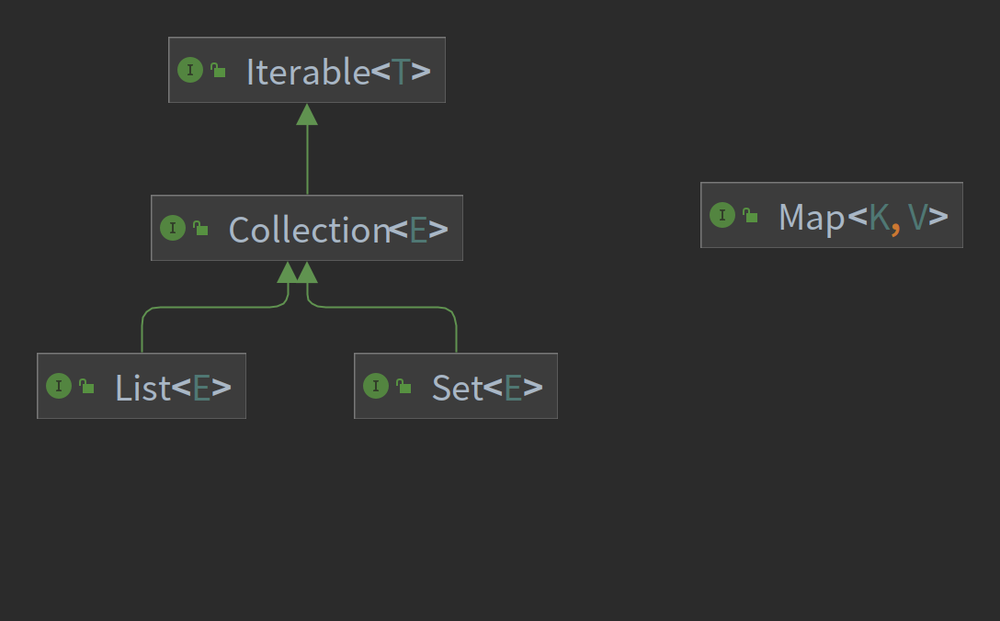
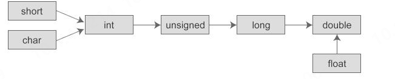

### JAVA基本知识 

* `StringBuilder`和`StringBuffer`可灵活扩展与更改，避免了`String`每次’更改’都会创建新对象的问题，其中`StringBuffer`线程安全，方法接口被`synchronized `修饰。
* 抽象类可以有构造函数，用于封装继承子类公共的东西。
  
### 1. List、Map与Set

#### List
* 可允许重复对象，可插入多个NULL值。
* 是一个有序容器，输出顺序是插入顺序。
* 常用实现类ArrayList底层为数组，用于随意访问；实现类LinkedList底层为链表，用于灵活增删；Vector底层为数组，但由于线程安全，效率比ArrayList低。
##### CopyOnWriteArrayList
CopyOnWriteArrayList允许线程并发访问读操作，这个时候是没有加锁限制的，性能较高。而写操作的时候，则首先将容器复制一份，然后在新的副本上执行写操作，这个时候写操作是上锁的。结束之后再将原容器的引用指向新容器。注意，在上锁执行写操作的过程中，如果有需要读操作，会作用在原容器上。因此上锁的写操作不会影响到并发访问的读操作。
#### Set
* 不允许重复对象，只能有一个NULL值。
* 是无序容器。
* 其实现类TreeSet根据compare()和compareTo()方法进行排序的有序容器。
#### Map
* 以键值对的形式存储。
* 键不可重复，值可重复，允许存NULL。
* 对于需要排序的场景，如果需要按插入顺序排序则可以使用LinkedHashMap，如果需要将key按自然顺序排列甚至是自定义顺序排列，则可以选择TreeMap。如果需要保证线程安全，则可以使用Collections工具类将上述实现类包装成线程安全的Map
##### HashMap中产生循环链表的原因
在多线程的情况下，当重新调整HashMap大小的时候，就会存在条件竞争，因为如果两个线程都发现HashMap需要重新调整大小了，它们会同时试着调整大小。在调整大小的过程中，存储在链表中的元素的次序会反过来，因为移动到新的bucket位置的时候，HashMap并不会将元素放在链表的尾部，而是放在头部（头插法），这是为了避免尾部遍历。如果条件竞争发生了，那么就会产生死循环了。
##### HashMap 扩容机制
1. 数组的初始容量为16，当当前元素个数达到当前的负载因子时，就会扩容
2. 为了解决碰撞，当链表长度到达一个阈值时（7或8），会将链表转换成红黑树提高性能。而当链表长度缩小到另一个阈值时（6），又会将红黑树转换回单向链表提高性能。
3. 若链表长度达到8，则将链表转换成红黑树，并将数据插入树中；检查链表长度转换成红黑树之前，还会先检测当前数组数组是否到达一个阈值（64），如果没有到达这个容量，会放弃转换，先去扩充数组。所以上面也说了链表长度的阈值是7或8，因为会有一次放弃转换的操作。
4. 容量以2次方进行扩充，首先是因为mask的计算只要将最高位前一位置为1；其次元素的在表中的hash不用重新计算，只要判断其hashcode中新增的位所在位置时1还是0，1则原hash+oldcap，0则原hash
##### treeMap
1. 默认按照key值升序排序，可使用以下方式取出
```java
    for (Map.Entry<Integer,Character> e : map.entrySet()){
            System.out.println(e.getValue());
        }
```
2. 若要按value排序，需要先转为List,再调用Collections.sort()方法
```java
    List<Map.Entry<Integer,Character>> list = new ArrayList<>(map.entrySet());
    Collections.sort(list,(o1,o2)-> o1.getValue()-o2.getValue() ); 
```
#### 其他
1. 需要使用线程安全的集合类，也建议将线程不安全的集合类包装成线程安全集合类的方式（使用Collection提供的synchronizedXXX()方法，如synchronizedMap），而不是直接使用这些古老的API（Vector，HashTable）
### 2. equals()与==   
1. `==`针对基本数据类型时，比较的是值是否相同，引用数据类型时是比较引用地址是否相同。
2. `equals()`属于Object中的方法，所有类都可重写该方法，但基本数据类型不可使用。
   ```java
     public boolean equals(Object obj) {
        return (this == obj);
    }
   ```
3. String类中先判断`==`,然后再判断值是否相同。
```java
  public boolean equals(Object anObject) {
        if (this == anObject) {
            return true;
        }
        return (anObject instanceof String aString)
                && (!COMPACT_STRINGS || this.coder == aString.coder)
                && StringLatin1.equals(value, aString.value);
    }

```
4. 包装类中会先判断包装类型是否相同，再判断值是否相同；
```java
public boolean equals(Object obj) {
        if (obj instanceof Integer) {
            return value == ((Integer)obj).intValue();
        }
        return false;
    }
```
5. 当重写`equals()`方法时，为了维持Java中的一般规定，即`equals()`方法判断相同的对象的hashcode应当相同，一般需要重写`hashCode()`方法。
### 3. Object类
&#8195;&#8195;是Java类结构中的根节点，每个类都要继承Object类，且实现该类中的方法。以下对其中的一些主要方法进行简要介绍：
1. hashCode()
   该方法根据对象的地址计算hash值；
```java
    @IntrinsicCandidate
    public native int hashCode();
```
1. equals()
2. clone()

&#8195;&#8195;对于任意对象x，应保证：   
```
  x.clone() != x
  x.clone().getClass() == x.getClass()
  x.clone().equals(x)
```
成立，但不是必须的。重写Object类中的clone()方法需要实现Cloneable接口，否则会抛出CloneNotSupportedException；
* Object类并未实现Cloneable接口，因此对Object类直接调用该方法会报错了；
* 所有数组都被视为实现了Cloneable接口；其实现过程可理解为对当前数组降一个维度后，挨个赋值。
* 如果覆盖了非final类中的clone方法，则应该返回一个通过调用super.clone()而得到的对象；因此要尽量避免在clone方法中使用构造器；
* 浅克隆对于引用类型而言，复制的是引用地址；深克隆对于引用类型而言，复制的是所引用的值。
4. toString()
```java
    public String toString() {
        return getClass().getName() + "@" + Integer.toHexString(hashCode());
    }
```
### 4. 内部类
&#8195;&#8195;在Java中，可以将一个类定义在另一个类里面或者一个方法里边，这样的类称为内部类，广泛意义上的内部类一般包括四种：成员内部类，局部内部类，匿名内部类，静态内部类 。
1. 成员内部类
* 该类像是外部类的一个成员，可以无条件的访问外部类的所有成员属性和成员方法（包括private成员和静态成员）；
* 成员内部类拥有与外部类同名的成员变量时，会发生隐藏现象，即默认情况下访问的是成员内部类中的成员。如果要访问外部类中的成员，需要以下形式访问：外部类.this.成员变量  或  外部类.this.成员方法； 
* 在外部类中如果要访问成员内部类的成员，必须先创建一个成员内部类的对象，再通过指向这个对象的引用来访问；
* 成员内部类是依附外部类而存在的，也就是说，如果要创建成员内部类的对象，前提是必须存在一个外部类的对象；
* 内部类可以拥有private访问权限、protected访问权限、public访问权限及包访问权限。如果成员内部类用private修饰，则只能在外部类的内部访问；如果用public修饰，则任何地方都能访问；如果用protected修饰，则只能在同一个包下或者继承外部类的情况下访问；如果是默认访问权限，则只能在同一个包下访问。外部类只能被public和包访问两种权限修饰。
    ```java
   public class Solution {
    int test = 2;
    //必须先创建成员内部类的对象，才能访问其成员
    mySolution mysolution = new mySolution();
    public int get(){
        return  mysolution.test;
    }
    public mySolution getMysolution(){
        return new mySolution();
    }
    //内部类
    public class  mySolution {
        int test;
        mySolution() {
            test = Solution.this.test;//使用<OuterClass>.this.<name>访问外部类中的同名属性或方法
        }
    }
    }
    class A{
    //要创建成员内部类的对象，前提是必须存在一个外部类的对象；
    Solution s = new Solution();
    Solution.mySolution ms = s.new mySolution();
    Solution.mySolution ms2 = s.getMysolution();
    }
    ``` 
1. 局部内部类
* 局部内部类是定义在一个方法或者一个作用域里面的类，它和成员内部类的区别在于局部内部类的访问仅限于方法内或者该作用域内；
* 局部内部类就像是方法里面的一个局部变量一样，是不能有public、protected、private以及static修饰符的。
* 在局部内部类中不能使用方法中可变的局部变量（因为方法中的局部变量位于栈中，而对象分配在堆中，生命周期不同，为解决这一问题，Java把局部内部类要访问的局部变量重新拷贝了一份，并把备份放在内部类的常量池中，这样就不会出现访问不存在的变量的错误了，但为了出现内部类和方法体都修改了局部变量的值，出现数据不同步的问题，所以要求其可访问的变量必须被final修饰）
3. 匿名内部类
* 一般使用匿名内部类的方法来编写事件监听代码；
* 匿名内部类是不能有访问修饰符和static修饰符的；
* 匿名内部类是唯一一种没有构造器的类；
* 匿名内部类用于继承其他类或是实现接口，并不需要增加额外的方法，只是对继承方法的实现或是重写。
4. 内部静态类
* 静态内部类是不需要依赖于外部类的，这点和类的静态成员属性有点类似；
* 不能使用外部类的非static成员变量或者方法。
### 5. switch方法
&#8195;&#8195;switch只接受int类型的数据：
* switch可以支持byte、short、char、int、Byte、Short、Character、Integer、String和枚举类型的数据
* byte、short、char自动转变为int类型，
* Byte、Short、Character、Integer--JDK1.5自动拆箱，转变为int类型进行匹配
* 同时随着jdk1.5中新增了枚举类型，枚举类型底层是使用了枚举类的ordinal方法，返回的是枚举常量的序号，其序号是int类型，所以可以作为switch的参数。
* 在jdk1.7中string类型底层使用了hashCode方法，返回的数据类型为哈希码，也是int类型。
### 6. 自动类型转换
自动类型转换遵循下面的规则：
* 若参与运算的数据类型不同，则先转换成同一类型，然后进行运算。
* 转换按数据长度增加的方向进行，以保证精度不降低。例如int型和long型运算时，先把int量转成long型后再进行运算。
* 所有的浮点运算都是以双精度进行的，即使仅含float单精度量运算的表达式，也要先转换成double型，再作运算。
* char型和short型参与运算时，必须先转换成int型。
* 在赋值运算中，赋值号两边的数据类型不同时，需要把右边表达式的类型将转换为左边变量的类型。如果右边表达式的数据类型长度比左边长时，将丢失一部分数据，这样会降低精度。
下图表示了类型自动转换的规则：

### 7. volatile和synchronized的区别
* volatile本质是在告诉jvm当前变量在寄存器（工作内存）中的值是不确定的，需要从主存中读取； synchronized则是锁定当前变量，只有当前线程可以访问该变量，其他线程被阻塞住。
* volatile仅能使用在变量级别；synchronized则可以使用在变量、方法、代码块和类级别的。
* volatile不会造成线程的阻塞；synchronized可能会造成线程的阻塞。
* volatile标记的变量不会被编译器优化；synchronized标记的变量可以被编译器优化。
* volatile能保证数据的可见性，但不能完全保证数据的原子性（不能保证复合操作的原子性），synchronized即保证了数据的可见性，也保证了原子性。
### 8. 多线程相关属性
#### 可见性：
&#8195;&#8195;可见性，是指线程之间的可见性，一个线程修改的状态对另一个线程是可见的。也就是一个线程修改的结果。另一个线程马上就能看到。比如：用volatile修饰的变量，就会具有可见性。volatile修饰的变量不允许线程内部缓存和重排序，即直接修改内存。所以对其他线程是可见的。但是这里需要注意一个问题，volatile只能让被他修饰内容具有可见性，但不能保证它具有原子性。比如 volatile int a = 0；之后有一个操作 a++；这个变量a具有可见性，但是a++ 依然是一个非原子操作，也就是这个操作同样存在线程安全问题。在 Java 中 volatile、synchronized 和 final 实现可见性。
#### 原子性：
&#8195;&#8195;原子是世界上的最小单位，具有不可分割性。比如 a=0；这个操作是不可分割的，那么我们说这个操作时原子操作。再比如：a++； 这个操作实际是a = a + 1；是可分割的，所以他不是一个原子操作。非原子操作都会存在线程安全问题，需要我们使用同步技术（sychronized）来让它变成一个原子操作。一个操作是原子操作，那么我们称它具有原子性。java的concurrent包下提供了一些原子类，我们可以通过阅读API来了解这些原子类的用法。比如：AtomicInteger、AtomicLong、AtomicReference等。在 Java 中 synchronized 和在 lock、unlock 中操作保证原子性。
#### 有序性：
&#8195;&#8195;Java 语言提供了 volatile 和 synchronized 两个关键字来保证线程之间操作的有序性，volatile 是因为其本身包含“禁止指令重排序”的语义，synchronized 是由“一个变量在同一个时刻只允许一条线程对其进行 lock 操作”这条规则获得的，此规则决定了持有同一个对象锁的两个同步块只能串行执行。
### 9. 基本类型的装箱和拆箱
&#8195;&#8195;装箱过程是通过调用包装器的valueOf方法实现的，而拆箱过程是通过调用包装器的 xxxValue方法实现的.
&#8195;&#8195;对于Integer类型，当int的值在[-128,127]之间的时候,valueOf会返回指向IntegerCache.cache中已经存在的对象的引用；否则创建一个新的Integer对象.Integer和int比较会进行自动拆箱，比较的是数值大小。
```java
 public static Integer valueOf(int i) {
        if (i >= IntegerCache.low && i <= IntegerCache.high)
            return IntegerCache.cache[i + (-IntegerCache.low)];
        return new Integer(i);
    }
```
### 10. 实现与继承
1. **默认方法**：在接口中使用`default`修饰的方法可以在接口中给出默认实现，其实现类可以直接调用默认方法。在遇到菱形继承问题时，需要显示调用。
2. 在子类的构造方法中使用`super()`调用父类构造方法时，`super()`必须出现在构造方法的第一行。而`this()`也需要在第一行(该方法用于调用类中其他已定义的构造犯法)。`super()`与`this()`无法同时使用。
### 11. JNDI
### 12. 异常
1. **运行时异常**只要代码不执行到这一行就不会出现问题，而导致**连接时异常**的代码放在一条根本无法被执行到的路径分支上，类加载时也照样会抛出异常。

### 13. 动态代理
&#8195;&#8195;动态代理中所说的“动态”，是针对使用Java代码实际编写了代理类的“静态”代理而言的，它的优势不在于省去了编写代理类那一点编码工作量，而是实现了可以在原始类和接口还未知的时候，就确定代理类的代理行为，当代理类与原始类脱离直接联系后，就可以很灵活地重用于不同的应用场景之中
### 14. 反射技术

### 15. stack和deque
#### Stack
&#8195;&#8195;继承自Vector，而Vector是线程安全的。其底层实现是数组，目前已经不被推荐，建议使用Deque来替代栈。
#### Queue
&#8195;&#8195;是一个继承自Collection的接口，由于LinkedList实现了该接口，因此可利用LinkedList来构建队列。
#### Deque
&#8195;&#8195;Deque是一个双端队列接口，继承自Queue接口。其原理为双端队列。
* offer()默认在队尾，peek()和poll()默认在队首
* push()和pop()在队首
#### PriorityQueue
&#8195;&#8195;是一个基于优先级堆实现的队列，默认其头部为最小值，不允许插入null和不可比较的元素。可通过构造函数设置所用的Comparator。如`Queue<Integer> p = new PriorityQueue<>(Collections.reverseOrder());`设置逆优先级。
* 构造comparator：
```java
    （o1, o2)-> o2-o1;//降序
    （o1, o2)-> o1-o2;//升序
```
#### ArrayDeque
* ArrayDeque是 Deque接口的一个实现，使用了可变数组，所以没有容量上的限制。同时ArrayDeque是线程不安全的，在没有外部同步的情况下，不能在多线程环境下使用。
* ArrayDeque是 Deque的实现类，可以作为栈来使用，效率高于 Stack；也可以作为队列来使用，效率高于 LinkedList。
* 不支持插入null类型。

### 16.lambda表达式
lambda表达式是java8中引入的特性，允许通过表达式来代替功能接口。它提供了一个正常的参数列表和一个使用这些参数的主体(body,可以是一个表达式或一个代码块)，可以看作是一个匿名函数。
#### 基本知识
1. 基本语法
(parameters) -> expression 或 (parameters) ->{ statements; }
* **paramaters**：类似方法中的形参列表，这里的参数是函数式接口里的参数。这里的参数类型可以明确的声明也可不声明而由JVM隐含的推断。另外当只有一个推断类型时可以省略掉圆括号。
* **方法体**：可以是表达式也可以代码块，是函数式接口里方法的实现。代码块可返回一个值或者什么都不返回，这里的代码块块等同于方法的方法体。如果是表达式，也可以返回一个值或者什么都不返回。
2. 函数式接口
函数式接口：一个接口有且只有一个抽象方法。
#### 语法精简
1. 参数类型可以省略，如果需要省略，每个参数的类型都要省略。
2. 参数的小括号里面只有一个参数，那么小括号可以省略
3. 如果方法体当中只有一句代码，那么大括号可以省略
4. 如果方法体中只有一条语句，且是return语句，那么大括号可以省略，且去掉return关键字
#### 变量捕获
* 即可以访问到外层定义的变量
* 捕获的变量在运行过程中不能发生改变(IDEA中会提醒变量应当声明为final或相对final)
* lambda的变量捕获与匿名内部类要求一致

#### 函数式接口
如果一个接口只有一个抽象方法，该接口为函数式接口，使用lambda表达式将匹配到该方法上。可以用`@FunctionnalInterface`注解。
1. Consumer:接受一个参数但无返回值
2. Supplier：无参数，有返回值
3. Function：接受一个参数，返回一个结果
4. Predicate：接收参数，返回布尔类型结果
#### 方法引用
是Lambda表达式的一种简写形式。若Lambda表达式方法体中只是调用一个特定的已存在的方法，则可以使用方法引用。常见形式：
* 对象::实例方法
* 类::静态方法
* 类::实例方法
* 类::new
### Stream 流
中间操作生成流，且只有在进行终止操作时，这些中间操作才会执行。常用的生成流为Collections中的stream()方法。
1. 中间操作
   * filter,limit,skip,distinct,sorted
   * map：映射
2. 终止操作
   * forEach,min,max,count
   * reduce：规约，即将多个元素规约为一个元素
   * collect
### Optional
为了解决NPE(空指针异常)，其可包含空值或非空值。
#### 创建
1. Optional.ofNullable(object)：对象为null时，返回空实例
2. Optional.of(object)：对象为null时，抛出NPE异常。
#### 判断
1. isPresent()：判断optional是否为空，如果空则返回false，否则返回true
2. ifPresent(Consumer c)：如果optional不为空，则将optional中的对象传给Comsumer函数
3. orElse(T other)：如果optional不为空，则返回optional中的对象；如果为null，则返回 other 这个默认值 
4. orElseGet(Supplier<T> other)：如果optional不为空，则返回optional中的对象；如果为null，则使用Supplier函数生成默认值other
5. orElseThrow(Supplier<X> exception)：如果optional不为空，则返回optional中的对象；如果为null，则抛出Supplier函数生成的异常

### 序列化
序列化机制可以将对象转换成字节序列，这些字节序列可以保存在磁盘上，也可以在网络中传输，并允许程序将这些字节序列再次恢复成原来的对象。其中，对象的序列化（Serialize），是指将一个Java对象写入IO流中，对象的反序列化（Deserialize），则是指从IO流中恢复该Java对象。
若对象要支持序列化机制，则它的类需要实现Serializable接口，该接口是一个标记接口，它没有提供任何方法，只是标明该类是可以序列化的
#### 定义serialVersionUID变量
serialVersionUID代表序列化的版本，通过定义类的序列化版本，在反序列化时，只要对象中所存的版本和当前类的版本一致，就允许做恢复数据的操作，否则将会抛出序列化版本不一致的错误。如果不定义序列化版本，在反序列化时可能出现冲突的情况，例如以下过程：
1. 创建该类的实例，并将这个实例序列化，保存在磁盘上；
2. 升级这个类，例如增加、删除、修改这个类的成员变量；
3. 反序列化该类的实例，即从磁盘上恢复修改之前保存的数据。
在第3步恢复数据的时候，当前的类已经和序列化的数据的格式产生了冲突，可能会发生各种意想不到的问题。增加了序列化版本之后，在这种情况下则可以抛出异常，以提示这种矛盾的存在，提高数据的安全性。

### 正则表达式
#### 识别合法字符
* X	字符x（x 可代表任何合法的字符)
* \0mnn	八进制数 0mnn 所表示的字符
* \xhh	十六进制值 0xhh 所表示的字符
* \uhhhh	十六进制值 0xhhhh 所表示的 Unicode 字符
* \t	制表符（“\u0009”）
* \n	新行（换行）符（‘\u000A’）
* \r	回车符（‘\u000D’)
* \f 	换页符（‘\u000C’）
* \a	报警（bell）符（‘\u0007’）
* \e	Escape 符（‘\u001B’）
* \cx	x 对应的的控制符。例如，\cM匹配 Ctrl-M。x 值必须为 A~Z 或 a~z 之一。
#### 特殊字符
* $	匹配一行的结尾。要匹配 $ 字符本身，请使用\$
* ^	匹配一行的开头。要匹配 ^ 字符本身，请使用\^
* ()	标记子表达式的开始和结束位置。要匹配这些字符，请使用\(和\)
* []	用于确定中括号表达式的开始和结束位置。要匹配这些字符，请使用\[和\]
* {}	用于标记前面子表达式的出现频度。要匹配这些字符，请使用\{和\}
* *指定前面子表达式可以出现零次或多次。要匹配 * 字符本身，请使用\*
* +指定前面子表达式可以出现一次或多次。要匹配 + 字符本身，请使用\+
* ?	指定前面子表达式可以出现零次或一次。要匹配 ？字符本身，请使用\?
* .	匹配除换行符\n之外的任何单字符。要匹配.字符本身，请使用\.
* \	用于转义下一个字符，或指定八进制、十六进制字符。如果需匹配\字符，请用\\
* |	指定两项之间任选一项。如果要匹配丨字符本身，请使用\|
由于这是由于 Java 字符串中反斜杠本身需要转义，因此两个反斜杠（\\）实际上相当于一个（前一个用于转义）。
#### 预定义字符
可以匹配多个字符的特殊字符：
* .	可以匹配任何字符
* \d	匹配 0~9 的所有数字
* \D	匹配非数字
* \s	匹配所有的空白字符，包括空格、制表符、回车符、换页符、换行符等
* \S	匹配所有的非空白字符
* \w	匹配所有的单词字符，包括 0~9 所有数字、26 个英文字母和下画线_
* \W	匹配所有的非单词字符
#### 方括号表达式
* 表示枚举	例如[abc]表示 a、b、c 其中任意一个字符；[gz]表示 g、z 其中任意一个字符
* 表示范围：-	例如[a-f]表示 a~f 范围内的任意字符；[\\u0041-\\u0056]表示十六进制字符 \u0041 到 \u0056 范围的字符。范围可以和枚举结合使用，如[a-cx-z]，表示 a~c、x~z 范围内的任意字符
* 表示求否：^	例如[^abc]表示非 a、b、c 的任意字符；[^a-f]表示不是 a~f 范围内的任意字符
* 表示“与”运算：&&	例如
  - [a-z&&[def]]是 a~z 和 [def] 的交集，表示 d、e、f
  - [a-z&&^bc]]是 a~z 范围内的所有字符，除 b 和 c 之外
* 表示“并”运算	并运算与前面的枚举类似。例如[a-d[m-p]]表示 [a-dm-p]。
#### 边界匹配符
* ^	行的开头
* $	行的结尾
* \b	单词的边界
* \B	非单词的边界
* \A	输入的开头
* \G	前一个匹配的结尾
* \Z	输入的结尾，仅用于最后的结束符
* \z	输入的结尾
#### 数量标识符
* Greedy（贪婪模式）：数量表示符默认采用贪婪模式，除非另有表示。贪婪模式的表达式会一直匹配下去，直到无法匹配为止。如果你发现表达式匹配的结果与预期的不符，很有可能是因为你以为表达式只会匹配前面几个字符，而实际上它是贪婪模式，所以会一直匹配下去。
* Reluctant（勉强模式）：用问号后缀（?）表示，它只会匹配最少的字符。也称为最小匹配模式。
* Possessive（占有模式）：用加号后缀（+）表示，目前只有 Java 支持占有模式，通常比较少用。
#### 非获取匹配
* (?:pattern)  非获取匹配，匹配pattern但不获取匹配结果，不进行存储供以后使用。这在使用或字符“(|)”来组合一个模式的各个部分时很有用。例如“industr(?:y|ies)”就是一个比“industry|industries”更简略的表达式。
* (?=pattern)  非获取匹配，正向肯定预查，在任何匹配pattern的字符串开始处匹配查找字符串，该匹配不需要获取供以后使用。例如，“Windows(?=95|98|NT|2000)”能匹配“Windows2000”中的“Windows”，但不能匹配“Windows3.1”中的“Windows”。预查不消耗字符，也就是说，在一个匹配发生后，在最后一次匹配之后立即开始下一次匹配的搜索，而不是从包含预查的字符之后开始。
* (?!pattern)  非获取匹配，正向否定预查，在任何不匹配pattern的字符串开始处匹配查找字符串，该匹配不需要获取供以后使用。例如“Windows(?!95|98|NT|2000)”能匹配“Windows3.1”中的“Windows”，但不能匹配“Windows2000”中的“Windows”。
* (?<=pattern)  非获取匹配，反向肯定预查，与正向肯定预查类似，只是方向相反。例如，“(?<=95|98|NT|2000)Windows”能匹配“2000Windows”中的“Windows”，但不能匹配“3.1Windows”中的“Windows”。
* (?<!pattern)  非获取匹配，反向否定预查，与正向否定预查类似，只是方向相反。此处用或任意一项都不能超过2位，如“(?<!95|98|NT|20)Windows正确，“(?<!95|980|NT|20)Windows 报错，若是单独使用则无限制，如(?<!2000)Windows 正确匹配

### 布隆过滤器
是一种用来检索元素是否在给定大集合中的数据结构。它由二进制向量（或者说位数组）和一系列随机映射函数（哈希函数）两部分组成的数据结构，相比于我们平时常用的的 List、Map 、Set 等数据结构，它占用空间更少并且效率更高，但是缺点是其返回的结果是概率性的，而不是非常准确的。理论情况下添加到集合中的元素越多，误报的可能性就越大。并且，存放在布隆过滤器的数据不容易删除。
#### 原理
当一个元素加入布隆过滤器中的时候，会进行如下操作：
1. 使用布隆过滤器中的哈希函数对元素值进行计算，得到哈希值（有几个哈希函数得到几个哈希值）。
2. 根据得到的哈希值，在位数组中把对应下标的值置为 1。
当我们需要判断一个元素是否存在于布隆过滤器的时候，会进行如下操作：
1. 对给定元素再次进行相同的哈希计算；
2. 得到值之后判断位数组中的每个元素是否都为 1，如果值都为 1，那么说明这个值在布隆过滤器中，如果存在一个值不为 1，说明该元素不在布隆过滤器中。
因此，布隆过滤器说某个元素存在，小概率会误判。布隆过滤器说某个元素不在，那么这个元素一定不在。
#### 使用场景
1. 判断给定数据是否存在：比如判断一个数字是否存在于包含大量数字的数字集中（数字集很大，5 亿以上！）、 防止缓存穿透（判断请求的数据是否有效避免直接绕过缓存请求数据库）等等、邮箱的垃圾邮件过滤、黑名单功能等等。
2. 去重：比如爬给定网址的时候对已经爬取过的 URL 去重。
#### 使用
1. Guava提供的
2. Redis 中的布隆过滤器