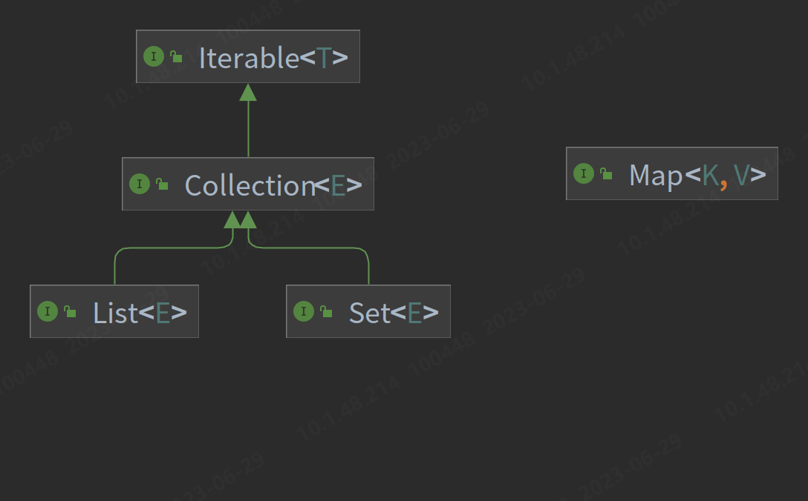

### JAVA基本知识 

* `StringBuilder`和`StringBuffer`可灵活扩展与更改，避免了`String`每次’更改’都会创建新对象的问题，其中`StringBuffer`线程安全，方法接口被`synchronized `修饰。
* 抽象类可以有构造函数，用于封装继承子类公共的东西。
  
### 1. List、Map与Set

#### List
* 可允许重复对象，可插入多个NULL值。
* 是一个有序容器，输出顺序是插入顺序。
* 常用实现类ArrayList底层为数组，用于随意访问；实现类LinkedList底层为链表，用于灵活增删；Vector底层为数组，但由于线程安全，效率比ArrayList低。
#### Set
* 不允许重复对象，只能有一个NULL值。
* 是无序容器。
* 其实现类TreeSet根据compare()和compareTo()方法进行排序的有序容器。
#### Map
* 以键值对的形式存储。
* 键不可重复，值可重复，允许存NULL。

### 2. equals()与==   
1. `==`针对基本数据类型时，比较的是值是否相同，引用数据类型时是比较引用地址是否相同。
2. `equals()`属于Object中的方法，所有类都可重写该方法，但基本数据类型不可使用。
   ```java
     public boolean equals(Object obj) {
        return (this == obj);
    }
   ```
3. String类中先判断`==`,然后再判断值是否相同。
```java
  public boolean equals(Object anObject) {
        if (this == anObject) {
            return true;
        }
        return (anObject instanceof String aString)
                && (!COMPACT_STRINGS || this.coder == aString.coder)
                && StringLatin1.equals(value, aString.value);
    }

```
4. 包装类中会先判断包装类型是否相同，再判断值是否相同；
```java
public boolean equals(Object obj) {
        if (obj instanceof Integer) {
            return value == ((Integer)obj).intValue();
        }
        return false;
    }
```
5. 当重写`equals()`方法时，为了维持Java中的一般规定，即`equals()`方法判断相同的对象的hashcode应当相同，一般需要重写`hashCode()`方法。
### 3. Object类
&#8195;&#8195;是Java类结构中的根节点，每个类都要继承Object类，且实现该类中的方法。以下对其中的一些主要方法进行简要介绍：
1. hashCode()
   该方法根据对象的地址计算hash值；
```java
    @IntrinsicCandidate
    public native int hashCode();
```
1. equals()
2. clone()

&#8195;&#8195;对于任意对象x，应保证：   
```
  x.clone() != x
  x.clone().getClass() == x.getClass()
  x.clone().equals(x)
```
成立，但不是必须的。重写Object类中的clone()方法需要实现Cloneable接口，否则会抛出CloneNotSupportedException；
* Object类并未实现Cloneable接口，因此对Object类直接调用该方法会报错了；
* 所有数组都被视为实现了Cloneable接口；其实现过程可理解为对当前数组降一个维度后，挨个赋值。
* 如果覆盖了非final类中的clone方法，则应该返回一个通过调用super.clone()而得到的对象；因此要尽量避免在clone方法中使用构造器；
* 浅克隆对于引用类型而言，复制的是引用地址；深克隆对于引用类型而言，复制的是所引用的值。
4. toString()
```java
    public String toString() {
        return getClass().getName() + "@" + Integer.toHexString(hashCode());
    }
```
### 4. 内部类
&#8195;&#8195;在Java中，可以将一个类定义在另一个类里面或者一个方法里边，这样的类称为内部类，广泛意义上的内部类一般包括四种：成员内部类，局部内部类，匿名内部类，静态内部类 。
1. 成员内部类
* 该类像是外部类的一个成员，可以无条件的访问外部类的所有成员属性和成员方法（包括private成员和静态成员）；
* 成员内部类拥有与外部类同名的成员变量时，会发生隐藏现象，即默认情况下访问的是成员内部类中的成员。如果要访问外部类中的成员，需要以下形式访问：外部类.this.成员变量  或  外部类.this.成员方法； 
* 在外部类中如果要访问成员内部类的成员，必须先创建一个成员内部类的对象，再通过指向这个对象的引用来访问；
* 成员内部类是依附外部类而存在的，也就是说，如果要创建成员内部类的对象，前提是必须存在一个外部类的对象；
* 内部类可以拥有private访问权限、protected访问权限、public访问权限及包访问权限。如果成员内部类用private修饰，则只能在外部类的内部访问；如果用public修饰，则任何地方都能访问；如果用protected修饰，则只能在同一个包下或者继承外部类的情况下访问；如果是默认访问权限，则只能在同一个包下访问。外部类只能被public和包访问两种权限修饰。
    ```java
   public class Solution {
    int test = 2;
    //必须先创建成员内部类的对象，才能访问其成员
    mySolution mysolution = new mySolution();
    public int get(){
        return  mysolution.test;
    }
    public mySolution getMysolution(){
        return new mySolution();
    }
    //内部类
    public class  mySolution {
        int test;
        mySolution() {
            test = Solution.this.test;//使用<OuterClass>.this.<name>访问外部类中的同名属性或方法
        }
    }
    }
    class A{
    //要创建成员内部类的对象，前提是必须存在一个外部类的对象；
    Solution s = new Solution();
    Solution.mySolution ms = s.new mySolution();
    Solution.mySolution ms2 = s.getMysolution();
    }
    ``` 
1. 局部内部类
* 局部内部类是定义在一个方法或者一个作用域里面的类，它和成员内部类的区别在于局部内部类的访问仅限于方法内或者该作用域内；
* 局部内部类就像是方法里面的一个局部变量一样，是不能有public、protected、private以及static修饰符的。
* 在局部内部类中不能使用方法中可变的局部变量（因为方法中的局部变量位于栈中，而对象分配在堆中，生命周期不同，为解决这一问题，Java把局部内部类要访问的局部变量重新拷贝了一份，并把备份放在内部类的常量池中，这样就不会出现访问不存在的变量的错误了，但为了出现内部类和方法体都修改了局部变量的值，出现数据不同步的问题，所以要求其可访问的变量必须被final修饰）
3. 匿名内部类
* 一般使用匿名内部类的方法来编写事件监听代码；
* 匿名内部类是不能有访问修饰符和static修饰符的；
* 匿名内部类是唯一一种没有构造器的类；
* 匿名内部类用于继承其他类或是实现接口，并不需要增加额外的方法，只是对继承方法的实现或是重写。
4. 内部静态类
* 静态内部类是不需要依赖于外部类的，这点和类的静态成员属性有点类似；
* 不能使用外部类的非static成员变量或者方法。
### 5. switch方法
&#8195;&#8195;switch只接受int类型的数据：
* switch可以支持byte、short、char、int、Byte、Short、Character、Integer、String和枚举类型的数据
* byte、short、char自动转变为int类型，
* Byte、Short、Character、Integer--JDK1.5自动拆箱，转变为int类型进行匹配
* 同时随着jdk1.5中新增了枚举类型，枚举类型底层是使用了枚举类的ordinal方法，返回的是枚举常量的序号，其序号是int类型，所以可以作为switch的参数。
* 在jdk1.7中string类型底层使用了hashCode方法，返回的数据类型为哈希码，也是int类型。
### 6. 自动类型转换
自动类型转换遵循下面的规则：
* 若参与运算的数据类型不同，则先转换成同一类型，然后进行运算。
* 转换按数据长度增加的方向进行，以保证精度不降低。例如int型和long型运算时，先把int量转成long型后再进行运算。
* 所有的浮点运算都是以双精度进行的，即使仅含float单精度量运算的表达式，也要先转换成double型，再作运算。
* char型和short型参与运算时，必须先转换成int型。
* 在赋值运算中，赋值号两边的数据类型不同时，需要把右边表达式的类型将转换为左边变量的类型。如果右边表达式的数据类型长度比左边长时，将丢失一部分数据，这样会降低精度。
下图表示了类型自动转换的规则：

### 7. volatile和synchronized的区别
* volatile本质是在告诉jvm当前变量在寄存器（工作内存）中的值是不确定的，需要从主存中读取； synchronized则是锁定当前变量，只有当前线程可以访问该变量，其他线程被阻塞住。
* volatile仅能使用在变量级别；synchronized则可以使用在变量、方法、代码块和类级别的。
* volatile不会造成线程的阻塞；synchronized可能会造成线程的阻塞。
* volatile标记的变量不会被编译器优化；synchronized标记的变量可以被编译器优化。
* volatile能保证数据的可见性，但不能完全保证数据的原子性（不能保证复合操作的原子性），synchronized即保证了数据的可见性，也保证了原子性。
### 8. 多线程相关属性
#### 可见性：
&#8195;&#8195;可见性，是指线程之间的可见性，一个线程修改的状态对另一个线程是可见的。也就是一个线程修改的结果。另一个线程马上就能看到。比如：用volatile修饰的变量，就会具有可见性。volatile修饰的变量不允许线程内部缓存和重排序，即直接修改内存。所以对其他线程是可见的。但是这里需要注意一个问题，volatile只能让被他修饰内容具有可见性，但不能保证它具有原子性。比如 volatile int a = 0；之后有一个操作 a++；这个变量a具有可见性，但是a++ 依然是一个非原子操作，也就是这个操作同样存在线程安全问题。在 Java 中 volatile、synchronized 和 final 实现可见性。
#### 原子性：
&#8195;&#8195;原子是世界上的最小单位，具有不可分割性。比如 a=0；这个操作是不可分割的，那么我们说这个操作时原子操作。再比如：a++； 这个操作实际是a = a + 1；是可分割的，所以他不是一个原子操作。非原子操作都会存在线程安全问题，需要我们使用同步技术（sychronized）来让它变成一个原子操作。一个操作是原子操作，那么我们称它具有原子性。java的concurrent包下提供了一些原子类，我们可以通过阅读API来了解这些原子类的用法。比如：AtomicInteger、AtomicLong、AtomicReference等。在 Java 中 synchronized 和在 lock、unlock 中操作保证原子性。
#### 有序性：
&#8195;&#8195;Java 语言提供了 volatile 和 synchronized 两个关键字来保证线程之间操作的有序性，volatile 是因为其本身包含“禁止指令重排序”的语义，synchronized 是由“一个变量在同一个时刻只允许一条线程对其进行 lock 操作”这条规则获得的，此规则决定了持有同一个对象锁的两个同步块只能串行执行。
### 9. 基本类型的装箱和拆箱
&#8195;&#8195;装箱过程是通过调用包装器的valueOf方法实现的，而拆箱过程是通过调用包装器的 xxxValue方法实现的.
&#8195;&#8195;对于Integer类型，当int的值在[-128,127]之间的时候,valueOf会返回指向IntegerCache.cache中已经存在的对象的引用；否则创建一个新的Integer对象.Integer和int比较会进行自动拆箱，比较的是数值大小。
```java
 public static Integer valueOf(int i) {
        if (i >= IntegerCache.low && i <= IntegerCache.high)
            return IntegerCache.cache[i + (-IntegerCache.low)];
        return new Integer(i);
    }
```
### 10. 实现与继承
1. **默认方法**：在接口中使用`default`修饰的方法可以在接口中给出默认实现，其实现类可以直接调用默认方法。在遇到菱形继承问题时，需要显示调用。
2. 在子类的构造方法中使用`super()`调用父类构造方法时，`super()`必须出现在构造方法的第一行。而`this()`也需要在第一行(该方法用于调用类中其他已定义的构造犯法)。`super()`与`this()`无法同时使用。
### 11. JNDI
### 12. 异常
1. **运行时异常**只要代码不执行到这一行就不会出现问题，而导致**连接时异常**的代码放在一条根本无法被执行到的路径分支上，类加载时也照样会抛出异常。

### 13. 动态代理
&#8195;&#8195;动态代理中所说的“动态”，是针对使用Java代码实际编写了代理类的“静态”代理而言的，它的优势不在于省去了编写代理类那一点编码工作量，而是实现了可以在原始类和接口还未知的时候，就确定代理类的代理行为，当代理类与原始类脱离直接联系后，就可以很灵活地重用于不同的应用场景之中
### 14. 反射技术

### 15. stack和deque
#### Stack
&#8195;&#8195;继承自Vector，而Vector是线程安全的。其底层实现是数组，目前已经不被推荐，建议使用Deque来替代栈。
#### Queue
&#8195;&#8195;是一个继承自Collection的接口，由于LinkedList实现了该接口，因此可利用LinkedList来构建队列。
#### Deque
&#8195;&#8195;Deque是一个双端队列接口，继承自Queue接口。其原理为双端队列。
* offer()默认在队尾，peek()和poll()默认在队首
* push()和pop()在队首
#### PriorityQueue
&#8195;&#8195;是一个基于优先级堆实现的队列，默认其头部为最小值，不允许插入null和不可比较的元素。可通过构造函数设置所用的Comparator。如`Queue<Integer> p = new PriorityQueue<>(Collections.reverseOrder());`设置逆优先级。
* 构造comparator：
```java
    （o1, o2)-> o2-o1;//降序
    （o1, o2)-> o1-o2;//升序
```
#### ArrayDeque
* ArrayDeque是 Deque接口的一个实现，使用了可变数组，所以没有容量上的限制。同时ArrayDeque是线程不安全的，在没有外部同步的情况下，不能在多线程环境下使用。
* ArrayDeque是 Deque的实现类，可以作为栈来使用，效率高于 Stack；也可以作为队列来使用，效率高于 LinkedList。
* 不支持插入null类型。

### 16.lambda表达式
lambda表达式是java8中引入的特性，允许通过表达式来代替功能接口。它提供了一个正常的参数列表和一个使用这些参数的主体(body,可以是一个表达式或一个代码块)，可以看作是一个匿名函数。
#### 基本知识
1. 基本语法
(parameters) -> expression 或 (parameters) ->{ statements; }
* **paramaters**：类似方法中的形参列表，这里的参数是函数式接口里的参数。这里的参数类型可以明确的声明也可不声明而由JVM隐含的推断。另外当只有一个推断类型时可以省略掉圆括号。
* **方法体**：可以是表达式也可以代码块，是函数式接口里方法的实现。代码块可返回一个值或者什么都不返回，这里的代码块块等同于方法的方法体。如果是表达式，也可以返回一个值或者什么都不返回。
2. 函数式接口
函数式接口：一个接口有且只有一个抽象方法。
#### 语法精简
1. 参数类型可以省略，如果需要省略，每个参数的类型都要省略。
2. 参数的小括号里面只有一个参数，那么小括号可以省略
3. 如果方法体当中只有一句代码，那么大括号可以省略
4. 如果方法体中只有一条语句，且是return语句，那么大括号可以省略，且去掉return关键字
#### 变量捕获
* 即可以访问到外层定义的变量
* 捕获的变量在运行过程中不能发生改变(IDEA中会提醒变量应当声明为final或相对final)
* lambda的变量捕获与匿名内部类要求一致

### 并发编程
#### 指令重排序
简单来说就是系统在执行代码的时候并不一定是按照你写的代码的顺序依次执行。，一般分为两种情况：
* 编译器优化重排 ：编译器（包括 JVM、JIT 编译器等）在不改变单线程程序语义的前提下，重新安排语句的执行顺序。
* 指令并行重排 ：现代处理器采用了指令级并行技术(Instruction-Level Parallelism，ILP)来将多条指令重叠执行。如果不存在数据依赖性，处理器可以改变语句对应机器指令的执行顺序。
Java 源代码会经历 编译器优化重排 —> 指令并行重排 —> 内存系统重排 的过程，最终才变成操作系统可执行的指令序列。指令重排序可以保证串行语义一致，但是没有义务保证多线程间的语义也一致
#### Java内存模型
原因：
   * Java 语言是跨平台的，它需要自己提供一套内存模型以屏蔽系统差异。
   * 简化多线程编程，增强程序可移植性的
##### 主内存与本地内存
* 主内存 ：所有线程创建的实例对象都存放在主内存中，不管该实例对象是成员变量还是方法中的本地变量(也称局部变量)
* 本地内存 ：每个线程都有一个私有的本地内存来存储共享变量的副本，并且，每个线程只能访问自己的本地内存，无法访问其他线程的本地内存。本地内存是 JMM 抽象出来的一个概念，存储了主内存中的共享变量副本。
##### 八种同步操作
* 锁定（lock）: 作用于主内存中的变量，将他标记为一个线程独享变量。
* 解锁（unlock）: 作用于主内存中的变量，解除变量的锁定状态，被解除锁定状态的变量才能被其他线程锁定。
* read（读取）：作用于主内存的变量，它把一个变量的值从主内存传输到线程的工作内存中，以便随后的 load 动作使用。
* load(载入)：把 read 操作从主内存中得到的变量值放入工作内存的变量的副本中。
* use(使用)：把工作内存中的一个变量的值传给执行引擎，每当虚拟机遇到一个使用到变量的指令时都会使用该指令。
* assign（赋值）：作用于工作内存的变量，它把一个从执行引擎接收到的值赋给工作内存的变量，每当虚拟机遇到一个给变量赋值的字节码指令时执行这个操作。
* store（存储）：作用于工作内存的变量，它把工作内存中一个变量的值传送到主内存中，以便随后的 write 操作使用。
* write（写入）：作用于主内存的变量，它把 store 操作从工作内存中得到的变量的值放入主内存的变量中。
##### happens-before 原则
1. 定义：
   * 如果一个操作 happens-before 另一个操作，那么第一个操作的执行结果将对第二个操作可见，并且第一个操作的执行顺序排在第二个操作之前。
   * 两个操作之间存在 happens-before 关系，并不意味着 Java 平台的具体实现必须要按照 happens-before 关系指定的顺序来执行。如果重排序之后的执行结果，与按 happens-before 关系来执行的结果一致，那么 JMM 也允许这样的重排序
2. 其表达的意义是前一个操作的结果对于后一个操作是可见的，无论这两个操作是否在同一个线程里。
3. 常用规则：
   * 程序顺序规则 ：一个线程内，按照代码顺序，书写在前面的操作 happens-before 于书写在后面的操作；
   * 解锁规则 ：解锁 happens-before 于加锁；
   * volatile 变量规则 ：对一个 volatile 变量的写操作 happens-before 于后面对这个 volatile 变量的读操作。说白了就是对 volatile 变量的写操作的结果对于发生于其后的任何操作都是可见的。
   * 传递规则 ：如果 A happens-before B，且 B happens-before C，那么 A happens-before C；
   * 线程启动规则 ：Thread 对象的 start（）方法 happens-before 于此线程的每一个动作。
#### 线程池
* 降低资源消耗。通过重复利用已创建的线程降低线程创建和销毁造成的消耗。
* 提高响应速度。当任务到达时，任务可以不需要等到线程创建就能立即执行。
* 提高线程的可管理性。线程是稀缺资源，如果无限制的创建，不仅会消耗系统资源，还会降低系统的稳定性，使用线程池可以进行统一的分配，调优和监控
#####  Executor 框架
1. 框架结构
   * 任务(Runnable /Callable)：执行任务需要实现的 Runnable 接口 或 Callable接口。Runnable 接口或 Callable 接口 实现类都可以被 ThreadPoolExecutor 或 ScheduledThreadPoolExecutor 执行。
   * 任务的执行(Executor)
   * 异步计算的结果(Future)：Future 接口以及 Future 接口的实现类 FutureTask 类都可以代表异步计算的结果。
2. 使用示意图

   * 主线程首先要创建实现 Runnable 或者 Callable 接口的任务对象。
   * 把创建完成的实现 Runnable/Callable接口的 对象直接交给 ExecutorService 执行: ExecutorService.execute（Runnable command））或者也可以把 Runnable 对象或Callable 对象提交给 ExecutorService 执行（ExecutorService.submit（Runnable task）或 ExecutorService.submit（Callable <T> task））。
   * 如果执行 ExecutorService.submit（…），ExecutorService 将返回一个实现Future接口的对象（我们刚刚也提到过了执行 execute()方法和 submit()方法的区别，submit()会返回一个 FutureTask 对象）。由于 FutureTask 实现了 Runnable，我们也可以创建 FutureTask，然后直接交给 ExecutorService 执行。
   * 最后，主线程可以执行 FutureTask.get()方法来等待任务执行完成。主线程也可以执行 FutureTask.cancel（boolean mayInterruptIfRunning）来取消此任务的执行
3. ThreadPoolExecutor 类
   * 构造函数：
```java
  /**
     * 用给定的初始参数创建一个新的ThreadPoolExecutor。
     */
    public ThreadPoolExecutor(int corePoolSize,//线程池的核心线程数量,定义了最小可以同时运行的线程数量。
                              int maximumPoolSize,//线程池的最大线程数
                              long keepAliveTime,//当线程数大于核心线程数时，多余的空闲线程存活的最长时间
                              TimeUnit unit,//时间单位
                              BlockingQueue<Runnable> workQueue,//任务队列，用来储存等待执行任务的队列
                              ThreadFactory threadFactory,//线程工厂，用来创建线程，一般默认即可
                              RejectedExecutionHandler handler//拒绝策略，当提交的任务过多而不能及时处理时，我们可以定制策略来处理任务
                               ) {
        if (corePoolSize < 0 ||
            maximumPoolSize <= 0 ||
            maximumPoolSize < corePoolSize ||
            keepAliveTime < 0)
            throw new IllegalArgumentException();
        if (workQueue == null || threadFactory == null || handler == null)
            throw new NullPointerException();
        this.corePoolSize = corePoolSize;
        this.maximumPoolSize = maximumPoolSize;
        this.workQueue = workQueue;
        this.keepAliveTime = unit.toNanos(keepAliveTime);
        this.threadFactory = threadFactory;
        this.handler = handler;
    }
```
#### 其他
1. this逃逸问题