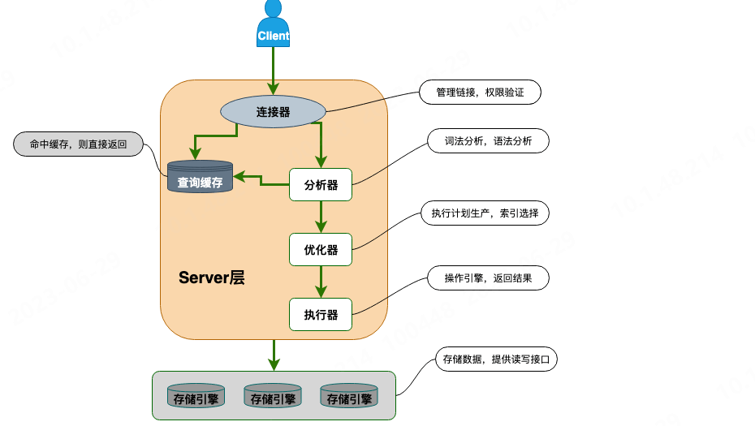

### MySQL 基础架构

* 连接器： 身份认证和权限相关(登录 MySQL 的时候)。
* 查询缓存： 执行查询语句的时候，会先查询缓存（MySQL 8.0 版本后移除，因为这个功能不太实用）。
* 分析器： 没有命中缓存的话，SQL 语句就会经过分析器，分析器说白了就是要先看你的 SQL 语句要干嘛，再检查你的 SQL 语句语法是否正确。
* 优化器： 按照 MySQL 认为最优的方案去执行。
* 执行器： 执行语句，然后从存储引擎返回数据。 执行语句之前会先判断是否有权限，如果没有权限的话，就会报错。
* 插件式存储引擎 ： 主要负责数据的存储和读取，采用的是插件式架构，支持 InnoDB、MyISAM、Memory 等多种存储引擎。
### 存储引擎
可以通过 `show engines `命令来查看 MySQL 支持的所有存储引擎。MySQL 5.5.5 之前，MyISAM 是 MySQL 的默认存储引擎。5.5.5 版本之后，InnoDB(唯一支持事务的) 是 MySQL 的默认存储引擎。
#### 存储引擎的架构
MySQL 存储引擎采用的是插件式架构，支持多种存储引擎，我们甚至可以为不同的数据库表设置不同的存储引擎以适应不同场景的需要。存储引擎是基于表的，而不是数据库。
####  InnoDB与MyISAM
一般使用InnoDB，某些读密集的情况下，使用 MyISAM 也是合适的（但会放弃事务支持等一系列InnoDB的优点）。
|InnoDB|MyISAM|
|---|---|
|支持行级锁(row-level locking)和表级锁,默认为行级锁。|只有表级锁(table-level locking)|
|提供事务支持，实现了 SQL 标准定义了四个隔离级别，具有提交(commit)和回滚(rollback)事务的能力。默认使用的可重复读隔离级别。|不提供事务支持|
|支持外键|不支持外键|
|支持数据库异常崩溃后的安全恢复|不支持数据库异常崩溃后的安全恢复|
|支持MVCC（多版本并发控制）|不支持MVCC|
|使用 B+Tree 作为索引结构，其数据文件本身就是索引文件|使用 B+Tree 作为索引结构,索引文件和数据文件是分离的，其表数据文件本身就是按 B+Tree 组织的一个索引结构，树的叶节点 data 域保存了完整的数据记录|
### 事务
事务是逻辑上的一组操作，要么都执行，要么都不执行。
#### 数据库事务的ACID特性
只有保证了事务的持久性、原子性、隔离性之后，一致性才能得到保障。也就是说 A、I、D 是手段，C 是目的。
1. 原子性（Atomicity）： 一个事务（transaction）中的所有操作，或者全部完成，或者全部不完成，不会结束在中间某个环节。事务在执行过程中发生错误，会被回滚（Rollback）到事务开始前的状态，就像这个事务从来没有执行过一样。即，事务不可分割、不可约简。
2. 一致性（Consistency）： 在事务开始之前和事务结束以后，数据库的完整性没有被破坏，数据保持一致。这表示写入的资料必须完全符合所有的预设约束、触发器、级联回滚等。
3. 隔离性（Isolation）： 数据库允许多个并发事务同时对其数据进行读写和修改的能力，隔离性可以防止多个事务并发执行时由于交叉执行而导致数据的不一致。事务隔离分为不同级别，包括未提交读（Read uncommitted）、提交读（read committed）、可重复读（repeatable read）和串行化（Serializable）。
   * 未提交读:正在执行的事务 读取到其他事物未提交的数据,会导致脏读。
   * 提交读：正在执行的事务 读取到其他事务已提交的数据 读取到其他事务已提交的修改 造成了不可重读，会造成不可重复读。
   * 可重复读：正在执行的事务 读取不到其他事务已提交或未提交的修改，但能读到其他事务已提交的插入，会造成幻读。
   * 可串行化： 最高的默认级别，强制事务串行执行（即一个事务一个事务执行）。效率极其低下。
4. 持久性（Durability）: 事务处理结束后，对数据的修改就是永久的，即便系统故障也不会丢失。
#### 并发事务带来的问题
1. 脏读（Dirty read）: 当一个事务正在访问数据并且对数据进行了修改，而这种修改还没有提交到数据库中，这时另外一个事务也访问了这个数据，然后使用了这个数据。因为这个数据是还没有提交的数据，那么另外一个事务读到的这个数据是“脏数据”，依据“脏数据”所做的操作可能是不正确的。
2. 丢失修改（Lost to modify）: 指在一个事务读取一个数据时，另外一个事务也访问了该数据，那么在第一个事务中修改了这个数据后，第二个事务也修改了这个数据。这样第一个事务内的修改结果就被丢失，因此称为丢失修改。 例如：事务 1 读取某表中的数据 A=20，事务 2 也读取 A=20，事务 1 修改 A=A-1，事务 2 也修改 A=A-1，最终结果 A=19，事务 1 的修改被丢失。
3. 不可重复读（Unrepeatable read）: 指在一个事务内多次读同一数据。在这个事务还没有结束时，另一个事务也访问该数据。那么，在第一个事务中的两次读数据之间，由于第二个事务的修改导致第一个事务两次读取的数据可能不太一样。这就发生了在一个事务内两次读到的数据是不一样的情况，因此称为不可重复读。
4. 幻读（Phantom read）: 幻读与不可重复读类似。它发生在一个事务（T1）读取了几行数据，接着另一个并发事务（T2）插入了一些数据时。在随后的查询中，第一个事务（T1）就会发现多了一些原本不存在的记录，就好像发生了幻觉一样，所以称为幻读。
#### MySQL保证原子性
想要保证事务的原子性，就需要在异常发生时，对已经执行的操作进行回滚，在 MySQL 中，恢复机制是通过 回滚日志（undo log） 实现的，所有事务进行的修改都会先记录到这个回滚日志中，然后再执行相关的操作。如果执行过程中遇到异常的话，我们直接利用 回滚日志 中的信息将数据回滚到修改之前的样子即可！并且，回滚日志会先于数据持久化到磁盘上。这样就保证了即使遇到数据库突然宕机等情况，当用户再次启动数据库的时候，数据库还能够通过查询回滚日志来回滚将之前未完成的事务。
#### 隔离级别的实现
SERIALIZABLE 隔离级别，是通过锁来实现的。除了 SERIALIZABLE 隔离级别，其他的隔离级别都是基于 MVCC 实现。但可能会用到锁机制，如REPEATABLE-READ 在当前读情况下需要使用加锁读来保证不会出现幻读。
### 锁
#### 行级锁与表级锁
* 表级锁： MySQL 中锁定粒度最大的一种锁，是针对非索引字段加的锁，对当前操作的整张表加锁，实现简单，资源消耗也比较少，加锁快，不会出现死锁。其锁定粒度最大，触发锁冲突的概率最高，并发度最低，MyISAM 和 InnoDB 引擎都支持表级锁。
* 行级锁： MySQL 中锁定粒度最小的一种锁，是针对索引字段加的锁，只针对当前操作的行记录进行加锁。 行级锁能大大减少数据库操作的冲突。其加锁粒度最小，并发度高，但加锁的开销也最大，加锁慢，会出现死锁。
#### 共享锁和排他锁
不论是表级锁还是行级锁，都存在共享锁（Share Lock，S 锁）和排他锁（Exclusive Lock，X 锁）这两类：
* 共享锁（S 锁） ：又称读锁，事务在读取记录的时候获取共享锁，允许多个事务同时获取（锁兼容）
* 排他锁（X 锁） ：又称写锁/独占锁，事务在修改记录的时候获取排他锁，不允许多个事务同时获取。如果一个记录已经被加了排他锁，那其他事务不能再对这条事务加任何类型的锁（锁不兼容）。
且排他锁与任何的锁都不兼容，共享锁仅和共享锁兼容。
#### 意向锁
用于快速判断是否可以对某个表使用表锁。它属于表级锁，分为：
* 意向共享锁（Intention Shared Lock，IS 锁）：事务有意向对表中的某些记录加共享锁（S 锁），加共享锁前必须先取得该表的 IS 锁。
* 意向排他锁（Intention Exclusive Lock，IX 锁）：事务有意向对表中的某些记录加排他锁（X 锁），加排他锁之前必须先取得该表的 IX 锁。
意向锁是有数据引擎自己维护的，在为数据行加共享 / 排他锁之前，InooDB 会先获取该数据行所在在数据表的对应意向锁。且意向锁之间是互相兼容的，但其意向排他锁和共享锁和排它锁互斥（表级别的）。
#### InnoDB的行锁
1. 记录锁（Record Lock） ：属于单个行记录上的锁。
2. 间隙锁（Gap Lock） ：索引记录之间的间隙上的锁，锁定一个范围，不包括记录本身。如果其他事务想要在这个范围内插入该范围不存在的数据时就会被阻塞。
3. 临键锁（Next-key Lock） ：Record Lock+Gap Lock，锁定一个范围，包含记录本身。记录锁只能锁住已经存在的记录，为了避免插入新记录，需要依赖间隙锁。
#### 当前读和快照读
1. 快照读（一致性非锁定读）就是单纯的 SELECT 语句，由 MVCC 机制来保证不出现幻读。除了以下两种都是快照读
```sql
SELECT ... FOR UPDATE
SELECT ... LOCK IN SHARE MODE
```
   * 如果读取的记录正在执行 UPDATE/DELETE 操作，读取操作不会因此去等待记录上 X 锁的释放，而是会去读取行的一个快照。
   * 只有在事务隔离级别 RC(读取已提交) 和 RR（可重读）下，InnoDB 才会使用一致性非锁定读：（1）在 RC 级别下，对于快照数据，一致性非锁定读总是读取被锁定行的最新一份快照数据。（2）在 RR 级别下，对于快照数据，一致性非锁定读总是读取本事务开始时的行数据版本。
   * 快照读比较适合对于数据一致性要求不是特别高且追求极致性能的业务场景。
2. 当前读 （一致性锁定读）就是给行记录加 X 锁或 S 锁。 使用 Next-Key Lock 进行加锁来保证不出现幻读
### 性能优化

### 注意事项
#### 数据库设计
1. 不建议在实际生产项目中使用外键的，在业务代码中进行约束即可。这也是阿里《JAVA开发手册》的要求
#### 锁相关   
1. 行级锁产生死锁，例：第一条语句会优先使用`name`索引，因为name不是主键索引，还会用到主键索引第二条语句是首先使用主键索引,再使用name索引 如果两条语句同时执行，第一条语句执行了name索引等待第二条释放主键索引，第二条执行了主键索引等待第一条的name索引，这样就造成了死锁。
* 解决方法：改造第一条语句 使其根据主键值进行更新
```sql
#①
update mk_user set name ='1' where `name`='idis12';
#②
update mk_user set name='12'  where id=12;
//改造后
update mk_user set name='1' where id=(select id from mk_user where name='idis12' );
```
2. 当我们执行 UPDATE、DELETE 语句时，如果 WHERE条件中字段没有命中唯一索引或者索引失效的话，就会导致扫描全表对表中的所有行记录进行加锁。
3. 由于 MVCC 的存在，对于一般的 SELECT 语句，InnoDB 不会加任何锁