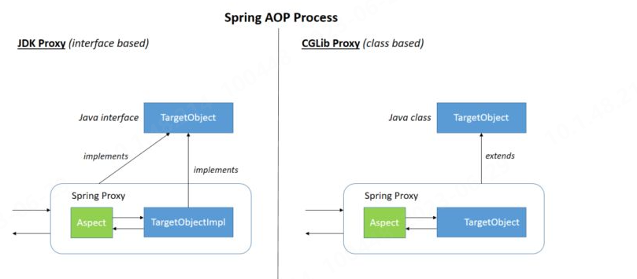
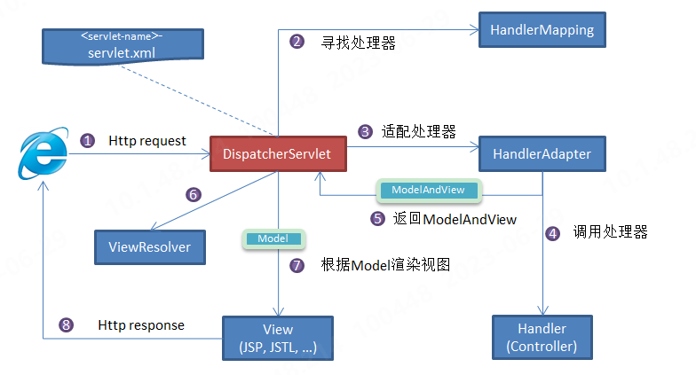

## SpringBoot
* 使用IDEA构建Spring boot+maven项目：新建项目时选择`Spring Initializr`,并将`Type`选项选为`Maven`。并在依赖中勾选`Spring Web`
* 若在`pom.xml`中`<artifactId>spring-boot-maven-plugin</artifactId>`变为红色，仅需为其增加版本号即可，注意要与所用`spring boot`版本一致。
### 基本知识
#### Spring,Spring MVC,Spring Boot的关系
* Spring是一款开源的轻量级 Java 开发框架，包含多个功能模块，最重要的是`Spring-Core`（主要提供 IoC 依赖注入功能的支持）模块。
* Spring MVC是Spring中的一个很重要的模块，主要赋予 Spring 快速构建 MVC 架构的 Web 程序的能力。MVC指模型(Model)、视图(View)、控制器(Controller)的简写，其核心思想是通过将业务逻辑、数据、显示分离来组织代码。
* Spring Boot是简化配制版本的Spring。
### Spring IoC
IoC（Inverse of Control:控制反转） 是一种设计思想，而不是一个具体的技术实现，其常用的实现模式是依赖注入。IoC 的思想就是将原本在程序中手动创建对象的控制权，交由 Spring 框架来管理，不通过`new`关键字来创建对象，通过IoC容器来帮助创建。即将对象之间的依赖关系交给IoC容器来管理，并由IoC容器完成对象的注入。IoC容器实际上可以理解为一个Map（key,value），存放着不同的对象。
[源码分析](https://javadoop.com/post/spring-ioc)
#### Spring Bean
Bean代指那些被 IoC 容器所管理的对象。通过配制元数据（xml,注解或java配置类）来定义哪些对象需要IoC容器管理。
##### 可以将类声明为Bean的注解
* `@Component`：通用的注解，可标注任意类为Spring组件。如果一个Bean不知道属于哪个层，可以使用`@Component`注解标注。
* `@Repository`: 对应持久层即Dao层，主要用于数据库相关操作
* `@Service`: 对应服务层，主要涉及一些复杂的逻辑，需要用到Dao层。
* `@Controller`: 对应Spring MVC控制层，主要用于接受用户请求并调用Service层返回数据给前端页面。
##### @Component和@Bean的区别
* `@Component`注解作用于类，而`@Bean`注解作用于方法。
* `@Component`通常是通过类路径扫描来自动侦测以及自动装配到Spring容器中的（可以使用`@ComponentScan`注解定义要扫描的路径),从路径中找出被标识的需要装配的类自动装配到 Spring 的 bean 容器中。`@Bean` 注解告知spring这个方法会返回一个对象，这个对象需要注册为Spring上下文中的bean，通常方法体包含了最终产生bean实例的逻辑
* `@Bean` 注解比 `@Component` 注解的自定义性更强，而且很多地方我们只能通过 `@Bean` 注解来注册 bean。比如当我们引用第三方库中的类需要装配到 Spring容器时，则只能通过 `@Bean`来实现。(因为它们一般是无法修改的，无法在其类上使用`@Component`注解)。
* `@Bean` 需要在配置类中使用，即类上需要加上`@Configuration`注解。
##### Bean的注入
* `@Autowired`， Spring内置的注解，默认的注入方式为byType（根据类型进行匹配），即会优先根据接口类型去匹配并注入Bean（接口的实现类）。
  1. 当一个接口存在多个实现类时，会无法正确注入，此时注入方式会变成`byName`(根据名称进行匹配)，名称通常是实现类名（首字母小写）
  2.  建议使用@Qualifier 注解来显示指定名称而不是依赖变量的名称
  3.  当发现有多种类型的Bean时，@Primary注解会通知IoC容器优先使用它所标注的Bean进行注入；@Quelifier注解可以与@AutoWired注解组合使用，达到通过类型和名称一起筛选Bean的效果。
```java
// 报错，byName 和 byType 都无法匹配到 bean
@Autowired
private SmsService smsService;
// 正确注入 SmsServiceImpl1 对象对应的 bean
@Autowired
private SmsService smsServiceImpl1;
// 正确注入  SmsServiceImpl1 对象对应的 bean
// smsServiceImpl1 就是我们上面所说的名称
@Autowired
@Qualifier(value = "smsServiceImpl1")
private SmsService smsService;

```
* 和`@Resource`，属于 JDK 提供的注解，默认注入方式为`byName`,如果无法通过名称匹配到对应的 Bean 的话，注入方式会变为`byType`.其实现如下：
```java
public @interface Resource {
    String name() default "";
    Class<?> type() default Object.class;
}
//因此注解格式为 @Resource(name="",type= )
```

##### Bean的作用域
* singleton : IoC 容器中只有唯一的 bean 实例。Spring 中的 bean 默认都是单例的，是对单例设计模式的应用。
* prototype : 每次获取都会创建一个新的 bean 实例。也就是说，连续 getBean() 两次，得到的是不同的 Bean 实例。
* request （仅 Web 应用可用）: 每一次 HTTP 请求都会产生一个新的 bean（请求 bean），该 bean 仅在当前 HTTP request 内有效。
* session （仅 Web 应用可用） : 每一次来自新 session 的 HTTP 请求都会产生一个新的 bean（会话 bean），该 bean 仅在当前 HTTP session 内有效。
* application/global-session （仅 Web 应用可用）： 每个 Web 应用在启动时创建一个 Bean（应用 Bean），该 bean 仅在当前应用启动时间内有效。
* websocket （仅 Web 应用可用）：每一次 WebSocket 会话产生一个新的 bean。
可使用`@Scope`注解的`value`属性设置作用域，如下：
```java
@Bean
@Scope(value = ConfigurableBeanFactory.SCOPE_PROTOTYPE)
...
```
##### 单例Bean的线程安全问题
* 单例 Bean 存在线程问题，主要是因为当多个线程操作同一个对象的时候是存在资源竞争的。
* 常见的有两种解决办法
  1. 在 Bean 中尽量避免定义可变的成员变量。
  2. 在类中定义一个 `ThreadLocal` 成员变量，将需要的可变成员变量保存在 `ThreadLocal` 中
##### Bean的生命周期
* 容器找到配制中Sping Bean的定义
* 容器利用反射机制创建Bean实例。
* 利用`set()`方法设置属性值
* 调用所实现的相关接口中的对应方法
* 程序执行，业务逻辑调用  
* 销毁Bean实例，并执行指定方法
##### 管理Bean生命周期的注解
* `@PostConstruct`：在bean创建完成并且属性赋值完成后执行初始化方法。
* `@PreDestroy`：在容器销毁bean之前通知我们进行清理工作。
##### 其他
1. Spring容器创建Bean对象的方法有三种方式，分别是：用构造器来实例化，使用静态工厂方法实例化和使用实例工厂方法实例化。注入有3种方式。属性注入、构造器注入、接口注入
2. 
### Spring AoP
AOP能够将那些与业务无关，却为业务模块所共同调用的逻辑或责任（例如事务处理、日志管理、权限控制等）封装起来，便于减少系统的重复代码，降低模块间的耦合度，并有利于未来的可拓展性和可维护性。它是基于动态代理的，如果要代理的对象，实现了某个接口，那么 Spring AOP 会使用 JDK Proxy，去创建代理对象，而对于没有实现接口的对象，就无法使用 JDK Proxy 去进行代理了，这时候 Spring AOP 会使用 Cglib 生成一个被代理对象的子类来作为代理，如下图所示：

此外还可以使用AspectJ框架。
#### 基本术语
* 目标(Target)：	被通知的对象
* 代理(Proxy)：	向目标对象应用通知之后创建的代理对象
* 连接点(JoinPoint)：	目标对象的所属类中，定义的所有方法均为连接点
* 切入点(Pointcut)：	被切面拦截 / 增强的连接点（切入点一定是连接点，连接点不一定是切入点）
* 通知(Advice)	增强的逻辑 / 代码，也即拦截到目标对象的连接点之后要做的事情
* 切面(Aspect)：	切入点(Pointcut)+通知(Advice)
* Weaving(织入)：	将通知应用到目标对象，进而生成代理对象的过程动作
#### Spring AOP和AspectJ AOP的区别
1. Spring AOP 属于运行时增强，而 AspectJ 是编译时增强。 
2. Spring AOP 基于代理(Proxying)，而 AspectJ 基于字节码操作(Bytecode Manipulation)。
3. 当切面太多的话，最好选择 AspectJ ，它比 Spring AOP 快很多。
#### AspectJ 定义的通知类型
* Before（前置通知）：目标对象的方法调用之前触发
* After （后置通知）：目标对象的方法调用之后触发
* AfterReturning（返回通知）：目标对象的方法调用完成，在返回结果值之后触发
* AfterThrowing（异常通知） ：目标对象的方法运行中抛出 / 触发异常后触发。AfterReturning 和 AfterThrowing 两者互斥。如果方法调用成功无异常，则会有返回值；如果方法抛出了异常，则不会有返回值。
* Around： （环绕通知）编程式控制目标对象的方法调用。环绕通知是所有通知类型中可操作范围最大的一种，因为它可以直接拿到目标对象，以及要执行的方法，所以环绕通知可以任意的在目标对象的方法调用前后搞事，甚至不调用目标对象的方法
#### 定义切面的执行顺序
1. 使用`@Order`注解定义切面顺序
```java
// 值越小优先级越高
@Order(3)
@Component
@Aspect
public class LoggingAspect implements Ordered {
```
2. 实现`Ordered`接口并重写`getOrder()`方法
```java
@Component
@Aspect
public class LoggingAspect implements Ordered {

    // ....

    @Override
    public int getOrder() {
        // 返回值越小优先级越高
        return 1;
    }
}
```
#### 其他
1. AOP有三种织入的方式： a、编译期织入，这要求使用特殊的Java编译器。 b、类装载期织入，这要求使用特殊的类装载器。 c、动态代理织入，在运行期为目标类添加增强生成子类的方式。 Spring采用动态代理织入，而AspectJ采用编译期织入和类装载期织入。
### Spring MVC
MVC指模型(Model)、视图(View)、控制器(Controller)的简写，其核心思想是通过将业务逻辑、数据、显示分离来组织代码。
#### 核心组件
* DispatcherServlet ：核心的中央处理器，负责接收请求、分发，并给予客户端响应。
* HandlerMapping ：处理器映射器，根据 uri 去匹配查找能处理的 Handler ，并会将请求涉及到的拦截器和 Handler 一起封装。
* HandlerAdapter ：处理器适配器，根据 HandlerMapping 找到的 Handler ，适配执行对应的 Handler；
* Handler ：请求处理器，处理实际请求的处理器。
* ViewResolver ：视图解析器，根据 Handler 返回的逻辑视图 / 视图，解析并渲染真正的视图，并传递给 DispatcherServlet 响应客户端
#### 工作原理

1. 客户端（浏览器）发送请求， `DispatcherServlet`拦截请求。
2. `DispatcherServlet` 根据请求信息调用 HandlerMapping 。`HandlerMapping `根据 uri 去匹配查找能处理的 `Handler`（也就是我们平常说的 Controller 控制器） ，并会将请求涉及到的拦截器和 `Handler` 一起封装。
3. `DispatcherServlet` 调用 `HandlerAdapter`适配执行 `Handler` 。
4. `Handler `完成对用户请求的处理后，会返回一个 ModelAndView 对象给`DispatcherServlet`，ModelAndView 顾名思义，包含了数据模型以及相应的视图的信息。Model 是返回的数据对象，View 是个逻辑上的 View。
5. `ViewResolver` 会根据逻辑 View 查找实际的 View。
6. `DispaterServlet` 把返回的 Model 传给 View（视图渲染）。
7. 把 View 返回给请求者（浏览器）
#### 统一异常处理
使用 `@ControllerAdvice` + `@ExceptionHandler` 这两个注解。
```java
@ControllerAdvice
@ResponseBody
public class GlobalExceptionHandler {

    @ExceptionHandler(BaseException.class)
    public ResponseEntity<?> handleAppException(BaseException ex, HttpServletRequest request) {
      //......
    }

    @ExceptionHandler(value = ResourceNotFoundException.class)
    public ResponseEntity<ErrorReponse> handleResourceNotFoundException(ResourceNotFoundException ex, HttpServletRequest request) {
      //......
    }
}
```
这种异常处理方式下，会给所有或者指定的 Controller 织入异常处理的逻辑（AOP），当 Controller 中的方法抛出异常的时候，由被`@ExceptionHandler `注解修饰的方法进行处理。`ExceptionHandlerMethodResolver `中 `getMappedMethod `方法决定了异常具体被哪个被 `@ExceptionHandler` 注解修饰的方法处理异常。该方法的源码如下：
```java
@Nullable
	private Method getMappedMethod(Class<? extends Throwable> exceptionType) {
		List<Class<? extends Throwable>> matches = new ArrayList<>();
    //找到可以处理的所有异常信息。mappedMethods 中存放了异常和处理异常的方法的对应关系
		for (Class<? extends Throwable> mappedException : this.mappedMethods.keySet()) {
      //class.isAssignableFrom()方法，返回该class所代表的类/接口是否是传入参数所代表的类/接口的父类/父接口。
			if (mappedException.isAssignableFrom(exceptionType)) {
				matches.add(mappedException);
			}
		}
    // 不为空说明有方法处理异常
		if (!matches.isEmpty()) {
      // 按照匹配程度从大到小排序
			matches.sort(new ExceptionDepthComparator(exceptionType));
      // 返回处理异常的方法
			return this.mappedMethods.get(matches.get(0));
		}
		else {
			return null;
		}
	}

```
#### 拦截器
1. preHandle() 方法：在控制器方法前执行，其返回值表示是否中断后续操作。当其返回值为true时，表示继续向下执行；当其返回值为false时，会中断后续的所有操作（包括调用下一个拦截器和控制器类中的方法执行等）。
2. postHandle()方法：在控制器方法调用之后，且解析视图之前执行。可以通过此方法对请求域中的模型和视图做出进一步的修改。
3. afterCompletion()方法：在整个请求完成，即视图渲染结束之后执行。可以通过此方法实现一些资源清理、记录日志信息等工作。

#### 其他
1. Model 对象可以被自动实例化。
2. 可以直接用request和response处理请求与响应
### Spring 事务
#### Spring对事务的支持
##### 编程式事务管理
通过 TransactionTemplate或者TransactionManager手动管理事务，实际应用中很少使用。
TransactionTemplate：
```java
@Autowired
private TransactionTemplate transactionTemplate;
public void testTransaction() {

        transactionTemplate.execute(new TransactionCallbackWithoutResult() {
            @Override
            protected void doInTransactionWithoutResult(TransactionStatus transactionStatus) {

                try {

                    // ....  业务代码
                } catch (Exception e){
                    //回滚
                    transactionStatus.setRollbackOnly();
                }

            }
        });
}
```
TransactionManager:
```java
@Autowired
private PlatformTransactionManager transactionManager;

public void testTransaction() {

  TransactionStatus status = transactionManager.getTransaction(new DefaultTransactionDefinition());
          try {
               // ....  业务代码
              transactionManager.commit(status);
          } catch (Exception e) {
              transactionManager.rollback(status);
          }
}
```
##### 声明式事务管理
实际是通过 AOP 实现，基于@Transactional 的全注解方式使用最多。
```java
@Transactional(propagation = Propagation.REQUIRED)
public void aMethod {
  //do something
  B b = new B();
  C c = new C();
  b.bMethod();
  c.cMethod();
}
```
#### 事务管理接口
Spring框架主要的相关接口为：
* PlatformTransactionManager： （平台）事务管理器，Spring 事务策略的核心。
```java
  package org.springframework.transaction;

import org.springframework.lang.Nullable;

public interface PlatformTransactionManager {
    //获得事务
    TransactionStatus getTransaction(@Nullable TransactionDefinition var1) throws TransactionException;
    //提交事务
    void commit(TransactionStatus var1) throws TransactionException;
    //回滚事务
    void rollback(TransactionStatus var1) throws TransactionException;
}
```
* TransactionDefinition： 事务定义信息(事务隔离级别、传播行为、超时、只读、回滚规则)。
* TransactionStatus： 事务运行状态。
其中PlatformTransactionManager 会根据 TransactionDefinition 的定义比如事务超时时间、隔离级别、传播行为等来进行事务管理 ，而 TransactionStatus 接口则提供了一些方法来获取事务相应的状态比如是否新事务、是否可以回滚等等。
##### TransactionDefinition:事务属性
事务属性可以理解成事务的一些基本配置，描述了事务策略如何应用到方法上。事务属性包含了 5 个方面：
* 隔离级别
* 传播行为
* 回滚规则
* 是否只读
* 事务超时
##### TransactionStatus:事务状态
TransactionStatus接口用来记录事务的状态,该接口定义了一组方法,用来获取或判断事务的相应状态信息。其接口定义如下：
```java
public interface TransactionStatus{
    boolean isNewTransaction(); // 是否是新的事务
    boolean hasSavepoint(); // 是否有恢复点
    void setRollbackOnly();  // 设置为只回滚
    boolean isRollbackOnly(); // 是否为只回滚
    boolean isCompleted; // 是否已完成
}
```
#### 事务属性
##### 事务传播行为
事务传播行为是为了解决业务层方法之间互相调用的事务问题。当事务方法被另一个事务方法调用时，必须指定事务应该如何传播。
|传播特性常量值	               |说明
|---                        |---|
|PROPAGATION_REQUIRED	      |如果当前没有事务，就新建一个事务，如果已经存在一个事务中，加入到这个事务中。这是最常见的选择|
|PROPAGATION_SUPPORTS      	|支持当前事务，如果当前没有事务，就以非事务方式执行|
|PROPAGATION_MANDATORY    	|使用当前的事务，如果当前没有事务，就抛出异常|
|PROPAGATION_REQUIRES_NEW	  |新建事务，如果当前存在事务，把当前事务挂起|
|PROPAGATION_NOT_SUPPORTED	|以非事务方式执行操作，如果当前存在事务，就把当前事务挂起|
|PROPAGATION_NEVER	        |以非事务方式执行，如果当前存在事务，则抛出异常|
|PROPAGATION_NESTED	        |如果当前存在事务，则在嵌套事务内执行。如果当前没有事务，则执行与PROPAGATION_REQUIRED类似的操作|
##### 事务隔离级别
ISOLATION_DEFAULT :使用后端数据库默认的隔离级别，MySQL 默认采用的 REPEATABLE_READ 隔离级别 Oracle 默认采用的 READ_COMMITTED 隔离级别
##### 事务超时属性
所谓事务超时，就是指一个事务所允许执行的最长时间，如果超过该时间限制但事务还没有完成，则自动回滚事务。其单位是秒。默认值为-1，这表示事务的超时时间取决于底层事务系统或者没有超时时间。
##### 事务只读属性
只读事务不涉及数据的修改，数据库会提供一些优化手段，适合用在有多条数据库查询操作的方法中。防止多条查询语句整体的不一致。
##### 事务回滚规则
这些规则定义了哪些异常会导致事务回滚而哪些不会。默认情况下，事务只有遇到运行期异常（RuntimeException 的子类）时才会回滚，Error 也会导致事务回滚，但是，在遇到检查型（Checked）异常时不会回滚。
如果你想要回滚你定义的特定的异常类型的话，可以这样：
```java
@Transactional(rollbackFor= MyException.class)
```
#### @Transactional 注解使用
##### 使用范围
* 方法 ：推荐将注解使用于方法上，不过需要注意的是：该注解只能应用到 public 方法上，否则不生效。
* 类 ：如果这个注解使用在类上的话，表明该注解对该类中所有的 public 方法都生效。
* 接口 ：不推荐在接口上使用。
##### 实现原理
1. 如果一个类或者一个类中的 public 方法上被标注@Transactional 注解的话，Spring 容器就会在启动的时候为其创建一个代理类，在调用被@Transactional 注解的 public 方法的时候，实际调用的是，TransactionInterceptor 类中的 invoke()方法。这个方法的作用就是在目标方法之前开启事务，方法执行过程中如果遇到异常的时候回滚事务，方法调用完成之后提交事务。
#### 注意事项
1. 事务能否生效数据库引擎是否支持事务是关键。比如常用的 MySQL 数据库默认使用支持事务的 innodb引擎。但是，如果把数据库引擎变为 myisam，那么程序也就不再支持事务了。
2. 若同一类中的其他没有 @Transactional 注解的方法内部调用有 @Transactional 注解的方法，有@Transactional 注解的方法的事务会失效。这是由于Spring AOP代理的原因造成的，因为只有当 @Transactional 注解的方法在类以外被调用的时候，Spring 事务管理才生效。
3. 底层使用的数据库必须支持事务机制，否则不生效；


### 常用注解
#### @SpringBootApplication
该注解可以看做是以下三个注解的集合：
* `@EnableAutoConfiguration`：启用 SpringBoot 的自动配置机制
* `@ComponentScan`： 扫描被注解的 bean，注解默认会扫描该类所在的包下所有的类。
* `@Configuration`：允许在 Spring 上下文中注册额外的 bean 或导入其他配置类
#### Bean相关
1. `@Autowired`:自动导入对象到类中，被注入进的类同样要被 Spring 容器管理比如：Service 类注入到 Controller 类中。
2. 用于声明为Bean的注解，`@Component`,`@Repository`,`@Service`, `@Controller`
3. `@RestController`:是`@Controller`和`@ResponseBody`的合集,表示这是个控制器 bean,并且是将函数的返回值直接填入 HTTP 响应体中,是 REST 风格的控制器。
   * `@Controller` +`@ResponseBody` 返回 JSON 或 XML 形式数据
   * `@Controller`一般是用在要返回一个视图的情况,对应前后端不分离的情况，目前很少使用。
4. `@Scope`:声明 Spring Bean 的作用域.
5. `@Configuration`:一般用来声明配置类，可以使用 `@Component`注解替代，不过使用`@Configuration`注解声明配置类更加语义化。
#### HTTP请求相关
常见的请求类型为：
|请求类型| 说明|
|:---    |:---:|
|GET    |请求从服务器获取特定资源。举个例子：GET /users（获取所有学生）|
|POST   |在服务器上创建一个新的资源。举个例子：POST /users（创建学生）|
|PUT    |更新服务器上的资源（客户端提供更新后的整个资源）。举个例子：PUT /users/12（更新编号为 12 的学生）|
|DELETE |从服务器删除特定的资源。举个例子：DELETE /users/12（删除编号为 12 的学生）|
|PATCH  |更新服务器上的资源（客户端提供更改的属性，可以看做作是部分更新），使用的比较少。|
1. get: @GetMapping("users") 等价于@RequestMapping(value="/users",method=RequestMethod.GET)
2. post:@PostMapping("users") 等价于@RequestMapping(value="/users",method=RequestMethod.POST)
3. put: @PutMapping("/users/{userId}") 等价于@RequestMapping(value="/users/{userId}",method=RequestMethod.PUT)
4. delete:@DeleteMapping("/users/{userId}")等价于@RequestMapping(value="/users/{userId}",method=RequestMethod.DELETE)
5. patch: 一般实际项目中，我们都是 PUT 不够用了之后才用 PATCH 请求去更新数据。
#### 前后端传值
1. `@PathVariable`:用于获取url路径上的参数,即使用`/`传数据。可以通过设置reqired属性来调节是否必须传
2. `@RequestParam`:用于获取查询参数，即使用`?`传数据。前端必须有对应的名字。可以通过设置reqired属性来调节是否必须传
3. `@RequestBody`:用于读取 Request 请求的 body 部分并且Content-Type 为 application/json 格式的数据，接收到数据之后会自动将数据绑定到 Java 对象上去。系统会使用HttpMessageConverter或者自定义的HttpMessageConverter将请求的 body 中的 json 字符串转换为 java 对象，也可以用String类型接受，然后自己解析。
   * 需要注意的是：一个请求方法只可以有一个@RequestBody，但是可以有多个@RequestParam和@PathVariable。 如果你的方法必须要用两个 @RequestBody来接受数据的话，大概率是数据库设计或者系统设计出问题了。
#### 读取配置信息
从配置文件中读取信息注入到对应属性中。
1. `@Value`:使用 @Value("${property}") 读取比较简单的配置信息。
2. `@ConfigurationProperties(prefix = )`:读取配置信息并与 bean 绑定。最适用于所有具有相同前缀的分层属性。默认情况下，Spring Boot 会忽略那些不能绑定到 @ConfigurationProperties 类字段的属性
3. `@PropertySource`:读取指定 properties 文件
#### 参数校验
JSR(Java Specification Requests） 是一套 JavaBean 参数校验的标准，它定义了很多常用的校验注解。 其时Hibernate Validator 框架的参考实现。
1. 常用的字段验证注解：
   
|注解名|说明|
|---|---|
| @NotEmpty | 被注释的字符串的不能为 null 也不能为空|
|@NotBlank |被注释的字符串非 null，并且必须包含一个非空白字符|
|@Null |被注释的元素必须为 null|
|@NotNull| 被注释的元素必须不为 null|
|@AssertTrue |被注释的元素必须为 true|
|@AssertFalse |被注释的元素必须为 false|
|@Pattern(regex=,flag=)|被注释的元素必须符合指定的正则表达式|
|@Email |被注释的元素必须是 Email 格式。|
|@Min(value)|被注释的元素必须是一个数字，其值必须大于等于指定的最小值，值为long类型|
|@Max(value)|被注释的元素必须是一个数字，其值必须小于等于指定的最大值|
|@DecimalMin(value)|被注释的元素必须是一个数字，其值必须大于等于指定的最小值，值为String类型|
|@DecimalMax(value) |被注释的元素必须是一个数字，其值必须小于等于指定的最大值|
|@Size(max=, min=)|被注释的元素的大小必须在指定的范围内|
|@Digits(integer, fraction)|被注释的元素必须是一个数字，其值必须在可接受的范围内|
|@Past|被注释的元素必须是一个过去的日期|
|@Future |被注释的元素必须是一个将来的日期|
2. 验证请求体,`@Valid`如果验证失败，它将抛出MethodArgumentNotValidException，默认情况下，Spring会将此异常转换为HTTP Status 400（错误请求）。。其合法性由Java对象内部的参数校验注解确定。
3. 验证请求参数，在类上使用`@Validated` ，这个参数可以告诉 Spring 去校验方法参数。如：
```java
@RestController
@RequestMapping("/api")
@Validated
public class PersonController {

    @GetMapping("/person/{id}")
    public ResponseEntity<Integer> getPersonByID(@Valid @PathVariable("id") @Max(value = 5,message = "超过 id 的范围了") Integer id) {
        return ResponseEntity.ok().body(id);
    }
}
```
#### 全局处理 Controller 层异常
1. `@ControllerAdvice` :注解定义全局异常处理类
2. `@ExceptionHandler` :注解声明异常处理方法
```java
@ControllerAdvice
@ResponseBody
public class GlobalExceptionHandler {

    /**
     * 请求参数异常处理
     */
    @ExceptionHandler(MethodArgumentNotValidException.class)
    public ResponseEntity<?> handleMethodArgumentNotValidException(MethodArgumentNotValidException ex, HttpServletRequest request) {
       ......
    }
}
```
#### JPA相关
#### json数据处理
1. 过滤json数据
   * `@JsonIgnoreProperties`在类上用于过滤掉特定字段不返回或者不解析。
   * `@JsonIgnore`一般用于类的属性上，作用和上面的`@JsonIgnoreProperties`一样。
2. `@JsonFormat`一般用来格式化 json 数据。`@JsonFormat(shape=JsonFormat.Shape.STRING, pattern="yyyy-MM-dd'T'HH:mm:ss.SSS'Z'", timezone="GMT")`
3. `@JsonUnwrapped`：扁平化对象
#### 测试相关
1. `@ActiveProfiles`一般作用于测试类上， 用于声明生效的 Spring 配置文件。
2. `@Test`声明一个方法为测试方法
3. `@Transactional`被声明的测试方法的数据会回滚，避免污染测试数据。
4. `@WithMockUser` Spring Security 提供的，用来模拟一个真实用户，并且可以赋予权限。
### Spring yaml配置
YAML 是 JSON 的超集，简洁而强大，专门用来书写配置文件的语言，可以替代 *.properties.它利用缩进来表示层级关系，并且大小写敏感。
#### 与*.properties文件的区别
1. 可以使用 @PropertySource 注解加载自定义的 Properties 配置文件，但无法加载自定义的 YAML 文件。
2. YAML 支持列表的配置，而 Properties 不支持。
3. application.properties 的优先级会比 application.yml 高，也就是说如果两个文件都存在，且两个文件都配置了同一个属性，那么会以 application.properties 里的配置为准。
#### 基础语法
#### 注意事项
1. 冒号后面要空一格再写值，否则会报错


### 其他
#### Spring Boot 拦截器
#### SpringApplication的run方法执行流程
1. 初始化监听器，以及添加到SpringApplication的自定义监听器。
2. 发布ApplicationStartedEvent事件，如果想监听ApplicationStartedEvent事件，你可以这样定义：public class ApplicationStartedListener implements ApplicationListener，然后通过SpringApplication.addListener(..)添加进去即可。
3. 装配参数和环境，确定是web环境还是非web环境。
4. 装配完环境后，就触发ApplicationEnvironmentPreparedEvent事件。
5. 如果SpringApplication的showBanner属性被设置为true，则打印启动的Banner。
6. 创建ApplicationContext，会根据是否是web环境，来决定创建什么类型的ApplicationContext。
7. 装配Context的环境变量，注册Initializers、beanNameGenerator等。
8. 发布ApplicationPreparedEvent事件。
9. 注册springApplicationArguments、springBootBanner，加载资源等
10. 遍历调用所有SpringApplicationRunListener的contextLoaded()方法。
11. 调用ApplicationContext的refresh()方法,装配context beanfactory等非常重要的核心组件。
12. 查找当前ApplicationContext中是否注册有CommandLineRunner，如果有，则遍历执行它们。
13. 发布ApplicationReadyEvent事件，启动完毕，表示服务已经可以开始正常提供服务了。通常我们这里会监听这个事件来打印一些监控性质的日志，表示应用正常启动了。
