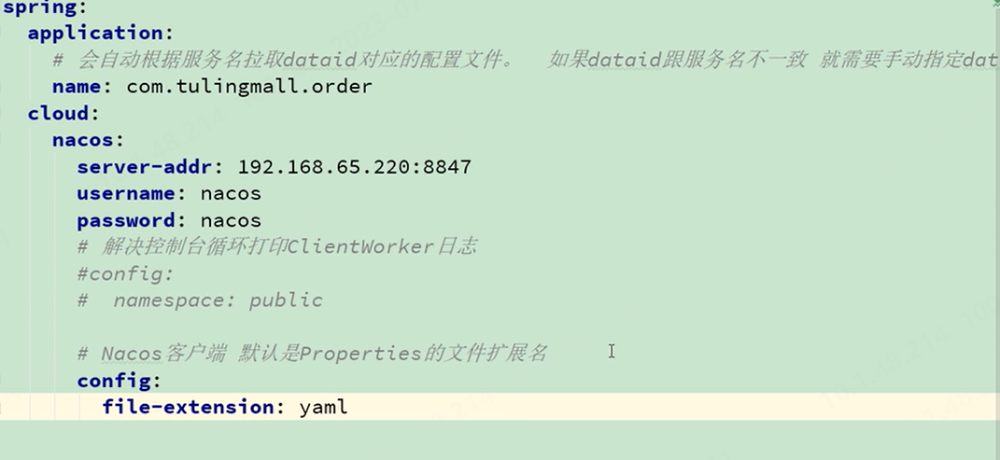

## Spring Cloud
微服务：即将原本布设在单一机器上的服务（可理解为某个Spring Boot项目），拆解成不同的服务（一般是按照业务逻辑进行拆解），布设在不同的地方。
### Eureka 微服务注册中心
微服务注册中心，将不同的微服务注册使用，包含其地址信息
#### 配制信息
##### Eureka 服务器
1. 需要在`pom.xml`中添加`spring-cloud-starter-netflix-eureka-server`依赖
2. `application.yml`中添加配制信息
``` yml
eureka:
  instance:
    hostname: localhost
  client:
    registerWithEureka: false #是否注册到服务器，由于其自身是服务器，所以是false
    fetchRegistry: false #是否从服务器获取注册信息，由于其自身是服务器，所以是false
    serviceUrl:
      defaultZone: http://${eureka.instance.hostname}:${server.port}/eureka/ #服务器地址

spring:
  application:
    name: eureka-server #微服务名
```
##### Eureka客户端
1. 需要在`pom.xml`中添加`spring-cloud-starter-netflix-eureka-client`依赖
2. `application.yml`中添加配制信息
```yml
spring:
  application:
    name: product-data-service
eureka:
  client:
    serviceUrl:
      defaultZone: http://localhost:8761/eureka/

```
### Ribbon 负载均衡
默认的使用RoundRobin轮询算法。首先Ribbon会从 Eureka Client里面获取到对应的服务注册表,也就知道了所有的服务都部署在了那台机器上,在监听哪些端口,然后Ribbon就可以使用默认的Round Robin算法,从中选择一台机器,Feigin就会针对这些机器构造并发送请求。


### Feign动态代理
如果你对某个接口定义了@FeignClient注解，Feign就会针对这个接口创建一个动态代理接着你要是调用那个接口，本质就是会调用 Feign创建的动态代理，这是核心中的核心Feign的动态代理会根据你在接口上的@RequestMapping等注解，来动态构造出你要请求的服务的地址最后针对这个地址，发起请求、解析响应。

### Hystrix熔断
使每个线程池只负责单一的服务，这样当某一服务不可用时，不会导致整个服务雪崩。当某个服务在一定时间内持续不可用时，直接进行熔断并降级（记录未进行的操作，后续手工进行）。

### Zuul网关
将不同REST请求转发至不同的微服务提供者，其作用类似于Nginx的反向代理。同时，也起到了统一端口的作用，将很多微服务提供者的不同端口统一到了Zuul的服务端口。并且还提供token认证和限流等功能。

## Spring Cloud Alibaba

??restTemoplate的使用
使用Rundashboard管理多服务启动

要注意版本依赖关系:[版本说明](https://github.com/alibaba/spring-cloud-alibaba/wiki/%E7%89%88%E6%9C%AC%E8%AF%B4%E6%98%8E)
#### 注意最新版springcloud的pom引入方式
在父maven的`.pom`文件中使用dependencyManagement引入
```xml
    <dependencyManagement>
        <dependencies>
            <dependency>
                <groupId>com.alibaba.cloud</groupId>
                <artifactId>spring-cloud-alibaba-dependencies</artifactId>
                <version><>
                <type>pom</type>
                <scope>import</scope>
            </dependency>
        </dependencies>
    </dependencyManagement>
```
初始化向导:start.aliyun.com
### [Nacos注册中心](https://nacos.io/zh-cn/docs/v2/guide/admin/cluster-mode-quick-start.html)
登陆的默认用户名和密码为:`nacos`
#### 主要功能
Nacos Discover
服务注册
服务心跳
服务同步
服务发现
服务健康检查

需要单独下载启动，配置启动模式等

#### yml文件配置
```yaml
server:
  port: 8010
spring: 
  application:
    name: #nacos会将该部分名称作为服务名
  cloud:
    nacos:
      server-addr: 127.0.0.1:8848 #nacos服务的地址
      discovery:
        username:
        password:
        namespace:
```
#### 使用
调用nacos服务的时候，需要启用负载均衡，即：`@LoadBalanced`注解

#### 集群部署 
1. 更改nacos配置文件application.properties，使用外置数据源mysql(5.7+),新建nacos的数据库(默认提供了一个sql文件用于创建),并设置服务端口
2. 更改conf目录下`cluster.conf.example`为`cluster.conf`，并添加节点配置
3. 更改nginx配置文件`conf\nginx.conf`进行负载均衡：

#### Ribbon
父接口：IRule 
实现类：
  RoundRobinRule：线性轮询
  RandomRule：随机
  RetryRule:，基于RoundRobinRule，但在连接有效期间可以重试
  WeightedResponseTimeRule：基于服务实例的响应时间，时间越短，权重越大
  BestAvailableRule:过滤失效的服务实例，然后使用并发请求最少的实例
  ZoneAvoidanceRule: 默认规则，根据server所在区域和server的可用性选择，之后采用轮询
  NacosRule： 采用nacos中使用的权重进行分配
1. 使用yml配置规则：
```yml
[server_name]: #被调用的微服务名
  ribbon: 
    NFLoadBalancerRuleClassName: #采用的策略的类名
```
2. 自定义规则：继承AbstractLoadBalanceRule类，并重写choose()方法

### [nacos配置中心](https://github.com/alibaba/spring-cloud-alibaba/wiki/Nacos-config)
1. 添加config_nacos的依赖，必须使用bootstrap.yml配置文件添加所用nacos（配置中心所在位置）的服务地址
2. 增加权限控制时需要更改nacos配置文件application.properties`nacos.core.auth.enabled=true`
3. 配置中心默认为properties格式，当配置中心使用yml文件格式时，需要更改bootstrap.yml中的配置

#### 注意事项
1. dataId以properties(默认的文件扩展名方式)为扩展名
2. 采用`@Value`方式获取到的属性值不会动态刷新，需要在类上增加`@RefreshScope`注解

### [微服务调用组件Feign-OpenFeign](https://spring.io/projects/spring-cloud-openfeign#learn)
声明式、模板化的HTTP客户端。
#### feign的使用
1. 在springapplication上使用`@FeignClientEnable`注解
2. 新建feign接口
```java
/*
* contextId: 指定BeanId
* value/name: 服务名（接口提供方的服务名），注意不支持下划线！！！
* path：所有方法的前缀路径，即接口所在controller的RequestMapping
*/
@FeignClient(contextId = "",value = )
public interface RemoteAioInfoService {
  //直接复制对应接口的声明
    @PostMapping("/list")
    Boolean queryAIOInfoDTOListBySnCodes(@RequestBody List<String> List, @RequestHeader(SecurityConstants.FROM) String from);//feign中对注解的要求比较严格，如@PathVariable需要指定value
}
```
#### 相关配置
1. 配置文件
```yml
feign:
  client:
    config:
      service-name: ##服务名
        loggerLevel: BASIC  
        connectTimeout：2000 ##连接超时时间，默认2s
        readTimeout： 5000 ##读取超时时间，默认5s
        requestInterceptors[0]:
          com.temp  ## 自定义拦截器的类名

```
2. 自定义拦截器：实现RequestInterceptor接口，重写apply方法

### [Sentinel分布式流量控制组件](https://github.com/alibaba/Sentinel/wiki) 
分为核心库和dashboard
#### 使用方式
**手动埋点示意：**
```java
Entry entry = null;
// 务必保证 finally 会被执行
try {
  // 资源名可使用任意有业务语义的字符串，注意数目不能太多（超过 1K），超出几千请作为参数传入而不要直接作为资源名
  // EntryType 代表流量类型（inbound/outbound），其中系统规则只对 IN 类型的埋点生效
  entry = SphU.entry("自定义资源名");
  // 被保护的业务逻辑
  // do something...
} catch (BlockException ex) {
  // 资源访问阻止，被限流或被降级
  // 进行相应的处理操作
} catch (Exception ex) {
  // 若需要配置降级规则，需要通过这种方式记录业务异常
  Tracer.traceEntry(ex, entry);
} finally {
  // 务必保证 exit，务必保证每个 entry 与 exit 配对
  if (entry != null) {
    entry.exit();
  }
}
```
* 注意：`SphU.entry(xxx)` 需要与 `entry.exit()` 方法成对出现，且`entry1 -> entry2 -> exit1 -> exit2`，应该为 `entry1 -> entry2 -> exit2 -> exit1`
FlowRule：流量控制规则类  
**使用`@SentinelResource`注解** 
1. 注解属性
  * `value` 定义资源
  * `blockHandler` 流控之后的处理方法，默认在同一个类。优先级大于fallback
  * `fallack` 出现异常后的处理方法，默认在同一个类。
2. blockHandler类定义要求：

#### 流量控制
一般用于服务提供端 
是针对资源进行控制的，将随机到来的请求调整为合适的形状。

**规则：**
1. QPS每秒访问次数：
2. 并发线程数：防止服务线程池耗尽的问题

**流控模式：**
1. 直接流控
2. 关联流控：当两个资源A和B有资源争抢或者依赖时，构成关联，使A关联的资源为B，当A访问达到阈值时，B被流控。
3. 链路流控：当资源AB调用了资源C，形成了调用链路，通过对C设置流控，并将A设置为入口资源，则A会被流控，但B不会（该模式需要手动配置关闭链路收敛）
通过实现BlockExceptionHandler接口，进行统一的异常处理，可以更具异常类型，分别对不同的异常进行不同的处理

**流控效果：**
1. 快速失败：超过阈值直接拒绝（默认效果）
2. warmup: 当流量激增时，让通过的流量缓慢增加，在一定时间内逐渐增加到阈值上线（处理激增流量，可以用于防止缓存击穿等）
3. 排队等待：超过阈值的排队等待一定时长，在时长内若有空余资源，就排队获得资源访问（处理脉冲流量，充分利用空闲时段）
  * 不支持QPS>1000的情况

**热点参数流控：**
即对经常访问的数据进行控制。常用操作为：热门商品访问，用户/ip防刷。

#### 降级规则
一般用于服务消费端，对若依赖服务降级
DegradeRule：降级规则类
1. 当出现熔断后，经过时间窗口后的第一次访问若还是失败，就会直接再进入降级熔断
2. 源码中判断次数采用的是`>`也就是说设置次数为2时，需要出现3次异常才会触发

**熔断策略:**
1. 慢调用比例：以慢调用（大于设置的RT时长，即最大响应时间，就是慢调用）比例作为阈值
2. 异常比例
3. 异常数

**整合openFeign**
1. 更改配置
```yml
feign: 
  sentinel:
    enabled: true
```
2. 新建fallback类实现对应的feign接口，并在feign接口的注解(`@FeignClient(fallback = )`)上，指定fallback路径

#### 系统保护规则 
结合系统指标控制流量，一般作为兜底方案
1. cpu使用率

#### 规则持久化（针对于dashboard）
以下给出结合nacos的方式中，yml文件的配置方式


### Seata分布式事务