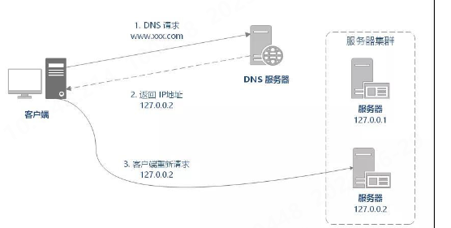
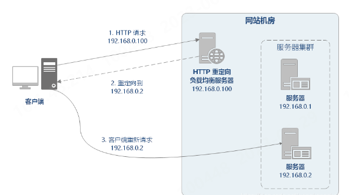
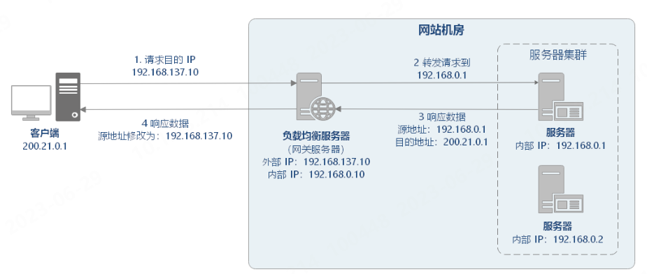
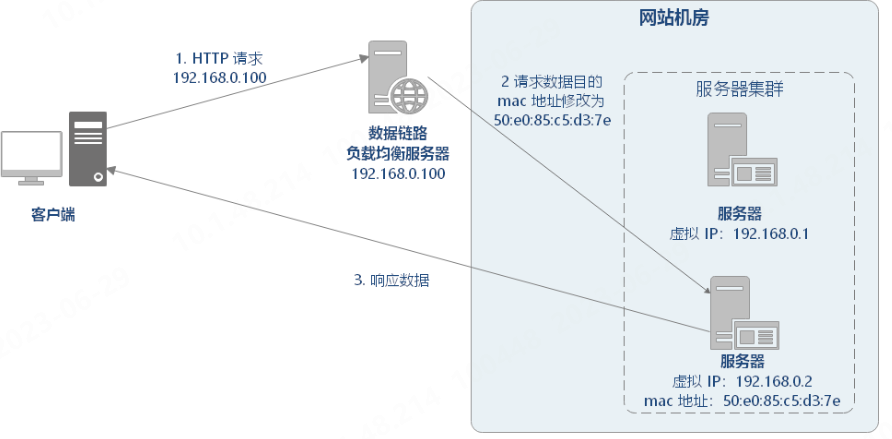

### FTP服务器
#### 软件安装
1. 安装vsftp软件`sudo apt-get install vsftpd`
2. 设置软件为开机启动`sudo systemctl enable vsftpd`
3. 启动ftp服务`sudo systemctl start vsftpd `
4. 确认服务是否启动`sudo netstat -antup | grep ftp `
#### vsftp配置
1. 创建ftp用户，使用m参数，把ftp用户的home目录一起创建`sudo useradd -m ftpuser`,并设置密码`sudo passwd ftpuser`
2. 打开 vsftpd.conf 文件`sudo vim /etc/vsftpd.conf `,修改配置参数。常用配制如下
```sh
anonymous_enable=NO
local_enable=YES
chroot_local_user=YES #是否限制用户离开限定的根目录
chroot_list_enable=YES
chroot_list_file=/etc/vsftpd.chroot_list

listen=YES 
write_enable=YES
#listen_ipv6=YES
```
```sh
#开启被动模式
local_root= 本地用户登录后所在目录
allow_writeable_chroot=YES
pasv_enable=YES
pasv_address=xxx.xx.xxx.xx #请修改为您服务器公网 IP
#服务器建立数据传输可使用的端口范围值,此范围的端口和端口21需要开放
pasv_min_port=40000
pasv_max_port=45000 
```
3. 创建并编辑 chroot_list 文件,输入用户名，一个用户名占据一行,完成后重启ftp服务

 
#### 注意事项
1. vsftpd 默认开启匿名访问模式，无需通过用户名和密码即可登录 FTP 服务器。使用此方式登录 FTP 服务器的用户没有权修改或上传文件的权限
2. 若ftp上传出现`FAIL MKDIR`错误，可通过以下流程解决：
   * 切换至ftp用户`su ftpuser`
   * 更改ftp目录权限`sudo chmod -R 777 ftp`


### MySQL
1. varchar(M) 在mysql5.0.3版本以下指存放M个字节的字符，5.0.3版本及以上表示存放M个字符。
2. varchar（100）和char（20）在存储“hello”时所用的空间一致，但前者在排序时所耗时间更长。

### Mybatis
#### 使用MyBatis Generator自动生成
#### resultMap和resultType
两者都是表示查询结果集与java对象之间的一种关系，处理查询结果集，映射到java对象
* resultType：直接表示返回类型，一般是bean中的对象类，此时可以省略掉resultMap标签的映射（由MyBatis自动创建并映射），但是必须保证查询结果集中的属性 和 bean对象类中的属性是一一对应的。
  ```xml
  <select id="selectUser" parameterType="java.lang.Integer" resultMap="com.yutchen.yunpan.entity.User">
    select *
	<!-- 可使用作映射 -->
	<!-- select user_name as `name` -->
    from user
    where user_id = #{user_id,jdbcType=INTEGER}
  </select>
  ```
* resultMap:表示将查询结果集中的列一一映射到bean对象的各个属性。在数据库字段无法与实体类中的属性名对应时使用。此外resultMap可以用在复杂联合查询上，而resultType不可以(比如实体类中包含其他表中的属性)。
  ```xml
  <!-- type指明要映射得到结果类型 -->
  <resultMap id="UserResultMap" type="com.yutchen.yunpan.entity.User">
	<!-- 主键需要单独映射 -->
    <id column="user_id" jdbcType="INTEGER" property="user_id" />
    <result column="file_store_id" jdbcType="INTEGER" property="file_store_id" javaType="java.lang.Integer"/>
    <result column="email" jdbcType="VARCHAR" property="email" />
    <result column="user_name" jdbcType="VARCHAR" property="user_name" />
    <result column="password" jdbcType="VARCHAR" property="password" />
    <result column="role" jdbcType="INTEGER" property="role" />
	<!-- 若包含其他类的集合，可使用以下方式 -->
	<!-- <collection property="fileList" resultMap="FileResultMap"></collection> -->
	<!-- 或者 -->
	<!-- <collection property="fileList" ofType="com.yutchen.yunpan.entity.File">
		 <id ...>
	     <result ...>
	     </collection> -->
	<!-- 若包含其他类型的关联（即实体类中的成员包含其他类的实例），可使用以下方式 -->
	<!-- 或者 -->
	<!-- <association property="变量名" resultMap="映射名"></association> -->
	<!-- <association property="变量名" javaType="类型名">
		<id ...>
	     <result ...>
    </association> -->
  </resultMap>
  ```
**常见情况：**
* 数据库字段名使用形如user_name命名方式，实体属性使用userName驼峰命名方式，开启mapUnderscoreToCamelCase=true后，直接使用resultType即可完成映射。
* 数据库字段名和实体属性名忽略大小写后串相等，如UserName和userName，可以直接使用resultType完成映射。
* 数据库字段名和实体属性名串忽略大小写和下划线后串不等，如user_name和name，就需要配置resultMap来完成这种不等值映射。
#### 动态SQL
即sql语句可以动态的变化，其本质是有条件的包含`where`子句的一部分，以达到方法重载的效果.原理为使用 OGNL 从 sql 参数对象中计算表达式的值，根据表达式的值动态拼接 sql，以此来完成动态 sql 的功能
##### if
主要用于基本的if判断，以下例子将查找user表，若没有传入`userId`,将所有`role=1`的记录返回，否则将返回指定id的`role=1`的记录。
```xml
<select id="selectUser" resultType="UserResultMap">
select * from user
where role = 1
<!-- 在test属性中设置判断条件 -->
<if test="userId!=null">
and user_id = #{userId}
</if>
```
##### when、choose、otherwise
主要用于实现类似`switch`语句的逻辑
```xml
<select id="selectUser" resultType="UserResultMap">
select * from user
where role = 1
<choose>
    <when test="userId!=null">
      and user_id = #{userId}
    </when>
    <when test="email != null">
      and email like #{email}
    </when>
    <otherwise>
      and file_stroe_id = 1
    </otherwise>
  </choose>
```
##### where
`where` 元素会在只有一个以上的if条件有值的情况下才去插入"WHERE"子句。而且，若最后的内容是"AND"或"OR"开头的，`where`元素也会将他们去除。
##### set
用于编写动态的更新语句,`set`元素可以用于去动态包含需要更新的列，而舍去其他的未输入的属性。
```xml
<update id="updateByPrimaryKeySelective" parameterType="com.yutchen.yunpan.entity.User">
    update user
    <set>
      <if test="file_store_id != null">
        file_store_id = #{file_store_id,jdbcType=INTEGER},
      </if>
      <if test="email != null">
        email = #{email,jdbcType=VARCHAR},
      </if>
      <if test="user_name != null">
        user_name = #{user_name,jdbcType=VARCHAR},
      </if>
      <if test="password != null">
        password = #{password,jdbcType=VARCHAR},
      </if>
      <if test="role != null">
        role = #{role,jdbcType=INTEGER},
      </if>
    </set>
    where user_id = #{user_id,jdbcType=INTEGER}
  </update>
```
##### trim
`trim`标记是一个格式化的标记，可以完成set或者是where标记的功能
1. 删除前后缀中命中的词`prefixoverride`；`suffixoverride`
2. 在删除操作结束后（不一定要执行），增加前后缀 `prefix`；`suffix`
##### foreach
1. 对一个集合进行遍历，通常是在构建 IN 条件语句的时候，如
```xml
<select id="selectPostIn" resultType="domain.blog.Post">
  SELECT *
  FROM POST P
  WHERE ID in
  <foreach item="item" index="index" collection="list"
      open="(" separator="," close=")">
        #{item}
  </foreach>
  <!-- 即等同于以下形式 -->
  <!-- SELECT *
  FROM POST P
  WHERE ID in（paramter1，paramter2，...，paramtern） 
  -->
</select>
```
2. 可以将任何可迭代对象（如 List、Set 等）、Map 对象或者数组对象作为集合参数传递给 foreach。当使用可迭代对象或者数组时，index 是当前迭代的序号，item 的值是本次迭代获取到的元素。当使用 Map 对象（或者 Map.Entry 对象的集合）时，index 是键，item 是值。collection指明要遍历的集合；open属性是起始拼接的值，separator是中间需要分割的值，close是结束拼接时的值。
3. collection属性指定
   * 若入参为单参数且参数类型是一个List的时候，collection属性值为list。
   * 若入参为单参数且参数类型是一个数组的时候，collection属性值为array（此处传入参数Integer[] rolelds为数组类型，故此处collection属性值设为“array”）。
   * 若传入参数为多参数，就需要把他们封装为一个Map进行处理，collection属性值为要遍历的集合的属性。
##### sql,include
用于定义并将sql语句中的重复部分抽取出来成为一个公用的部分，并使用`include`调用如
```xml
<sql id="selectall">
    select  *  from  user
</sql>
<select id="selectUser" resultType="UserResultMap">
<include refid="selectall">
<select>
```
##### bind
OGNL 表达式中创建一个变量并将其绑定到上下文
```xml
<select id="selectBlogsLike" resultType="Blog">
<!-- _parameter表示传入的参数 -->
  <bind name="pattern" value="'%' + _parameter.getTitle() + '%'" />
  SELECT * FROM BLOG
  WHERE title LIKE #{pattern}
</select>
```

#### 相关配制
1. pom.xml部分
```xml
<dependency>
	<groupId>org.mybatis.generator</groupId>
	<artifactId>mybatis-generator-core</artifactId>
	<version>1.4.1</version>
</dependency>

<plugin>
	<groupId>org.mybatis.generator</groupId>
	<artifactId>mybatis-generator-maven-plugin</artifactId>
	<version>1.4.1</version>
	<configuration>
	<!--配置文件的位置-->
	   <configurationFile>${basedir}/src/main/resources/generator/generatorConfig.xml</configurationFile>
	   <verbose>true</verbose>
		<overwrite>true</overwrite>
   </configuration>
	<executions>
		<execution>
			<id>Generate MyBatis Artifacts</id>
			<goals>
				<goal>generate</goal>
			</goals>
	   </execution>
	</executions>
</plugin>

```

##### 注意事项
1. 自动生成 User 类的同时会生成 UserKey 及 UserWithBlob 类的问题：
   * 首先要在 <jdbcConnection> 中的 connectionURL 中指定数据库的实例名，
   * 然后在 <jdbcConnection> 中添加相关配置信息，即 <property name="nullCatalogMeansCurrent" value="true"/>，即可保证只生成自己需要的 User 类。

#### docker
##### 使用docker部署

### 其他
#### MD5
1. MD5是一种摘要算法，加密后为128位，按16进制编码后，为32个字符。
2. 虽然md5本身是不可逆的,但是因为其唯一性,会遭到遍历破解,所以一般使用md5的时候还会进行加盐操作,即在md5运算结果上再加入自己的加密算法,例如这里为将结果都加上字符串yan,这样就不容易被破解了,加盐的加密算法也可以自己直接封装在工具类中
```java

import java.security.MessageDigest;
import java.security.NoSuchAlgorithmException;
/**
 * @Author yutchen
 * @Date 2022/9/9 上午10:01
 */
public class MD5Util {
    private static final String hexDigits[] = {"0", "1", "2", "3", "4", "5",
            "6", "7", "8", "9", "a", "b", "c", "d", "e", "f"};
    /*
     * @Author yutchen
     * @Description //实现加盐的MD5加密，其中盐为字符串本身
     * @Date 下午2:53 2022/9/9
     * @Param [java.lang.String]
     * @return java.lang.String
     **/
    public static String getMD5WithSalt(String s){
        String temp = getMD5(s);
        return getMD5(temp+s);
    }
    /*
     * @Author yutchen
     * @Description //对输入进行MD5加密，并返回加密后的字符串
     * @Date 下午2:50 2022/9/9
     * @Param [java.lang.String]
     * @return java.lang.String
     **/
    private static String getMD5(String s){
        String output = null;
        try {
            //获取MD5算法实例
            MessageDigest digest = MessageDigest.getInstance("MD5");
            //传入要处理的字节数据
            digest.update(s.getBytes());
            //进行数据加密，并返回加密后的字节数组
            byte[] b = digest.digest();
            output = byteArray2HexString(b);
        }catch (NoSuchAlgorithmException e){
            e.printStackTrace();
        }
        return output;
    }
    /*
     * @Author yutchen
     * @Description 将byte[]数组转化为16进制的字符串
     * @Date 上午10:49 2022/9/9
     * @Param [byte[]]
     * @return java.lang.String
     **/
    private static String byteArray2HexString(byte[] bytes){
        int len = bytes.length;
        StringBuilder result = new StringBuilder();
        for (int i = 0; i < len; i++) {
            byte byte0 = bytes[i];
            //利用无符号右移分别截取当前字节的前、后4位，并转为16进制
            result.append(hexDigits[byte0 >>> 4 & 0xf]);
            result.append(hexDigits[byte0 & 0xf]);
        }
        return result.toString();
    }

}
```
或者使用`org.apache.commons.codec.digest.DigestUtils`包中的方法：
```java
DigestUtils.md5Hex(str);
```
#### 利用邮件服务器发送验证
1. 引入邮箱任务依赖
```xml
		<dependency>
			<groupId>org.springframework.boot</groupId>
			<artifactId>spring-boot-starter-mail</artifactId>
		</dependency>
```
2. 在yml文件中增加邮箱配制
```yaml
mail:
    username: 邮箱名
    password: 授权码
    # 邮箱服务器的host
    host: smtp.qq.com
    port: 465
    properties:
      mail:
        smtp:
          auth: true
          starttls:
            enable: true
            required: true
          socketFactory:
          #使用SMTPS协议465端口
            port: 465
            class: javax.net.ssl.SSLSocketFactory
            fallback: false
```
3. 邮件服务
spring为发送邮件提供了一个抽象层: 定义了MailMessage 和 MailSender抽象 来描述邮件消息和邮件发送者
`MailMessage`: 有两个实现类: `SimpleMainMessage`(text格式) 和 `MimeMailMessage`(多用途)
`setTo(String to)` 发送地址，可以设置多个
`setFrom(String from)` 发送方
`setCc(String c)` 抄送
`SetSubject(String subject)` 主题
`setText(String text) `邮件内容
`MimeMessageHelper`: 简化对mimeMessage的封装

```java
public class MailUtils {


    //邮件发送器
    private JavaMailSenderImpl mailSender;
    private final String emailFrom = "";
    Logger logger = LogUtils.getLogger(MailUtils.class);

    public MailUtils(JavaMailSenderImpl mailSender) {
        this.mailSender = mailSender;
    }


    /**
     * @param title       邮件标题
     * @param text        邮件内容
     * @param acceptEmail 接收方邮件
     * @return void
     * @Author yutchen
     * @Description 发送纯文本邮件
     * @Date 下午3:55 2022/9/9
     **/
    public void sendSimpleMailMessage(String title, String text, String acceptEmail) {
        logger.info("开始发送简单邮件...");
        logger.info("mailSender对象为:" + mailSender);
        SimpleMailMessage message = new SimpleMailMessage();
        message.setSubject(title);
        message.setText(text);
        message.setFrom(emailFrom);
        message.setTo(acceptEmail);
        System.out.println(mailSender);
        logger.info("message对象为:" + message);
        mailSender.send(message);
    }

    /**
     * @param email    目标邮箱
     * @param userName 注册用户名
     * @param date     注册时间
     * @return java.lang.String
     * @Author yutchen
     * @Description //发送验证码（发送复杂邮件，包含Html标签）
     * @Date 下午4:04 2022/9/9
     **/

    public String sendCode(String email, String userName, Date date) {
      //生成验证码,Math.random()方法将返回一个0.0-1.0之间的数，取自均匀分布
        int code = (int) ((Math.random() * 9 + 1) * 100000);
        logger.info("开始发送复杂邮件...");
        logger.info("mailSender对象为:" + mailSender);
        MimeMessage mimeMessage = mailSender.createMimeMessage();
        MimeMessageHelper helper = new MimeMessageHelper(mimeMessage);
        try {
            helper.setSubject("网盘-邮箱验证");
            helper.setText("<h2 >内部网盘，仅用于科研资料传输</h2>" +
                    "<h3>用户注册-邮箱验证<h3/>" +
                    "您现在正在注册账号<br>" +
                    "验证码: <span style='color : red'>" + code + "</span><br>" +
                    "用户名 :" + userName +
                    "<br>" + date +
                    "<hr>" +
                    "<h5 style='color : red'>如果并非本人操作,请忽略本邮件</h5>", true);
            helper.setFrom(emailFrom);
            helper.setTo(email);
            // 添加资源文件
            // FileSystemResource resource = new FileSystemResource("文件路径")；
            // 以内嵌的方式添加文件
            // helper.addInline("id1",resource);
            // 以附件的方式增加文件
            // helper.addAttachment("tiger.jpeg",resource);

        } catch (MessagingException e) {
            e.printStackTrace();
        }
        logger.info("mimeMessage对象为:" + mimeMessage);
        mailSender.send(mimeMessage);
        return String.valueOf(code);
    }
}

```
#### 负载均衡
即尽力将网络流量平均分发到多个服务器上，以提高系统整体的响应速度和可用性。
##### 基础知识
1. 软件负载均衡的主流产品有：Nginx、HAProxy、LVS。
   * LVS 可以作为四层负载均衡器。其负载均衡的性能要优于 Nginx。
   * HAProxy 可以作为 HTTP 和 TCP 负载均衡器。
   * Nginx、HAProxy 可以作为四层或七层负载均衡器。
2. 网络通信分类
  * 七层负载均衡：就是可以根据访问用户的 HTTP 请求头、URL 信息将请求转发到特定的主机。
  * 四层负载均衡：基于 IP 地址和端口进行请求的转发。
3.  DNS 负载均衡：大型网站一般使用 DNS 负载均衡作为 第一级负载均衡手段，然后在内部使用其它方式做第二级负载均衡。DNS 负载均衡属于七层负载均衡。工作原理就是：基于 DNS 查询缓存，按照负载情况返回不同服务器的 IP 地址。
   
4.  HTTP 负载均衡：基于 HTTP 重定向实现，即根据用户的 HTTP 请求计算出一个真实的服务器地址，将该服务器地址写入 HTTP 重定向响应中，返回给浏览器，由浏览器重新进行访问。
   
5.  反向代理负载均衡：以代理服务器来接受网络请求，然后将请求转发给内网中的服务器，并将从内网中的服务器上得到的结果返回给网络请求的客户端。
   
6.  IP负载均衡：在网络层通过修改请求目的地址进行负载均衡。
   
7. 数据链路层负载均衡：在通信协议的数据链路层修改 mac 地址进行负载均衡。如Linux上的LVS(Linux Virtual Server)
   
##### 负载均衡算法