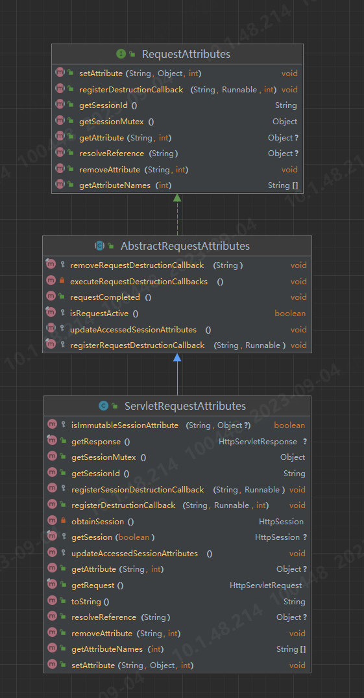

### Redis

Redis：k-v持久化产品，内存型数据库,也可以持久化到磁盘。value支持
    *String(可以包含jpg图片或序列化对象，内部实现可以看作byte数组，上限1G字节),
    * Hash(string类型的field和value的映射表,适合存储对象),
    *List(string 类型的双向链表,操作中key理解为链表的名字),
    * Sets(提供集合操作),
    * Sorted sets(相对于set增加了顺序属性)

#### StringRedisTemplate

其key和value默认是String方式

``` java
    stringRedisTemplate.opsForValue();　　//操作字符串
    stringRedisTemplate.opsForHash();　　 //操作hash
    stringRedisTemplate.opsForList();　　 //操作list
    stringRedisTemplate.opsForSet();　　  //操作set
    stringRedisTemplate.opsForZSet();　 　//操作有序set
```

#### 注意事项

对于String类型的value，当使用set，setex等方法修改Redis中的value时，会重置原来设置的过期时间(用当前set操作的参数覆盖原有的数据)，因此为保证其过期时间不变，需要调用`getExpire()`方法返回剩余的过期时间，然后作为set操作的参数传入。

### controller的单元测试

1.在需测试的controller中右键单击选择"generate"选项，生成test。(注意：测试文件的目录需要提前建立)
2.假设要测试的类为`DemoController`，自动生成的测试类为`demoControllerTest`测试方式为

```java
@SpringBootTest
class DemoControllerTest {
    private MockMvc mockMvc;

    @Autowired
    private DemoController demoController;//需要测试的接口


    @BeforeEach
    void setUp() {
        mockMvc = MockMvcBuilders.standaloneSetup(demoController).build();
    }

    @Test
    void functionA() throws Exception {    
      System.out.println("-------------------");
      System.out.println(LocalDate.now());
      EmailDTO request = new InputParam();
      request.setA("xxxx");
      //post形式
      MvcResult mvcResult = mockMvc.perform(MockMvcRequestBuilders.post("/url")
                  .contentType(MediaType.APPLICATION_JSON)
                  .content(JSONObject.toJSONString(request)))
              .andExpect(MockMvcResultMatchers.status().isOk())
              .andDo(MockMvcResultHandlers.print())                 
              .andReturn();
    }
    /*
    get-@RequestParam("id"):
        MvcResult mvcResult = mockMvc.perform(
                MockMvcRequestBuilders.get("/getId")
                        .param("id", "123"))
                ...
    get-@PathVariable:
        int id = 111;
        MvcResult mvcResult = mockMvc.perform(
                MockMvcRequestBuilders.get("/getId"+id))
                ...
    get-类传值:
        MvcResult mvcResult = mockMvc.perform(
                MockMvcRequestBuilders.get("/getUser")
                        .param("userId", "123")
                        .param("name", "JCccc")
                        .param("age", "18")
                        .param("userCode", "100244")
                        .contentType(MediaType.APPLICATION_FORM_URLENCODED_VALUE))
    post-RequestHeader:
        MvcResult mvcResult = mockMvc.perform(
                MockMvcRequestBuilders.post("/getRequestBodyValue")
                        .header("token", "收藏点赞")
                        .accept(MediaType.parseMediaType("application/json;charset=UTF-8")))
    */ 
} 
```

### [Lombok] (<https://projectlombok.org/features/>)

用于简化实体类编写的注解
常用注解有：

* `@NoArgsConstructor/@AllArgsConstructor` 生成无参/全参构造函数
* `@RequiredArgsConstructor` 生成带有必需参数的构造函数（声明为final或者有`@NotNull`注解），写在类上可以代替`@Autowired`注解(采用了构造器注入的形式)
* `@Getter/@Setter` 生成get/set方法
* `@ToString/@EqualsAndHashCode` 生成toString，equals和hashcode方法，同时后者还会生成一个canEqual方法
* `@Data` 效果等同于 `@Getter` + `@Setter` + `@ToString` + `@EqualsAndHashCode` + `@RequiredArgsConstructor`
* `@SneakyThrows` 生成try-catch逻辑
* `@Accessors` 主要服务于get和set方法
  * fluent 属性 : 生成的方法前不会有"get"和"set"前缀，且支持set方法的链式调用
  * chain 属性 : 支持set方法的链式调用
  * prefix 属性 : 生成get与set方法时会去除指定前缀

### [MyBatis plus](https://baomidou.com/pages/24112f/)

内置了通用Mapper和通用Service，支持lambda表达式

1. BaseMapper中集成了大量的通用CRUD操作，自定义的Mapper只需继承该类就可实现常用功能；
    常用方法：
    * insert()
    * update()
    * selectById()
    * exist()
2. ServiceImpl中集成了常用的服务，自定义的Service只需继承它就可以实现常用的数据库操作，继承要求：`... extend ServiceImpl<M extends BaseMapper<T>, T>`

#### 条件构造器Wrapper

可以使用wrapper构造较为复杂的SQL;[参考资料](https://blog.csdnne.net/qq_39715000/article/details/120090033)

#### sql注入器（增强BaseMapper方法）

1. 自定义接口，并继承BaseMapper,添加自定义的方法

    ```java
    public interface MyBaseMapper<T> extends BaseMapper<T> {
        List<T> findAll();
    }
    ```

2. 定义SQL类，需继承AbstractMethod

    ```java
    public class FindAll extends AbstractMethod {

        public FindAll() {
            super("findAll");//要与mapper中定义的方法名一致
        }

        @Override
        public MappedStatement injectMappedStatement(Class<?> mapperClass, Class<?> modelClass, TableInfo tableInfo) {
            SqlMethod sqlMethod = SqlMethod.SELECT_LIST;
            //定义SQL语句
            String sql = String.format(sqlMethod.getSql(), this.sqlFirst(), this.sqlSelectColumns(tableInfo, true),
                    tableInfo.getTableName(), this.sqlWhereEntityWrapper(true, tableInfo), this.sqlOrderBy(tableInfo),
                    this.sqlComment());
            //写法基本固定，唯一需要改变的是sql
            SqlSource sqlSource = this.languageDriver.createSqlSource(this.configuration, sql, modelClass);
            //固定写法
            return this.addSelectMappedStatementForTable(mapperClass, sqlSource, tableInfo);
        }

    }
    ```

3. 注入到容器中，需继承DefaultSqlInjector

    ```java
    @Component
    public class DataScopeSqlInjector extends DefaultSqlInjector {

        @Override
        public List<AbstractMethod> getMethodList(Class<?> mapperClass, TableInfo tableInfo) {
            //将父类的方法加入，防止其丢失
            List<AbstractMethod> methodList = super.getMethodList(mapperClass, tableInfo);
            //添加自定义的方法类
            methodList.add(new FindAll());
            return methodList;
        }

    }
    ```

#### 重要成员类

##### SelectBody实现类
该类代表了查询的主体部分

1. PlainSelect：表示简单的select查询语句
2. ValuesStatement：表示值数组或参考变量集合。它可以在 INSERT, REPLACE 或 MERGE 语句中与列名一起使用来插入或替换新数据

#### 其他

1. 通过`@TableField(fill = FieldFill.INSERT)//FieldFill.INSERT_UPDATE`自动生成创建和更新时间

### [gradle](https://zhuanlan.zhihu.com/p/570009095)

#### 项目结构

**gradle**：gradle-wrapper存放位置
**src**:与maven目录一致
**build.gradle**： gradle项目构建文件
**gradlew**：gradle命令行工具
**settings.gradle**: 多模块项目配置文件

#### buildscript

1. buildscript中的声明是gradle脚本自身需要使用的资源。gradle在执行脚本时，会优先执行buildscript代码块中的内容，然后才会执行剩余的build脚本。buildscript代码块中你可以对dependencies使用classpath声明。
2. 该classpath声明说明了在执行其余的build脚本时，class loader可以使用这些你提供的依赖项。这也正是我们使用buildscript代码块的目的。某种意义上来说，classpath 声明的依赖，不会编译到最终的 jar包里面
3. 另外，buildscript必须位于plugins块和apply plugin之前

#### 依赖引入

使用dependcies代码块，遵循scope 'gropId:artifactId:version'的格式，也可以是scope (gropId:artifactId:version)形式，其中scope分为：

1. implementation：会将指定的依赖添加到编译路径，并且会将该依赖打包到输出，但是这个依赖在编译时不能暴露给其他模块，例如依赖此模块的其他模块。这种方式指定的依赖在编译时只能在当前模块中访问。
2. api：api关键字是由java-library提供，若要使用，请在plugins中添加：id 'java-library'（在旧版本中作用与compile相同，新版本移除了compile）使用api配置的依赖会将对应的依赖添加到编译路径，并将依赖打包输出，但是这个依赖是可以传递的，比如模块A依赖模块B，B依赖库C，模块B在编译时能够访问到库C，而implemetation不同的是，在模块A中库C也是可以访问的。
3. compileOnly：compileOnly修饰的依赖会添加到编译路径中，但是不会被打包，因此只能在编译时访问，且compileOnly修饰的依赖不会传递。
4. runtimeOnly：这个与compileOnly相反，它修饰的依赖不会添加到编译路径中，但是能被打包，在运行时使用。和Maven的provided比较接近。
5. annotationProcessor：用于注解处理器的依赖配置。
6. testImplementation：这种依赖在测试编译时和运行时可见，类似于Maven的test作用域。
7. testCompileOnly和testRuntimeOnly：这两种类似于compileOnly和runtimeOnly，但是作用于测试编译时和运行时。
8. classpath：classpath并不能在buildscript外的dependcies中使用

#### 仓库管理

gradle仓库可以直接使用maven的仓库，但是gradle下载的jar包文件格式与maven不一样，所以不能和maven本地仓库共用，仓库的配置，是在repository中的：

``` java
repositories {
     mavenLocal() //本地仓库
     maven { url 'http://maven.aliyun.com/nexus/content/groups/public' } //外部仓库（阿里云）
     //若这里解析报错，则将http替换为https，或者在url前边添加 allowInsecureProtocol = true
     mavenCentral() // maven 中心仓库
 }
```

### netty

一个异步事件驱动的网络应用程序框架，用于快速开发可维护的高性能协议服务器和客户端。底端采用TCP/IP协议，本质上是一个NIO框架。
Netty有两组线程池，一个Boss Group，它专门负责客户端连接，另一个Work Group，专门负责网络读写；

### 其他

#### 静态变量的自动注入

1. 采用set方法注入

```java
private static JavaMailSenderImpl mailSender;

@Autowired
public void setMailSender(JavaMailSenderImpl mailSender) {
    MailUtilsNew.mailSender = mailSender;
}
```

2. 利用`@PostConstruct`注解

```java
private static JavaMailSenderImpl mailSender;
@Autowired
private JavaMailSenderImpl myMailSender;
@PostConstruct
private void init(){
    mailSender = myMailSender;
}
```

#### @JsonCreator

默认情况下，Jackson在反序列化过程中会：

1. 首先调用反序列化的目标类的无参构造函数，构造一个java对象
2. 然后调用该类的成员变量的set方法，为该对象的每一个成员变量赋值。
当时用该注解时，可以自定义反序列化过程，一般用于构造方法和工厂静态方法上

```java
 @JsonCreator
  public PlayerStar3(@JsonProperty("name") String name,
                     @JsonProperty("age") Integer age,
                     @JsonProperty("hobbies") String[] hobbies,
                     @JsonProperty("friends") List<String> friends,
                     @JsonProperty("salary") Map<String, BigDecimal> salary) {
    this.name = name;
    this.age = age;
    this.hobbies = hobbies;
    this.friends = friends;
    this.salary = salary;
  }
```

#### @SneakyThrows

用于生成try-catch模板。

```java
@SneakyThrows
   public void utf8ToString(byte[] bytes) {
       return new String(bytes, "UTF-8");
   }
 //等同于
 public void utf8ToString(byte[] bytes) {
    try {
      return new String(bytes, "UTF-8");
    } catch (Exception e) {
      throw Lombok.sneakyThrow(e);
    }
}    

```

#### @Cleanup

指定的方法（这个方法需要在注解对象中存在）关闭资源，默认使用 close 方法

#### 时间

1. 获得相对于某个时区的时间
`LocalDateTime.now(ZoneId.of("UTC+00:00"))`
2. Date转换为LocalDateTime

```java
Date todayDate = new Date();

LocalDateTime ldt = todayDate.toInstant()
        .atZone( ZoneId.systemDefault() )
        .toLocalDateTime();
```

3. 获取当天开始和结束时间

 ```java
LocalDateTime startTime = LocalDateTime.of(dateTime.toLocalDate(), LocalTime.MIN);
LocalDateTime endTime = LocalDateTime.of(dateTime.toLocalDate(), LocalTime.MAX);
 ```

#### 定时任务

xxl-job

#### ImmutableMap

是个map集合下的一个不可变的子类map对象，一旦创建添加完键值对，后面就不能再添加改变这个map了,但支持链式编程。

```java
Map<String, String> map = ImmutableMap.<String,String>builder()
            .put("k1","v1")
            .put("k2","v2")
            .put("k3","v3")
            .put("k4","v4")
            .build();

```

* 当数据超过5对时，只能使用builder方法。

#### ObjectNode与JsonNode

1. JsonNode:`com.fasterxml.jackson.databind.JsonNode;`
JsonNode是Jackson中为了处理JOSN文本的树模型(tree model)。可以将JSON文本转成JsonNode，也可以将JsonNode转成JOSN文本。JsonNode是只读的，不可修改，用它可以方便的获取JSON中某字段的值。
2. ObjectNode
ObjectNode和ArrayNode都是JsonNode类的扩展，不同的是JsonNode是只读的，而ObjectNode和ArrayNode是可以修改的。如果只是从JSON文本中读取数据，用JsonNode就够了。

ObjectNode是一个JSON对象节点，ArrayNode就是一个数组，可以包含多个ObjectNode。

##### JSON 和 JsonNode 的转换

1. json->JsonNode

```java
ObjectMapper mapper = new ObjectMapper();//建议使用spring注入，增加运行速率，提高性能:com.fasterxml.jackson.databind.ObjectMapper
JsonNode rootNode = mapper.readTree(studentStr);
```

2. JsonNode->json
`String json = mapper.writeValueAsString(rootNode);`

3. JsonNode->Java对象
`Student student = mapper.treeToValue(rootNode, Student.class);`

##### JsonNode取值操作

1. get方法取值：`public JsonNode get(String fieldName)`。不存在的字段，则直接返回null
2. path方法取值：`public JsonNode path(String fieldName)`。不存在的字段，则直接返回`MissingNode`
3. at方法取值：`public final JsonNode at(String jsonPtrExpr)`。根据路径查找。不存在的字段，则直接返回`MissingNode`

##### ObjectNode

用ObjectNode可以自己构建JSON的内容，然后把ObjectNode转成JSON文本。

```java
ObjectMapper mapper = new ObjectMapper();
ObjectNode studentNode = mapper.createObjectNode();
studentNode.put("id", "1");
studentNode.put("name", "亚瑟");
studentNode.put("age", 30);
//添加一个数组
List<CourseScore> courseScores = new ArrayList<>();
courseScores.add(new CourseScore("Java", 100));
courseScores.add(new CourseScore("C++", 90));
studentNode.put("courseScores", courseScores.toString());
System.out.println(studentNode.toPrettyString());
//删除一个属性
studentNode.remove("name");
System.out.println(studentNode.toPrettyString());
```

##### ArrayNode

```java
//创建一个pythonNode 
ObjectNode pythonNode = mapper.createObjectNode();
pythonNode.put("course", "python");
pythonNode.put("score", 100);

ArrayNode arrayNode = (ArrayNode)rootNode.get("courseScores");
if (arrayNode.isArray() && !arrayNode.isEmpty()) {
    //删除第一个Java
    arrayNode.remove(0);
    
    //又添加了一个python
    arrayNode.add(pythonNode);
    Iterator<JsonNode> elements = arrayNode.elements();
    while (elements.hasNext()) {
        JsonNode score = elements.next();
        System.out.println(score.toString());
    }
}

```

#### assert断言

assertion用于保证程序最基本、关键的正确性。assertion检查通常在开发和测试时开启。为了提高性能，在软件发布后，assertion检查通常是关闭的。

**语法：**
`assert <boolean表达式>`
`assert <boolean表达式>:<错误信息表达式>`
当boolean表达式为false时，会抛出异常(并输出错误信息表达式)
**开启**
设置jvm参数，即VM options选项为`-ea`或`-enableassertions`

#### MySQL数据库隐式转换规则

1. 数值类型的隐式转换：除非两个都是整数，否则作为浮点数比较
    * 若字符串不能转换为数值，则返回0
    * 布尔值中，true转换为1，false转换为0
2. 日期类型：
    * 日期和时间比较时，日期会转为时间，其时间部分为`00:00:00`
    * 若字符串不能转为日期，则返回NULL
3. 其他：
    * 除了相等比较符，所有涉及NULL的运算结果都是NULL
    * 若不与数字比较，则将十六进制视为二进制字符串

#### 网络传输解码

```java
    String param = "4%2c3%2c2";
    String decode = URLDecoder.decode(param, StandardCharsets.UTF_8);
    List<String> params = Arrays.asList(decode.split(","));
    System.out.println(params);
```

#### MyBatis mappper.xml相关

1. `<if test="">`标签中，使用的时OGNL语法规则，即可使用Java中的语法规则进行判断

### spring 中的一些方法（不知道咋起名字了）

AnnotationUtils.findAnnotation

### 事务

声明式事务是Spring官方推荐的使用方式，但在实际应用中，由于声明式事务的粒度最小是在方法级别上的，在使用时很容易一不小心写出一个超大事务(如包含rpc远程调用，缓存更新，消息写入等操作)，导致涉及的数据库被长时间锁定，从而导致高并发场景下的业务失败。这时我们需要进行事务的拆分。

#### 关于事务失效问题的解决

在使用@Transactional注解时，最容易出现也是最容易被忽略的失效场景就是类间调用。即类中的A方法调用类中的B方法，而B方法开启了事务，A没有。这是用于采用注解开启事务时，其本质是通过动态代理获取对象。当未开启事务的方法A调用开启事务的方法B时，不会新建对象，自然也就不会开启事务了。为了解决这一问题常用的三种方法是：

1. 新建Service，将方法B放到新的service中，再通过这个service调用
2. 为当前的Service注入自己，[spring解决循环依赖的方式](https://mp.weixin.qq.com/s?__biz=MzU0OTE4MzYzMw==&mid=2247545567&idx=2&sn=8478f342befd6d2d84e3e11c635c4952&chksm=fbb1bb21ccc63237a4890e75a3b43a50b69ef88900fac7e784916fdff134cc94a058c192b63f&scene=27)：通过三级缓存解决循环依赖问题，但仅限单例。

```java
@Service
public class MyService{
    @Autowired
    private MyService myService;

    public void A(){
        //do()
        B();
    }
    @Transactional
    public void B(){
        //doSql()
    }

}
```

3. 动态代理:在该Service类中使用AopContext.currentProxy()获取代理对象

```java
@Servcie
public class ServiceA {
 
   public void save(User user) {
         queryData1();
         queryData2();
         ((ServiceA)AopContext.currentProxy()).doSave(user);
   }
 
   @Transactional(rollbackFor=Exception.class)
   public void doSave(User user) {
       addData1();
       updateData2();
    }
 }
```

### web

#### ServerWebExchange接口

ServerWebExchange是一个HTTP请求-响应交互的契约。提供对HTTP请求和响应的访问，并公开额外的 服务器 端处理相关属性和特性，如请求属性。存放着重要的请求-响应属性、请求实例和响应实例。

```java
public interface ServerWebExchange {

    // 日志前缀属性的KEY，值为org.springframework.web.server.ServerWebExchange.LOG_ID
    // 可以理解为 attributes.set("org.springframework.web.server.ServerWebExchange.LOG_ID","日志前缀的具体值");
    // 作用是打印日志的时候会拼接这个KEY对应的前缀值，默认值为""
    String LOG_ID_ATTRIBUTE = ServerWebExchange.class.getName() + ".LOG_ID";
    String getLogPrefix();

    // 获取ServerHttpRequest对象
    ServerHttpRequest getRequest();

    // 获取ServerHttpResponse对象
    ServerHttpResponse getResponse();
    
    // 返回当前exchange的请求属性，返回结果是一个可变的Map
    Map<String, Object> getAttributes();
    
    // 根据KEY获取请求属性
    @Nullable
    default <T> T getAttribute(String name) {
        return (T) getAttributes().get(name);
    }
    
    // 根据KEY获取请求属性，做了非空判断
    @SuppressWarnings("unchecked")
    default <T> T getRequiredAttribute(String name) {
        T value = getAttribute(name);
        Assert.notNull(value, () -> "Required attribute '" + name + "' is missing");
        return value;
    }

     // 根据KEY获取请求属性，需要提供默认值
    @SuppressWarnings("unchecked")
    default <T> T getAttributeOrDefault(String name, T defaultValue) {
        return (T) getAttributes().getOrDefault(name, defaultValue);
    } 

    // 返回当前请求的网络会话
    Mono<WebSession> getSession();

    // 返回当前请求的认证用户，如果存在的话
    <T extends Principal> Mono<T> getPrincipal();  
    
    // 返回请求的表单数据或者一个空的Map，只有Content-Type为application/x-www-form-urlencoded的时候这个方法才会返回一个非空的Map -- 这个一般是表单数据提交用到
    Mono<MultiValueMap<String, String>> getFormData();   
    
    // 返回multipart请求的part数据或者一个空的Map，只有Content-Type为multipart/form-data的时候这个方法才会返回一个非空的Map  -- 这个一般是文件上传用到
    Mono<MultiValueMap<String, Part>> getMultipartData();
    
    // 返回Spring的上下文
    @Nullable
    ApplicationContext getApplicationContext();   

    // 这几个方法和lastModified属性相关
    boolean isNotModified();
    boolean checkNotModified(Instant lastModified);
    boolean checkNotModified(String etag);
    boolean checkNotModified(@Nullable String etag, Instant lastModified);
    
    // URL转换
    String transformUrl(String url);    
   
    // URL转换映射
    void addUrlTransformer(Function<String, String> transformer); 

    // 注意这个方法，方法名是：改变，这个是修改ServerWebExchange属性的方法，返回的是一个Builder实例，Builder是ServerWebExchange的内部类
    default Builder mutate() {
      return new DefaultServerWebExchangeBuilder(this);
    }

    interface Builder {      
         
        // 覆盖ServerHttpRequest
        Builder request(Consumer<ServerHttpRequest.Builder> requestBuilderConsumer);
        Builder request(ServerHttpRequest request);
        
        // 覆盖ServerHttpResponse
        Builder response(ServerHttpResponse response);
        
        // 覆盖当前请求的认证用户
        Builder principal(Mono<Principal> principalMono);
    
        // 构建新的ServerWebExchange实例
        ServerWebExchange build();
    }
}  
```

重要方法：

1. getRequest
2. getResponse
3. mutate() 用于构建新的实例

##### ServerHttpRequest接口

用于承载请求相关的属性和请求体。
其中由于其getHeaders()方法返回的是ReadOnlyHttpHeaders，所以无法对获取到的请求头 HttpHeaders 修改。

```java
public interface ServerHttpRequest extends HttpRequest, ReactiveHttpInputMessage {
    
    // 连接的唯一标识或者用于日志处理标识
    String getId();   
    
    // 获取请求路径，封装为RequestPath对象
    RequestPath getPath();
    
    // 返回查询参数，是只读的MultiValueMap实例
    MultiValueMap<String, String> getQueryParams();

    // 返回Cookie集合，是只读的MultiValueMap实例
    MultiValueMap<String, HttpCookie> getCookies();  
    
    // 远程服务器地址信息
    @Nullable
    default InetSocketAddress getRemoteAddress() {
       return null;
    }

    // SSL会话实现的相关信息
    @Nullable
    default SslInfo getSslInfo() {
       return null;
    }  
    
    // 修改请求的方法，返回一个建造器实例Builder，Builder是内部类
    default ServerHttpRequest.Builder mutate() {
        return new DefaultServerHttpRequestBuilder(this);
    } 

    interface Builder {

        // 覆盖请求方法
        Builder method(HttpMethod httpMethod);
   
        // 覆盖请求的URI、请求路径或者上下文，这三者相互有制约关系，具体可以参考API注释
        Builder uri(URI uri);
        Builder path(String path);
        Builder contextPath(String contextPath);

        // 覆盖请求头
        Builder header(String key, String value);
        Builder headers(Consumer<HttpHeaders> headersConsumer);
        
        // 覆盖SslInfo
        Builder sslInfo(SslInfo sslInfo);
        
        // 构建一个新的ServerHttpRequest实例
        ServerHttpRequest build();
    }         
}

}
```

**请求体修改：**

```java
ServerHttpRequest request = exchange.getRequest();
ServerHttpRequestDecorator requestDecorator = new ServerHttpRequestDecorator(request) {

     @Override
     public Flux<DataBuffer> getBody() {
         // 拿到承载原始请求体的Flux
         Flux<DataBuffer> body = super.getBody();
         // 这里通过自定义方式生成新的承载请求体的Flux
         Flux<DataBuffer> newBody = ...
         return newBody;
     }            
}
return chain.filter(exchange.mutate().request(requestDecorator).build();
```

##### ServerHttpResponse接口

是用于承载响应相关的属性和响应体，利用该接口获取到的响应header是可以直接修改的。

```java
public interface HttpMessage {
    
    // 获取响应Header，目前的实现中返回的是HttpHeaders实例，可以直接修改
    HttpHeaders getHeaders();
}  

public interface ReactiveHttpOutputMessage extends HttpMessage {
    
    // 获取DataBufferFactory实例，用于包装或者生成数据缓冲区DataBuffer实例(创建响应体)
    DataBufferFactory bufferFactory();

    // 注册一个动作，在HttpOutputMessage提交之前此动作会进行回调
    void beforeCommit(Supplier<? extends Mono<Void>> action);

    // 判断HttpOutputMessage是否已经提交
    boolean isCommitted();
    
    // 写入消息体到HTTP协议层
    Mono<Void> writeWith(Publisher<? extends DataBuffer> body);

    // 写入消息体到HTTP协议层并且刷新缓冲区
    Mono<Void> writeAndFlushWith(Publisher<? extends Publisher<? extends DataBuffer>> body);
    
    // 指明消息处理已经结束，一般在消息处理结束自动调用此方法，多次调用不会产生副作用
    Mono<Void> setComplete();
}

public interface ServerHttpResponse extends ReactiveHttpOutputMessage {
    
    // 设置响应状态码
    boolean setStatusCode(@Nullable HttpStatus status);
    
    // 获取响应状态码
    @Nullable
    HttpStatus getStatusCode();
    
    // 获取响应Cookie，封装为MultiValueMap实例，可以修改
    MultiValueMap<String, ResponseCookie> getCookies();  
    
    // 添加响应Cookie
    void addCookie(ResponseCookie cookie);  
} 
```

**响应修改**

```java
ServerHttpResponse response = exchange.getResponse();
ServerHttpResponseDecorator responseDecorator = new ServerHttpResponseDecorator(response) {

            @Override
            public Mono<Void> writeWith(Publisher<? extends DataBuffer> body) {
                if (body instanceof Flux) {
                    Flux<? extends DataBuffer> flux = (Flux<? extends DataBuffer>) body;
                    return super.writeWith(flux.map(buffer -> {
                        // buffer就是原始的响应数据的缓冲区
                        // 下面处理完毕之后返回新的响应数据的缓冲区即可
                        return bufferFactory.wrap(...);
                    }));
                }
                return super.writeWith(body);
            }
        };
return chain.filter(exchange.mutate().response(responseDecorator).build(); 
```

注意：

1. 必须实现 Ordered 接口，返回一个小于-1的order值，这是因为 NettyWriteResponseFilter 的order值为-1，我们需要覆盖返回响应体的逻辑，自定义的 GlobalFilter 必须比 NettyWriteResponseFilter 优先执行。
2. 网关每次重启之后，第一个请求总是无法从原始的 ServerHttpRequest 读取到有效的Body，准确来说出现的现象是 NettyRoutingFilter 调用 ServerHttpRequest#getBody() 的时候获取到一个空的对象，导致空指针；奇怪的是从第二个请求开始就能正常调用。 笔者把 Spring Cloud Gateway 的版本降低到 Finchley.SR3 ， Spring Boot 的版本降低到 2.0.8.RELEASE ，问题不再出现，初步确定是 Spring Cloud Gateway 版本升级导致的兼容性问题或者是BUG 。

##### ServerWebExchangeUtils

用于存储静态公有的字符串KEY值，这些字符串KEY值一般是用于 ServerWebExchange 的属性，在使用过滤器的时候如果时机适当可以直接取出来使用。
 **补充属性名和含义**

#### Filter

在 Web 应用中，可以部署多个 Filter，若这些 Filter 都拦截同一目标资源，则它们就组成了一个 Filter 链（也称过滤器链）。过滤器链中的每个过滤器负责特定的操作和任务，客户端的请求在这些过滤器之间传递，直到传递给目标资源。

1. 只要在 Filter.doFilter 方法中调用 FilterChain.doFilter 方法的语句前后增加某些程序代码，这样就可以在 Servlet 进行响应前后实现某些特殊功能。
2. 如果在 Filter.doFilter 方法中没有调用 FilterChain.doFilter 方法，则目标 Servlet 的 service 方法不会被执行，这样通过 Filter 就可以阻止某些非法的访问请求。
3. Filter.doFilter 方法中不能直接调用 Servlet 的 service 方法，而是调用 FilterChain.doFilter 方法来激活目标 Servlet 的 service 方法，FilterChain 对象时通过 Filter.doFilter 方法的参数传递进来的。

### 响应式编程
[webflux](https://docs.spring.io/spring-framework/reference/web/webflux.html)

### SpringBoot监听器

作为Spring提供的扩展点，可以自定义对事件(ApplicationEvent及其子类)的监听处理。事件携带一个Object对象。可以被发布，事件监听者监听到这个事件后，出发自定义逻辑(操作Object对象)

* 注意：

1. spring事件是同步的，这意味着发布者线程将阻塞，直到所有监听都完成对事件的处理为止。
2. 当 Spring 发布一个事件时，会调用所有能处理这个事件的事件监听器方法，可以使用 @Order 注解来指定事件监听器方法的优先级。

#### 基础类

1. 事件类

    ```java
    /*  
    * 顶层类
    */
    public class EventObject implements java.io.Serializable {

        private static final long serialVersionUID = 5516075349620653480L;

        /**
         * The object on which the Event initially occurred.
         */
        protected transient Object source;

        /**
         * Constructs a prototypical Event.
         *
         * @param source the object on which the Event initially occurred
         * @throws IllegalArgumentException if source is null
         */
        public EventObject(Object source) {
            if (source == null)
                throw new IllegalArgumentException("null source");

            this.source = source;
        }

        /**
         * The object on which the Event initially occurred.
         *
         * @return the object on which the Event initially occurred
         */
        public Object getSource() {
            return source;
        }

        /**
         * Returns a String representation of this EventObject.
         *
         * @return a String representation of this EventObject
         */
        public String toString() {
            return getClass().getName() + "[source=" + source + "]";
        }
    }
    /*  
    * ApplicationEvent
    */
    public abstract class ApplicationEvent extends EventObject {
        private static final long serialVersionUID = 7099057708183571937L;
        private final long timestamp;

        public ApplicationEvent(Object source) {
            super(source);
            this.timestamp = System.currentTimeMillis();
        }

        public ApplicationEvent(Object source, Clock clock) {
            super(source);
            this.timestamp = clock.millis();
        }

        public final long getTimestamp() {
            return this.timestamp;
        }
    }
    ```

2. 监听类

    ```java
    /*  
    * 顶层类
    */
    public interface EventListener {
    }
    /*  
    * ApplicationListener
    */
    // 该注解用于检查接口是否满足函数式接口的定义：仅包含一个抽象方法
    @FunctionalInterface
    public interface ApplicationListener<E extends ApplicationEvent> extends EventListener {
        void onApplicationEvent(E event);

        static <T> ApplicationListener<PayloadApplicationEvent<T>> forPayload(Consumer<T> consumer) {
            return (event) -> {
                consumer.accept(event.getPayload());
            };
        }
    }
    ```

#### 监听的实现

1. 编写监听器实现类

    ```java
    @Component
    public class MyApplicationListener implements ApplicationListener<ApplicationEvent> {
    @Override
    public void onApplicationEvent(ApplicationEvent applicationEvent) {
        System.out.println("收到容器中的事件："+applicationEvent);
    }
    ```

2. 注解形式

    ```java
    @Service
    public class UserService {

    //通过注解来实现普通的业务方法实现监听ApplicationEvent类型的事件
    @EventListener(classes = {ApplicationEvent.class})
    public void listen(ApplicationEvent event){
        System.out.println("UserService ...监听到的事件:"+event);
    }
    ```

#### 事件发布

使用ApplicationContext的 `publishEvent` 方法来发布事件

### Spring MVC

#### RequestContextHolder

持有上下文的Request容器，可以用去获取到当前请求的request对象

```java
    public abstract class RequestContextHolder  {

        private static final boolean jsfPresent = ClassUtils.isPresent("javax.faces.context.FacesContext", RequestContextHolder.class.getClassLoader());

        private static final ThreadLocal<RequestAttributes> requestAttributesHolder = new NamedThreadLocal<>("Request attributes");

        private static final ThreadLocal<RequestAttributes> inheritableRequestAttributesHolder = new NamedInheritableThreadLocal<>("Request context");


        public static void resetRequestAttributes() {
            requestAttributesHolder.remove();
            inheritableRequestAttributesHolder.remove();
        }


        public static void setRequestAttributes(@Nullable RequestAttributes attributes) {
            setRequestAttributes(attributes, false);
        }


        public static void setRequestAttributes(@Nullable RequestAttributes attributes, boolean inheritable) {
            if (attributes == null) {
                resetRequestAttributes();
            }
            else {
                if (inheritable) {
                    inheritableRequestAttributesHolder.set(attributes);
                    requestAttributesHolder.remove();
                }
                else {
                    requestAttributesHolder.set(attributes);
                    inheritableRequestAttributesHolder.remove();
                }
            }
        }

        //获取当前线程中的RequestAttributes
        @Nullable
        public static RequestAttributes getRequestAttributes() {
            RequestAttributes attributes = requestAttributesHolder.get();
            if (attributes == null) {
                attributes = inheritableRequestAttributesHolder.get();
            }
            return attributes;
        }

        //获取当前线程中的RequestAttributes，当前没有的话，会返回当前jsf的
        public static RequestAttributes currentRequestAttributes() throws IllegalStateException {
            RequestAttributes attributes = getRequestAttributes();
            if (attributes == null) {
                if (jsfPresent) {
                    attributes = FacesRequestAttributesFactory.getFacesRequestAttributes();
                }
                if (attributes == null) {
                    throw new IllegalStateException("No thread-bound request found: " +
                            "Are you referring to request attributes outside of an actual web request, " +
                            "or processing a request outside of the originally receiving thread? " +
                            "If you are actually operating within a web request and still receive this message, " +
                            "your code is probably running outside of DispatcherServlet: " +
                            "In this case, use RequestContextListener or RequestContextFilter to expose the current request.");
                }
            }
            return attributes;
        }


        /**
         * Inner class to avoid hard-coded JSF dependency.
         */
        private static class FacesRequestAttributesFactory {

            @Nullable
            public static RequestAttributes getFacesRequestAttributes() {
                FacesContext facesContext = FacesContext.getCurrentInstance();
                return (facesContext != null ? new FacesRequestAttributes(facesContext) : null);
            }
        }

    }
```

1. 实现原理： 使用ThreadLocal保存当前线程下的`request`，而`RequestAttributes`属性是在`FrameworkServlet`的`processRequest`方法中通过调用`initContextHolders`方法传入到`RequestContextHolder`中的，注意，实际上传入的是`ServletRequestAttributes`
2. 使用：一般将得到的`RequestAttributes`转为`ServletRequestAttributes`，以获取`session`、`request`、`response`等属性
    RequestAttributes与ServletRequestAttributes
    

#### HttpservletRequest和HttpServletResponse

`javax.servlet.http`包中定义的接口，用于表示请求和响应，可以通过其获取到请求和响应中的属性。


### 自定义注解完成无侵入式的功能增强

#### 元注解

用于注解其他注解的注解。元注解提供了有关注解本身的信息。

##### @Retention 保留策略

用于指定注解的保留策略，即注解在什么时候会被丢弃
|                      取值|                                        含义|
|-------------------------|--------------------------------------------|
|`RetentionPolicy.SOURCE`|注解仅保留在源代码中，不包含在编译后的字节码文件中|
|`RetentionPolicy.CLASS`|注解保留在编译后的字节码文件中，但在运行时不会被加载|
|`RetentionPolicy.RUNTIME`|注解在运行时保留，可以通过反射读取|

##### @Target 适用目标

用于指定注解可以应用的程序元素类型,其取值可以组合使用

|                      取值|                   含义|
|-------------------------|-----------------------|
|`ElementType.ANNOTATION_TYPE`|可以用于注解其他注解|
|`ElementType.CONSTRUCTOR`|可以用于构造方法|
|`ElementType.FIELD`|可以用于字段(成员变量)|
|`ElementType.LOCAL_VARIABLE`|可以用于局部变量|
|`ElementType.METHOD`|可以用于方法|
|`ElementType.PARAMETER`|可以用于方法的参数|
|`ElementType.TYPE`|可以用于类、接口、枚举等|

##### @Documented 生成文档

用于指定注解是否应该包含在生成的 Java 文档中

##### @Inherited 继承性

用于指定注解是否具有继承性。如果一个类使用了被 `@Inherited` 修饰的注解，其子类是否也继承该注解。

##### @Repeatable 可重复注解

允许在同一程序元素上多次使用同一个注解

#### 获取注解信息

##### 获取指定类上的注解信息

```java
public class Main {

    // getDeclaredAnnotations 获取所有的注解
    // getDeclaredAnnotation 获取指定的注解
    public static void main(String[] args) throws NoSuchMethodException, NoSuchFieldException {
        Class<Test> testClazz = Test.class;

        // 获取(类、接口、枚举、注解)上注解的
        AnnotationForClass annotationForClass = testClazz.getDeclaredAnnotation(AnnotationForClass.class);
        System.out.println("类上的注解的值\t" + annotationForClass.value());

        // 获取类中构造器的注解
        Constructor<Test> constructor = testClazz.getConstructor();
        AnnotationForConstructor annotationForConstructor = constructor.getDeclaredAnnotation(AnnotationForConstructor.class);
        System.out.println("类中构造器的注解的值\t" + annotationForConstructor.value());

        // 获取类中字段的注解
        Field nameField = testClazz.getDeclaredField("name");
        AnnotationForField annotationForField = nameField.getDeclaredAnnotation(AnnotationForField.class);
        System.out.println("类中字段的注解的值\t" + annotationForField.value());

        // 获取类中方法的注解
        Method getNameMethod = testClazz.getDeclaredMethod("getName");
        AnnotationForMethod annotationForMethod = getNameMethod.getDeclaredAnnotation(AnnotationForMethod.class);
        System.out.println("类中方法的注解的值\t" + annotationForMethod.value());

        // 获取方法上参数的注解
        Method setNameMethod = testClazz.getDeclaredMethod("setName", String.class);
        AnnotationForParam annotationForParam = setNameMethod.getDeclaredAnnotation(AnnotationForParam.class);
        System.out.println("类中方法的参数的注解的值\t" + annotationForParam.value());
    }
}

```

##### 使用AnnotationUtils

Spring 框架提供的一个工具类，用于处理 Java 注解的常见任务。它提供了一系列静态方法，可以简化获取、解析和操作注解的过程。

1.  寻找指定元素上的指定类型的注解
`public static <A extends Annotation> A findAnnotation(AnnotatedElement ae, Class<A> annotationType)`
2. 获取注解的属性和值的映射
`public static Map<String, Object> getAnnotationAttributes(Annotation annotation)`
3.  获取注解的值
`public static Object getValue(Annotation annotation)`


 