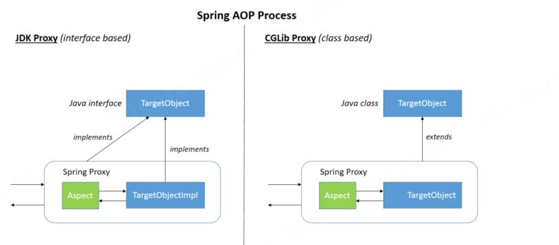
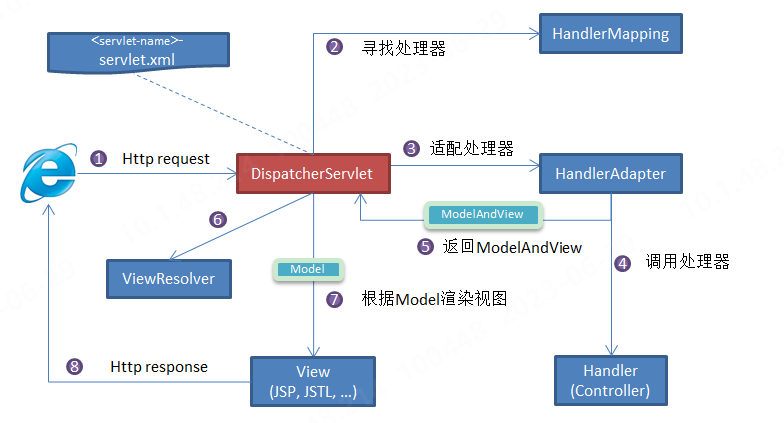

## Maven
[官方下载地址](https://maven.apache.org/)
* 安装与配置后输入`mvn-v`测试是否成功。并在其目录下conf文件中的`settings.xml`修改镜像地址。
``` xml
<mirrors>
   <mirror>
       <id>nexus-aliyun</id>
       <mirrorOf>*</mirrorOf>
       <name>Nexus aliyun</name>
       <url>http://maven.aliyun.com/nexus/content/groups/public</url>
   </mirror> 
</mirrors>
```
其两个主要的作用为：
1. 依赖管理：管理项目中所需要的jar包
   maven工程中不直接将 jar包导入到工程中，而是通过在 pom.xml 文件中添加所需jar包的坐标。在需要用到 jar 包的时候，再通过pom.xml文件中的坐标到一个专门用于”存放 jar 包的仓库”(maven 仓库)中根据坐标从而找到这些 jar 包拿去运行。
2. 一键构建：项目从编译、测试、运行、打包、安装、 部署整个过程都交给 maven进行管理，使用 maven几个命令可以轻松完成整个工作。


* 若要创建WEB工程，需要在原型中勾选`maven-archetype-webapp`模板。
* 创建项目后，需要手动补全相关结构

| |----main 项目的主要代码的地方...
| | |----java ————--存放项目的源文件
| | |----resources ——存放项目资源文件，如spring, hibernate配置文件
| |----test 用于测试项目代码的, 目录相当于 Junit的测试代码的目录
| | |----java ————--存放所有测试.java文件，如JUnit测试类
| | |----resources ——存放项目测试资源文件，如spring, hibernate配置文件
### pom.xml格式
新创建的项目工程，其`pom.xml`文件结构以及相关说明如下所示：
```xml
<?xml version="1.0" encoding="UTF-8"?>

<project xmlns="http://maven.apache.org/POM/4.0.0" xmlns:xsi="http://www.w3.org/2001/XMLSchema-instance"
  xsi:schemaLocation="http://maven.apache.org/POM/4.0.0 http://maven.apache.org/xsd/maven-4.0.0.xsd">
  <!-- 指定当前pom模型的版本，maven2 和3都是4 -->
  <!-- Pom文件可以用于解耦，最大程度区分项目与项目之间的区别 -->
  <modelVersion>4.0.0</modelVersion>

  <groupId>org.example</groupId>   <!-- 定义项目是哪个公司哪个部门组 -->
  <artifactId>MyYunPan</artifactId>   <!-- 组内的唯一id（例如项目中的哪个组件:模块名,Maven可以实现模块开发~） -->
  <version>1.0-SNAPSHOT</version>     <!-- 项目当前版本,SNAPSHOT为不稳定版本(快速开发) -->
  <!-- groupId  artifactId  version:也决定了项目在打包/发布文件的样式/地址：本地仓库下/org/example/MavenWSM/1.0-SNAPSHOT/MavenWSM-1.0-SNAPSHOT.jar  -->
  <packaging>war</packaging>   <!-- 项目打包产生的构件类型,例如jar、war、ear、pom... 常用Jar(默认) war -->

  <name>MyYunPan Maven Webapp</name>   <!-- 项目别名 -->
  <!-- FIXME change it to the project's website -->
  <url>http://www.example.com</url>   <!--项目主页的url-->

  <!-- 为pom定义一些常量，在pom中的其它地方可以直接引用 使用方式 如下 ：${project.build.sourceEncoding} -->
  <properties>
    <!-- 统一项目字符集编码: 底层引用了${project.build.sourceEncoding} 统一字符集  -->
    <project.build.sourceEncoding>UTF-8</project.build.sourceEncoding>
    <!-- 设值jdk编码,该方法是指定项目的JDK版本 或 在Maven settings.xml中配置统一环境JDK  -->
    <maven.compiler.source>18</maven.compiler.source>
    <maven.compiler.target>18</maven.compiler.target>
  </properties>

  <!-- 存放着所有依赖包的描述,也就是提供下载的坐标 -->
  <dependencies>
    <!-- 每一个dependency 描述一个Jar坐标: 去本地找————找不到去远程仓库下载————再没有去中央仓库下载到私服到本地.. -->
    <!--可通过maven依赖官网https://mvnrepository.com/或 http://search.maven.org/查找，并选择所需要的包的配置信息，复制到该部分-->
    <dependency>
      <groupId>junit</groupId>    <!-- 公司组 -->
      <artifactId>junit</artifactId>     <!-- 项目/jar/模块名 -->
      <version>4.11</version>    <!-- 版本 -->
      <scope>test</scope>     <!-- Jar包使用的范围: 默认使用范围是compile,则测试代码和主代码都可以使用该代码; -->
      <!--compile：该依赖可以在整个项目中使用(是指代码范围, main 目录和 test 目录下都能使用这个依赖),参与打包部署.-->
      <!--test:该依赖只能在测试代码中使用(是指代码范围,只能在 test 目录下使用这个依赖),不参与打包部署.-->
      <!--provided:不参与打包部署.只是在编写源码的时候使用。一般用于那些部署后，服务器自身会提供的依赖，如javax.servlet-api-->
      <!--runtime：该依赖编写代码时不需要,运行时需要,参与打包部署。一般是一些通过反射加载的资源，如数据库驱动 mysql-connector-java-->
      <!--system：表示使用本地系统路径下的 jar 包,需要和 <systemPath> 配合使用.一般是一些没有被maven中央仓库录入的-->
    </dependency>
  </dependencies>

  <!-- 该元素设置了项目源码目录,当构建项目的时候,构建系统会编译目录里的源码。-->
  <build>
    <finalName>MyYunPan</finalName>
    <pluginManagement><!-- lock down plugins versions to avoid using Maven defaults (may be moved to parent pom) -->
      <!--使用的插件列表-->
      <plugins>
        <plugin>
          <artifactId>maven-clean-plugin</artifactId>
          <version>3.1.0</version>
        </plugin>
        <!-- see http://maven.apache.org/ref/current/maven-core/default-bindings.html#Plugin_bindings_for_war_packaging -->
        <!--以下省略-->
      </plugins>
    </pluginManagement>
  </build>
</project>
``` 
详细的格式说明可参照[官网网站](https://maven.apache.org/ref/3.8.6/maven-model/maven.html)中的说明。
### maven命令
* compile 编译命令，作用是将 src/main/java 下的文件编译为 class 文件输出到 target目录下；
* clean 会删除 target 目录及内容, 清理。
* package 对于 java 工程执行 package 打成 jar 包，对于 web 工程打成 war包。 并且会包含 test操作；
* install 执行 install 将 maven 打成 jar 包或 war 包发布到本地仓库。
* deploy 执行 deploy 将 maven 打成 jar 包或 war 包发布到本地仓库和远程仓库中。
* site 生成项目相关信息的网站。
* resources 将主源代码的资源复制到主输出目录。

### 常用技巧
* 在`pom.xml`中使用快捷键`alt+insert`可快速寻找并插入所需依赖

## Tomcat
[官方下载地址](https://tomcat.apache.org/)
* 安装与环境配制后，运行`<tomcat所在路径>/bin/startup.sh`,并访问`http://localhost:8080`，验证是否正确安装与配置
### Idea中的Tomcat配制
* war模式：将WEB工程以包的形式上传到服务器 ；最终打包部署到Tomcat所在位置。
* war exploded模式：将WEB工程以当前文件夹的位置关系上传到服务器；最终打包部署到项目target所在位置。
* 在`HTTP port`中设置端口号

## Mysql
[官方下载地址](https://www.mysql.com/)
* 通过`sudo apt install mysql-server`安装Mysql，通过`netstat -tap | grep mysql`检查是否安装成功。
* 执行Mysql附带的脚本`sudo mysql_secure_installation`,借助它设置Mysql的安全性。在此阶段，将要为设置一个不同级别的密码.(若遇到`SET PASSWORD has no significance for user 'root'@'localhost' as the authentication method...`问题，则先登录mysql，执行`ALTER USER 'root'@'localhost' IDENTIFIED WITH mysql_native_password by 'password';`便可解决)。然后后续将询问是否限制root用户对本地计算机的访问，删除测试数据库并重新加载特权表，可以均选择`y`。
* 通过`mysql -u root -p` 登录mysql，即可进入mysql操作模式，(默认是没有密码，但是需要使用root权限登录)。
* 如果要使用外部程序以root用户身份登录到MYSQL服务器，需要将身份验证方法从auth_socket更改为mysql_native_password。即`ALTER USER 'root'@'localhost' IDENTIFIED WITH mysql_native_password BY 'password';`和`FLUSH PRIVILEGES;`(因此可以直接在设置安全行之前先执行第一个指令)。
## SpringBoot
* 使用IDEA构建Spring boot+maven项目：新建项目时选择`Spring Initializr`,并将`Type`选项选为`Maven`。并在依赖中勾选`Spring Web`
* 若在`pom.xml`中`<artifactId>spring-boot-maven-plugin</artifactId>`变为红色，仅需为其增加版本号即可，注意要与所用`spring boot`版本一致。
### 基本知识
#### Spring,Spring MVC,Spring Boot的关系
* Spring是一款开源的轻量级 Java 开发框架，包含多个功能模块，最重要的是`Spring-Core`（主要提供 IoC 依赖注入功能的支持）模块。
* Spring MVC是Spring中的一个很重要的模块，主要赋予 Spring 快速构建 MVC 架构的 Web 程序的能力。MVC指模型(Model)、视图(View)、控制器(Controller)的简写，其核心思想是通过将业务逻辑、数据、显示分离来组织代码。
* Spring Boot是简化配制版本的Spring。
### Spring IoC
IoC（Inverse of Control:控制反转） 是一种设计思想，而不是一个具体的技术实现，其常用的实现模式是依赖注入。IoC 的思想就是将原本在程序中手动创建对象的控制权，交由 Spring 框架来管理，不通过`new`关键字来创建对象，通过IoC容器来帮助创建。即将对象之间的依赖关系交给IoC容器来管理，并由IoC容器完成对象的注入。IoC容器实际上可以理解为一个Map（key,value），存放着不同的对象。
[源码分析](https://javadoop.com/post/spring-ioc)
#### Spring Bean
Bean代指那些被 IoC 容器所管理的对象。通过配制元数据（xml,注解或java配置类）来定义哪些对象需要IoC容器管理。
##### 可以将类声明为Bean的注解
* `@Component`：通用的注解，可标注任意类为Spring组件。如果一个Bean不知道属于哪个层，可以使用`@Component`注解标注。
* `@Repository`: 对应持久层即Dao层，主要用于数据库相关操作
* `@Service`: 对应服务层，主要涉及一些复杂的逻辑，需要用到Dao层。
* `@Controller`: 对应Spring MVC控制层，主要用于接受用户请求并调用Service层返回数据给前端页面。
##### @Component和@Bean的区别
* `@Component`注解作用于类，而`@Bean`注解作用于方法。
* `@Component`通常是通过类路径扫描来自动侦测以及自动装配到Spring容器中的（可以使用`@ComponentScan`注解定义要扫描的路径),从路径中找出被标识的需要装配的类自动装配到 Spring 的 bean 容器中。`@Bean` 注解告知spring这个方法会返回一个对象，这个对象需要注册为Spring上下文中的bean，通常方法体包含了最终产生bean实例的逻辑
* `@Bean` 注解比 `@Component` 注解的自定义性更强，而且很多地方我们只能通过 `@Bean` 注解来注册 bean。比如当我们引用第三方库中的类需要装配到 Spring容器时，则只能通过 `@Bean`来实现。(因为它们一般是无法修改的，无法在其类上使用`@Component`注解)。
* `@Bean` 需要在配置类中使用，即类上需要加上`@Configuration`注解。
##### Bean的注入
* `@Autowired`， Spring内置的注解，默认的注入方式为byType（根据类型进行匹配），即会优先根据接口类型去匹配并注入Bean（接口的实现类）。
  1. 当一个接口存在多个实现类时，会无法正确注入，此时注入方式会变成`byName`(根据名称进行匹配)，名称通常是实现类名（首字母小写）
  2.  建议使用@Qualifier 注解来显示指定名称而不是依赖变量的名称
```java
// 报错，byName 和 byType 都无法匹配到 bean
@Autowired
private SmsService smsService;
// 正确注入 SmsServiceImpl1 对象对应的 bean
@Autowired
private SmsService smsServiceImpl1;
// 正确注入  SmsServiceImpl1 对象对应的 bean
// smsServiceImpl1 就是我们上面所说的名称
@Autowired
@Qualifier(value = "smsServiceImpl1")
private SmsService smsService;

```
* 和`@Resource`，属于 JDK 提供的注解，默认注入方式为`byName`,如果无法通过名称匹配到对应的 Bean 的话，注入方式会变为`byType`.其实现如下：
```java
public @interface Resource {
    String name() default "";
    Class<?> type() default Object.class;
}
//因此注解格式为 @Resource(name="",type= )
```
##### Bean的作用域
* singleton : IoC 容器中只有唯一的 bean 实例。Spring 中的 bean 默认都是单例的，是对单例设计模式的应用。
* prototype : 每次获取都会创建一个新的 bean 实例。也就是说，连续 getBean() 两次，得到的是不同的 Bean 实例。
* request （仅 Web 应用可用）: 每一次 HTTP 请求都会产生一个新的 bean（请求 bean），该 bean 仅在当前 HTTP request 内有效。
* session （仅 Web 应用可用） : 每一次来自新 session 的 HTTP 请求都会产生一个新的 bean（会话 bean），该 bean 仅在当前 HTTP session 内有效。
* application/global-session （仅 Web 应用可用）： 每个 Web 应用在启动时创建一个 Bean（应用 Bean），该 bean 仅在当前应用启动时间内有效。
* websocket （仅 Web 应用可用）：每一次 WebSocket 会话产生一个新的 bean。
可使用`@Scope`注解的`value`属性设置作用域，如下：
```java
@Bean
@Scope(value = ConfigurableBeanFactory.SCOPE_PROTOTYPE)
...
```
##### 单例Bean的线程安全问题
* 单例 Bean 存在线程问题，主要是因为当多个线程操作同一个对象的时候是存在资源竞争的。
* 常见的有两种解决办法
  1. 在 Bean 中尽量避免定义可变的成员变量。
  2. 在类中定义一个 `ThreadLocal` 成员变量，将需要的可变成员变量保存在 `ThreadLocal` 中
##### Bean的生命周期
* 容器找到配制中Sping Bean的定义
* 容器利用反射机制创建Bean实例。
* 利用`set()`方法设置属性值
* 调用所实现的相关接口中的对应方法
* 程序执行，业务逻辑调用  
* 销毁Bean实例，并执行指定方法
* 
### Spring AoP
AOP能够将那些与业务无关，却为业务模块所共同调用的逻辑或责任（例如事务处理、日志管理、权限控制等）封装起来，便于减少系统的重复代码，降低模块间的耦合度，并有利于未来的可拓展性和可维护性。它是基于动态代理的，如果要代理的对象，实现了某个接口，那么 Spring AOP 会使用 JDK Proxy，去创建代理对象，而对于没有实现接口的对象，就无法使用 JDK Proxy 去进行代理了，这时候 Spring AOP 会使用 Cglib 生成一个被代理对象的子类来作为代理，如下图所示：

此外还可以使用AspectJ框架。
#### 基本术语
* 目标(Target)：	被通知的对象
* 代理(Proxy)：	向目标对象应用通知之后创建的代理对象
* 连接点(JoinPoint)：	目标对象的所属类中，定义的所有方法均为连接点
* 切入点(Pointcut)：	被切面拦截 / 增强的连接点（切入点一定是连接点，连接点不一定是切入点）
* 通知(Advice)	增强的逻辑 / 代码，也即拦截到目标对象的连接点之后要做的事情
* 切面(Aspect)：	切入点(Pointcut)+通知(Advice)
* Weaving(织入)：	将通知应用到目标对象，进而生成代理对象的过程动作
#### Spring AOP和AspectJ AOP的区别
1. Spring AOP 属于运行时增强，而 AspectJ 是编译时增强。 
2. Spring AOP 基于代理(Proxying)，而 AspectJ 基于字节码操作(Bytecode Manipulation)。
3. 当切面太多的话，最好选择 AspectJ ，它比 Spring AOP 快很多。
#### AspectJ 定义的通知类型
* Before（前置通知）：目标对象的方法调用之前触发
* After （后置通知）：目标对象的方法调用之后触发
* AfterReturning（返回通知）：目标对象的方法调用完成，在返回结果值之后触发
* AfterThrowing（异常通知） ：目标对象的方法运行中抛出 / 触发异常后触发。AfterReturning 和 AfterThrowing 两者互斥。如果方法调用成功无异常，则会有返回值；如果方法抛出了异常，则不会有返回值。
* Around： （环绕通知）编程式控制目标对象的方法调用。环绕通知是所有通知类型中可操作范围最大的一种，因为它可以直接拿到目标对象，以及要执行的方法，所以环绕通知可以任意的在目标对象的方法调用前后搞事，甚至不调用目标对象的方法
#### 定义切面的执行顺序
1. 使用`@Order`注解定义切面顺序
```java
// 值越小优先级越高
@Order(3)
@Component
@Aspect
public class LoggingAspect implements Ordered {
```
2. 实现`Ordered`接口并重写`getOrder()`方法
```java
@Component
@Aspect
public class LoggingAspect implements Ordered {

    // ....

    @Override
    public int getOrder() {
        // 返回值越小优先级越高
        return 1;
    }
}
```
### Spring MVC
MVC指模型(Model)、视图(View)、控制器(Controller)的简写，其核心思想是通过将业务逻辑、数据、显示分离来组织代码。
#### 核心组件
* DispatcherServlet ：核心的中央处理器，负责接收请求、分发，并给予客户端响应。
* HandlerMapping ：处理器映射器，根据 uri 去匹配查找能处理的 Handler ，并会将请求涉及到的拦截器和 Handler 一起封装。
* HandlerAdapter ：处理器适配器，根据 HandlerMapping 找到的 Handler ，适配执行对应的 Handler；
* Handler ：请求处理器，处理实际请求的处理器。
* ViewResolver ：视图解析器，根据 Handler 返回的逻辑视图 / 视图，解析并渲染真正的视图，并传递给 DispatcherServlet 响应客户端
#### 工作原理

1. 客户端（浏览器）发送请求， `DispatcherServlet`拦截请求。
2. `DispatcherServlet` 根据请求信息调用 HandlerMapping 。`HandlerMapping `根据 uri 去匹配查找能处理的 `Handler`（也就是我们平常说的 Controller 控制器） ，并会将请求涉及到的拦截器和 `Handler` 一起封装。
3. `DispatcherServlet` 调用 `HandlerAdapter`适配执行 `Handler` 。
4. `Handler `完成对用户请求的处理后，会返回一个 ModelAndView 对象给`DispatcherServlet`，ModelAndView 顾名思义，包含了数据模型以及相应的视图的信息。Model 是返回的数据对象，View 是个逻辑上的 View。
5. `ViewResolver` 会根据逻辑 View 查找实际的 View。
6. `DispaterServlet` 把返回的 Model 传给 View（视图渲染）。
7. 把 View 返回给请求者（浏览器）
#### 统一异常处理
使用 `@ControllerAdvice` + `@ExceptionHandler` 这两个注解。
```java
@ControllerAdvice
@ResponseBody
public class GlobalExceptionHandler {

    @ExceptionHandler(BaseException.class)
    public ResponseEntity<?> handleAppException(BaseException ex, HttpServletRequest request) {
      //......
    }

    @ExceptionHandler(value = ResourceNotFoundException.class)
    public ResponseEntity<ErrorReponse> handleResourceNotFoundException(ResourceNotFoundException ex, HttpServletRequest request) {
      //......
    }
}
```
这种异常处理方式下，会给所有或者指定的 Controller 织入异常处理的逻辑（AOP），当 Controller 中的方法抛出异常的时候，由被`@ExceptionHandler `注解修饰的方法进行处理。`ExceptionHandlerMethodResolver `中 `getMappedMethod `方法决定了异常具体被哪个被 `@ExceptionHandler` 注解修饰的方法处理异常。该方法的源码如下：
```java
@Nullable
	private Method getMappedMethod(Class<? extends Throwable> exceptionType) {
		List<Class<? extends Throwable>> matches = new ArrayList<>();
    //找到可以处理的所有异常信息。mappedMethods 中存放了异常和处理异常的方法的对应关系
		for (Class<? extends Throwable> mappedException : this.mappedMethods.keySet()) {
      //class.isAssignableFrom()方法，返回该class所代表的类/接口是否是传入参数所代表的类/接口的父类/父接口。
			if (mappedException.isAssignableFrom(exceptionType)) {
				matches.add(mappedException);
			}
		}
    // 不为空说明有方法处理异常
		if (!matches.isEmpty()) {
      // 按照匹配程度从大到小排序
			matches.sort(new ExceptionDepthComparator(exceptionType));
      // 返回处理异常的方法
			return this.mappedMethods.get(matches.get(0));
		}
		else {
			return null;
		}
	}

```
### Spring 事务
### Spring yaml配置
YAML 是 JSON 的超集，简洁而强大，专门用来书写配置文件的语言，可以替代 *.properties.它利用缩进来表示层级关系，并且大小写敏感。
#### 与*.properties文件的区别
1. 可以使用 @PropertySource 注解加载自定义的 Properties 配置文件，但无法加载自定义的 YAML 文件。
2. YAML 支持列表的配置，而 Properties 不支持。
3. application.properties 的优先级会比 application.yml 高，也就是说如果两个文件都存在，且两个文件都配置了同一个属性，那么会以 application.properties 里的配置为准。
#### 基础语法
#### 注意事项
1. 冒号后面要空一格再写值，否则会报错


## MyBatis

### Dao接口工作原理
### MyBatis配置

### 注意事项
####  #{} 和 ${} 
* `${}`是 Properties 文件中的变量占位符，它可以用于标签属性值和 sql 内部，属于静态文本替换
* `#{}`是 sql 的参数占位符,会返回其属性值。

## IDEA
### 自定义注释模板
1. `settings`->`live templates`新增 templates group 和 live template
2. 编写live template中的template text
```
   *
 * @Author $user$
 * @Description //TODO $end$
 * @Date $time$ $date$
$param$
 * @return $return$
 **/
```
3. edit variables,为每个属性选择对应的函数，其中$param$为
``` js
groovyScript("def result=''; def params=\"${_1}\".replaceAll('[\\\\[|\\\\]|\\\\s]', '').split(',').toList(); for(i = 0; i < params.size(); i++) {result+=' * @param ' + params[i] + ((i < params.size() - 1) ? '\\n':'')}; return result", methodParameters()) ()
```
结果如下所示
```java
/**
 * @Author yutchen
 * @Description //TODO 
 * @Date 下午4:57 2022/9/9
 * @param email
 * @param userName
 * @param date
 * @return java.lang.String
 **/
```
### 常用快捷键
1. 格式化代码`ctrl+alt+l`;