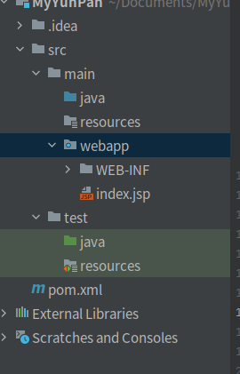

## Maven
[官方下载地址](https://maven.apache.org/)
* 安装与配置后输入`mvn-v`测试是否成功。并在其目录下conf文件中的`settings.xml`修改镜像地址。
``` xml
<mirrors>
   <mirror>
       <id>nexus-aliyun</id>
       <mirrorOf>*</mirrorOf>
       <name>Nexus aliyun</name>
       <url>http://maven.aliyun.com/nexus/content/groups/public</url>
   </mirror> 
</mirrors>
```
其两个主要的作用为：
1. 依赖管理：管理项目中所需要的jar包
   maven工程中不直接将 jar包导入到工程中，而是通过在 pom.xml 文件中添加所需jar包的坐标。在需要用到 jar 包的时候，再通过pom.xml文件中的坐标到一个专门用于”存放 jar 包的仓库”(maven 仓库)中根据坐标从而找到这些 jar 包拿去运行。
2. 一键构建：项目从编译、测试、运行、打包、安装、 部署整个过程都交给 maven进行管理，使用 maven几个命令可以轻松完成整个工作。


* 若要创建WEB工程，需要在原型中勾选`maven-archetype-webapp`模板。
* 创建项目后，需要手动补全相关结构

| |----main 项目的主要代码的地方...
| | |----java ————--存放项目的源文件
| | |----resources ——存放项目资源文件，如spring, hibernate配置文件
| |----test 用于测试项目代码的, 目录相当于 Junit的测试代码的目录
| | |----java ————--存放所有测试.java文件，如JUnit测试类
| | |----resources ——存放项目测试资源文件，如spring, hibernate配置文件
### pom.xml格式
新创建的项目工程，其`pom.xml`文件结构以及相关说明如下所示：
```xml
<?xml version="1.0" encoding="UTF-8"?>

<project xmlns="http://maven.apache.org/POM/4.0.0" xmlns:xsi="http://www.w3.org/2001/XMLSchema-instance"
  xsi:schemaLocation="http://maven.apache.org/POM/4.0.0 http://maven.apache.org/xsd/maven-4.0.0.xsd">
  <!-- 指定当前pom模型的版本，maven2 和3都是4 -->
  <!-- Pom文件可以用于解耦，最大程度区分项目与项目之间的区别 -->
  <modelVersion>4.0.0</modelVersion>

  <groupId>org.example</groupId>   <!-- 定义项目是哪个公司哪个部门组 -->
  <artifactId>MyYunPan</artifactId>   <!-- 组内的唯一id（例如项目中的哪个组件:模块名,Maven可以实现模块开发~） -->
  <version>1.0-SNAPSHOT</version>     <!-- 项目当前版本,SNAPSHOT为不稳定版本(快速开发) -->
  <!-- groupId  artifactId  version:也决定了项目在打包/发布文件的样式/地址：本地仓库下/org/example/MavenWSM/1.0-SNAPSHOT/MavenWSM-1.0-SNAPSHOT.jar  -->
  <packaging>war</packaging>   <!-- 项目打包产生的构件类型,例如jar、war、ear、pom... 常用Jar(默认) war -->

  <name>MyYunPan Maven Webapp</name>   <!-- 项目别名 -->
  <!-- FIXME change it to the project's website -->
  <url>http://www.example.com</url>   <!--项目主页的url-->

  <!-- 为pom定义一些常量，在pom中的其它地方可以直接引用 使用方式 如下 ：${project.build.sourceEncoding} -->
  <properties>
    <!-- 统一项目字符集编码: 底层引用了${project.build.sourceEncoding} 统一字符集  -->
    <project.build.sourceEncoding>UTF-8</project.build.sourceEncoding>
    <!-- 设值jdk编码,该方法是指定项目的JDK版本 或 在Maven settings.xml中配置统一环境JDK  -->
    <maven.compiler.source>18</maven.compiler.source>
    <maven.compiler.target>18</maven.compiler.target>
  </properties>

  <!-- 存放着所有依赖包的描述,也就是提供下载的坐标 -->
  <dependencies>
    <!-- 每一个dependency 描述一个Jar坐标: 去本地找————找不到去远程仓库下载————再没有去中央仓库下载到私服到本地.. -->
    <!--可通过maven依赖官网https://mvnrepository.com/或 http://search.maven.org/查找，并选择所需要的包的配置信息，复制到该部分-->
    <dependency>
      <groupId>junit</groupId>    <!-- 公司组 -->
      <artifactId>junit</artifactId>     <!-- 项目/jar/模块名 -->
      <version>4.11</version>    <!-- 版本 -->
      <scope>test</scope>     <!-- Jar包使用的范围: 默认使用范围是compile,则测试代码和主代码都可以使用该代码; -->
      <!--compile：该依赖可以在整个项目中使用(是指代码范围, main 目录和 test 目录下都能使用这个依赖),参与打包部署.-->
      <!--test:该依赖只能在测试代码中使用(是指代码范围,只能在 test 目录下使用这个依赖),不参与打包部署.-->
      <!--provided:不参与打包部署.只是在编写源码的时候使用。一般用于那些部署后，服务器自身会提供的依赖，如javax.servlet-api-->
      <!--runtime：该依赖编写代码时不需要,运行时需要,参与打包部署。一般是一些通过反射加载的资源，如数据库驱动 mysql-connector-java-->
      <!--system：表示使用本地系统路径下的 jar 包,需要和 <systemPath> 配合使用.一般是一些没有被maven中央仓库录入的-->
    </dependency>
  </dependencies>

  <!-- 该元素设置了项目源码目录,当构建项目的时候,构建系统会编译目录里的源码。-->
  <build>
    <finalName>MyYunPan</finalName>
    <pluginManagement><!-- lock down plugins versions to avoid using Maven defaults (may be moved to parent pom) -->
      <!--使用的插件列表-->
      <plugins>
        <plugin>
          <artifactId>maven-clean-plugin</artifactId>
          <version>3.1.0</version>
        </plugin>
        <!-- see http://maven.apache.org/ref/current/maven-core/default-bindings.html#Plugin_bindings_for_war_packaging -->
        <!--以下省略-->
      </plugins>
    </pluginManagement>
  </build>
</project>
``` 
详细的格式说明可参照[官网网站](https://maven.apache.org/ref/3.8.6/maven-model/maven.html)中的说明。
### maven命令
* compile 编译命令，作用是将 src/main/java 下的文件编译为 class 文件输出到 target目录下；
* clean 会删除 target 目录及内容, 清理。
* package 对于 java 工程执行 package 打成 jar 包，对于 web 工程打成 war包。 并且会包含 test操作；
* install 执行 install 将 maven 打成 jar 包或 war 包发布到本地仓库。
* deploy 执行 deploy 将 maven 打成 jar 包或 war 包发布到本地仓库和远程仓库中。
* site 生成项目相关信息的网站。
* resources 将主源代码的资源复制到主输出目录。

### 常用技巧
* 在`pom.xml`中使用快捷键`alt+insert`可快速寻找并插入所需依赖

## Tomcat
[官方下载地址](https://tomcat.apache.org/)
* 安装与环境配制后，运行`<tomcat所在路径>/bin/startup.sh`,并访问`http://localhost:8080`，验证是否正确安装与配置
### Idea中的Tomcat配制
* war模式：将WEB工程以包的形式上传到服务器 ；最终打包部署到Tomcat所在位置。
* war exploded模式：将WEB工程以当前文件夹的位置关系上传到服务器；最终打包部署到项目target所在位置。
* 在`HTTP port`中设置端口号

## Mysql
[官方下载地址](https://www.mysql.com/)
* 通过`sudo apt install mysql-server`安装Mysql，通过`netstat -tap | grep mysql`检查是否安装成功。
* 执行Mysql附带的脚本`sudo mysql_secure_installation`,借助它设置Mysql的安全性。在此阶段，将要为设置一个不同级别的密码.(若遇到`SET PASSWORD has no significance for user 'root'@'localhost' as the authentication method...`问题，则先登录mysql，执行`ALTER USER 'root'@'localhost' IDENTIFIED WITH mysql_native_password by 'password';`便可解决)。然后后续将询问是否限制root用户对本地计算机的访问，删除测试数据库并重新加载特权表，可以均选择`y`。
* 通过`mysql -u root -p` 登录mysql，即可进入mysql操作模式，(默认是没有密码，但是需要使用root权限登录)。
* 如果要使用外部程序以root用户身份登录到MYSQL服务器，需要将身份验证方法从auth_socket更改为mysql_native_password。即`ALTER USER 'root'@'localhost' IDENTIFIED WITH mysql_native_password BY 'password';`和`FLUSH PRIVILEGES;`(因此可以直接在设置安全行之前先执行第一个指令)。
## SpringBoot
* 使用IDEA构建Spring boot+maven项目：新建项目时选择`Spring Initializr`,并将`Type`选项选为`Maven`。并在依赖中勾选`Spring Web`
* 若在`pom.xml`中`<artifactId>spring-boot-maven-plugin</artifactId>`变为红色，仅需为其增加版本号即可，注意要与所用`spring boot`版本一致。

## MyBatis

### Dao接口工作原理
### MyBatis配置

### 注意事项
####  #{} 和 ${} 
* `${}`是 Properties 文件中的变量占位符，它可以用于标签属性值和 sql 内部，属于静态文本替换
* `#{}`是 sql 的参数占位符,会返回其属性值。

## IDEA
### 插件
1. 插件Translation,用来阅读源码。
### 自定义注释模板
1. `settings`->`live templates`新增 templates group 和 live template
2. 编写live template中的template text
```
   *
 * @Author $user$
 * @Description //TODO $end$
 * @Date $time$ $date$
$param$
 * @return $return$
 **/
```
3. edit variables,为每个属性选择对应的函数，其中$param$为
``` js
groovyScript("def result=''; def params=\"${_1}\".replaceAll('[\\\\[|\\\\]|\\\\s]', '').split(',').toList(); for(i = 0; i < params.size(); i++) {result+=' * @param ' + params[i] + ((i < params.size() - 1) ? '\\n':'')}; return result", methodParameters()) ()
```
结果如下所示
```java
/**
 * @Author yutchen
 * @Description //TODO 
 * @Date 下午4:57 2022/9/9
 * @param email
 * @param userName
 * @param date
 * @return java.lang.String
 **/
```
### 常用快捷键
1. 格式化代码`ctrl+alt+l`;